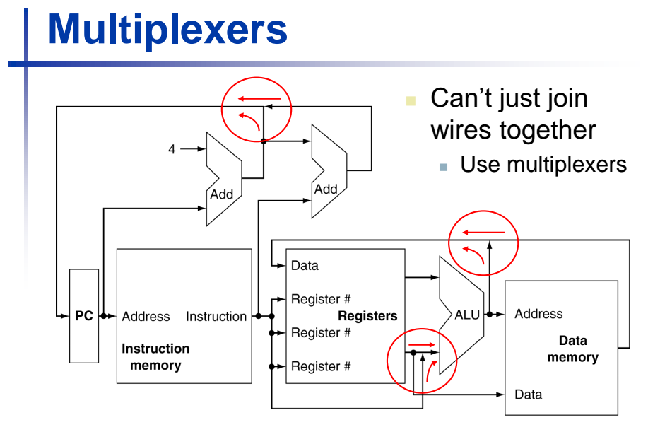
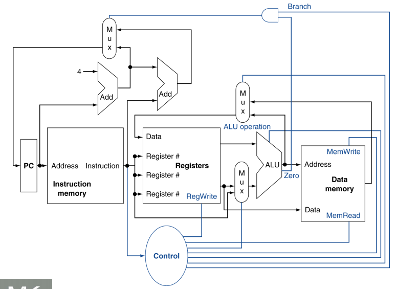
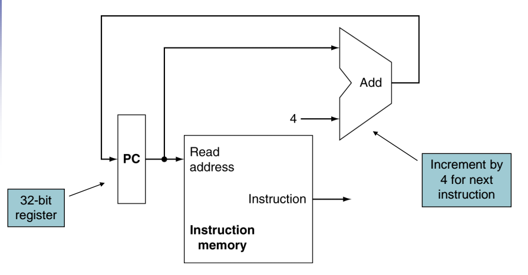
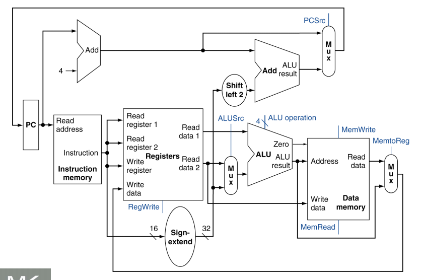

# 4.1 Introduction
CPU 성능 요인
- 명령어 개수
- CPI
- Cycle time

## Instruction Execution
1. PC를 프로그램이 저장되어 있는 메모리에 보내서 메모리로 부터 명령어를 가져온다.
2. 읽을 레지스터를 선택하는 명령어 필드를 사용하여 하나 또는 2개의 레지스터를 읽는다.

위 그림은 MIPS 구현을 상위 수준에서 본 그림이다. 빨간색 원은 멀티플렉서로, 제어선의 값에 따라 여러 개 입력 중에서 하나를 선택하는 소자이다. 

제어 유닛(control unit)은 명령어를 입력으로 받아서 기능 유닛들과 두 멀티 플렉서의 제어선 값을 결정한다.
세 번째 멀티플렉서의 경우 PC+4와 분기 목적지 주소 중 어느 주소를 PC에 써야할 지를 결정하는 것인데, 이는 ALU의 Zero 출력으로 제어된다. 

# 4.2 Logic Design Convention
MIPS를 구현하는 데이터패스 요소는 조합 소자와 상태 소자 두 가지 종류의 논리 소자들로 구성된다. 조합 소자(combinational element)는 데이터 값에 대해 연산을 수행하는 소자로, 출력이 현재 입력에 의해서만 결정된다. 즉, 내부 기억 장소가 없어서 같은 입력을 주면 항상 같은 출력을 낸다. 조합 소자에는 AND-gate, Adder, Multiplexer, ALU가 있다.
상태 소자(state element)는 소자에 내부 기억 장소가 있어 상태를 갖는다. 상태 소자는 적어도 2개의 입력과 1개의 출력을 갖는다. 꼭 있어야 되는 입력은 기록할 데이터와 클럭이다. 클럭 입력은 데이터 값이 소자에 기록되는 시점을 결정한다. 상태 소자의 출력은 이전 클럭 사이클에 기록된 값이다. 상태 소자에 언제 쓸 것인가는 클럭이 결정하지만, 상태 소자의 값을 읽는 것은 언제라도 가능하다. 상태 소자에는 명령어 메모리, 데이터 메모리, 레지스터 등이 있다.

## Sequential Element
상태를 포함하는 논리 구성 요소들을 순차 회로(sequential circuit)라 부르는데, 이는 출력이 입력뿐만 아니라 내부 상태에 따라서도 달라진다.

## Clocking Methodology

클러킹 방법론(clocking methodology)은 신호를 읽고 쓰는 시점을 정의한다. 엣지 구동 클러킹(edge-triggered clocking) 방법론은 순차 논리 소자에 저장된 값은 클럭 엣지에서만 바꿀 수 있다는 것을 의미한다. 상태 소자들만이 데이터 값을 저장할 수 있기 때문에 모든 조합 논리는 상태 소자에서 입력을 받고 상태 소자로 출력을 내보낸다.
상태 소자의 모든 입력은 활성화된 클럭 엣지가 상태를 바꾸기 전에 안정된 값에 도달해야 한다. 모든 상태 소자는 클럭의 상향 엣지에서 값이 바뀐다. 즉, 모든 신호가 한 클럭 이내에 상태 소자 1에서 나와서 조합 회로를 거쳐 상태 소자 2까지 전달되어야 한다. 신호가 상태 소자 2에 도착하는 데 필요한 시간이 클럭 사이클의 길이를 결정하게 된다.

# 4.3 Building a Datapath
데이터패스(Datapath): CPU 안에서 데이터를 가지고 연산하거나 데이터를 저장하는 기능 유닛
## Instruction Fetch

어느 명령어든지 실행하기 위해서는 1. 메모리에서 명령어를 가져오는 것으로 시작해야 한다. 그리고 다음 명령어 실행 준비를 위해서 2. 프로그램 카운터가 다음 명령어를 가리키도록 4만큼 증가시켜야 한다. 

## R-Format Instrution

모든 R형식 명령어들은 2개의 레지스터를 읽고 레지스터 내용에 ALU 연산을 수행한 후 그 결과를 레지스터에 쓴다. R형식 명령어들은 레지스터 피연산자 3개를 가지고 있기 때문에, 매 명령어마다 레지스터 파일에서 데이터 워드 2개를 읽고 데이터 워드 하나를 써야 한다. 

### Register Read
레지스터에서 데이터 워드를 읽기 위해서는 레지스터의 입력과 출력이 하나씩 필요하다. 읽을 레지스터 번호를 저장하는 입력과 레지스터에서 읽은 값을 내보내는 출력이다.

### Register Write
데이터 워드를 쓰기 위해서는 입력이 2개 필요하다. 한 입력은 쓸 레지스터 번호를 지정하고, 다른 입력은 레지스터에 쓸 값을 제공한다. 레지스터 파일은 Read register 입력에 실리는 번호에 해당하는 레지스터의 내용을 항상 출력한다. 그러나 쓰기는 쓰기 제어 신호에 의해 제어되므로 클럭 엣지에서 쓰기가 일어나려면 이 제어 신호가 인가되어야 한다. 따라서, 전체적으로 4개의 입력과 2개의 출력이 필요하다. 레지스터 번호 입력은 32개의 레지스터 중 하나를 저장해야 하므로 5비트 크기인 반면, 데이터 입력과 데이터 출력 버스는 모드 32비트 폭을 가진다.

### ALU
ALU는 32비트 입력 2개를 받아서 32비트 결과와 결과가 0인지 아닌지를 나타내는 1비트 신호를 만든다.

## Load/Store Instructions

이 명령어들은 베이스 레지스터(\$t2)와 명령어에 포함되어 있는 16비트 부호있는 변위 필드를 더하여 메모리 주소를 계산한다. 저장 명령어의 저장할 값은 \$t1에 있다. 따라서, 적재, 저장 명령어 둘 다 레지스터 파일과 ALU가 필요하다. 그 외에도 명령어의 16비트 변위 필드 값을 32비트 부호있는 값으로 부호확장하기 위한 유닛이 필요하며, 또 읽고 쓸 데이터 메모리가 필요하다. 
데이터 메모리는 저장 명령어일 때만 쓰기를 해야한다. 따라서, 데이터 메모리는 읽기와 쓰기 제어 신호, 주소 입력, 메모리에 쓸 데이터 입력이 필요하다.

## Branch Instruction

beq 명령어는 비교할 레지스터 2개와 16비트 변위의 세 피연산자를 갖는다. 변위는 분기 목적지 주소를 분기 명령어 주소에 대한 상대적인 값으로 표현하는 데 사용된다. 이 명령어를 구현하기 위해서는 부호확장한 명령어 변위 필드의 값을 PC에 더해서 분기 목적지 주소를 계산해야 한다. 

분기 명령어의 정의에는 주의를 기울여야 할 점이 두 가지 있다.
1. 명령어 집합 구조는 분기 주소 계산의 베이스 주소가 분기 명령어 다음 명령어의 주소라고 명기하고 있다. 명령어 인출 데이터패스에서 PC+4를 계산하기 때문에 이 값을 분기 목적지 주소 계산의 베이스로 사용하는 것이 어렵지 않다.

2. 명령어 집합 구조는 변위 필드를 2비트만큼 오른쪽으로 자리이동하여 워드 변위로 만든다고 서술하고 있다. 이렇게 함으로써 변위 필드의 유효 범위를 4배만큼 증가시킨다.

두 번째 문제를 다루기 위해서는 변위 필드를 왼쪽으로 2비트 자리이동해야한다. 

분기 목적지 주소만 계산하면 되는 것이 아니고, 실행할 다음 명령어가 분기 명령어 뒤에 있는 명령어가 될지 아니면 분기 목적지 주소에 있는 명령어가 될지를 판단해야 한다. 두 피연산자 값이 같을 때 분기 목적지 주소가 새로운 PC가 되며 '분기가 일어났다'라고 말한다. 피연산자 값이 같지 않으면 증가된 PC값이 새 PC값이 된다(PC = PC + 4). 이 경우에는 '분기가 일어나지 않았다'라고 말한다.

## Jump Instruction
점프 명령어는 명령어의 하위 26비트를 2비트만큼 왼쪽으로 자리이동한 값으로 PC의 하위 28비트를 대체한다.

## Composing the Elements
이제까지 각 명령어 종류에 필요한 데이터패스 구성 요소에 대하여 알아보았다. 이제 이 데이터패스 구성 요소들을 하나로 묶고 여기에 제어를 추가하여 구현을 완성해야 한다. 가장 간단한 데이터패스는 모든 명령어를 한 클럭 사이클에 실행하려고 하는 것이다. 
즉, 어느 데이터패스 자원도 명령어당 두 번 이상 사용될 수 없다. 2개의 다른 명령어 종류들이 데이터패스 구성 요소를 공유하기 위해서는 그 구성 요소의 입력에 여러 개의 연결을 허용해야 하며, 멀티플렉서와 제어 신호를 사용해서 그 입력들 중 하나를 선택해야 한다.

## Construct Datapath

R형식 명령어 데이터패스와 메모리 명령어 데이터패스는 매우 비슷하나 다음과 같은 점이 다르다.
1. R형식 명령어는 ALU를 사용하는데 입력은 두 레지스터에서부터 온다. 하지만 메모리 명령어 주소는 주소를 계산할 때 ALU 두 번째 입력이 명령어의 16비트 변위 필드를 확장한 값이다.
2. 목적지 레지스터에 저장되는 값은 R형식의 경우 ALU에서 오지만 적재 명령어의 경우 메모리에서 온다.

레지스터 파일 하나와 ALU 하나만을 사용하는 데이터패스를 만들기 위해서는 두 번째 ALU 입력에 멀티플렉서를 사용하여 R형식일 경우 레지스터의 값을, 메모리 명령어의 경우에는 명령어의 16비트 변위 필드를 확장한 값을 넣는다.

레지스터에 저장하는 값을 구분해야하기 때문에 ALU 결과 값과 메모리의 값을 멀티플렉서에 넣어서 R형식의 경우 ALU의 결과 값을 목적지 레지스터에 넣고, 메모리 명령어의 경우 메모리에서 나온 값을 목적지 레지스터에 넣는다.

이때까지 배운 내용을 취합하여 구성하면 위 그림과 같다.
