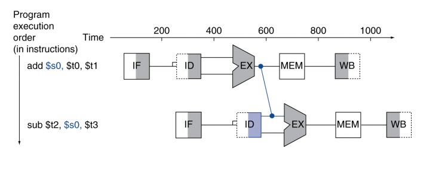

# 4.1 Introduction
CPU 성능 요인
- 명령어 개수
- CPI
- Cycle time

## Instruction Execution
1. PC를 프로그램이 저장되어 있는 메모리에 보내서 메모리로 부터 명령어를 가져온다.
2. 읽을 레지스터를 선택하는 명령어 필드를 사용하여 하나 또는 2개의 레지스터를 읽는다.


위 그림은 MIPS 구현을 상위 수준에서 본 그림이다. 빨간색 원은 멀티플렉서로, 제어선의 값에 따라 여러 개 입력 중에서 하나를 선택하는 소자이다. 


제어 유닛(control unit)은 명령어를 입력으로 받아서 기능 유닛들과 두 멀티 플렉서의 제어선 값을 결정한다.
세 번째 멀티플렉서의 경우 PC+4와 분기 목적지 주소 중 어느 주소를 PC에 써야할 지를 결정하는 것인데, 이는 ALU의 Zero 출력으로 제어된다. 

# 4.2 Logic Design Convention
MIPS를 구현하는 데이터패스 요소는 조합 소자와 상태 소자 두 가지 종류의 논리 소자들로 구성된다. 조합 소자(combinational element)는 데이터 값에 대해 연산을 수행하는 소자로, 출력이 현재 입력에 의해서만 결정된다. 즉, 내부 기억 장소가 없어서 같은 입력을 주면 항상 같은 출력을 낸다. 조합 소자에는 AND-gate, Adder, Multiplexer, ALU가 있다.
상태 소자(state element)는 소자에 내부 기억 장소가 있어 상태를 갖는다. 상태 소자는 적어도 2개의 입력과 1개의 출력을 갖는다. 꼭 있어야 되는 입력은 기록할 데이터와 클럭이다. 클럭 입력은 데이터 값이 소자에 기록되는 시점을 결정한다. 상태 소자의 출력은 이전 클럭 사이클에 기록된 값이다. 상태 소자에 언제 쓸 것인가는 클럭이 결정하지만, 상태 소자의 값을 읽는 것은 언제라도 가능하다. 상태 소자에는 명령어 메모리, 데이터 메모리, 레지스터 등이 있다.

## Sequential Element
상태를 포함하는 논리 구성 요소들을 순차 회로(sequential circuit)라 부르는데, 이는 출력이 입력뿐만 아니라 내부 상태에 따라서도 달라진다.

## Clocking Methodology

클러킹 방법론(clocking methodology)은 신호를 읽고 쓰는 시점을 정의한다. 엣지 구동 클러킹(edge-triggered clocking) 방법론은 순차 논리 소자에 저장된 값은 클럭 엣지에서만 바꿀 수 있다는 것을 의미한다. 상태 소자들만이 데이터 값을 저장할 수 있기 때문에 모든 조합 논리는 상태 소자에서 입력을 받고 상태 소자로 출력을 내보낸다.
상태 소자의 모든 입력은 활성화된 클럭 엣지가 상태를 바꾸기 전에 안정된 값에 도달해야 한다. 모든 상태 소자는 클럭의 상향 엣지에서 값이 바뀐다. 즉, 모든 신호가 한 클럭 이내에 상태 소자 1에서 나와서 조합 회로를 거쳐 상태 소자 2까지 전달되어야 한다. 신호가 상태 소자 2에 도착하는 데 필요한 시간이 클럭 사이클의 길이를 결정하게 된다.

# 4.3 Building a Datapath
데이터패스(Datapath): CPU 안에서 데이터를 가지고 연산하거나 데이터를 저장하는 기능 유닛
## Instruction Fetch

어느 명령어든지 실행하기 위해서는 1. 메모리에서 명령어를 가져오는 것으로 시작해야 한다. 그리고 다음 명령어 실행 준비를 위해서 2. 프로그램 카운터가 다음 명령어를 가리키도록 4만큼 증가시켜야 한다. 

## R-Format Instrution

모든 R형식 명령어들은 2개의 레지스터를 읽고 레지스터 내용에 ALU 연산을 수행한 후 그 결과를 레지스터에 쓴다. R형식 명령어들은 레지스터 피연산자 3개를 가지고 있기 때문에, 매 명령어마다 레지스터 파일에서 데이터 워드 2개를 읽고 데이터 워드 하나를 써야 한다. 

### Register Read
레지스터에서 데이터 워드를 읽기 위해서는 레지스터의 입력과 출력이 하나씩 필요하다. 읽을 레지스터 번호를 저장하는 입력과 레지스터에서 읽은 값을 내보내는 출력이다.

### Register Write
데이터 워드를 쓰기 위해서는 입력이 2개 필요하다. 한 입력은 쓸 레지스터 번호를 지정하고, 다른 입력은 레지스터에 쓸 값을 제공한다. 레지스터 파일은 Read register 입력에 실리는 번호에 해당하는 레지스터의 내용을 항상 출력한다. 그러나 쓰기는 쓰기 제어 신호에 의해 제어되므로 클럭 엣지에서 쓰기가 일어나려면 이 제어 신호가 인가되어야 한다. 따라서, 전체적으로 4개의 입력과 2개의 출력이 필요하다. 레지스터 번호 입력은 32개의 레지스터 중 하나를 저장해야 하므로 5비트 크기인 반면, 데이터 입력과 데이터 출력 버스는 모드 32비트 폭을 가진다.

### ALU
ALU는 32비트 입력 2개를 받아서 32비트 결과와 결과가 0인지 아닌지를 나타내는 1비트 신호를 만든다.

## Load/Store Instructions

이 명령어들은 베이스 레지스터(\$t2)와 명령어에 포함되어 있는 16비트 부호있는 변위 필드를 더하여 메모리 주소를 계산한다. 저장 명령어의 저장할 값은 \$t1에 있다. 따라서, 적재, 저장 명령어 둘 다 레지스터 파일과 ALU가 필요하다. 그 외에도 명령어의 16비트 변위 필드 값을 32비트 부호있는 값으로 부호확장하기 위한 유닛이 필요하며, 또 읽고 쓸 데이터 메모리가 필요하다. 
데이터 메모리는 저장 명령어일 때만 쓰기를 해야한다. 따라서, 데이터 메모리는 읽기와 쓰기 제어 신호, 주소 입력, 메모리에 쓸 데이터 입력이 필요하다.

## Branch Instruction

beq 명령어는 비교할 레지스터 2개와 16비트 변위의 세 피연산자를 갖는다. 변위는 분기 목적지 주소를 분기 명령어 주소에 대한 상대적인 값으로 표현하는 데 사용된다. 이 명령어를 구현하기 위해서는 부호확장한 명령어 변위 필드의 값을 PC에 더해서 분기 목적지 주소를 계산해야 한다. 

분기 명령어의 정의에는 주의를 기울여야 할 점이 두 가지 있다.
1. 명령어 집합 구조는 분기 주소 계산의 베이스 주소가 분기 명령어 다음 명령어의 주소라고 명기하고 있다. 명령어 인출 데이터패스에서 PC+4를 계산하기 때문에 이 값을 분기 목적지 주소 계산의 베이스로 사용하는 것이 어렵지 않다.

2. 명령어 집합 구조는 변위 필드를 2비트만큼 오른쪽으로 자리이동하여 워드 변위로 만든다고 서술하고 있다. 이렇게 함으로써 변위 필드의 유효 범위를 4배만큼 증가시킨다.

두 번째 문제를 다루기 위해서는 변위 필드를 왼쪽으로 2비트 자리이동해야한다. 

분기 목적지 주소만 계산하면 되는 것이 아니고, 실행할 다음 명령어가 분기 명령어 뒤에 있는 명령어가 될지 아니면 분기 목적지 주소에 있는 명령어가 될지를 판단해야 한다. 두 피연산자 값이 같을 때 분기 목적지 주소가 새로운 PC가 되며 '분기가 일어났다'라고 말한다. 피연산자 값이 같지 않으면 증가된 PC값이 새 PC값이 된다(PC = PC + 4). 이 경우에는 '분기가 일어나지 않았다'라고 말한다.

## Jump Instruction
점프 명령어는 명령어의 하위 26비트를 2비트만큼 왼쪽으로 자리이동한 값으로 PC의 하위 28비트를 대체한다.

## Composing the Elements
이제까지 각 명령어 종류에 필요한 데이터패스 구성 요소에 대하여 알아보았다. 이제 이 데이터패스 구성 요소들을 하나로 묶고 여기에 제어를 추가하여 구현을 완성해야 한다. 가장 간단한 데이터패스는 모든 명령어를 한 클럭 사이클에 실행하려고 하는 것이다. 
즉, 어느 데이터패스 자원도 명령어당 두 번 이상 사용될 수 없다. 2개의 다른 명령어 종류들이 데이터패스 구성 요소를 공유하기 위해서는 그 구성 요소의 입력에 여러 개의 연결을 허용해야 하며, 멀티플렉서와 제어 신호를 사용해서 그 입력들 중 하나를 선택해야 한다.

## Construct Datapath


R형식 명령어 데이터패스와 메모리 명령어 데이터패스는 매우 비슷하나 다음과 같은 점이 다르다.
1. R형식 명령어는 ALU를 사용하는데 입력은 두 레지스터에서부터 온다. 하지만 메모리 명령어 주소는 주소를 계산할 때 ALU 두 번째 입력이 명령어의 16비트 변위 필드를 확장한 값이다.
2. 목적지 레지스터에 저장되는 값은 R형식의 경우 ALU에서 오지만 적재 명령어의 경우 메모리에서 온다.

레지스터 파일 하나와 ALU 하나만을 사용하는 데이터패스를 만들기 위해서는 두 번째 ALU 입력에 멀티플렉서를 사용하여 R형식일 경우 레지스터의 값을, 메모리 명령어의 경우에는 명령어의 16비트 변위 필드를 확장한 값을 넣는다.

레지스터에 저장하는 값을 구분해야하기 때문에 ALU 결과 값과 메모리의 값을 멀티플렉서에 넣어서 R형식의 경우 ALU의 결과 값을 목적지 레지스터에 넣고, 메모리 명령어의 경우 메모리에서 나온 값을 목적지 레지스터에 넣는다.


이때까지 배운 내용을 취합하여 구성하면 위 그림과 같다.

# 4.4 A simple Implementation Scheme
## ALU Control
MIPS ALU는 제어 입력 4개의 다음 여섯 가지 조합을 정의하고 있다.


ALU는 명령어 종류에 따라 첫 다섯 가지 기능(AND, OR, add, subtract, set-on-less-than)중 하나를 수행하게 된다. 
lw, sw 명령어는 메모리 주소를 계산할 때 add 명령어를 사용한다.
R형식 명령어의 경우 명령어 하위 6비트 funct 필드 값에따라 위 다섯 가지 연산 중 하나를 사용한다.
beq 명령어의 경우 ALU는 subtract 연산을 수행한다.


명령어의 funct 필드와 2비트 제어 필드(ALUOp)를 입력으로 갖는 조그만 control 유닛을 만들어서 4비트 제어 입력을 발생시킬 수 있다.
ALUOp는 수행할 연산이 덧셈(00)인지(lw, sw 명령어), 뺄셈(01)인지(beq 명령어), 아니면 funct 필드에 따라 달라지는지(10)를 표시한다.
ALU 제어 유닛의 출력은 4비트 신호인데, 이 신호가 앞서 말한 4비트 조합 중 하나가 되어서 ALU를 직접 제어한다.

주 제어 유닛이 ALUOp 비트를 생성하고 ALU 제어 유닛은 이것을 입력으로 받아 ALU를 제어한다. 이를 다단계 제어라고 하는데, 이는 주 제어 유닛의 크기를 줄일 수 있으며, 여러 개의 작은 제어 유닛을 사용하는 것은 제어 유닛의 속도를 증가시킬 수 있다.

위 그림을 보면 진리표에서 X표는 don't care 항으로, 이는 ALU 제어 신호 결과에 영향을 주지 않는 비트들이다.
funct 필드는 ALUOp 비트가 10일때만 ALU 제어 비트 생성에 쓰인다.

## The Main Control Unit


아래 그림은 명령어의 부분을 따로 나누어 실행한다.
- 각 명령어의 31:26은 opcode 부분이다.
- rs 필드는 항상 읽기 연산에 사용되는 읽을 레지스터이다. 따라서 Registers 유닛의 Read register 1 부분에 입력으로 들어간다.
- rt 필드는 읽기 연산에 사용된다. 하지만 적재 명령어의 경우 쓰기 연산에 쓰이므로 MUX를 통해 Read register 2 or Write register에 들어간다. 
- R명령어의 rd 명령어는 목적지 레지스터이므로 쓰기가 행해진다. 따라서 write register에 들어간다.
- 15:0 필드는 주소로 사용되므로 sign-extend 유닛에 들어가서 32비트 주소로 변환된다. 가는 도중 5:0 필드를 확인해서 혹시 R명령어의 funct 부분이면 ALU 제어 유닛에 들어가서 ALU 제어 비트를 생성한다.

## 7 Control Signals
- RegDst
    - 0일 경우: 명령어 rt필드가 Write register 번호 입력이 된다.
    - 1일 경우: 명령어 rd필드가 Write register 번호 입력이 된다.

- RegWrite
    - 0일 경우: 아무 일도 생기지 않는다.
    - 1일 경우: Write register 입력이 지정하는 레지스터에 Write data 값을 쓴다.

- ALUSrc
    - 0일 경우: 레지스터 파일의 두 번째 출력(Read data 2)이 ALU의 두 번째 피연산자가 된다.
    - 1일 경우: 부호 확장된 명령어의 하위 16비트가 ALU의 두 번째 피연산자가 된다.

- PCSrc
    - 0일 경우: PC + 4가 새로운 PC 값이 된다.
    - 1일 경우: 분기 목적지 주소가 새로운 PC값이 된다.

- MemRead
    - 0일 경우: 아무 일도 생기지 않는다.
    - 1일 경우: Address 입력이 지정하는 데이터 메모리 내용을 Read data 출력으로 내보낸다.

- MemWrite
    - 0일 경우: 아무 일도 새기지 않는다.
    - 1일 경우: Address 입력이 지정하는 데이터 메모리 내용을 Write data 입력값으로 바꾼다.

- MemtoReg
    - 0일 경우: ALU 출력이 레지스터의 Write data 입력이 된다.
    - 1일 경우: 데이터 메모리 출력이 레지스터의 Write data 입력이 된다.


위 그림은 명령어 opcode 필드에 따라 제어 신호를 생성하는 유닛을 넣은 Datapath이다.

아래 그림들은 각 명령어당 쓰이는 제어선을 나타낸 것이다.

1. R-Type Instruction


2. Load Instruction


3. Beq Instruction


opcode에 따른 제어 신호를 정리하면 다음과 같다.


## Implementing Jumps
점프 명령은 워드 주소를 사용한다. 이는 목적지 PC값 계산 방식이 다르고 조건 분기가 아니라는 점에서 분기 명령어와 다르다.
분기 주소처럼 점프 주소의 하위 2비트는 항상 00이다.(4를 미리 더해서 계산하기 때문)
32비트 주소 중 하위 26비트는 명령어의 26비트 수치 필드에서 나와 2비트 shift연산 후 28비트가 된다. 그런 다음 현재 PC + 4의 상위 4비트를 왼쪽에 붙여 만든 32비트 주소가 점프 목적지 주소가 된다.

점프 명령어는 opcode가 2이다. 따라서 다음과 같은 형식을 갖는다.
000010 address(26 bits)

## Performance Issues
- 가장 긴 경로가 컴퓨터의 클럭사이클로 결정되는데, 적재 명령어는 너무 긴 경로를 가진다.
    - 명령어 -> 레지스터 파일 -> ALU -> 메모리 -> 레지스터 파일
    - 따라서 단일 사이클로 구현하는 것은 성능이 좋지 않다.
- '자주 생기는 일을 빠르게' 라는 설계 원칙을 위반한다. 클럭 사이클은 모든 명령어에 대한 최악의 지연과 같다고 가정해야 하는데, 자주 생기는 경우의 지연은 줄여주지만 최악의 경우에는 사이클 시간을 계산하지 못할 수 있기 때문에 의미가 없다.

## 4.5 An Overview of Pipelining
파이프라이닝은 여러 명령어가 중첩되어 실행되는 구현 기술이다.
MIPS 명령어는 전통적으로 다섯 단계가 걸린다.
1. IF: 메모리에서 명령어를 가져온다.
2. ID: 명령어를 해독하는 동시에 레지스터를 읽는다.
3. EX: 연산을 수행하거나 주소를 계산한다.
4. MEM: 데이터 메모리에 있는 피연산자에 접근한다.
5. WB: 결과값을 레지스터에 쓴다.

각 구성 요소의 동작 시간으로 계산한 각 명령어의 실행시간이다.


### 예제: 단일 사이클 대 파이프라인의 성능
단일 사이클 구현에서 명령어 사이의 평균 시간을 파이프라인 구현의 경우와 비교하라. 주요 기능 유닛의 동작 시간은 다음과 같다. 메모리 접근 200ps, ALU 연산 200ps, 레지스터 파일 읽기/쓰기 100ps. 


lw 명령어는 명령어 패치, 레지스터 읽기, ALU 연산, 메모리 접근, 레지스터 쓰기를 포함하므로 200+100+200+200+100 = 800이다. 따라서, 단일 사이클에서 모든 명령어에 필요한 시간은 800ps이다.

파이프라인 구현에서는 모든 단계가 한 클럭 사이클에 처리된다. 파이프라인 구현도 가장 느린 동작을 수행할 만큼 충분히 길어야 하므로 각 단계의 클럭 사이클은 200ps가 되어야 한다. 

단일 사이클에서 첫 번째와 네 번째 명령어 사이의 시간은 3*800 = 2400ps이고, 파이프라인 구현에서 첫 번째와 네 번째 명령어 사이의 시간은 3 * 200 = 600ps이다. 

명령어 사이의 시간(pipelined) = 명령어 사이의 시간(not pipelined) / 파이프 단계 수

위 식에 따르면 파이프라인 구현에서 각 명령어는 800/5 = 160ps가 걸려야하지만 사실 상 그렇지 않다.
명령어의 개수를 10만으로 하여 걸리는 시간의 비율을 계산해보자.
단일 사이클 구현: 800 * 100000
파이프라인 구현: 200 * 100000 + 800

비율을 구해보면 파이프라인 구현이 약 4배 정도 성능 개선이 일어난 것으로 보인다. 즉, 파이프라인은 개별 명령어의 실행시간을 줄이지는 못하지만 명령어 처리량이 많은 경우에는 성능을 향상시킬 수 있다.

## Pipelining and ISA Design
다음 특징들은 효율적인 파이프라인 실행을 위한 것이다.
1. 모든 MIPS 명령어는 같은 길이를 갖는다.
2. MIPS는 몇 가지 안 되는 명령어 형식을 가지고 있다.
    - 모든 명령어에서 근원지 레지스터 필드는 같은 위치에 있다. -> 명령어 식별과 레지스터 읽기를 동시에 할 수 있다는 것을 의미한다.
3. MIPS에서는 메모리 피연산자가 적재와 저장 명령어에서만 나타난다.
    - 3단계에서 주소를 계산하고 4단계에 메모리 접근을 가능하게 해준다.
4. MIPS 피연산자는 메모리에 정렬되어 있어야 한다.
    - 메모리 접근은 두 번 이상 이루어지지 않고 단계 하나에서 처리된다.

## Hazards
다음 명령어가 다음 클럭 사이클에 실행될 수 없는 상황을 해저드라고 부른다.
1. 구조적 해저드(Structure hazard)
- 같은 클럭 사이클에 실행하기를 원하는 명령어들이 같은 리소스를 사용하기를 원할 때 발생한다.
- MIPS에서 단일 메모리의 경우 적재/저장 명령어는 메모리 접근을 필요로 한다. 명령어가 적재/저장 명령어의 메모리 접근이 끝날 때까지 기다리면 빈 공간이 생기고 이를 버블(bubble)이라고 부른다.

2. 데이터 해저드(Data hazard)

- **어떤 단계가 끝나야** 실행할 수 있는 단계 때문에 파이프라인이 지연되어야 하는 경우이다.
```
add $s0, $t0, $t1
sub $t2, $s0, $t3
```
- 위 명령어의 경우 add 명령어가 $s0에 값을 쓰는 단계는 5단계(WB)인데, sub 명령어는 $s0 레지스터를 2단계(ID)에서 읽으려고 한다.
- 이 때문에 sub 명령어의 2단계는 add 연산의 WB가 끝날 때 실행되어야 하기 때문에 기다리게 되는데 이 때 버블이 발생한다.

Forwarding(bypassing)
그림을 보면 add의 WB가 끝나자마자 sub의 ID 입력으로 사용하고 있다. 이는 별도의 하드웨어를 추가하여 정상적으로는 얻을 수 없는 값을 내부 자원으로부터 일찍 받아 오는 것이며 전방전달, 우회전달이라고 한다.


그림에서 어두운 부분은 그 구성 요소가 명령어에 의해 사용되고 있다는 것을 나타내며, 오른쪽이 어두운 경우는 그 구성요소가 read 연산을 하고 있다는 뜻이며 왼쪽이 어두운 경우는 구성요소가 write 연산을 하고 있다는 뜻이다.

그림에서 add연산의 EX단계 출력을 WB단계에서 메모리에 쓰기 전에 sub연산의 EX단계 입력으로 전달하는 경로를 나타내고 있다. 이는 전방전달로, sub의 두 번째 단계에서 읽은 레지스터 $s0의 값을 대치한다.


적재 명령어 다음에 나오는 R형식 명령어가 데이터를 사용하려고 할 때는 전방 전달을 해도 지연이 필요하다. 적재 명령어는 4단계(MEM)에서 메모리의 데이터를 읽어오기 때문에 MEM단계의 출력부분이 sub연산의 입력값이 되어야 한다. 후방 전달은 안되기 때문에 따라서 lw연산과 sub연산 사이에는 bubble이 발생하게 된다. 이를 적재-사용 데이터 해저드(Load-Use data hazard)라고 부른다.

### 예제: 파이프라인 지연을 피하기 위한 코드의 재정렬
a = b + e;
c = b + f;

다음은 이 코드에 대한 MIPS 코드이다. 모든 변수는 메모리에 있고, $t0를 베이스로 사용해서 접근할 수 있는 위치에 있다고 가정한다.

```
lw  $t1, 0($t0)
lw  $t2, 4($t0)
add $t3, $t1, $t2
sw  $t3, 12($t0)
lw  $t4, 8($t0)
add $t5, $t1, $t4
sw  $t5, 16($t0)
```

위 코드에서 두 add명령어가 모두 해저드를 가지고 있는데, 바로 앞에 lw 명령어가 있고 종속성을 가지고 있기 때문이다. 두 명령어 사이에 한 칸이 있으면 되므로, 마지막 lw명령을 위로 올리면 해결된다.
```
lw  $t1, 0($t0)
lw  $t2, 4($t0)
lw  $t4, 8($t0)
add $t3, $t1, $t2
sw  $t3, 12($t0)
add $t5, $t1, $t4
sw  $t5, 16($t0)
```
이러면 $t2 적재 후 두 타임 뒤에 add연산에서 $t2를 쓰게 되고, $t4 적재 후 세 타임 뒤에 add 연산에서 $t4를 써서 해저드가 사라진다.

3. 제어 해저드(Control hazard)
- 다른 명령어들이 실행되는 동안 이전 명령어의 **결과**에 기반을 둔 결정을 할 필요가 있을 때 일어난다.
- 조건부 분기 명령어에서 다음에 실행할 명령어를 바로 다음 클럭 사이클에 인출해야 한다. 하지만 파이프라인은 다음 명령어가 어느 것이 되어야 하는지 사전에 알 수가 없어서 분기 명령어를 가져온 직후 지연시켜야 한다.


위 그림처럼 reg에서 레지스터를 테스트하고 분기 주소를 계산하고 PC값을 바꿀 수 있게 하드웨어로 계산을 하는데 최소 1 단계가 필요하므로 버블이 생기게 된다.

분기 명령어가 나왔을 때 지연시키는 방법을 사용하면 200ps 클럭 사이클동안 지연된 후에 시작된다. 만약 2단계에서 분기를 다 해결하지 못하면 더 큰 속도 저하를 초래한다. 이에 해결책으로 '예측'을 사용한다.

대부분의 컴퓨터가 분기 명령어를 다루기 위해 '예측'을 사용한다. 간단하게 모든 분기가 항상 실패한다고 예측하자. 그러면 예측이 맞으면 파이프라인은 최고 속도로 진행되며, 실제로 분기가 일어날 때만 파이프라인이 지연된다. 


위 그림을 보면 위 그림은 분기가 일어나지 않았을 때의 파이프라인이고 아래 그림은 분기가 일어났을 때의 파이프라인이다. 

좀 더 정교한 분기 예측은 어떤 경우는 분기한다고 예측하고 어떤 경우는 분기하지 않는다고 예측하는 것이다.

1. Static branch prediction
    - 프로그램 실행 전에 항상 분기가 일어나지 않을 것이라고 예측하는 것이다.
    - 예측이 맞으면 초고속으로 파이프라인이 진행된다.
    - 예측이 맞지 않으면 파이프라인을 지연시킨다.

2. Dynamic branch prediction
    - 하드웨어가 과거의 행동에 예측하여 프로그램 진행 중에 예측을 한다.

### 예제: 분기 시 지연의 성능
기본 명령어 CPI가 1이고 분기 명령어는 실행되는 명령어의 17%이다. 분기 명령어는 지연때문에 한 클럭 사이클이 더 필요하기 때문에 다음과 같이 계산된다.
1 + 1 * 0.17 = 1.17
따라서 분기시 지연의 성능은 이상적인 경우와 비교하면 1.17배 속도 저하가 생긴다.

# 4.6 Pipelined Datapath and Control

명령어와 데이터는 실행되면서 다섯 단계를 왼쪽에서 오른쪽으로 통과한다. 하지만 이런 흐름에 두 가지 예외가 있다.
1. PC의 다음 값 선정: 증가된 PC값과 MEM 단계의 분기 주소 중에서 고른다.
2. 쓰기 단계: 결과값을 데이터패스 ID단계의 레지스터 파일에다 쓴다.

오른쪽에서 왼쪽으로 흐르는 데이터는 현재 명령어에 영향을 주지 않는다. 파이프라인의 뒤쪽에 있는 명령어들만이 이 역방향 데이터 흐름에 영향을 받는다.

1. PC값을 선정하는 연결은 **데이터 헤저드**를 일으킬 수 있다.
2. 레지스터에 쓰는 연결은 **제어 헤저드**를 일으킬 수 있다.


각 단계의 값을 유지하기 위해 다음 단계로 넘어갈 때 이전 단계의 값을 저장하는 레지스터를 파이프라인 레지스터라고 한다.
모든 명령어는 매 클럭 사이클마다 한 파이프라인 레지스터에서 다음 레지스터로 전진한다. 레지스터의 이름은 이 레지스터가 분리하고 있는 두 단계를 따라서 붙인다. ex) IF/ID

WB 단계의 끝에는 파이프라인 레지스터가 없다.

모든 명령어는 컴퓨터의 상태(레지스터 파일, 메모리, PC)를 갱신해야 한다. 이는 이미 어떤 레지스터에 존재하는 정보이며, 이는 파이프라인 레지스터에 저장할 필요없이 그냥 그 레지스터에 접근하면 된다.

### 적재 명령어 데이터패스
레지스터나 메모리를 읽을 때에는 레지스터/메모리의 오른쪽 반을 칠하고, 쓰기를 행할 때에는 왼쪽 반을 칠한다.


PC에 있는 주소를 사용하여 메모리에서 명령어를 읽어와서 IF/ID 파이프라인 레지스터에 저장한다. PC주소는 4만큼 증가되어 PC에 다시 저장되고 다음 클럭 사이클에 사용될 수 있다. 증가한 PC주소가 IF/ID 파이프라인 레지스터에 저장되는 이유는 beq같은 명령어가 나중에 사용할 수도 있기 때문이다.
컴퓨터는 어떤 명령어가 나올 지 모르므로 잠재적으로 필요한 정보는 모두 파이프라인을 따라 전달한다.


IF/ID 파이프라인 레지스터의 명령어 부분이 16비트 수치 필드값(32비트로 부호확장됨)과 레지스터 번호 2개를 제공하는 것을 보여준다. 세 값 모두 증가한 PC값과 더불어 ID/EX 파이프라인 레지스터에 저장된다.


**이 부분은 적재 명령어에만 해당된다.**
ID/EX 파이프라인 레지스터에서 레지스터 1의 내용과 부호확장된 수치 필드를 읽고 ALU에서 덧셈을 한다. 이 더한 값을 EX/MEM 파이프라인 레지스터에 저장한다.


**이 부분은 적재 명령어에만 해당된다.**
적재 명령어가 EX/MEM 파이프라인 레지스터에서 주소를 받아서 데이터 메모리의 Address에 저장하여 데이터 메모리를 읽고 이 데이터를 MEM/WB 파이프라인 레지스터에 저장한다.


**이 부분은 적재 명령어에만 해당된다.**
MEM/WB 파이프라인 레지스터에서 데이터를 읽어서 그 데이터를 레지스터 파일의 Write data에 쓴다.
