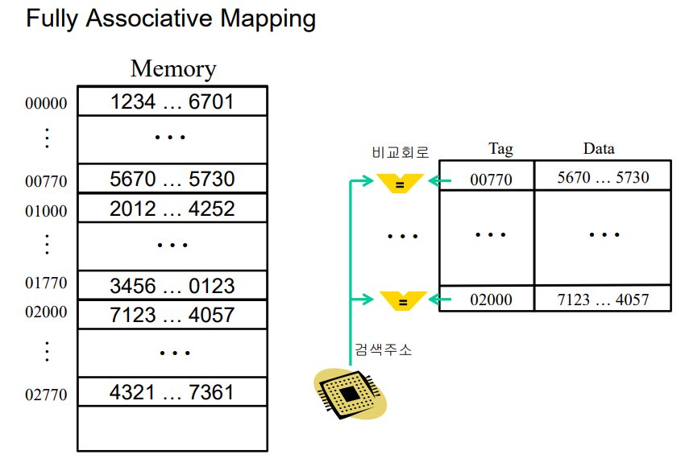
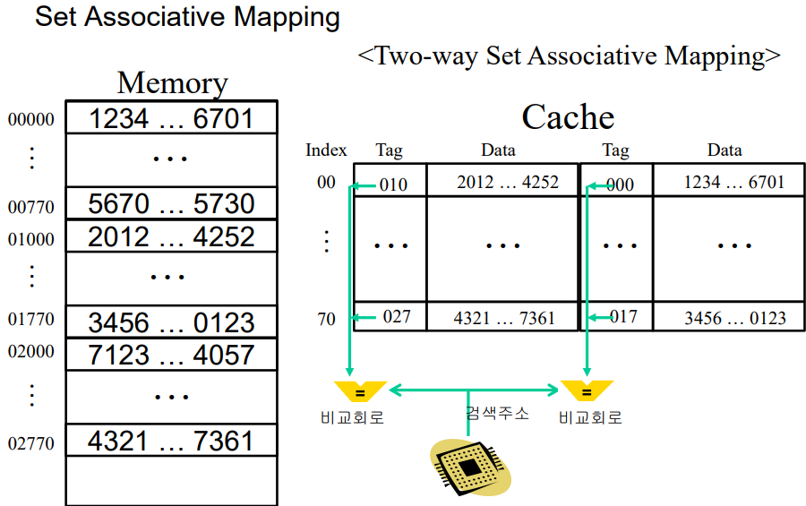
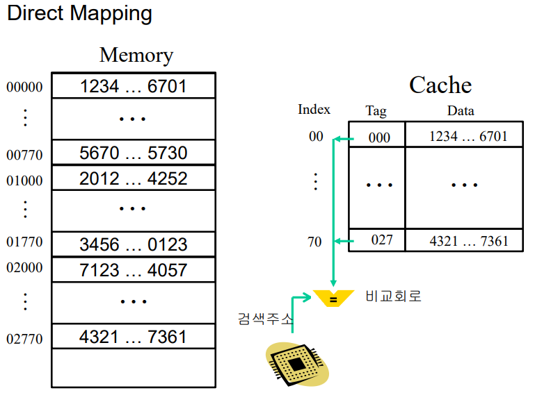
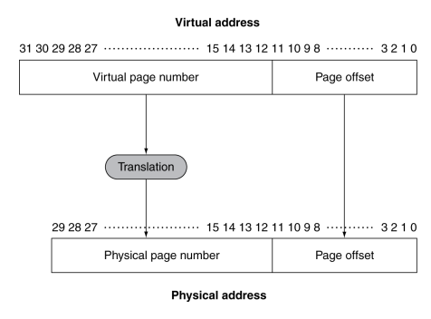
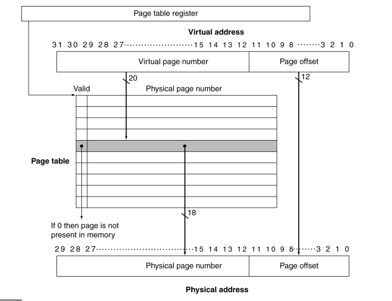
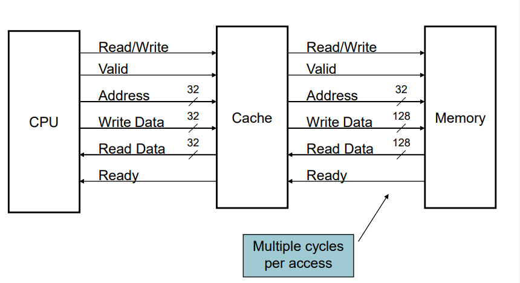
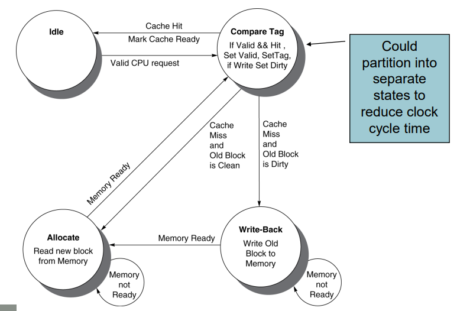

# Large and Fast: Exploiting Memory Hierarchy
## 5.1 Introduction
### Principle of Locality
지역성의 원칙: 프로그램은 어떤 특정 시간에는 주소 공간 내의 비교적 작은 부분만을 접근한다.
1. Temporal locality: 한 번 참조된 항목은 곧바로 다시 참조되는 경향이 있다.
> ex. 반복문 내 명령어

2. Spatial locality: 어떤 항목이 참조되면 그 근처에 있는 다른 항목들이 곧바로 참조될 가능성이 높다.
> ex. 순차적인 명령어 접근, 배열

### Taking Advantage of Locality
메모리 계층구조를 구현함으로써 지역성의 원칙을 이용할 수 있다.
1. 모든 데이터를 디스크에 저장한다.
2. 최근에 접근된 데이터와 그 주변 데이터를 디스크에서 복사하여 DRAM 메모리(메인 메모리)로 옮긴다.
3. DRAM에서 최근에 사용된 데이터는 SRAM으로 복사하여 옮긴다.

메모리 계층구조는 서로 다른 속도와 크기를 갖는 여러 계층의 메모리로 구성되어 있다. 그림에서 빠른 메모리는 프로세서에 가깝게 두고 느리고 싼 메모리를 그 아래에 둔다. 메모리 계층구조의 목적은 사용자에게 가장 빠른 메모리의 접근 속도를 제공하면서 동시에 가장 싼 메모리만큼의 용량을 제공하는 것이다.

프로세서에서 멀어지면 멀어질수록 그 계층에 접근하는 데 시간이 오래 걸린다. 메모리 계층구조는 여러 계층으로 구성되지만, 데이터는 인접한 두 계층 사이에서만 한 번에 복사가 된다.

두 계층 간 정보 전송의 최소 단위를 블록(block) 또는 라인(line)이라고 부른다.
프로세서가 요구한 데이터가 상위 계층의 어떤 블록에 있을 때 이를 적중(hit)이라고 부른다.
상위 계층에서 찾을 수 없다면 이를 실패(miss)라고 부르고 이때는 필요한 데이터를 포함하는 블록을 찾기 위해 하위 계층 메모리를 접근하게 된다.
적중률(hit ratio)은 메모리 접근 중 상위 계층에서 찾을 수 있는 것의 비율로서 메모리 계층의 성능을 평가하는 척도이다.
실패율(miss rate)는 1 - hit ratio로, 메모리 접근 중 상위 계층에서 찾을 수 없는 것의 비율을 말한다.

적중시간(hit time)은 메모리 계층구조의 상위 계층을 접근하는 데 걸리는 시간이며 이 시간에는 접근이 hit인지 miss인지를 결정하는 데 필요한 시간도 포함된다.

실패 손실(miss penalty)은 하위 계층에서 해당 블록을 가져와서 상위 계층 블록과 교체하는 시간 + 그 블록을 프로세서에 보내는 데 걸리는 시간이다.

## 5.2 Memory Technologies
메인 메모리는 DRAM(Dynamic Random Access Memory)로 구현된다. 프로세서에 더 가까운 계층인 캐시에는 SRAM(Static Random Access Memory)이 사용된다.

### DRAM Technology
DRAM에서는 셀에 기억되는 값이 전하 형태로 capacitor에 저장된다. 저장된 전하를 접근하는 데 트렌지스터가 하나 필요하다.
DRAM은 저장된 비트 하나당 트랜지스터 하나만 있으면 되므로 SRAM에 비하여 훨씬 더 집적도가 높고 값도 싸다(SRAM은 비트당 6~8개의 트렌지스터를 사용함)
DRAM은 capacitor에 전하(유지 기간이 짧음)를 저장하기 때문에 무한히 유지할 수가 없어서 주기적으로 리프레시 해주어야 한다. 이 메모리 구조는 이렇게 기억을 지속하지 못하기 때문에 SRAM 셀의 정적(Static)과 반대로 동적(Dynamic)이라고 한다.

DRAM은 뱅크로 구성되어 있는데, DDR4는 일반적으로 뱅크가 4개이다. 각 뱅크는 일련의 행으로 구성되어 있다. 
Pre 신호는 뱅크를 열거나 닫는데 사용된다. 행 주소는 Act 신호와 함께 보내지는데, 이 신호는 행을 버퍼로 보낸다.
Burst mode: 행 단위로 refresh함으로써 접근 시간도 줄여주고 공간적 지역성도 제공한다.

Double data rate(DDR) DRAM: 주소를 일일이 지정하는 대신에 클럭이 연속적인 비트를 버스트 모드로 전송한다. 클럭의 상승 엣지에서도 데이터가 전송되고 하강 엣지에서도 데이터가 전송되어 대역폭이 2배가 된다.
Quad data rate(QDR) DRAM: DDR의 입력값과 출력값을 구분하였다.

1996년 까지는 DRAM의 크기가 약 3년마다 4배씩 증가하였으나, 그 후에는 많이 느려졌다.

### DRAM Performance Factors
- Row buffer: 한 꺼번에 몇 개의 워드를 읽어서 병렬로 refresh하게 한다.
- Synchronous DRAM: 각 주소를 지정할 필요 없이 버스트 모드로 연속적인 접근을 가능하게 한다. 대역폭도 향상시켜 주었다.
- DRAM banking: 여러 DRAM에 동시에 접근하게 하여 대역폭을 증가시켰다.

### Increasing Memory Bandwidth
각자 별도의 행 버퍼를 가지고 있는 여러 개의 뱅크에서 동시에 읽고 쓸 수 있도록 한 주소를 여러 뱅크에 보내서 모든 뱅크가 동시에 읽고 쓸 수 있게 한다. 이러한 방식을 주소 인터리빙이라고 한다.
★☆★☆★☆★☆★☆★☆★☆★☆★☆★☆★☆★☆★☆

### Flash Storage
비휘발성 반도체로 디스크보다 100~1000배 빠르다.

### Disk Storage
비휘발성이다. 하드 디스크는 원판의 집합으로 구성되어 있고 원판은 회전한다. 하드 디스크상의 정보를 읽고 쓰기 위해 읽기/쓰기 헤드라고 불리는 암(arm)이 각 표면 바로 위에 있다.
각 디스크 표면은 트랙이라고 불리는 동심원으로 나누어 진다. 각 트랙은 다시 정보를 저장하는 섹터로 나누어 진다. 한 트랙은 수천 개의 섹터로 구성된다.
각 면의 디스크 헤드는 서로 연결되어 있으며 함께 움직이므로 모든 헤드는 각 면의 같은 트랙에 위치하게 된다. 헤드 아래에 있는 모든 면의 트랙을 실린더라고 부른다.

## 5.3 The Basics of Caches
메모리 계층구조에서 CPU와 가장 가까운 계층이다. 

워드 Xn을 참조하기 전에는 캐시에 Xn이 없으므로 Cache miss를 발생시켜서 메모리에서 Xn을 가져와 캐시에 넣도록 만든다.

각 메모리 워드에 캐시 내의 위치를 할당하는 가장 간단한 방법은 그 워드의 메모리 주소를 이용하는 것이다. 이러한 캐시 구조를 직접 사상(direct mapped)이라고 한다.

각 메모리 위치는 캐시 내의 딱 한 장소에 바로 사상된다.
직접 사상 캐시가 메모리 주소를 캐시 위치로 바꾸는 방법은 간단하다.

(블록 주소) modulo (캐시 내에 존재하는 전체 캐시 블록 수)
캐시 내의 블록 수가 2의 거듭제곱이면 주소의 하위 lg(캐시 내의 전체 블록 수)비트를 취하는 것만으로 간단히 modulo연산을 할 수 있다.

캐시에 태그(tag)를 추가함으로써 요구하는 워드가 캐시 내에 있는지 없는지를 알 수 있다. 태그는 캐시 인덱스로, 사용되지 않은 주소의 상위 부분 비트들로 구성된다.

캐시 블록이 유효한 정보를 가지고 있는지를 알아내기 위해 유효 비트(valid bit)를 이용한다. 각 엔트리에 valid bit를 추가함으로써 이 비트가 0이면 이 엔트리에는 유효한 블록이 없는 것으로 간주한다. 초기 상태는 모두 0이다.

캐시 블록의 인덱스와 그 블록의 태그 값이 캐시 블록에 있는 워드의 메모리 주소를 표시한다. 인덱스 필드가 캐시를 접근하는 주소로 이용되며 직접 사상 캐시 전체 엔트리의 수는 2의 거듭제곱이 되어야 한다.

MIPS 구조에는 정렬 제약이 있어서 모든 워드 주소가 4의 배수이므로, 주소의 최하위 2비트(Byte offset)는 워드 내의 바이트 순서를 나타낸다.

캐시는 데이터뿐만 아니라 태그도 저장해야 하므로 캐시 구현에 필요한 총 비트 수는 캐시 크기와 주소 크기에 따라 결정된다. 

태그 필드의 크기: 32 - (캐시 인덱스 필드 비트 수 + 캐시 블록의 크기 + Byte offset)

직접 사상 캐시의 전체 비트 수: $2^n$ * (블록 크기 + 태그 크기 + 유효 비트 크기), n = 캐시 인덱스 필드 비트 수

### 예제: 캐시의 전체 비트 수
16KiB의 데이터와 4워드 블록을 갖는 직접 사상 캐시의 구현에 필요한 전체 비트 수는 얼마인가? 단, 32비트 주소를 가정하라.

16KiB의 데이터는 4*4096B이며 4096워드이다. 한 블록이 4워드이므로 이 캐시에는 1024개의 블록이 있다. 즉, 캐시의 인덱스 필드 비트 수는 10이다.
태그 필드의 크기 = 32 - (10 + 2 + 2) = 18

직접 사상 캐시의 전체 비트 수: 2^10 * (32 * 4 + 18 + 1) = 2^10 * 147 = 147KiBiBit

즉 16KiB 캐시를 구현하려면 147KiBiBit(= 18.4KiB) 메모리가 필요하다. 이 캐시에서 전체 비트 수는 데이터 저장에 필요한 공간보다 약 1.15배 더 크다.

### 예제: 여러 워드 블록을 갖는 캐시의 주소 사상
블록 크기가 16바이트, 블록 개수가 64개인 캐시에서 바이트 주소 1200은 몇 번 블록에 사상되는가?

블록 번호는 다음 식으로 구할 수 있다.
블록 번호 = (블록 주소) mod (캐시 내 블록 수)

여기서 블록 주소는 다음과 같이 구할 수 있다.
블록 주소 = 바이트 주소/블록 당 바이트 수

블록 당 바이트 수는 16이므로 바이트 주소 1200의 블록 주소는 1200/16 = 75이다.
이를 이용하여 블록 번호를 구하면
75 mod 64 = 11이다.
따라서 바이트 주소 1200은 11에 사상된다.

블록이 크면 spatial locality를 더 잘 활용해서 실패율이 낮아진다. 하지만 블록이 너무 커서 캐시의 상당 부분을 차지하게 되면 캐시 내의 블록 개수가 너무 적어서 블록에 대한 경쟁이 심해지기 때문에 실패율이 오히려 높아진다.

조기 재시작, 중요 워드 우선 방식은 Larger miss penalty를 줄일 수 있다.
- 조기 재시작: 블럭 전체를 기다리지 않고 블럭 내의 요청된 워드가 도달하면 곧바로 실행을 시작한다.
- 중요 워드 우선: 요청한 워드를 메모리에서 캐시로 제일 먼저 전송시킨다.

## Cache Miss
캐시 실패가 발생하면 제어 유닛은 실패를 탐지하고 메모리 or 하위 수준의 캐시로부터 데이터를 가져와서 실패를 처리해야 한다.

명령어 캐시 실패의 처리 단계는 다음과 같이 정의할 수 있다.
1. 원래의 PC값을 메모리로 보낸다.
2. 메인 메모리에 읽기 동작을 지시하고 메모리가 접근을 끝낼 때까지 기다린다.
3. 캐시 엔트리에 쓴다. 메모리에서 인출한 데이터를 데이터 부분에 쓰고, 태그 필드에 주소의 상위 비트를 쓰고, 유효 비트를 1로 한다.
4. 명령어 수행을 첫 단계부터 다시 시작한다.

### 쓰기의 처리
데이터를 캐시에만 쓰고 메인 메모리에 쓰지 않으면 메인 메모리는 캐시와 다른 값을 갖게 된다. 이 경우 캐시와 메모리는 불일치되기 때문에 메인 메모리와 캐시를 일치시켜야 한다.
Write-Through(즉시 쓰기): 항상 데이터를 메모리와 캐시에 같이 쓴다. 이 방식은 시간이 오래 걸려서 프로세서 클럭 사이클이 많이 필요하고 프로세서의 성능을 저하시키는 경향이 있다.
> 이를 해결하기 위해 쓰기 버퍼를 이용할 수 있다. 쓰기 버퍼는 데이터가 메모리에 써질 때까지 기다리는 동안 이 데이터를 저장한다. 메인 메모리에 쓰기를 완료하면 쓰기 버퍼의 엔트리는 지워진다. 프로세서가 쓰기를 하려고 할 때 쓰기 버퍼가 모두 차 있으면 쓰기 버퍼에 빈 공간이 생길 때까지 멈춰 있어야 한다.

Wirte-Back(나중 쓰기): 즉시 쓰기 방식의 대안으로, 쓰기가 발생했을 때 새로운 값은 캐시 내의 블록에만 쓴다. 나중에 캐시에서 데이터가 쫒겨날 때 쓰기에 의해 내용이 바뀌었으면 이 블록을 하위 메모리 계층에 쓴다.

즉시 쓰기가 실패할 경우 대안: 
1. 쓰기 할당(Write allocate)
> 일단 전체 블록을 메모리에서 읽어 온 후 블록 중에서 쓰기 실패를 발생시킨 워드만 덮어쓴다.
2. 쓰기 비할당(no write allocate)
> 메모리에 있는 블록의 해당 부분만 갱신하고 캐시에는 쓰지 않는다.

## 5.4 캐시 성능의 측정 및 향상
CPU 시간은 CPU가 프로그램을 수행하는 데 쓴 클럭 사이클과 메모리 시스템을 기다리는 데 쓴 클럭 사이클로 나눌 수 있다.

일반적으로 적중된 캐시 접근시간은 정상적인 CPU 수행 사이클의 일부로 간주한다.
즉,
CPU 시간 = (CPU 클럭 사이클 + 메모리 지연 클럭 사이클) * 클럭 사이클 시간

메모리 지연 클럭 사이클 읽기와 쓰기 시에 발생되는 지연 사이클의 합으로 정의할 수 있다.

메모리 지연 클럭 사이클 = 읽기 지연 사이클 + 쓰기 지연 사이클

읽기 지연 사이클은 프로그램당 읽기 접근의 수, 읽기시 실패 손실 클럭 사이클 수, 읽기 실패율에 의해 정의된다.

$$ 읽기 지연 사이클 = {{읽기 접근 횟수} \over 프로그램} * 읽기 실패율 * 읽기 실패 손실 $$

쓰기의 경우 다음과 같다.

$ 쓰기 지연 사이클 = ({{쓰기 접근 횟수} \over 프로그램} * 쓰기 실패율 * 쓰기 실패 손실) + 쓰기 버퍼 지연 $
쓰기 버퍼 지연은 쓰기 시 쓰기 버퍼에 빈자리가 없는 경우에 발생한다.

결론
$ 메모리 지연 클럭 사이클 = {{메모리 접근 횟수} \over 프로그램} * 실패율 * 실패 손실 $
$메모리 지연 클럭 사이클 = {명령어 \over 프로그램} * {실패 \over 명령어} * 실패손실$

### 예제: 캐시 성능의 계산
명령어 캐시 실패율이 2%이고, 데이터 캐시 실패율이 4%라고 가정하자. 메모리 지연이 없을 때 CPI가 2이고 매 실패마다 실패 손실이 100사이클이다. 실패가 발생하지 않는 완벽한 캐시를 사용한다면 시스템이 얼마나 빨라지는지 계산하라. 적재와 저장 명령어의 실행 빈도는 36%라 가정하자.

명령어 개수를 I라고 하자.
명령어 실패 사이클 = 명령어 개수 * 명령어 캐시 실패율 * 실패 손실 이므로 I * 2% * 100 = 2I이다.

읽기와 쓰기의 빈도는 36%이므로 데이터 참조에 대한 메모리 실패 사이클의 수는 다음과 같다.
데이터 실패 사이클 = I * 36% * 4% * 100 = 1.44I이다.

전체 메모리 지연 사이클의 수는 2I + 1.44I = 3.44I이다.
평균적으로 3.44 사이클 이상의 메모리 지연이 발생한다는 뜻이다.
메모리 지연을 포함한 CPI는 2 + 3.44 = 5.44가 된다. 

명령어 개수와 클럭 속도에는 변화가 없기 때문에 프로세스 수행시간의 비율은 다음과 같다.

> CPU시간 = 명령어 개수 * CPI * 클럭 사이클

지연이 있는 경우의 CPU 시간/완벽한 캐시의 CPU 시간 = I * CPI(지연) * 클럭 사이클 / I * CPI(완벽) * 클럭 사이클 = 5.44 / 2 = 2.72

따라서 성능은 2.72배 더 좋아진다.

## 평균 메모리 접근시간
적중과 실패 시의 데이터 접근시간이 모두 성능에 영향을 미치므로, 평균 메모리 접근시간(AMAT)을 사용한다.
AMAT은 적중과 실패를 모두 고려하고 서로 다른 접근의 빈도를 감안하여 구한다.

평균 메모리 접근시간 = 적중시간 + 실패율 * 실패손실

### 예제: 평균 메모리 접근시간의 계산
클럭 사이클 시간이 1ns이고, 실패 손실이 20클럭, 명령어당 실패율이 0.05, 캐시 적중 검사를 포함한 캐시 접근시간이 1클럭 사이클일 때, 평균 메모리 접근시간을 구하라. 읽기와 쓰기의 실패 손실은 같고 다른 쓰기 지연은 무시한다.

AMAT = 1 +  20 * 0.05 = 2클럭 사이클
1클럭사이클당 1ns이므로 AMAT = 2ns

## Associative Caches
1. Fully associative(완전 연관)

- 블록이 어느 곳에나 있을 수 있기 때문에 주어진 블록을 찾으려면 캐시 내의 모든 엔트리를 검색해야 한다. 
- 각 캐시 엔트리와 연결된 비교기를 이용하여 병렬로 검색해야 한다.
- 하드웨어 비용이 높으므로 블록이 몇 개 안 되는 작은 캐시에만 쓸 수 있다.

2. Set associative(집합 연관)

- 한 블록이 들어갈 수 있는 자리의 개수가 고정되어 있다.
- 각 블록당 n개의 배치 가능한 위치를 찾는 집합 연관 캐시를 n-way 집합 연관 캐시라고 부른다.
- n-way 집합 연관 캐시에는 각 집합에 n개의 블록이 있다.
- 선택된 집합 내에서는 아무 장소에나 들어갈 수 있기 때문에 집합 내의 모든 태그를 다 검색해야 한다.
- 집합 연관 캐시에서 어떤 메모리 블록을 갖고 있는 집합은 다음과 같이 구할 수 있따.
- (블록 번호) mod (캐시 내 집합의 수)

3. Direct mapped(직접 사상)

- 직접 사상 캐시 내에서 메모리 블록의 위치는 다음과 같이 구할 수 있다.
- (블록 번호) mod (캐시 내 블록의 수)

> 연관 정도가 높을수록 집합의 수는 적다.

## Replacement policy
완전 연관 캐시에서는 모든 블록이 교체의 후보가 된다.
LRU(Least Recently Used)
- 가장 오랫동안 사용되지 않은 블록을 교체한다.
- n-way에서 n이 커지면 random하게 교체하는 것과 성능에서의 차이가 없다.

## Multilevel Caches
DRAM 접근시간 사이의 차이를 줄이기 위해 대부분의 마이크로프로세서는 캐시를 한 계층 더 지원한다.
2차 캐시(L2 캐시)는 보통 마이크로프로세서와 같은 칩에 있으며 1차 캐시에서 실패가 발생하면 접근한다.
2차 캐시가 원하는 데이터를 갖고 있으면 실패 손실은 2차 캐시의 접근시간이 되며, 이 값은 메인 메모리 접근시간보다 훨씬 짧다.
1차 캐시와 2차 캐시 둘 다 데이터를 갖고 있지 않은 경우에는 메인 메모리 접근이 필요하게 되어 더 큰 실패 손실이 발생한다.

### 예제: 다단계 캐시의 성능
클록 속도 = 4GHz이고, 모든 참조가 1차 캐시에서 적중된다고 가정했을 때 기본 CPI가 1인 프로세서를 생각해보자. 실패처리까지 포함하여 메인메모리 접근 시간이 100ns이고, 1차 캐시에서 명령어 하나당 실패율이 2%라고 가정하자. 접근 시간이 5ns인 2차 캐시를 충분히 많이 추가하여 메인 메모리까지 가야하는 실패의 비율을 0.5%로 낮출 수 있었다면 프로세서는 얼마나 빨라지는가?

메인 메모리로 가는 경우의 실패 손실은 다음과 같다.
100ns / (0.25 * (1ns/클럭사이클)) = 400 클럭사이클

캐시가 한 계층만 있는 경우 CPI는 다음과 같다.
전체 CPI = 기본 CPI + 명령어 하나당 메모리 지연사이클
         = 1.0 + 명령어 하나당 메모리 지연사이클
         = 1.0 + 2% * 400 = 9

2차 캐시가 있을 때는 1차 캐시 실패가 2차에서 될 수도 있고 메인 메모리에서 처리될 수도 있다. 2차 캐시 접근에 따른 실패 손실은 다음과 같다.

5ns / (0.25 * ns/클럭사이클) = 20 클럭사이클

캐시가 2단계 있을 때 전체 CPI는 다음과 같다.
전체 CPI = 1 + 명령어 하나당 1차 캐시 지연 + 명령어 하나당 2차 캐시 지연 = 1 + 2% * 20 + 0.5% * 400 =  3.4

따라서 캐시가 2단계 있을 때 프로세서는 다음과 같이 빨라지게 된다.
9.0 / 3.4 = 2.6

## 5.5 신용도 있는 메모리 계층구조
### 장애의 정의
장애: 서비스 수행 -> 서비스 중단
복구: 서비스 중단 -> 서비스 수행

신뢰성: 어떤 기준 시점에서부터 서비스 수행의 지속성에 대한 측도. = 장애가 발생하기까지의 시간

평균 무장애 시간(MTTF): 신뢰성의 측도

서비스 중단은 평균 복구사긴(MTTR)으로 측정된다. 따라서, 장애간 평균 시간(MTBF)은 MTTF + MTTR이다.

가용성(Availability) = MTTF / (MTTF + MTTR)

MTTF를 늘리면서 MTTR을 줄여야 한다.

MTTF를 개선하는 방법 세 가지
1. 결함 회피: 결함 발생을 구조적으로 방지한다.
2. 결함 감내: 결함이 나타나더라도 서비스 명세대로 서비스가 제공될 수 있도록 여유분을 사용한다.
3. 결함 예상: 결함의 존재와 발생을 예측하는 방법을, 구성 요소가 실패하기 전에 교체할 수 있도록 한다.

## The Hamming SEC Code
Hamming Distance는 유효한 두 비트 패턴에서 같은 위치의 비트 중 값이 서로 다른 것의 개수를 말한다.
예를 들어 011011과 001111의 거리는 2이다.

Hamming은 에러 검출을 위해 패리티 코드(parity code)를 사용한다. 워드를 메모리에 쓸 때 패리티비트도 함께 쓰면 N+1비트의 패리티는 항상 짝수가 된다. 

예제) 1바이트 데이터의 값이 10011010라고 가정하자. 이 데이터에 대한 Hamming ECC를 보여라. 그리고 비트 10을 반대로 바꾼 다음, ECC코드가 단일 비트 에러를 찾아서 정정하는 과정을 보여라.

SOL)
패리티 비트를 빈칸으로 표시하면 _ _ 1 _ 0 0 1 _ 1 0 1 0이다.
위치 1은 비트 1, 3, 5, 7, 9, 11의 패리티이다. 각 위치의 패리티 합은 4로 짝수이다. 따라서 비트 1은 0이 되어야 한다.

위치 2는 2, 3, 6, 7, 10, 11이다. 각 위치의 패리티 합은 3으로 홀수이다. 따라서 비트 2는 1이 되어야 한다.

위치 4는 비트 4, 5, 6, 7, 12의 패리티이다. 현재 합은 1로 홀수이므로 비트 4는 1이 되어야 한다.

위치 8은 8, 9, 10, 11, 12의 패리티이다. 현재 합은 2로 짝수이므로 비트 8은 0이 되어야 한다.

따라서 최종 코드 워드는 011100101010이 된다.

비트 10을 반대로 바꾼 다음 에러를 정정하여야 하므로 바꿔보면 011100101110이 된다. 이제 패리티 비트를 검사해 보면
패리티 비트 1은 1이 4개라 짝수패리티이므로 문제없다.
패리티 비트 2는 5로 홀수이므로 에러가 있다.
패리티 비트 4는 2로 짝수이므로 문제 없다.
패리티 비트 8은 3으로 홀수이므로 문제가 있다.

패리티 비트 2와 8이 틀렸으므로 2+8 = 10 -> 비트 10이 잘못된 것이다.
따라서 비트 10을 반대로 바꾸면 011100101010이 된다.

Hamming 거리가 2이면 단일 비트 에러 검출을 제공한다.
Hamming 거리가 3이면 단일 비트 정정과 2 비트 에러 검출을 제공한다.
Hamming 거리가 4면 단일 비트 에러를 정정하고 이중 비트 에러를 검출할 수 있다.

## 5.6 가상 머신
운영체제 가상 머신은 사용자들에게 전체 컴퓨터를 자신만이 쓰고 있다는 환상을 제공한다.
가상 머신을 사용하는 이유
- 현대 시스템에서 격리와 보안에 관한 중요도 증가
- 표준 운영체제의 보안성과 신뢰성 실패
- 관련 없는 많은 사용자들이 한 컴퓨터를 공유하고자 함

### Virtual Machine Monitor
VM을 지원하는 소프트웨어를 가상 머신 모니터(VMM)라고 하며 하이퍼바이저 라고도 부른다.
기반이 되는 하드웨어 플랫폼을 호스트라고 하고, 호스트의 자원을 손님(guest) VM들이 공유한다.
VMM은 어떻게 가상 자원을 물리 자원으로 사상할 것인지를 결정한다. 물리 자원은 시분할(time-shared)이나 공간 분할(partitioned)로 공유되며, 소프트웨어로 에뮬레이션되기도 한다.

## 5.7 가상 메모리
메인 메모리가 디스크를 위한 캐시로 동작할 수 있다. 이 기술을 가상 메모리라고 한다.

가상 메모리를 사용하는 이유
1. 프로그램이 메인 메모리를 공유하기 위해서
2. 작고 제한된 크기의 메인 메모리에서 프로그래밍을 해야 하는 제약을 제거하기 위해서

가상 메모리의 블럭은 페이지라고 불리며 가상 메모리 실패는 페이지 폴트라고 부른다.

### Address Translation
가상 주소를 물리 주소로 바꾸는 작업(가상의 페이지 -> 실제 페이지)

가상 메모리 시스템의 주소는 가상 페이지 번호와 페이지 변위로 나누어 진다. 변할 때 페이지 변위(Page offset)는 변하지 않는다.

페이지의 크기는 2^12 = 4KiB이다. 실제 페이지 번호가 18비트 이므로 메인 메모리에 있을 수 있는 실제 페이지의 수는 2^18개이다. 그러므로 가상 주소 공간은 4 * 2^12 * 2&18 = 2^32 = 4GiB이지만 메인 메모리는 최대 1GiB(2^30)이다.

### Page Fault Penalty
페이지 폴트가 발생하면 페이지는 디스크에서 패치되어야 한다.
- 운영체제에 의해 관리되며 수백 클럭 사이클이 걸린다.
페이지 폴트 발생률을 줄여야 한다.
- Fully associative placement
- Smart replacement algorithm

### Page Table
가상 메모리의 페이지를 인덱스하는 표이다. CPU내의 페이지 테이블 레지스터는 실제 메모리의 페이지 테이블을 가리킨다.

각 프로그램은 각자 자신의 페이지 테이블을 갖고 있으며, 페이지 테이블은 그 프로그램의 가상 주소 공간을 메인 메모리로 사상한다.

페이지 테이블은 메모리에 적재되지 않은 페이지의 엔트리도 포함하고 있다. 메모리 내 페이지 테이블의 위치를 나타내기 위해 페이지 테이블의 시작 주소를 나타내는 레지스터가 하드웨어에 포함되고 있다. 이 레지스터를 페이지 테이블 레지스터라고 부른다.

페이지가 메모리에 있다면
1. 페이지 테이블 엔트리는 물리 페이지 번호를 저장한다.
2. 다른 상태 비트(참조, 수정 비트)또한 저장한다.

페이지가 존재하지 않는다면
- 페이지 테이블 엔트리는 디스크의 스왑 스페이스에서 데이터를 찾는다.

페이지 테이블은 가상 페이지 번호로 인덱스되어 있으며, 실제 주소를 찾아 준다.
위 그림에서 페이지 테이블 엔트리의 수는 2^20개이다. 

## Replacement and Write
페이지 폴트 발생률을 줄이기 위해 LRU(Least Recently Used) 교체 정책을 사용한다.
- 참조되면 페이지 테이블 엔트리에 있는 참조비트를 1로 설정한다.(운영체제가 주기적으로 0으로 만든다.)
-  참조비트가 0이면 최근에 참조되지 않은 것이다.

디스크 쓰기는 수백만 사이클이 걸린다.
- Write through 방식은 비현실적이다.
- 블럭단위로 저장된다.
- Write Back 방식을 사용한다.
- 페이지 테이블 엔트리의 수정 비트를 사용한다.(쓰기 작업이 시행되면 1로 설정)

## Fast Translation Using a TLB
주소 변환은 추가적인 메모리 참조를 요구한다.
1. 페이지 테이블 엔트리에 접근한다.
2. 그런 다음 메모리에 접근한다.

페이지 테이블에 접근하는 것은 좋은 지역성을 가진다.
- 페이지 테이블에 2번 접근하는 것을 막기 위해 최근에 사용된 변환을 가지고 있는 특별한 캐시가 있다(변환 참조용 버퍼, TLB 라고 부른다).
TLB의 일반적인 값들은 다음과 같다.
- TLB 크기: 16~512 엔트리
- 블록 크기: 1~2 페이지 테이블 엔트리
- 적중 시간: 0.5~1 클럭 사이클
- 실패 손실: 10~100 클럭 사이클
- 실패율: 0.01 ~ 1%

메모리를 참조할 때마다 TLB를 먼저 참조하여 가상 페이지 번호를 찾아보고 적중되면 참조 비트를 1로 설정하고, 쓰기를 수행하면 더티 비트도 1로 설정한다. 만약 없으면 메모리에서 TLB로 적재한다. 만약 메모리에도 없으면 페이지 부재이므로 시스템 호출을 진행한다.

페이지 폴트가 발생해서 메모리의 페이지를 TLB로 끌어올리는데, TLB가 가득찼다면 TLB중 하나를 교체해야 한다. 이 때 dirty 비트가 0인것을 교체해야 하는데, 모두 1이라면 먼저 디스크에 그 TLB 데이터를 쓴 다음에 교체해야 한다.

## Memory Protection
다른 프로세스도 가상 주소 공간에 접근할 수 있다. 따라서 악의를 가진 프로세스가 메모리에 쓰기를 수행할 수 없도록 해야하므로 TLB의 쓰기 접근 비트로 접근 제어를 해야한다.

운영체제가 이러한 보호를 구현할 수 있게 하기 위해서는, 하드웨어가 최소한 다음 세 가지 기본적인 능력을 제공해야 한다.
1. 실행 중인 프로세스가 사용자 프로세스인지 운영체제 프로세스인지를 나타내는 최소한 두 가지 모드를 지원해야 한다.
2. 프로세스 상태의 일부를 사용자 프로세스가 읽기만 하고 쓸 수는 없도록 한다. 이는 특권 명령을 통해서만 쓸 수 있다.
3. 시스템 호출을 통한 예외 처리를 지원해야 한다.

# 5.8 A Common Framework for Memroy Hierarchy
1. 블럭을 어디에 넣을까?
- 연관 방식에 의해 결정된다.
    - Direct mapped(직접 사상, 1-way associative)
    - n-way set associative
    - Fully associative
- 연관성이 높을수록 실패율이 떨어진다.
    - 대신 복잡성, 비용, 접근 시간이 높아진다.

2. 블럭을 어떻게 찾을까?
- 블럭 배치방식에 의존한다.
- Direct mapped: 인덱스로 접근하며 각 인덱스마다 1번 비교한다.
- n-way set associative: 집합을 인덱스한 후 집합 내 모든 원소를 비교한다. n번의 비교가 필요하다.
- fully associative: 모든 엔트리를 검색하며 모두 병렬로 엔트리 수만큼 비교연산을 한다.

3. 캐시 실패가 발생하면 어느 블럭을 교체할까?
- LRU: 가장 오랫동안 사용되지 않은 것을 교체한다.
- Random: 임의로 교체한다.
- Virtual memory

4. 쓰기는 어떻게 하는가?
- Write-through
    - 캐시 내의 블럭과 하위 계층 동시에 저장한다.
    - 구현은 간단하나 쓰기 버퍼가 필요하다.

- Write-back
    - 상위 계층만 먼저 업데이트한다.
    - 하위 계층은 상위 계층의 해당 블럭이 교체될 때 쓰기가 필요하다면 교체한다.

- Virtual memory: write-back만 가능하다.

## Sources of Misses
- 필수 실패(Compulsory miss): 캐시에 한 번도 들어오지 않았던 블럭에 대한 첫 번째 접근에 의해 발생한다.(최초 시작 실패(cold-start miss)라고도 한다.)
    - 블럭 사이즈를 크게 해서 한 번에 많은 데이터를 저장하면 줄어들지만 miss penalty가 증가하며 캐시 실패율을 높일 수 있다.
- 용량 실패(capacity miss): 캐시가 프로그램 수행 중 필요한 모든 블록을 포함할 수 없을 때 발생한다. 용량 실패는 블럭이 교체되고 나중에 다시 그 블록을 가져올 때 발생한다.
    - 캐시 사이즈를 키우면 해결되지만 접근 시간을 증가시킬 우려가 있다.

- 대립 실패(conflict miss): 집합 연관이나 직접 사상 캐시에서 여러 블록들이 같은 집합에 대해 경쟁을 벌일 때 발생하는 캐시 실패이다. 완전 연관캐시에서는 발생하지 않는다. 충돌 실패(collision miss)라고도 한다.
    - 연관성을 높이면 되지만 접근 시간을 증가시킬 우려가 있다.

# 5.9 Using a Finite-State Machine to Control a Simple Cache
캐시를 제어하기 위한 제어기이다.

캐시의 특징은 다음과 같다.
- Direct-mapped, write-back, write allocate
- 블럭 크기: 4워드(16바이트)
- 캐시 크기: 16KiB(1024 블럭)
- 32비트 주소를 가짐
- 캐시 블럭마다 유효 비트와 dirty 비트를 가짐

- 캐시 인덱스는 10비트이다.
- 블럭 offset은 4비트이다.
- 태그 크기는 18비트이다.

프로세스와 캐시 사이의 신호는 다음과 같다.
- 1비트의 읽기, 쓰기 신호
- 1비트의 유효 신호
- 32비트 주소
- 프로세서에서 캐시로 가는 32비트 데이터
- 캐시에서 프로세서로 가는 32비트 데이터
- 캐시 동작이 완료되었음을 표시하는 1비트의 레디 신호

캐시와 메모리 사이에는 블럭(1블럭 = 4워드) 단위로 움직이므로 128비트의 데이터가 움직일 수 있다.

## Finite State Machine
입력과 출력, 다음 상태 함수, 출력 함수로 구성된 순차 논리 함수이다. 다음 상태 함수는 현재 상태와 입력을 새로운 상태로 사상하며, 출력 함수는 현재 상태를 출력에 사상한다.

### Cache Controller FSM

위는 캐시 제어기의 네 가지 상태를 보여준다.
1. 대기 상태(Idle): 프로세서에서 유효한 읽기, 쓰기 요청이 오기를 기다리는 상태. 요청이 오면 FSM이 태그 비교 상태로 이동한다.

2. 태그 비교 상태(Compare Tag): 읽기나 쓰기 요청이 적중인지 실패인지를 검사한다.
- 주소의 인덱스 부분이 비교할 태그를 선택한다.
- 인덱스가 가리키는 캐시 블록의 데이터가 유효하고 주소의 태그 부분이 캐시 블럭의 태그와 일치하면 적중이다.
- 적재 명령어이면 선택된 워드에서 데이터를 읽고, 저장 명령어이면 선택된 워드에 쓴다. 그런 다음 캐시 준비 신호가 1로 바뀐다. 쓰기 요청이면 갱신 비트를 1로 만든다.
- 쓰기 적중은 유효 비트와 태그 필드 값도 새로 쓴다.
- 적중 후 블럭이 유효하면 FSM은 Idle 상태로 돌아간다.
- 캐시 실패가 발생하면 dirty 비트가 1이면 Write-back 상태로 가고 0이면 allocate 상태로 간다.

3. 나중 쓰기(Write-back)상태: 태그와 캐시 인덱스로 이루어진 주소를 사용하여 128비트 블록을 메모리에 쓴다.
- 메모리에서 준비 신호가 올 때까지 이 상태에서 기다린다.
- 메모리 쓰기가 완료되면 FSM은 allocate 상태로 이동한다.

4. 할당(allocate) 상태: 메모리에서 새로운 블록을 읽어온다. 메모리에서 준비 신호가 올 때까지 기다린다.

# 5.15 Fallacies and Pitfalls
