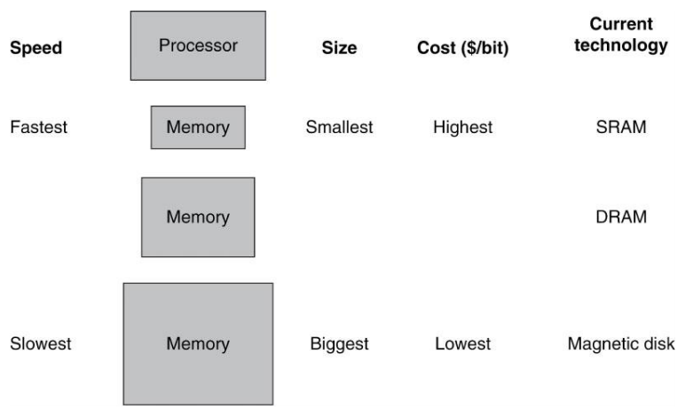
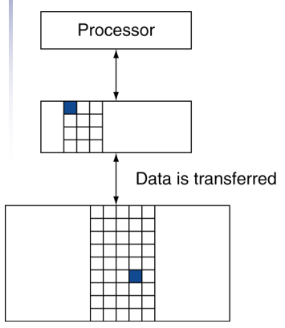
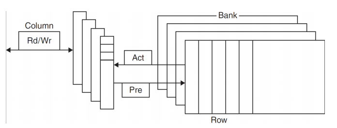
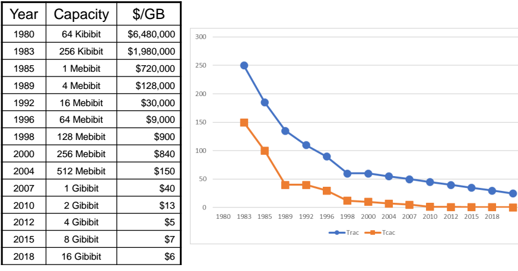
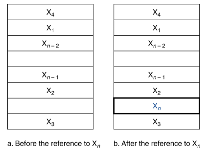
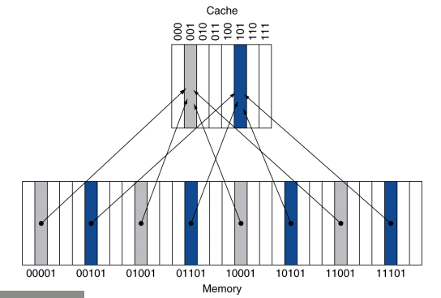
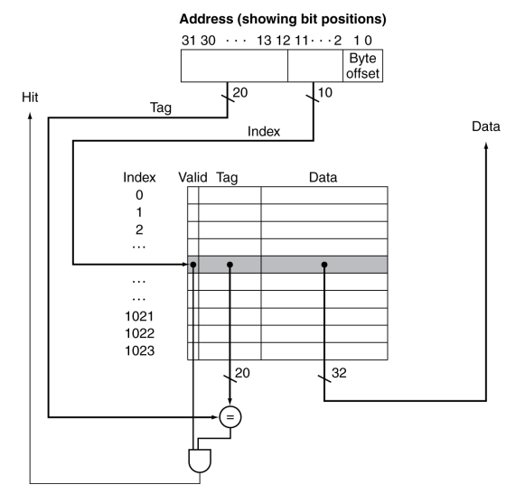

# Large and Fast: Exploiting Memory Hierarchy
## 5.1 Introduction
### Principle of Locality
지역성의 원칙: 프로그램은 어떤 특정 시간에는 주소 공간 내의 비교적 작은 부분만을 접근한다.
1. Temporal locality: 한 번 참조된 항목은 곧바로 다시 참조되는 경향이 있다.
> ex. 반복문 내 명령어

2. Spatial locality: 어떤 항목이 참조되면 그 근처에 있는 다른 항목들이 곧바로 참조될 가능성이 높다.
> ex. 순차적인 명령어 접근, 배열

### Taking Advantage of Locality
메모리 계층구조를 구현함으로써 지역성의 원칙을 이용할 수 있다.
1. 모든 데이터를 디스크에 저장한다.
2. 최근에 접근된 데이터와 그 주변 데이터를 디스크에서 복사하여 DRAM 메모리(메인 메모리)로 옮긴다.
3. DRAM에서 최근에 사용된 데이터는 SRAM으로 복사하여 옮긴다.

메모리 계층구조는 서로 다른 속도와 크기를 갖는 여러 계층의 메모리로 구성되어 있다. 그림에서 빠른 메모리는 프로세서에 가깝게 두고 느리고 싼 메모리를 그 아래에 둔다. 메모리 계층구조의 목적은 사용자에게 가장 빠른 메모리의 접근 속도를 제공하면서 동시에 가장 싼 메모리만큼의 용량을 제공하는 것이다.

프로세서에서 멀어지면 멀어질수록 그 계층에 접근하는 데 시간이 오래 걸린다. 메모리 계층구조는 여러 계층으로 구성되지만, 데이터는 인접한 두 계층 사이에서만 한 번에 복사가 된다.

두 계층 간 정보 전송의 최소 단위를 블록(block) 또는 라인(line)이라고 부른다.
프로세서가 요구한 데이터가 상위 계층의 어떤 블록에 있을 때 이를 적중(hit)이라고 부른다.
상위 계층에서 찾을 수 없다면 이를 실패(miss)라고 부르고 이때는 필요한 데이터를 포함하는 블록을 찾기 위해 하위 계층 메모리를 접근하게 된다.
적중률(hit ratio)은 메모리 접근 중 상위 계층에서 찾을 수 있는 것의 비율로서 메모리 계층의 성능을 평가하는 척도이다.
실패율(miss rate)는 1 - hit ratio로, 메모리 접근 중 상위 계층에서 찾을 수 없는 것의 비율을 말한다.

적중시간(hit time)은 메모리 계층구조의 상위 계층을 접근하는 데 걸리는 시간이며 이 시간에는 접근이 hit인지 miss인지를 결정하는 데 필요한 시간도 포함된다.

실패 손실(miss penalty)은 하위 계층에서 해당 블록을 가져와서 상위 계층 블록과 교체하는 시간 + 그 블록을 프로세서에 보내는 데 걸리는 시간이다.

## 5.2 Memory Technologies
메인 메모리는 DRAM(Dynamic Random Access Memory)로 구현된다. 프로세서에 더 가까운 계층인 캐시에는 SRAM(Static Random Access Memory)이 사용된다.

### DRAM Technology
DRAM에서는 셀에 기억되는 값이 전하 형태로 capacitor에 저장된다. 저장된 전하를 접근하는 데 트렌지스터가 하나 필요하다.
DRAM은 저장된 비트 하나당 트랜지스터 하나만 있으면 되므로 SRAM에 비하여 훨씬 더 집적도가 높고 값도 싸다(SRAM은 비트당 6~8개의 트렌지스터를 사용함)
DRAM은 capacitor에 전하(유지 기간이 짧음)를 저장하기 때문에 무한히 유지할 수가 없어서 주기적으로 리프레시 해주어야 한다. 이 메모리 구조는 이렇게 기억을 지속하지 못하기 때문에 SRAM 셀의 정적(Static)과 반대로 동적(Dynamic)이라고 한다.

DRAM은 뱅크로 구성되어 있는데, DDR4는 일반적으로 뱅크가 4개이다. 각 뱅크는 일련의 행으로 구성되어 있다. 
Pre 신호는 뱅크를 열거나 닫는데 사용된다. 행 주소는 Act 신호와 함께 보내지는데, 이 신호는 행을 버퍼로 보낸다.
Burst mode: 행 단위로 refresh함으로써 접근 시간도 줄여주고 공간적 지역성도 제공한다.

Double data rate(DDR) DRAM: 주소를 일일이 지정하는 대신에 클럭이 연속적인 비트를 버스트 모드로 전송한다. 클럭의 상승 엣지에서도 데이터가 전송되고 하강 엣지에서도 데이터가 전송되어 대역폭이 2배가 된다.
Quad data rate(QDR) DRAM: DDR의 입력값과 출력값을 구분하였다.

1996년 까지는 DRAM의 크기가 약 3년마다 4배씩 증가하였으나, 그 후에는 많이 느려졌다.

### DRAM Performance Factors
- Row buffer: 한 꺼번에 몇 개의 워드를 읽어서 병렬로 refresh하게 한다.
- Synchronous DRAM: 각 주소를 지정할 필요 없이 버스트 모드로 연속적인 접근을 가능하게 한다. 대역폭도 향상시켜 주었다.
- DRAM banking: 여러 DRAM에 동시에 접근하게 하여 대역폭을 증가시켰다.

### Increasing Memory Bandwidth
각자 별도의 행 버퍼를 가지고 있는 여러 개의 뱅크에서 동시에 읽고 쓸 수 있도록 한 주소를 여러 뱅크에 보내서 모든 뱅크가 동시에 읽고 쓸 수 있게 한다. 이러한 방식을 주소 인터리빙이라고 한다.
★☆★☆★☆★☆★☆★☆★☆★☆★☆★☆★☆★☆★☆

### Flash Storage
비휘발성 반도체로 디스크보다 100~1000배 빠르다.

### Disk Storage
비휘발성이다. 하드 디스크는 원판의 집합으로 구성되어 있고 원판은 회전한다. 하드 디스크상의 정보를 읽고 쓰기 위해 읽기/쓰기 헤드라고 불리는 암(arm)이 각 표면 바로 위에 있다.
각 디스크 표면은 트랙이라고 불리는 동심원으로 나누어 진다. 각 트랙은 다시 정보를 저장하는 섹터로 나누어 진다. 한 트랙은 수천 개의 섹터로 구성된다.
각 면의 디스크 헤드는 서로 연결되어 있으며 함께 움직이므로 모든 헤드는 각 면의 같은 트랙에 위치하게 된다. 헤드 아래에 있는 모든 면의 트랙을 실린더라고 부른다.

## 5.3 The Basics of Caches
메모리 계층구조에서 CPU와 가장 가까운 계층이다. 

워드 Xn을 참조하기 전에는 캐시에 Xn이 없으므로 Cache miss를 발생시켜서 메모리에서 Xn을 가져와 캐시에 넣도록 만든다.

각 메모리 워드에 캐시 내의 위치를 할당하는 가장 간단한 방법은 그 워드의 메모리 주소를 이용하는 것이다. 이러한 캐시 구조를 직접 사상(direct mapped)이라고 한다.

각 메모리 위치는 캐시 내의 딱 한 장소에 바로 사상된다.
직접 사상 캐시가 메모리 주소를 캐시 위치로 바꾸는 방법은 간단하다.

(블록 주소) modulo (캐시 내에 존재하는 전체 캐시 블록 수)
캐시 내의 블록 수가 2의 거듭제곱이면 주소의 하위 lg(캐시 내의 전체 블록 수)비트를 취하는 것만으로 간단히 modulo연산을 할 수 있다.

캐시에 태그(tag)를 추가함으로써 요구하는 워드가 캐시 내에 있는지 없는지를 알 수 있다. 태그는 캐시 인덱스로, 사용되지 않은 주소의 상위 부분 비트들로 구성된다.

캐시 블록이 유효한 정보를 가지고 있는지를 알아내기 위해 유효 비트(valid bit)를 이용한다. 각 엔트리에 valid bit를 추가함으로써 이 비트가 0이면 이 엔트리에는 유효한 블록이 없는 것으로 간주한다. 초기 상태는 모두 0이다.

캐시 블록의 인덱스와 그 블록의 태그 값이 캐시 블록에 있는 워드의 메모리 주소를 표시한다. 인덱스 필드가 캐시를 접근하는 주소로 이용되며 직접 사상 캐시 전체 엔트리의 수는 2의 거듭제곱이 되어야 한다.

MIPS 구조에는 정렬 제약이 있어서 모든 워드 주소가 4의 배수이므로, 주소의 최하위 2비트(Byte offset)는 워드 내의 바이트 순서를 나타낸다.

캐시는 데이터뿐만 아니라 태그도 저장해야 하므로 캐시 구현에 필요한 총 비트 수는 캐시 크기와 주소 크기에 따라 결정된다. 

태그 필드의 크기: 32 - (캐시 인덱스 필드 비트 수 + 캐시 블록의 크기 + Byte offset)

직접 사상 캐시의 전체 비트 수: $2^n$ * (블록 크기 + 태그 크기 + 유효 비트 크기), n = 캐시 인덱스 필드 비트 수

### 예제: 캐시의 전체 비트 수
16KiB의 데이터와 4워드 블록을 갖는 직접 사상 캐시의 구현에 필요한 전체 비트 수는 얼마인가? 단, 32비트 주소를 가정하라.

16KiB의 데이터는 4*4096B이며 4096워드이다. 한 블록이 4워드이므로 이 캐시에는 1024개의 블록이 있다. 즉, 캐시의 인덱스 필드 비트 수는 10이다.
태그 필드의 크기 = 32 - (10 + 2 + 2) = 18

직접 사상 캐시의 전체 비트 수: 2^10 * (32 * 4 + 18 + 1) = 2^10 * 147 = 147KiBiBit

즉 16KiB 캐시를 구현하려면 147KiBiBit(= 18.4KiB) 메모리가 필요하다. 이 캐시에서 전체 비트 수는 데이터 저장에 필요한 공간보다 약 1.15배 더 크다.

### 예제: 여러 워드 블록을 갖는 캐시의 주소 사상
블록 크기가 16바이트, 블록 개수가 64개인 캐시에서 바이트 주소 1200은 몇 번 블록에 사상되는가?

블록 번호는 다음 식으로 구할 수 있다.
블록 번호 = (블록 주소) mod (캐시 내 블록 수)

여기서 블록 주소는 다음과 같이 구할 수 있다.
블록 주소 = 바이트 주소/블록 당 바이트 수

블록 당 바이트 수는 16이므로 바이트 주소 1200의 블록 주소는 1200/16 = 75이다.
이를 이용하여 블록 번호를 구하면
75 mod 64 = 11이다.
따라서 바이트 주소 1200은 11에 사상된다.

블록이 크면 spatial locality를 더 잘 활용해서 실패율이 낮아진다. 하지만 블록이 너무 커서 캐시의 상당 부분을 차지하게 되면 캐시 내의 블록 개수가 너무 적어서 블록에 대한 경쟁이 심해지기 때문에 실패율이 오히려 높아진다.