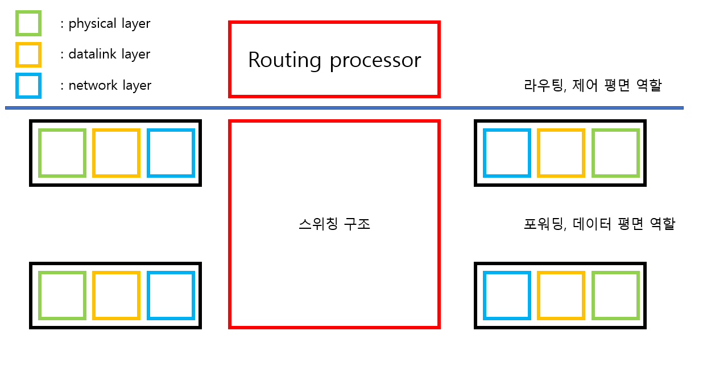
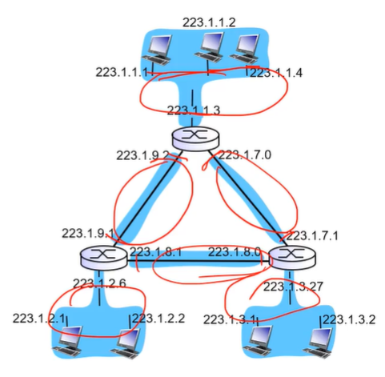

# CHAPTER 04 네트워크 계층: 데이터 평면
네트워크 계층은 서로 상호작용하는 데이터 평면과 제어 평면의 두 부분으로 나눌 수 있다. 

## 4.1 네트워크 계층 개요
각 라우터의 데이터 평면 역할은 입력 링크에서 출력 링크로 데이터그램을 전달하는 것이다. 

### 4.1.1 포워딩과 라우팅: 데이터 평면과 제어 평면
네트워크 계층의 근본적 역할은 송신 호스트에서 수신 호스트로 패킷을 전달하는 것이다. 다음은 네트워크 계층의 두 가지 중요 기능이다.
1. 포워딩(전달): 패킷이 라우터의 입력 링크에 도달했을 때 그 패킷을 적절한 출력 링크로 보내는 것. 포워딩은 데이터 평면에 구현된 하나의 기능이다.

2. 라우팅: 송신자가 수신자에게 패킷을 전송할 때 네트워크 계층이 **패킷 경로를 결정하는 것**. 이러한 경로를 계산하는 알고리즘을 라우팅 프로토콜이라 한다. 패킷 전송 라우팅은 네트워크 계층의 제어 평면에서 실행된다. 

라우터는 도착하는 패킷 헤더의 필드 값을 조사하여 패킷을 포워딩하는데, 이 값을 라우터의 포워딩 테이블의 내부 색인으로 사용한다. 포워딩 테이블 엔트리에 저장되어 있는 헤더의 값은 해당 패킷이 전달되어야 할 라우터의 외부 링크 인터페이스를 나타낸다.

#### 제어 평면: 전통적인 접근(Destination-based forwarding)

라우팅 프로토콜은 라우터의 포워딩 테이블의 내용을 결정한다. 라우팅 프로토콜은 **각각의 모든 라우터**에서 실행되며, 라우터는 포워딩과 라우팅 기능 모두 갖고 있어야 한다. 또, 모든 라우터는 다른 라우팅 구성요소를 가지고 있어 통신이 가능하다. 즉, 라우터 서로서로 상호작용을 하여 라우팅 알고리즘으로 포워딩 테이블을 작성하고 패킷은 이를 보고 목적지를 찾아간다.

#### 제어 평면: SDN(Software Defined Networking)

**원격 컨트롤러가 각 라우터의 CA(Control Agent)로부터 정보를 수집하여 포워딩 테이블을 작성**해서 개별 라우터가 이를 사용할 수 있도록 포워딩 테이블을 제공한다. 원격 컨트롤러가 포워딩 테이블을 계산/배분 하는 동안 **라우팅 기기는 포워딩만을 수행**한다. 라우터는 포워딩 테이블과 다른 라우팅 정보를 포함한 메시지를 원격 컨트롤러와 교환함으로써 소통한다.

> traditional한 방식은 IP 데이터그램의 목적지 IP 주소만을 보고 포워딩을 결정하지만 SDN방식은 목적지 IP 주소 뿐만 아니라 헤드의 관련된 기타 정보를 보고 포워딩을 결정한다.

### 4.1.2 네트워크 서비스 모델
네트워크 서비스 모델은 송수신 호스트 간 패킷 전소 특성을 정의한다.
네트워크 계층에서 제공할 수 있는 서비스들은 다음과 같다.
1. 보장된 전달: 패킷이 소스 호스트에서부터 목적지 호스트까지 도착하는 것을 보장한다.
2. 지연 제한 이내의 보장된 전달: 패킷의 전달 보장뿐만 아니라 호스트간의 특정 지연 제한안에 전달한다.
> 여기까지가 개별 데이터그램에 대한 서비스

3. 순서화 패킷 전달: 패킷이 목적지에 송신된 순서대로 도착하는 것을 보장한다.
4. 최소 대역폭 보장: 송신과 호스트 사이에 특정한 비트 속도의 전송 링크를 에뮬레이트한다
5. 보안 서비스: 모든 데이터그램들을 소스 호스트에서는 암호화, 목적지 호스트에서는 해독을 할 수 있게 하여 전송 계층의 모든 세그먼트들에 대해 기밀성을 제공하여야 한다.
> 여기는 일련의 데이터그램(하나의 어플리케이션 데이터)에 대한 서비스

인터넷 네트워크 계층은 최선형 서비스를 제공하는데, 최선형 서비스는 패킷을 보내는 순서대로 수신됨을 보장할 수 없을 뿐만 아니라, 목적지까지의 전송 자체도 보장될 수 없다. 이에 반해 ATM(Asynchronous Transfer Mode)이라는 기술(virtual circuit 방식-패킷(cell이라고 불린다)스위칭 방식)이 있다.

|Network Architecture|Service Model|Bandwidth|Loss|Order|Timing|Congestion feedback|
|-|-|-|-|-|-|-|
|Internet|best effort|none|no|no|no|no|
|ATM|CBR|constant rate|yes|yes|yes|no|
|ATM|VBR|guaranteed rate|yes|yes|yes|no congestion|
|ATM|ABR|guaranteed|no|yes|no|yes|
|ATM|UBR|none|no|yes|no|no|
## 4.2 라우터 내부에는 무엇이 있을까?

라우터의 4가지 요소는 다음과 같다.
1. 입력 포트: 제어 패킷(라우팅 프로토콜 정보를 전달하는 패킷)은 입력 포트에서 라우팅 프로세서로 전달된다. 
    - physical layer: **비트 단위**의 입력값을 받아들인다.
    - datalink layer: 입력 링크의 반대편에 있는 링크 계층과 상호작용하기 위해 필요한 링크 계층 기능을 수행한다.
    - network layer: IP 데이터그램의 헤더 값(목적지 IP주소)을 읽고 이를 포워딩 테이블을 참조하여 전달되는 라우터 출력 포트를 결정한다. 검색 기능 또한 수행한다. 네트워크 계층 내부에는 큐가 있어서 데이터그램이 포워딩 속도보다 빠르면 큐 내에 잠시 저장된다.

    > 물리계층에서 네트워크 계층까지 decapsulation해서 정보를 추출한다.

2. 스위칭 구조: 라우터의 입력 포트와 출력 포트를 연결한다. 라우터 내부에 포함되어 있다. -> 네트워크 라우터의 내부 네트워크

3. 출력 포트: 출력 포트는 스위칭 구조에서 수신한 패킷을 저장하고 필요한 링크 계층 및 물리적 계층 기능을 수행하여 출력 링크로 패킷을 전송한다. 링크가 양방향일 때 출력 포트는 일반적으로 동일한 링크의 입력 포트와 한 쌍을 이룬다.

4. 라우팅 프로세서: 라우팅 프로세서는 **제어 평면** 기능을 수행한다. SDN 라우터에서는 라우팅 프로세서는 원격 컨트롤러와 통신하여 원격 컨트롤러에서 계산된 **포워딩 테이블 항목**을 수신하고 라우터의 입력 포트에 이러한 항목을 제공한다.

라우터의 입력 포트, 출력 포트, 스위칭 구조는 거의 하드웨어로 구현된다. -> data plane으로 처리 속도가 중요하기 때문에 하드워에 적으로 구현된다. ns단위이다.

제어 평면(라우팅 프로세서)은 소프트웨어적으로 구현되며 ms단위이다.

### 4.2.1 입력 포트 처리 및 목적지 기반 전달
> Destination-based forwarding
라우터는 포워딩 테이블을 사용하여 도착 패킷이 스위칭 구조를 통해 전달되는 출력 포트를 검색한다. 포워딩 테이블은 라우팅 프로세서에서 계산되거나 업데이트되거나 원격 SDN 컨트롤러에서 수신된다. 포워딩 테이블에서 패킷의 목적지 주소 범위는 32비트 IP 주소의 경우 약 40억개의 주소가 있지만 프리픽스를 테이블의 엔트리와 대응시킴으로써 줄일 수 있다. 대응하는 엔트리가 존재하면 라우터는 패킷을 그 대응에 연관된 링크로 보낸다. 
만약 엔트리가 중복되어 대응되면 **최장 프리픽스 매칭 규칙** 을 적용한다. 즉, 테이블에서 가장 긴 대응 엔트리를 찾고, 여기에 연관된 링크 인터페이스로 패킷을 보낸다. 만약 길이도 같으면 먼저 대응된 엔트리의 값으로 패킷을 보낸다.

기가바이트 전송 속도에서 포워딩 테이블의 검색은 나노초 단위로 수행되어야 하기 때문에 빠른 검색 알고리즘이 필요하다. 실제로 TCAM(Ternary Content Addressable Memories)도 검색을 위해 자주 사용된다. 테이블의 엔트리 수와 무관하게 1 클럭 사이클 내에 검색을 완료할 수 있다.

> Cisco Catalyst는 1M 개의 라우팅 테이블 엔트리들이 TCAM에 저장되었다.

검색을 통해 패킷의 출력 포트가 결정되면 스위칭 구조로 보낼 수 있다. 일부 설계에서, 다른 입력 포트로부터의 패킷이 현재 스위칭 구조를 사용하고 있다면 패킷이 스위칭 구조에 들어가는 것을 일시적으로 차단할 수 있다. 차단된 패킷은 입력포트에서 대기하다가 다음 나중 시점에 스위칭 구조에 들어간다.

### 4.2.2 변환기

스위칭 기술은 여러 가지가 있다.
1. 메모리를 통한 교환: 
- 패킷이 도착하면 입력 포트는 라우팅 프로세서에게 인터럽트를 보내 패킷을 프로세서 메모리에 복사한다.
- 라우팅 프로세서는 헤더에서 대상 주소를 추출하여 포워딩 테이블에서 적절한 출력 포트를 찾은 다음 패킷을 출력 포트의 버퍼에 복사한다.

> 이 시나리오에서 메모리 대역폭이 초당 최대 B인 패킷을 메모리에 쓰거나 메모리에서 읽을 수 있는 경우 전체 전달 처리량(패킷이 입력 포트에서 출력 포트로 전송되는 총 속도)은 B/2보다 작아야 한다. 

> 또한 목적지 포트가 다른 경우라도 공유 시스템 버스를 통해 한 번에 하나의 메모리 읽기/쓰기 작업을 수행할 수 있기 때문에 **두 패킷을 동시에 전달할 수 없다**.

2. 버스를 통한 교환: 라우팅 프로세서의 개입 없이 공유 버스를 통해 직접 출력 포트로 패킷을 전송한다.
- 일반적으로 미리 준비된 입력 포트 스위치 내부 헤더가 로컬 출력 포트를 나타내는 패킷에게 전송되거나 버스에 패킷을 전송하여 수행된다.
- 모든 출력 포트에 패킷이 수신되지만 라벨과 일치하는 포트만 패킷을 유지한다.
- 한 번에 하나의 패킷만 버스를 통과할 수 있기 때문에 라우터의 교환 속도는 버스 속도에 의해 제한된다.
> 작은 규모에 사용될 수 있는 switching fabric의 구조이다.

3. Crossbar를 통한 교환

## 4.2.3 출력 포트 프로세싱
출력 포트의 메모리에 저장된 패킷을 가져와서 출력 링크를 통해 전송한다.

## 큐잉
### 입력 큐잉

switching 속도가 입력 포트로부터 패킷이 들어오는 속도보다 늦으면 큐에서 기다린다. 
- Head-of-the-Line(HOL) blocking: 같은 시간대에 같은 출력 포트로 가는 패킷이 2개가 있으면 한 입력 포트는 기다리게 되는데 이 때문에 놀고 있는 출력포트에 대한 패킷이 이동하지 못하게 되는 현상이다.

### 출력 큐잉
스위칭 구조에서 처리하는 속도가 전송 속도보다 빠를 경우에는 패킷이 쌓이기 때문에 datagram buffer에 큐가 필요하다. 이에 따라 **delay와 loss**가 발생할 수 있다.
스위칭 구조에서 변환되는 속도가 출력 포트의 속도보다 N배 빠를 경우 만약 스위칭 구조에서 모든 패킷이 하나의 출력포트로 향한다면 N개가 출력 포트의 큐에 대기하게 되고 하나가 처리되는 동안에 또 N개가 밀릴 수 있다. 즉, 대기 중인 패킷의 수가 출력 포트에서 사용 가능한 메모리를 소모할 만큼 충분히 많아질 수 있다.

## 4.2.5 패킷 스케줄링
scheduling discipline은 데이터그램 버퍼 내부에 패킷을 전송하는 순서를 결정한다. 
1. First-In-First-Out: 들어온 순서대로 내보낸다.
    - discard policy(큐가 가득찬 상태에서 패킷이 도착하면 어떤 패킷을 제거해야 하는가?)
        - tail drop: 새로 들어온 패킷을 제거한다.
        - priority: 우선순위에 따라 제거한다.
        - random: 임의로 제거한다.

2. Priority: 높은 우선순위를 가진 패킷을 먼저 보낸다.
    - 우선순위는 IP 출발지/목적지, 포트 번호에 따라 결정된다.

# 4.3 인터넷 프로토콜(IP)
네트워크 계층에는 IP Protocol(addressing 관련), ICMP protocol(IP 데이터그램을 전송할 때 에러 체킹 & 라우터 signaling->Traceroute), Routing protocol이 있다.

## 4.3.1 IPv4 데이터그램 형식

- 32비트(1 word, 4bytes) 주소를 사용한다.
- 버전 번호: 4비트로 데이터그램의 IP 프로토콜 버전을 명시한다. 이 값을 통해 나머지 필드를 어떻게 해석할지를 결정한다. ex) IPv4: 0100, IPv6: 0110
- 헤더 길이: 4비트로 IP 데이터그램에서 실제 페이로드(데이터)가 시작하는 곳을 결정한다.
- 서비스 타입: IPv4 헤더에 포함된 서비스타입(TOS) 비트는 서로 다른 유형의 IP 데이터그램을 구별한다. QOS(Quality of service) 기능을 제공한다.
- 데이터그램 길이: 바이트로 계산한 IP 데이터그램의 전체 길이이다. 16비트로 IP데이터그램의 이론상 최대 길이는 65535 바이트이다. 보통 1500바이트 이하이다.
- 16비트 식별자, 플래그, fragment offset: fragment와 관련된 필드
- TTL(Time-to-live): 네트워크에서 데이터그램이 무한히 순환하지 않도록 한다. 라우터가 데이터그램을 처리할 때마다 감소하도록 하며 시간 내 도착하지 못하면 버리게 하는 필드이다. TTL이 0이 되면 라우터가 데이터그램을 폐기한다. 폐기한 후 ICMP를 사용하여 source한테 에러 여부를 전달한다.
- 상위 계층 프로토콜: 데이터 필드가 어떤 프로토콜에 의해 작성된것인지 알려준다. 값 6은 TCP, 17은 UDP를 뜻한다. 이 필드는 일반적으로 IP 데이터그램이 최종 목적지에 도착했을 때만 사용된다.
- 헤더 체크섬: 헤더 부분에 대한 오류 체크를 위한 것이다.
- 옵션: 거의 사용되지 않는다.(가변적인 데이터) timestamp, record route, source routing(거쳐야할 라우터를 명시할 수 있다.)
- 데이터: TCP/UDP 세그먼트 or IP데이터그램이 들어간다.(OSPF, ICMP같은 것들도 들어갈 수 있다.)
> IP 데이터그램 안에 IP 데이터그램도 들어갈 수 있다.

> IP 데이터그램은 총 20바이트의 헤더를 가지며 데이터그램이 TCP 세그먼트를 전송하게 되면 총 40바이트의 헤더를 전송하게 되는 것이다.

### IP fragmentation, reassembly
링크 계층 프레임(2계층 프레임)이 전달할 수 있는 최대 데이터의 양을 MTU(Maximum Transmission Unit)라고 한다. ex) 이더넷: MTU = 1500
송-수신자 간의 경로를 따르는 각 링크가 서로 다른 링크 계층 프로토콜을 사용할 수 있고, 각 프로토콜이 서로 다른 MTU를 가질 수 있다.

각 라우터마다 다른 MTU를 가질 수 있으며 한 라우터의 MTU가 IP 데이터그램의 크기보다 작을 경우 전달할 수 없기 때문에 IP 데이터그램의 페이로드를 두 개 이상의 작은 IP 데이터그램으로 분할하고 각각의 분할한 조각들을 별도의 링크 계층 프레임으로 캡슐화해서 출력 링크로 보낸다. 이를 fragment라고 부른다.

각 fragment는 독립적인 datagram이다. 목적지에서 원래 형태로 재조립된다.

IP 데이터그램의 길이가 4000바이트이면 이는 헤더 + 데이터를 의미한다. 즉 헤더(20바이트) + 데이터(3980바이트)이다.

MTU가 1500바이트이면 1500 2개와 나머지가 되어야 한다. 따라서 다음과 같이 된다.
1500(20 + 1480)
1500(20 + 1480)
1040(20 + 1020)
따라서 1480 + 1480 + 1020 = 3980바이트의 데이터를 전달할 수 있게 된다.

플래그 비트: 마지막 fragment는 0이다. 나머지는 다 1이다.
오프셋: 앞의 fragment가 전달 된 데이터의 크기를 8로 나눈 값이다. 첫 번째 fragment의 offset은 0이고, 두 번째 fragment의 offset은 1480 / 8 = 185가 된다. 세 번째는 370이 된다.

목적지에서 재조립을 하게 되는데, 이를 위해 버퍼가 쓰인다. 순서대로 오지 않을 경우 버퍼에 저장되게 되는데, offset의 순서에 맞게 재조립된다. reassembly(재조립) timer가 있는데 이 시간 내에 도착하지 않으면 버려지게 된다.

## 4.3.3 IPv4 주소체계
IP address: 32-bit, 호스트/라우터 인터페이스에 대한 식별자 역할을 한다.
Interface: 호스트/라우터와 physical link 사이의 경계지점 

라우터는 데이터그램을 수신하여 다른 링크로 전달해야 하므로 2개 이상의 연결된 링크(인터페이스)가 필요하다.
호스트는 무선인 경우 2개의 인터페이스를 쓴다.(평소엔 1개)

IP 주소(dotted-decimal notation): 223.1.1.1
IP 주소(2진수): 11011111 00000001 00000001 00000001

세 호스트들의 인터페이스들과 하나의 라우터 인터페이스로 연결된 네트워크는 **서브넷**을 구성한다고 말한다. 서브넷에 속해있는 호스트의 인터페이스 주소에서 왼쪽 24비트는 해당 서브넷의 프리픽스이다.

어떻게 인터페이스들이 연결되어 있는가?
> 이더넷 스위치에 의해 연결되어 있다. or 와이파이에 의해 연결되어 있다.

### Subnets
IP address
- subnet(network) portion: prefix로, 같은 subnet에 속해있는 인터페이스들은 network portion이 동일하다.
- host portion:

What is a subnet?
- 동일 서브넷에 속하는 장치들은 라우터를 거치지 않고 direct delivery를 할 수 있지만 서브넷이 다른 경우 router를 거쳐야 한다. 이는 IP 헤더의 목적지 IP 주소를 보고 파악할 수 있다.

223.1.1.0/24 에서 24는 왼쪽 24비트가 prefix임을 나타내며 위의 예에서는 223.1.1 부분은 prefix임을 알 수 있다. /24는 서브넷 마스크라고 부른다.

위 그림에서 빨간색 동그라미가 subnet이다.

### IP addressing: CIDR
CIDR: Classless InterDomain Routing
- Class개념이 없다. CIDR이 채택되기 전에는 IP주소의 네트워크 부분을 8, 16, 24비트로 제한했고, 8, 16, 24비트 서브넷 주소를 갖는 서브넷을 각각 A, B, C클래스 네트워크로 분류하였다. 이러한 주소체계를 classful addressing이라고 한다. A, B, C클래스는 unicat용 주소, D클래스는 multicast용 주소, E클래스는 experimental용 주소이다.
- A클래스: 8비트(Network portion) + 24비트(host identifier) -> 2^24개 주소(대규모 네트워크에 적합)
- B클래스: 16비트 + 16비트 -> 2^16개 주소
- C클래스: 24비트 + 8비트 -> 2^8개 주소(소규모 네트워크에 적합)
- 주소가 부족해지면서 Classful addressing이 사라졌다.
- class개념이 사라지면서 network protion의 크기가 가변적이게 되었고, 이에 prefix의 크기를 나타내기 위해서 subnet mask를 표시하게 되었다.
- 목적지 IP주소를 볼 때 서브넷 마스크의 크기만큼만 확인한다.

### IP addresses: How to get one?
호스트가 주소를 어떤식으로 받아올 수 있는가?
1. manual한 방법: hard-coded by system admin a file
- 사용자가 직접 코드를 쳐서 주소를 받아온다.

2. dynamic한 방법
- plug and play
- DHCP(Dynamic Host Configuration Protocol) 서버로부터 자동으로 주소를 받아온다.

### DHCP
네트워크에 접속했을 때 필요시 IP주소를 DHCP서버로부터 받아온다.
- lease(대여) 시간이 있어서 더 쓰고 싶으면 갱신(renew)한다.
- 주소를 다 썼으면 반납하고 이는 DHCP서버의 address pool에서 관리한다.
> 즉, 주소는 필요시 동적으로 그때그때 할당된다.

DHCP는 다음 4개의 메시지를 이용하여 동작한다.
1. 호스트는 'DHCP discover'이란 메시지를 보낸다.(optional)
2. DHCP서버는 'DHCP offer'이란 메시지로 응답한다.(optional)
3. 호스트는 IP주소를 요청할 때 'DHCP request'메시지를 보낸다.
4. DHCP 서버는 'DHCP ack'메시지와 함께 주소를 할당한다.

1. DHCP server discovery: 새로온 DHCP 클라이언트는 서버가 어디있는지 모르기때문에 서버를 찾기 위해 broadcast 메시지를 보낸다. 이때 출발지 IP주소를 src에 0.0.0.0으로 설정하여 보낸다. dest에 67번이면 UDP 패킷을 보낸다는 것이다. dest에 255.255.255.255로 설정하여 보낸다. transaction ID를 가지고 목적지를 찾아가는 것이다.

2. DHCP server offer: DHCP server discovery메시지를 받은 DHCP 서버는 DHCP server offer 메시지를 클라이언트로 응답한다. 이 때에도 다시 브로드캐스트 주소 255.255.255.255를 사용하여 서브넷의 모든 노드로 이 메시지를 브로드캐스트한다. src에는 DHCP 서버의 주소를 담는다. yiaddrr에는 제공할 IP주소를 적어서 보낸다. 클라이언트는 브로드캐스트 메시지를 보냈기 때문에 다른 서버도 IP주소를 제공할 수 있기 때문에 yiaddrr를 바로 사용하지 않을 수도 있다. lifetime은 lease time이다.

3. DHCP request: yiaddrr 사용 여부를 브로드캐스트 메시지로 보낸다.(dest: 255.255.255.255로 설정 -> 브로드캐스트 메시지) server identifier option이라는 것이 있는데, 여기에 223.1.2.5라고 명시하면(yiaddrr은 223.1.2.4) 해당 서버가 제공한 주소를 사용한다는 것을 알 수 있다.

4. DHCP ACK: DHCP request 메시지를 받으면 브로드캐스트 메시지로 ack를 보낸다. 따라서 dest는 255.255.255.255 이다.

DHCP는 IP주소를 할당하는 것 뿐만 아니라 다른 일도 한다.
1. first-hop router(서브넷에서 가장 가까운 라우터)의 주소도 클라이언트에 알려준다.
2. DNS 서버의 IP주소와 이름도 알려준다.
3. network portion에 대한 mask도 알려준다.

DHCP 서버는 IP주소의 network portion을 제공자 ISP로 부터 할당받는다. 즉, 위 그림에서 ISP의 prefix는 왼쪽 20비트이며 ISP가 8개의 기관에 할당한 주소 범위의 prefix는 왼쪽 23비트이다.

위와 같은 방법은 계층적 주소 할당 방식을 사용할 수 있다. 기관 8개를 대표하는 ISP가 있다. 이러한 방식은 route aggregation이라고 한다. ex. 200.23.16.0/20: Fly-By-Night-ISP로, 200.23.16.0의 왼쪽 20비트에 해당하는 주소는 위의 ISP로 보내달라고 하는 것이다. 인터넷은 이런 테이블을 보고 정보를 효율적으로 보낸다.

#### 문제점
만약 기관 1이 사용하는 ISP를 바꿨다고 가정하자. 그렇게 하려면 인터넷의 Destination Address 테이블에는 해당 기관의 prefix에 대한 목적지를 세세하게 지정해주어야 한다. 목적지 주소 테이블에서 매칭이 2개가 되면 최장 프리픽스 매칭 방식으로 목적지를 설정한다.

How does an ISP get block of address?
ISP는 어디서 주소를 가져오는가?
- ICANN: Internet Corporation for Assigned Names and Numbers
    - 주소를 할당하는 기관
    - DNS를 관리함
    - 도메인 이름 배정
    - 논쟁 해결

## 4.3.4 네트워크 주소 변환(NAT: Network Address Translation)
IPv4 주소 부족 문제를 해결하기 위해 나온 기술이다. private network에 사용된다.
홈 네트워크는 private network가 있고 이는 홈 네트워크에서만 사용되는 IP 주소를 가진다.
홈 네트워크에서 클라이언트가 정보를 보내면 NAT-enabled 라우터는 클라이언트의 (source IP Address, port #)를 (NAT IP Address, new port #)으로 변환하고 이를 NAT Translation Table에 기록한다. 그러면 외부 네트워크는 이 클라이언트의 주소를 NAT IP Address로 인식해서 다시 정보를 보낼 때 NAT IP Address로 정보를 보낸다. 이는 다시 NAT-enabled 라우터에서 NAT Table을 look up하여 원래 source IP Address와 port #을 확인한 다음에 원래의 클라이언트 주소로 정보를 보낸다.

NAT의 좋은 점
1. ISP로 부터 주소 범위를 할당받을 필요가 없다.
2. 로컬 네트워크의 장치 주소는 외부에 알릴 필요없이 바꿀 수 있다.
3. ISP를 변경할 때 로컬 네트워크 주소를 바꿀 필요가 없다.
4. 외부에 주소를 알리지 않기 때문에 보안성이 뛰어나다.

NAT-Enabled Router가 하는 일
1. 외부로 향하는 주소를 바꾼다.(source IP Address, port #) -> (NAT IP Address, new port #)
2. NAT Translation Table에 주소 변환 기록을 저장한다.
3. 데이터그램이 외부로부터 도착하면 이를 소스 주소로 바꾼다.(NAT IP Address, new port #) -> (sour IP Address, port #)

> NAT 가능 라우터에서 포트 번호 필드는 16비트로 약 6만개의 NEW 포트 번호를 만들 수 있다. 이는 WAN쪽의 하나의 IP주소에 대해 60000개 이상의 동시 접속을 지원한다.

> 라우터는 3계층 장치를 의미하지만 NAT를 사용하면 4계층 transport layer를 사용해야한다는 점이 계층적 개념을 지키지 않는다.

## 4.3.5 IPv6
주소 공간이 부족하게된 상황을 해결하고자 하였다.
+ 처리/포워딩 속도를 빠르게 하기 위해 헤더를 변형하였다.
+ QoS(Quality of Service, 서비스 품질)를 고려한 기능을 추가하였다.

기본적으로 헤더 크기는 40바이트로 고정되었다. 이는 주소가 32비트에서 128비트로 증가하였기 때문이다. 하지만 필드 수가 감소하여 처리해야할 기능이 줄어서 처리속도가 빨라지게 되었다.
또한, fragmentation을 허용하지 않는다. source에서 내보낼 때 미리 쪼개어서 내보낼 수는 있다.

ver: 4비트로 버전을 나타낸다.
priority(traffic class): 흐름 속의 데이터에 대한 우선순위(QoS)를 명시하는 필드이다.
flow label: 서로 연관이 있는(같은 flow에 속하는) 데이터 그램을 식별하는데 사용된다.
payload len: 16비트 값으로, 40바이트 헤더 뒤에 나오는 바이트 길이이다. 부호 없는 정수(unsigned integer)이다.
next header: 데이터그램의 내용이 전달될 프로토콜을 구분한다. 만약 다음 헤더가 extension header이면 이를 가리키고 마지막 extension헤더에는 그 다음 next header를 가리키는 next header 필드가 있다.
hop limit: IPv4의 TTL과 동일한 기능으로, 라우터가 데이터그램을 전달할 때마다 1씩 감소한다. 홉 제한 수가 0보다 작아지면 데이터그램을 버린다.
> IPv6에는 옵션 필드가 없는데, extension headers가 이 패킷 뒤에 올 수 있다. 이는 next header가 가리킬 수 있다.

IPv4와 달라진 점
1. Checksum: 각 홉에서 처리 속도를 줄이기 위해 제거되었다. IPv4는 라우터마다 매번 헤더 체크섬을 검사를 해야해서 오버헤드가 심하기 때문이었다.
2. Options: 필드 내에서는 사라졌지만 extension header 형태로 남아있다.
3. ICMPv6: 새로운 ICMP 버전이다. 
- fragmentation 대신에 라우터는 데이터그램이 너무 크면 "Packet Too Big"이라는 메시지를 송신자에게 보낸다.
- multicast group management protocol 기능을 수행하는 IGMP는 IPv4와 달리 IPv6에서는 ICMP에 속하도록 하였다.

### Transition from IPv4 to IPv6
터널링: Encapsulation하는 방법으로 IPv6 데이터그램을 IPv4 데이터그램의 페이로드에 넣어서 전달하는 방식이다.

즉, IPv4라우터와 IPv6라우터가 섞여있을 때 IPv6라우터들 사이의 IPv4라우터들을 터널링 기법을 사용해서 전달한다.
위 그림에서 B, E는 TEP(Tunnel End Point)라고 한다.

### IPv6: adoption
Google: 클라이언트의 33.96%가 IPv6을 통한 서비스에 액세스한다. -> 많이 늘어나지 않음 & NAT기술에 의해 대체가 됨

IoT기술은 주소가 많이 필요하기 때문에 장점을 가진다.
