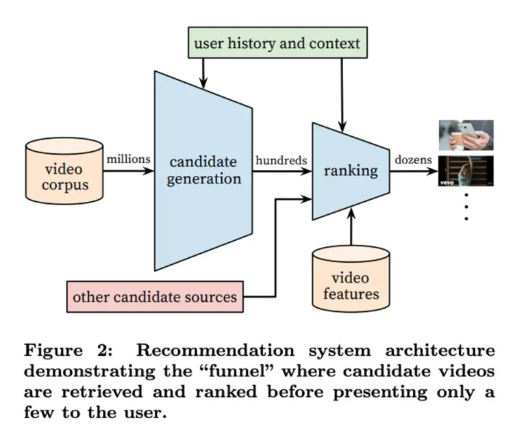
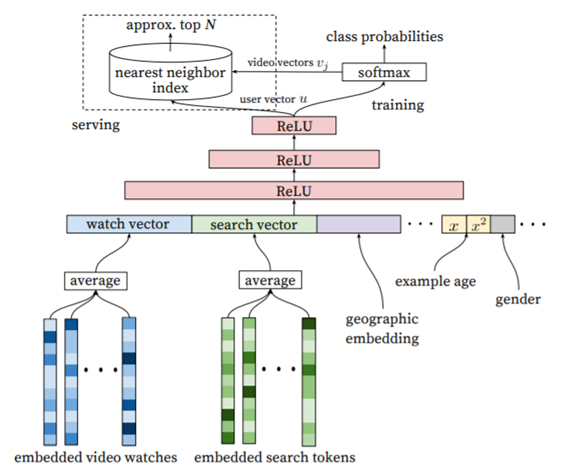

# Youtube 알고리즘
## 들어가며
>알고리즘이 나를 여기로 이끌었다.

평소 유튜브를 자주 시청하는 사람이라면 종종 이런 댓글을 본 적이 있을 것입니다. 여기서 유튜브 알고리즘이란 무엇일까요?

유튜브 알고리즘이란 유튜브가 약 20억 명 이상의 사용자에게 어떤 동영상을 제안할 지 결정하는 추천 시스템입니다. 이번 포스팅에서는 Youtube Recommender System 2010, 2016, 2019에 대한 리뷰를 중점으로 진행하겠습니다.

## 추천 시스템?
추천 시스템(Recommender System)이란 사용자의 과거 행동 데이터나 다른 데이터를 바탕으로 사용자에게 필요한 정보 및 상품을 추천해주는 시스템입니다. 

최근에는 기술의 발전으로 인해 각 사용자 별로 맞춤형 추천을 제공하는 개인화 추천을 제공하고 있습니다.

## 유튜브 알고리즘
초기 유튜브의 추천 시스템은 다음과 같은 목표를 가지고 있었습니다.
1. To be resonably recent and fresh
2. Diverse and relevant to the user's recent actions

이 시기 유튜브 추천 시스템에서 가장 먼저 직면한 문제는 메타데이터의 부재였습니다. 컨텐츠에 대한 feedback도 명확하지가 않으며, 유튜브의 영상들은 휘발성이 강하며 지속적인 freshness가 필요하였습니다. 따라서 'constant freshness'를 파악하는 것이 매우 중요한 과제였습니다.

## System Design

유튜브 추천 시스템은 크게 Candidate generation, ranking 단계를 거쳐 완성됩니다. 

Candidate generation 단계에서는 사용자의 개인 활동(시청, 좋아요, 구독) 이력을 시드로 사용하였으며 동영상의 공동 시청 기반 그래프를 통해 동영상 세트를 확장하였습니다. 이 때 association rule, co-visitation count 등의 방법을 사용하였습니다.

그리고 Ranking stage에서는 동영상에 대한 ranking을 매기고 몇 가지 제약을 추가하여 관련성과 다양성을 증가시켰습니다. 

### Candidate Generation
#### 2010년
2010년에 발표된 [The YouTube Video Recommendation System](https://scholar.google.co.kr/scholar?hl=ko&as_sdt=0%2C5&as_vis=1&q=The+YouTube+Video+Recommendation+System&btnG=)에 따르면 association rule을 사용하여 r(vi, vj) 스코어를 생성함으로써 알고리즘을 적용하였습니다.
$$r(v_{i} ,v_{j}) = \frac{c_{ij}}{f(v_{i} ,v_{j})}$$

association rule을 사용하여 r(vi, vj)를 생성할 때 co-visitation count를 하나의 섹션에서 일어난 것으로 하되, global popularity로 정규화 하는 함수인 f(vi, vj)로 나누어 간단하게 계산한다고 합니다.
$${f(v_{i} ,v_{j})} = c_i·c_j$$

사용자의 관심사에 가까운 컨텐츠를 추천한다는 목표를 달성하기는 하였지만 사용자에게 새로운 비디오를 추천하지는 못한다는 단점이 있었습니다. 이에 유튜브는 추천 범위를 넓히기 위해 비디오 그래프에 대해 제한적인 전이적 폐쇠(limited transitive closure)를 수행하여 후보 세트를 확대하였습니다. 이를 통해 후보군의 크기를 더 늘렸고, 이에 따라 커버리지 자체를 늘리는 효과를 가져왔다고 합니다.

#### 2016년
2016년에도 여전히 candidate generation -> ranking이란 구조는 동일하였습니다. 하지만, [Deep Neural Networks for YouTube Recommendations(2016)](https://scholar.google.co.kr/scholar?hl=ko&as_sdt=0%2C5&as_vis=1&q=Deep+Neural+Networks+for+YouTube+Recommendations&btnG=)을 보면 2010년과 달리 위의 두 layer 모두 neural network로 대체되었다는 것을 알 수 있습니다. candidate generation network는 입력 값으로 사용자의 유튜브 활동 이력을 가져와서 작은 부분 집합(수 백개)의 비디오를 검색합니다. 또한 후보군을 생성할 때에는 협업 필터링(collaborative filtering) 방식을 적용하여 개인화 서비스를 제공하였다고 합니다. 또한, 협업 필터링을 적용할 때 사용자 간의 유사성으로 Video ID, 검색어 등을 이용하였습니다.

$$ P(w_{t} =i|U,C) = \frac{e^{v_iu}}{\sum{{}_{j\in V}e^{v_ju}}} $$

> $$v_j\in R^N은 \space 각 \space 후보 \space 비디오이며, \space u \in R^N은 \space 유저를 \space 나타낸다.$$

위 식은 특정 시간 t에 유저 U가 C라는 Context를 가지고 있을 때, 각각의 동영상 i 를 볼 확률을 정의한 것입니다. 

위 그림과 같이 시청 기록, 검색어 토큰, 업로드 시간 등 각 유저의 정보의 average를 구하였고, 각 벡터를 concatenate 하였습니다. 이 concatenate한 유저의 벡터를 fully connected ReLU라 불리는 함수에 넣어서 출력값으로 각 유저의 User embedding을 얻을 수 있습니다. 그런 다음, 출력한 이 유저의 정보를 위의 softmax 함수에 넣어서 그 유저에 대한 각 비디오의 가중치를 얻을 수 있습니다. 

softmax 함수 단계에서는 모든 비디오를 입력 값으로 넣지 않고 Negative Sampling 이라는 방법으로 알맞은 비디오를 추출하여 입력 값으로 넣어줌으로써 성능 개선을 하였습니다.

마지막으로 유저의 정보와 softmax의 출력 값을 Nearest Neighbor 알고리즘을 이용하여 상위 N개의 비디오를 얻습니다.

### Ranking
#### 2010년
순위가 매겨지는 기준은 다음과 같습니다.
1. Video quality
2. User specificity
3. Diversification

Video quality는 영상 조회수, 댓글, 좋아요 수, 업로드 시간 등에 따라 결정됩니다. User specificity는 사용자의 시청 기록으로부터 사용자의 선호도를 나타내는 feature를 구합니다. 그런 다음, Video quality와 User specificity를 linear combinatin(더하기)로 합산하여 순위를 매깁니다. 

유튜브의 경우 유저가 하나의 관심사만 갖는게 아니기 때문에 최종적인 추천 영상 리스트에는 다양성이 존재해야 했습니다. 이는 같은 채널의 동영상 개수를 제한하거나 매우 유사한 비디오는 함께 보여지지 않도록 함으로써 다양성을 증가시켰습니다.

#### 2016년
.png)

Ranking 모델도 Candidate generation의 모델과 매우 유사합니다. 각 비디오의 정보를 입력 값으로 넣은 뒤 fully connected ReLU라는 함수에 넣어 순위를 매깁니다.

이때 다른 점은 비디오들을 학습시킬 때 weighted logistic regression을 사용하였다는 점입니다. 이는 추천된 영상을 얼마나 오랫동안 볼 지를 예측하는 것을 목표로 합니다. 감상시간은 안 봤으면 0, 봤으면 그 감상 시간을 가중치로 설정합니다.

#### 2019년

## 용어 정리
- [association rule](https://en.wikipedia.org/wiki/Association_rule_learning): 변수 간의 관계를 발견하기 위한 학습 방법
- [Logistic Regression](https://wikidocs.net/22881): 종속 변수와 독립 변수간의 관계를 함수로 설명하는 방법이다. 종속 변수가 범주형 데이터를 대상으로 하고, 결과가 특정 분류로 나뉜다는 점에서 선형회귀와 구분된다.
- [Weighted Logistic Regression](https://towardsdatascience.com/weighted-logistic-regression-for-imbalanced-dataset-9a5cd88e68b): 불균형 데이터의 경우에 로지스틱 회귀를 사용하면 소수 클래스의 경우 예측이 정확하지 않다는 장점이 있었습니다. 이를 해결하기 위해 각 클래스에 가중치를 설정하여 더 나은 성능을 유도하는 방식입니다.
- [Negative Sampling](https://wikidocs.net/69141): Negative Sampling: Word2Vec이 학습 과정에서 전체 단어 집합이 아니라 일부 단어 집합에만 집중할 수 있도록 하는 방법