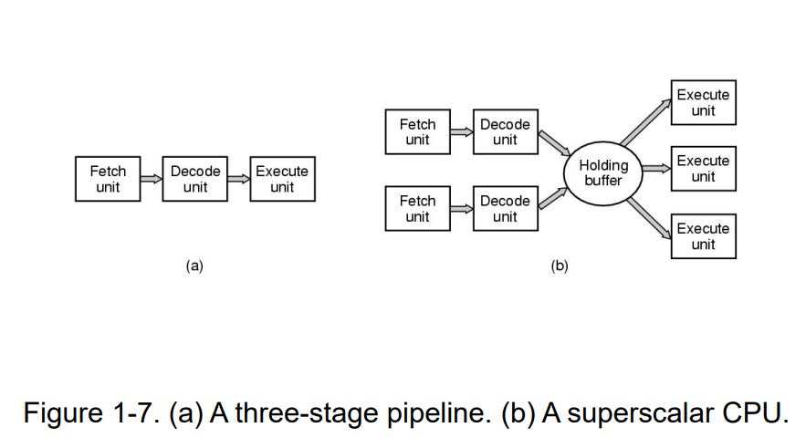
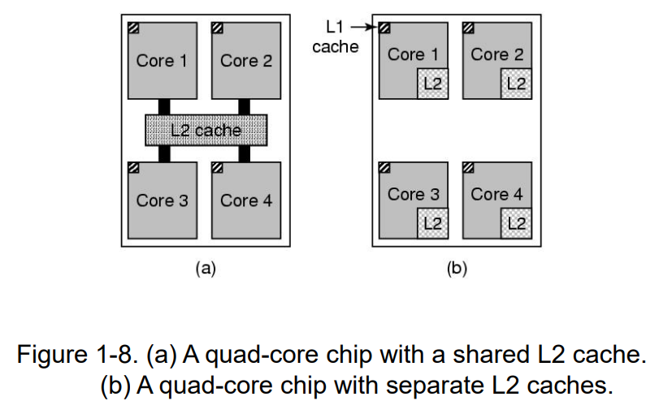
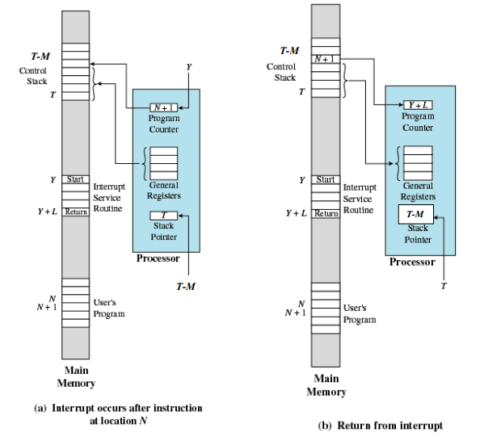
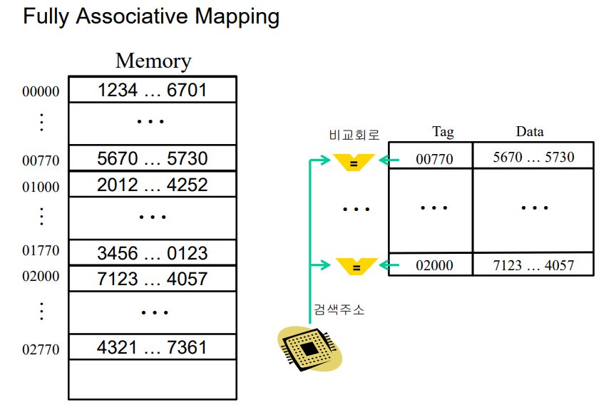
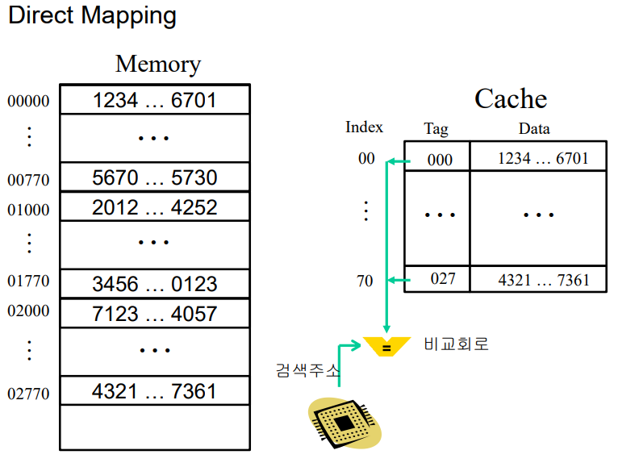
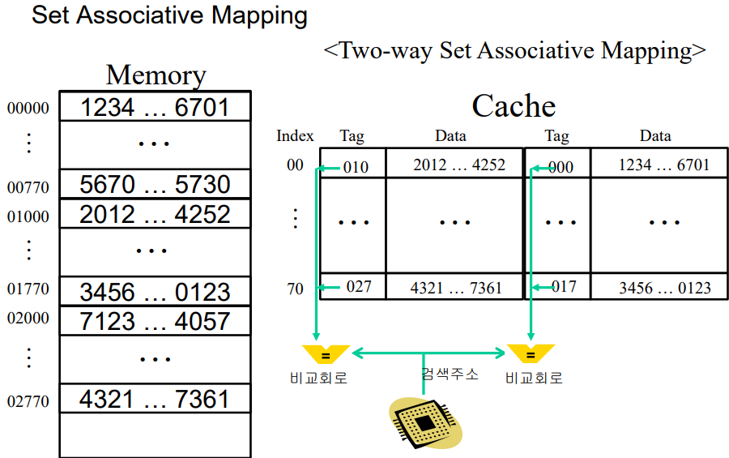
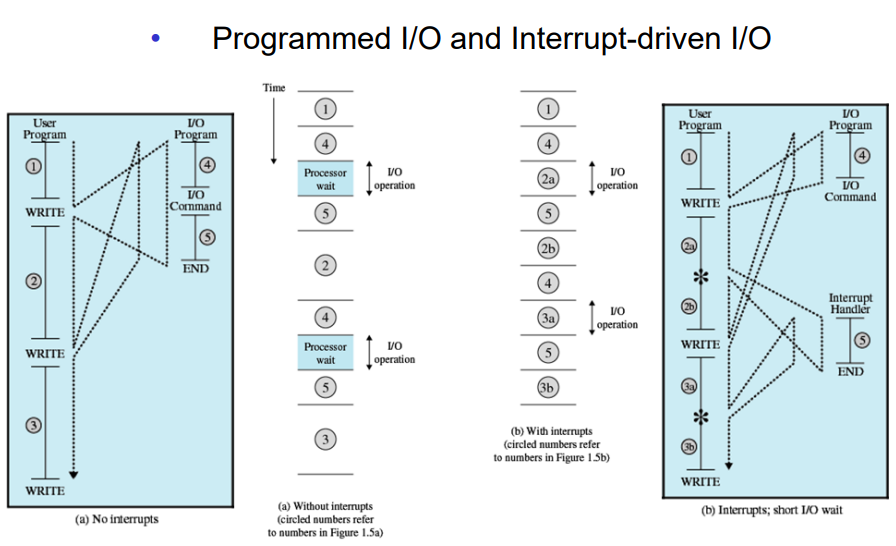
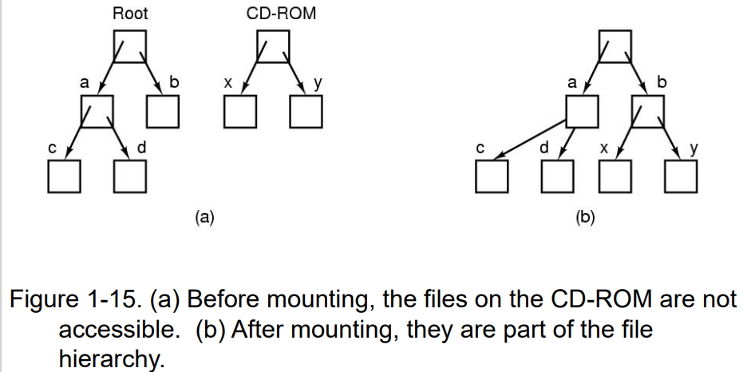

# Introduction
## 컴퓨터의 구성요소
- 하나 이상의 프로세서
- 메인 메모리
- 디스크
- 프린터
- 입/출력 장치

> 이러한 구성요소들을 관리하는 것이 운영체제

대부분의 컴퓨터는 커널 모드와 사용자 모드라는 이중 실행 모드를 갖는다. 운영체제는 가장 기본적인 소프트웨어로 커널모드에서 실행된다. 이 모드에서 운영체제는 모든 하드웨어에 대한 완전한 접근이 가능하며 기계가 실행할 수 있는 어떤 명령도 실행할 수 있다.

나머지 소프트웨어는 유저 모드에서 실행된다. 기계의 제어에 영향을 미치거나 I/O하는 명령들은 유저 모드에서 실행할 수 없다.

## The Operating System as a Resource Manager
- 여러 프로그램이 동시에 실행되도록 한다.
- 메모리, 입/출력 장치, 다른 리소스들을 관리하고 보호한다.
- 리소스를 공유하도록 한다(Multiplexing).
    - 시간적으로(여러 프로그램이 자원을 돌아가면서 사용한다)
    - 공간적으로(여러 프로그램을 메모리에 동시 상주 시킨다)

## Top-Level View
PC(Program counter): 패치해야하는 다음 명령의 메모리 주소를 포함
IR(Instruction register): 메모리에서 수행할 명령을 가져오면 명령어 레지스터에 저장
MAR(Memory address register): CPU가 데이터를 읽거나 쓰려는 메모리 주소를 일시적으로 저장
MBR(Memory buffer register): 메모리를 읽거나 메모리에 쓰려는 데이터 또는 명령을 일시적으로 저장
I/O AR(Input/output address register): 특정 I/O 입출력 장치의 주소를 지정하는데 사용
I/O BR(Input/output buffer register): I/O 모듈과 프로세서 간에 데이터를 교환하는데 사용

## Processor Register
1. User-Visible Registers
- 레지스터 사용을 최적화함으로써 프로그래머가 메인 메모리 참조를 최소화하도록 함
- 기계어에 의해 참조됨
- Types of registers
    - Data
    - Address
    - Index
    - Segment pointer
    - Stack pointer

2. Special and/or User-Invisible Registers
- 프로세서에 의해 사용됨
- 프로그램 실행을 제어하는데 사용되는 운영체제의 특권 routine에 의해 사용됨
- ex. PC(Program Counter), IR(Instruction Register), PSW(Program Status Word Register)

## CPU Pipelining

(a): 파이프라인 구조
(b): 슈퍼스칼라 CPU -> 두 개 이상의 명령이 한 번에 Fetch되고 Decode되어 실행할 때까지 Holding buffer에 남겨둔다.

## Multithreaded and Multicore Chips

각각 독립된 CPU를 갖는 네 개의 미니 칩들이 있다.

## Interrupt

프로그램이 실행되다가 운영체제가 Interrupt 신호를 받으면 PC주소(N+1), 범용 레지스터 내용을 스택에 저장하고 스택 포인터 값을 T-M(M: 스택에 저장된 데이터의 크기)으로 설정하고 Interrupt Service Routine에 들어간다.
Interrupt Service Routine이 끝나면 스택에 있던 PC값과 범용 레지스터 값을 다시 가져오고 스택 포인터 값을 T로 복구한다. PC는 N+1이 되었으므로 N+1번 주소의 명령을 다시 실행한다.

## Memory
메모리 종류: 레지스터, 캐시, 메인 메모리, 마그네틱 디스크, 마그네틱 테이프
> 앞에서 부터 access time은 작으나 용량도 작다.

1. 캐시 메모리
캐시를 다룰 때 다음과 같은 질문들을 생각해야 한다.
- 새 항목을 언제 캐시에 넣을 것인가
- 캐시/블럭 사이즈
- 새 항목을 어떤 캐시 라인에 넣을 것인가
- 공간이 필요할 때는 어느 항목을 제거할 것인가
- 새로 제거된 항목을 큰 메모리 어디에 둘 것인가

각 태그마다 비교회로가 존재한다. 메인 메모리의 모든 블록들이 캐시에 모두 저장될 수 있다. 캐시 적중률이 높고 유연성이 우수하지만 모든 캐시 슬롯들의 태그번호를 비교해야하기에 속도가 느리고 회로가 복잡하다.

주소의 뒷 2자리를 인덱스로 지정하여 캐시에 저장한다. 동일한 인덱스를 가진 모든 블록들은 지정된 한 개의 캐시 슬롯에만 저장된다. 구현이 간단하지만 동일한 인덱스를 가진 블록들이 빈번하게 액세스될 경우 Cache Miss Ratio가 높아진다. 처리속도는 빠르다. 비교회로는 하나다.

Fully Associative Mapping과 Direct Mapping의 절충으로, 같은 인덱스를 가진 블록 2개 이상을 캐시에 저장할 수 있다. 동일한 태그를 가진 블록들이 저장되는 캐시 슬롯을 집합으로 관리한다. 비교회로는 각 열에 하나씩 있다.

### Performance analysis of cache memory
Cache Access Time: 0.1㎲
Main Memory Access Time: 1㎲
Cache hit rate: 0.95
Average Access Time: 0.95*0.1㎲ + 0.05*(0.1㎲+1㎲) = 0.095 + 0.055 = 0.15㎲
일반적으로 캐시 히트율은 Locality of Reference때문에 높다.
Locality
- Temporal Locality: 최초로 참조된 기억 장소가 계속 참조될 가능성이 높다.
- Spatial Locality: 일단 하나의 기억 장소가 참조되면 그 근처의 기억 장소가 계속 참조될 가능성이 높다.
- Working Set: Virtual memory system에서 주어진 시간에 프로세스가 참조하는 페이지 프레임의 집합. 

## Disks
정보는 디스크의 동심원들 위에 쓰여지며 암이 플래터 전체 위를 움직인다. 암의 끝에는 헤드가 있으며 각 헤드는 트랙이라고 하는 동심원 상의 영역을 읽을 수 있다. 특정 위치에 있는 암에서의 모든 트랙들의 모음이 실린더를 이룬다.

각 트랙은 여러 개의 섹터로 나누어지는데 바깥쪽 실린더가 안쪽 실린더에 비해 더 많은 섹터를 갖는다.

## I/O Devices
I/O 장치들은 대체로 컨트롤러와 장치 자체로 구분된다. 컨트롤러는 칩 또는 칩의 집합으로 운영체제의 명령을 수행한다. 컨트롤러는 운영체제에게 보다 간단한 인터페이스를 제공한다.

### I/O 장치를 시작하고 인터럽트를 받는 과정
1. 드라이버는 어떠한 일을 하라고 컨트롤러에게 알린다.
2. 특정 버스 선을 이용해서 인터럽트 컨트롤러에게 신호를 보낸다.
3. 인터럽트 컨트롤러가 인터럽트 준비가 되어 있으면 CPU 칩의 특정 핀을 올려 인터럽트 상황을 알린다.
4. 인터럽트 컨트롤러가 장치 번호를 버스에 올려 CPU가 이를 읽고 I/O가 완료되었음을 알 수 있게 한다.

CPU가 인터럽트를 받아 드리기로 결정하면 일반적으로 PC와 PSW를 현 스택에 푸시하고 CPU를 커널 모드로 전환한다. 이 장치의 인터럽트 핸들러의 주소를 찾아 내기 위해서 장치 번호가 메모리 영역에 대한 인덱스로 활용될 수도 있다. 인터럽트 핸들러가 시작되면 스택에 푸시된 PC와 PSW를 저장해 두고 장치의 상태를 파악한다. 핸들러가 완료되면 전에 실행하던 사용자 프로그램의 실행되지 않은 첫 명령(N+1)로 되돌아간다.

### Programmed I/O and Interrupt-driven I/O

Programmed I/O의 경우에는 I/O 명령이 실행되면 I/O 인터럽트 핸들러의 작업이 끝날 때까지 본 명령 실행을 중단하였다가 끝나면 다음 명령으로 간다. 이는 I/O 인터럽트 핸들러 명령 실행 중 I/O Command작업 시간동안 프로세서가 기다리는 상황이 발생하여 효율이 떨어진다.
Interrupt-driven I/O는 I/O 인터럽트가 발생하면 I/O Command 작업 전까지 인터럽트 과정을 진행하다가 I/O Command 때는 본 명령으로 다시 와서 실행하다가 인터럽트 핸들러의 작업이 다시 시작되면 마무리 짓고 그 다음 명령을 다시 실행한다. 여기서도 문제점이 있는게, I/O Command 시간이 너무 길면 기존 I/O 명령이 끝나기도 전에 본 명령에서 새로운 I/O 인터럽트 명령이 떨어질 수도 있다.

## Dual Mode of Processors
1. User mode
- Code, Data, Heap, Stack, Library
- 사용자 프로그램이 작동되는 모드이다.
- 특권 명령을 사용할 수 없다.
- 인터럽트 또는 트랩은 유저 모드를 커널 모드로 전환시킬 수 있다.

2. System mode, control mode, kernel mode
- 특권 명령을 사용할 수 있다.
- 운영체제의 커널이다.

3. Privileged instructions
- I/O
- 프로세서의 상태 설정
- 특정 메모리 공간에 접근

## Operating System Concepts
대부분의 운영체제는 프로세스, 주소공간, 파일, 입출력, 보호기능, 쉘을 제공한다.
Ontogeny recapitulates phylogeny: 개체 발생은 계통 발생을 반복한다.

### Processes
실행하고 있는 프로그램이다. 각 프로세스는 자기의 주소공간과 연관이 되는데 주소공간은 프로세스가 읽고 쓸 수 있는 0에서 특정 최대 값에 이르는 메모리 주소를 일컫는다. 대부분의 운영체제에서는 자신의 주소공간의 내용물을 제외한 모든 정보를 배열구조로 관리하는 프로세스 테이블이 있는데, 이는 프로세스 별로 하나씩 존재한다. 한 프로세스는 하나 이상의 다른 프로세스를 생성할 수 있으며 이를 자식 프로세스라고 부른다. 이러한 프로세스는 트리 구조를 이룬다.

### Files
파일을 둘 수 있는 곳이 필요하므로 대부분의 운영체제는 파일들을 그룹화하는 방법의 하나로 디렉터리 개념을 지원한다. 프로세스와 파일의 계층구조는 둘 다 트리 형태로 이루어지긴 했으나 차이점이 많아. 프로세스의 계층 구조는 깊지가 않은 반면 파일의 계층 구조는 깊다. 또, 프로세스 계층 구조는 지속 시간이 짧은 반면 디렉터리는 수 년간 지속되는 경우도 있다.
디렉터리 계층에 속한 모든 파일은 루트 디렉터리로부터 시작하는 경로 이름을 이용해 접근할 수 있다.
프로세스들은 시스템 호출을 통해서 새로운 작업 디렉터리를 지정할 수 있다.
파일을 읽고 쓰기 전에 파일을 먼저 열어야 하는데 이 때 파일에 대한 권한을 확인하게 된다. 접근 권한은 파일 디스크립터라고 하는 정수를 통해 확인할 수 있다.

UNIX에서는 파일 시스템을 마운트할 수 있다. 마운트하기 전에는 루트 파일 시스템과 CD-ROM 파일 시스템이 서로 관련 없이 독립되어 있다. 이러면 CD-ROM에 있는 내용에 대한 경로 이름을 지정할 수 있는 방법이 없기 때문에 마운트 시스템 호출을 이용하여 CD-ROM에 있는 파일 시스템을 루트 파일 시스템의 특정 위치에 붙일 수 있도록 한다.

UNIX는 모든 장치를 파일로 보기 때문에 특수 파일이라는 개념이 존재한다. 특수 파일은 I/O 장치가 파일처럼 보이도록 하기 위해 제공된다. 

두 프로세스를 연결하는 파이프도 의사파일(pseudofile)이라는 개념으로 파일로 간주된다. 프로세스 A가 프로세스 B에게 데이터를 보내고 싶으면 프로세스 A는 데이터를 파이프에 쓰면 된다. 