# Processes and Threads

## The Process Model
하나의 프로세스는 실행중인 프로그램의 인스턴스로서 프로그램 카운터의 현재 값, 레지스터, 변수들을 포함한다. 물리적인 프로그램 카운터는 하나만 존재하므로 각 프로세스가 실행될 때 논리적인 프로그램 카운터는 실제 프로그램 카운터로 적재되어야 한다. 프로세스가 잠시 실행을 멈추면 물리적인 프로그램 카운터는 메모리에 있는 프로세스의 논리적인 프로그램 카운터 저장소에 저장되어야 한다. 

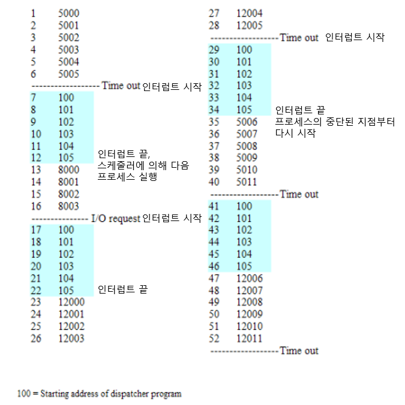
프로세스 실행 중 인터럽트 요청이 들어오면 인터럽트 주소로 가서 실행하고 끝날 때는 스케줄러에 의해 다음에 실행할 프로세스를 결정하여 해당 주소부터 수행한다.

## Process Creation
프로세서의 생성을 유발하는 네 가지 주요 이벤트
1. 시스템 초기화
2. 실행중인 프로세스가 프로세스 생성 시스템 호출(fork)을 부르는 경우
3. 사용자가 새로운 프로세스를 생성하도록 요청하는 경우
4. 배치 작업의 시작

## Process Termination
프로세스 종료를 유발하는 네 가지 주요 이벤트
1. 정상적인 종료(자발적)
2. 오류 종료(자발적)
3. 치명적인 오류(비자발적)
4. 다른 프로세스에 의해 종료(비자발적)

## Process States
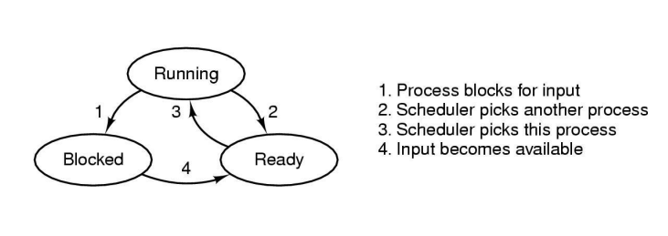
1. Running -> Blocked: 논리적으로 프로세스가 수행을 계속할 수 없는 경우(프로세스 수행에 필요한 자원이 없는 경우)
2. Running -> Ready: 운영체제가 잠시 CPU를 다른 프로세스에 할당하기로 결정한 경우
3. Ready -> Running: 운영체제가 해당 프로세스에 CPU를 할당한 경우
4. Blocked -> Ready: 프로세스가 기다리던 외부 이벤트가 발생했을 경우(프로세스 수행에 필요한 자원이 할당된 경우), CPU가 이용 가능해질 때까지 Ready상태에서 기다렸다가 실행한다.

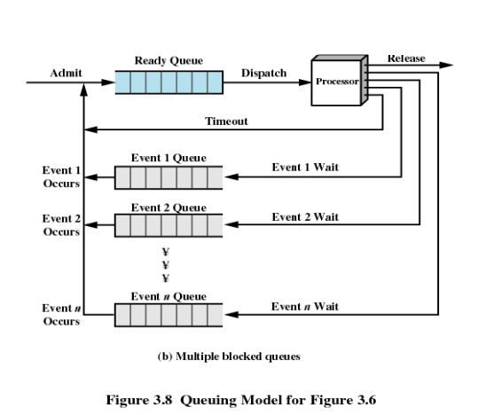
dispatcher(스케줄러)에 의해 Ready Queue의 프로세스가 프로세서에서 실행된다. 타임아웃의 경우 해당 프로세스는 다시 Ready Queue에 적재되고 스케줄러는 Ready Queue의 다른 프로세스를 실행한다. 프로세스가 어떤 외부 이벤트를 기다리는 경우 Event Queue라고 하는 Block Queue에 들어가서 외부 이벤트 발생을 기다린다. 이 상태를 blocked 상태라고 한다. 외부 이벤트가 발생하면 Ready Queue로 들어간다.

### Suspend State
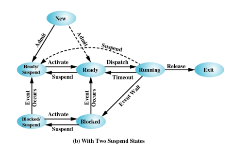
New -> Ready: 새 프로세스가 생성되면 Ready상태로 실행을 기다린다.
New -> Ready/Suspend: 시스템 설계마다 다르나, 새 프로세스가 생성되어서 Ready Suspend에서 기다렸다가 메인메모리의 상태가 괜찮으면 activate 시켜서 ready상태로 전환한다. 
Ready -> Ready/Suspend: ready상태의 프로세스 중 우선순위가 상대적으로 낮은 프로세스는 Ready/Suspend로 잠시 빼두어 메인메모리를 알맞게 유지한다.
Ready -> Running: 스케줄러에 의해 선택되면 프로세스를 수행한다.
Running -> Ready/Suspend: 실행 중인 프로세스가 뭔가 문제를 일으킬 것 같다고 판단되면 Ready/Suspend 상태로 전이시킨다.
Running -> Exit: 프로세스 수행을 종료한다.
Running -> Ready: 프로세스가 타임아웃 인터럽트가 발생하면 타이머 인터럽트 명령 수행 후 ready 큐로 들어간다.
Running -> Blocked: 실행 중 외부 이벤트의 발생으로부터의 입력 값이 필요하면 Block queue에 들어간다.
Blocked -> Ready: 외부 이벤트가 발생하여 자원이 할당되면 ready 큐에 들어간다.
Blocked -> Blocked/Suspend: Block queue에 외부 이벤트를 기다리는 프로세스가 너무 많으면 blocked/suspend 상태로 전이시켜 메모리를 유지한다.
Blocked/Suspend -> Ready/Suspend: Blocked/suspend 상태에서 외부 이벤트가 발생하면 Ready/suspend상태로 전이한다.

## Implementation of Processes
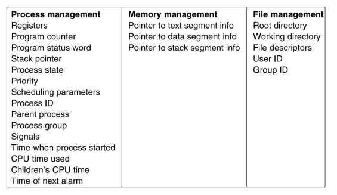
프로세스 모델을 구현하기 위해서 운영체제는 프로세스 테이블이라 불리는 각 프로세스마다 하나의 엔트리가 존재하는 테이블을 유지한다. 엔트리는 프로세스 상태에 대한 중요한 정보들을 가진다. 프로세스는 실행 상태에서 준비 또는 대기 상태로 전환될 때 이러한 엔트리 정보를 저장해야 다음 실행 때 재시작할 수 있다. 엔트리는 Process management(CPU 정보), Memory management(메모리 정보), File management(파일 정보)를 가진다.

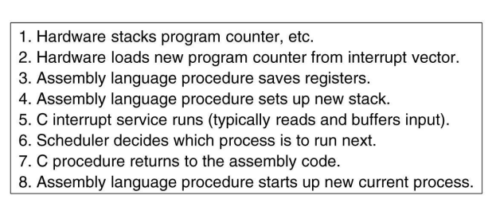
모든 인터럽트 처리는 보통 현재 프로세스의 프로세스 테이블 엔트리에 레지스터들을 저장하는 것부터 시작한다. 
1. 하드웨어는 Program counter를 스택에 저장한다.
2. 하드웨어는 인터럽트 벡터라 불리는 메모리의 하나의 위치로부터 인터럽트 서비스 프로시저의 주소를 받아온다.
3. 어셈블리어 프로시저는 레지스터를 저장한다.
4. 새 스택을 설정한다.
5. C 인터럽트 서비스를 실행시킨다.
6. 스케줄러는 다음에 실행될 프로세스를 결정한다.
7. C 프로시저는 어셈블리 코드로 다시 제어를 넘긴다.
8. 어셈블리어 프로시저는 새로운 프로세스를 실행시킨다.

## Modeling Multiprogramming
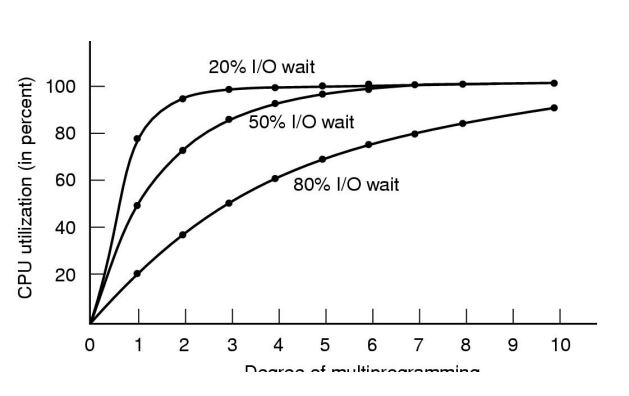
일반적으로 CPU 이용률은 다음과 같은 식을 따른다.
CPU 이용률 = 1 - p^n

여기서 n은 I/O를 기다리는 확률이다. 따라서, 만약 프로세스가 자신의 시잔 중 80% 정도를 I/O를 기다리면서 보낸다면 적어도 10개의 프로세스가 메모리에 적재되어 있어야 CPU낭비를 10%이하로 줄일 수 있다.

## Thread
스레드를 사용해야 하는 주된 이유는 많은 응용에서 다수의 동작이 동시에 진행되기 때문이다. 준 병렬로 수행하는 다수의 순차적인 스레드로 분해하면 프로그래밍 모델이 훨씬 단순해진다.

스레드를 사용하여 새로운 요소를 하나 더 추가하면 이 요소는 주소 공간을 공유하여 실행의 흐름들 간에 모든 데이터를 공유하는 병렬로 수행하는 개체를 지원하는 능력이다. 
스레드는 프로세스보다 더 경량이어서 프로세스보다 생성과 제거가 쉽고 빠르다.
CPU-바운드의 경우 프로세스와 차이가 별로 없지만 I/O가 동시에 존재하는 경우 스레드는 I/O동작을 겹치도록 수행할 수 있어 응용의 속도를 향상시킬 수 있다.
스레드는 다수의 CPU를 가지는 시스템에서 유용하다.

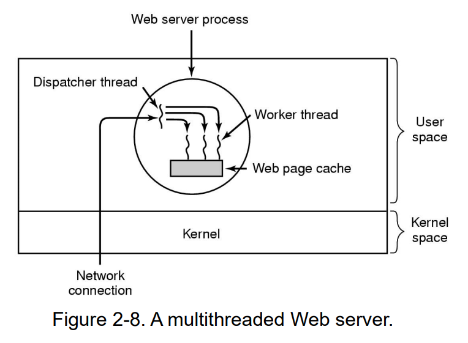
Dispatcher는 메인스레드로, 네트워크로부터 도착하는 작업 요청을 읽어 들인다. 그 후, 작업 스레드(Worker thread)를 선정하고 각 스레드마다 지정된 위치의 워드에 메시지의 포인터를 기록함으로써 요청을 이 스레드에 전달한다. 디스패처는 잠들어 있던 작업 스레드를 꺠워 이 스레드가 대기 상태에서 준비 상태가 되도록 한다.
작업 스레드가 깨어나면 이 작업 스레드는는 작업 요청이 웹페이지 캐시에서 만족될 수 있는지를 검사한다. 만약 그렇지 않으면 스레드는 디스크 읽기 연산을 시작하고 디스크 동작이 완료될 때까지 대기 상태가된다. 
디스패처 프로그램은 작업 스레드를 선정하고 작업 스레드에게 요청을 전달하는 무한 루프로 구성된다. 각 작업 스레드 코드는 디스패처로부터 요청을 전달 받고 웹 캐시에서 해당 페이지가 존재하는지 검사하는 무한 루프로 구성된다.

```C++
// 웹 서버 스레드

// 디스패처 스레드
while (TRUE){
    get_next_request(&buf); // 다음 요청을 받는다.
    handoff_work(&buf); // 작업스레드에 요청을 전달한다.
}

// 작업 스레드
while (TRUE){
    wait_for_work(&buf); // 요청을 기다린다.
    look_for_page_in_cache(&buf, &page); // 캐시에 페이지가 존재하는지 확인한다.
    if (page_not_in_cache(&page)) // 캐시에 페이지가 존재하지 않으면
        read_page_from_disk(&buf, &page); // 디스크로 부터 읽기 연산을 하고 대기상태로 들어간다.
    return_page(&page); // 페이지를 반환한다.
}
```

### Three ways to construct a server
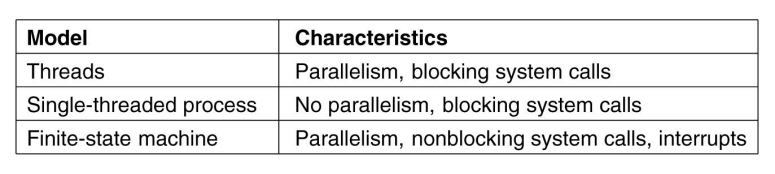

## The Classical Thread Model
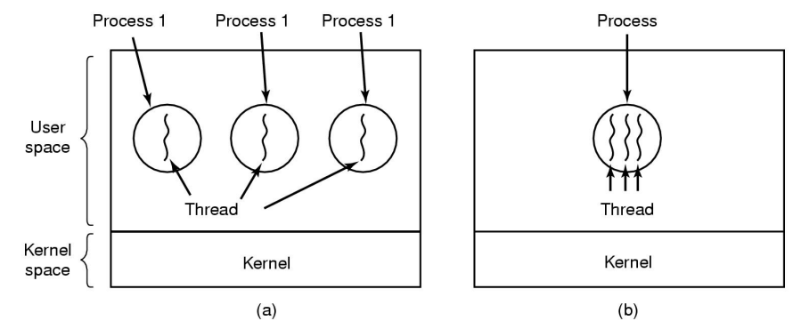
스레드: PC(Program Counter), 현재 작업 변수를 저장하는 레지스터, 실행 히스토리를 담고있는 스택을 가진다.

(a)의 경우 각 스레드는 서로 다른 주소 공간에서 동작하는 반면 (b)의 경우 세 스레드 모두 동일한 주소 공간을 공유한다.
다중스레드 프로세스가 하나의 CPU를 가진 시스템에서 실행될 때 스레드는 순서대로 수행된다. 한 프로세스 내부의 서로 다른 스레드들은 완전히 동일한 주소 공간을 가지며 동일한 전역 변수를 공유한다. 스레드는 다른 스레드의 스택을 읽고, 기록하고, 지워버릴 수 있다.

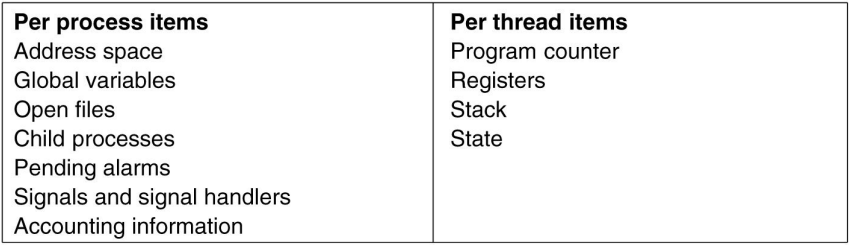
스레드는 다른 스레드가 작업중인 파일을 볼 수 있으므로 프로세스가 자원 관리의 단위가 되어야한다. 따라서, 스레드는 PC, Register, Stack, State만 가진다.
스레드는 Running, Blocked, Ready, Terminate의 상태를 가진다. 
스레드는 자신만의 스택을 가지고 있으며, 스택에는 호출되었으나 아직 복귀하지 않은 프로시저당 하나의 프레임이 존재한다. 이 프레임은 프로시저의 지역 변수들과 프로시저 수행이 끝날 때 돌아갈 복귀 주소를 가지고 있다. 
예를 들어 프로시저 a가 프로시저 b를 호출하고 b가 c를 호출했으면 a, b, c의 프레임들이 스택에 존재한다. 
일반적으로 각 스레드는 서로 다른 프로시저들을 호출하며 따라서 서로 다른 실행 히스토리를 가진다. 따라서 각 스레드들은 각자 자신의 스택을 가져야 한다.

## POSIX Thread
이식 가능한 스레드 프로그램(POSIX Thread)
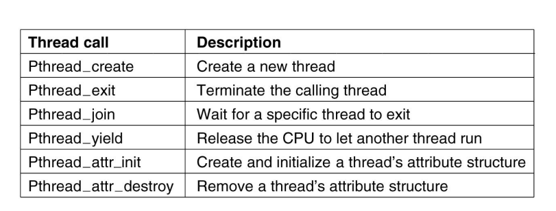
Pthread_create: 새로운 스레드를 생성한다. 새로 생성된 스레드에 대한 식별자가 함수의 값으로 반환된다. 스레드 식별자는 PID와 동일한 역할을 가지며 다른 호출에서 스레드를 지정하고 식별하는 역할을 수행한다.
Pthread_exit: 스레드가 지시된 작업을 마치면 이 함수를 호출하여 종료한다. 스레드를 종료시키고 스레드의 스택을 반환한다.
Pthread_join: 다른 스레드가 종료할 때까지 기다린다. 기다릴 대상 스레드의 식별자가 인자로 주어진다.
Pthread_yield: 다른 스레드에게 수행 권리를 양보한다.
Pthread_attr_init: 스레드와 관련된 속성 구조체를 생성하고 필드들을 기본 값으로 설정한다.
Pthread_attr_destory: 스레드의 속성 구조체를 파괴하여 메모리를 반환한다. 이 호출은 이 속성을 현재 사용하고 있는 스레드들에게는 그대로 존재하도록 하여 영향을 미치지 않는다.

### An example program using threads
```C++
#include <pthread.h>
#include <stdio.h>
#include <stdlib.h>

#define NUMBER_OF_THREADS 10

void *print_hello_world(void *tid)
{
    /* This function prints the thread's identifier and then exits */
    printf("Hello World. Greetings from thread %d\n", tid);
    pthread_exit(NULL);
}

int main(int argc, char *argv[])
{
    /* This main program creates 10 threads and then exits */
    // 메인 스레드가 10개의 스레드를 생성했으므로 11개의 스레드가 존재한다.
    pthread_t threads[NUMBER_OF_THREADS];
    int status, i;

    for(i = 0; i < NUMBER_OF_THREADS; i++){
        printf("Main here. Creating thread %d\n", i);
        status = pthread_create(&threads[i], NULL, print_hell_world, (void *)i);

        if (status != 0) {
            printf("Oops. pthread_create returned error code %d\n", status)
            exit(-1);
        }
    }
    exit(NULL);
}
```

## Implementing Threads
스레드 패키지를 구현하는 주요 방법으로는 두 가지가 있는데 하나는 사용자 공간에서 하나는 커널 내에서 구현하는 것이다.
둘을 혼합하면 하이브리드 방법이 된다.

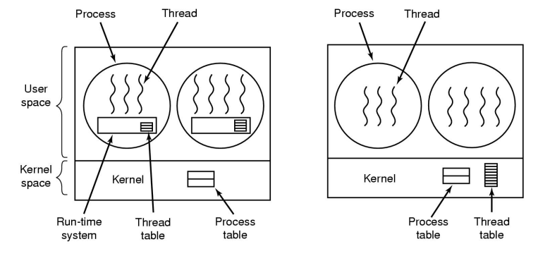
(a)는 스레드 패키지 전체를 사용자 공간에 위치시키는 것이다. 커널은 이들에 대해 전혀 알지 못한다. 커널이 나는 것은 단지 자신이 평범한 단일 스레드 프로세스를 수행하고 있다는 점이다. 이는 스레드를 전혀 지원하지 않은 운영체제에서도 구현될 수 있다는 장점이 있다. 스레드는 런타임 시스템 상에서 수행되며 런타임 시스템은 스레드를 관리하는 프로시저들의 모음이다.
스레드가 사용자 공간에서 관리되면 프로세스는 프로세스 내 모든 스레드를 관리하기 위해 각자의 스레드 테이블을 가져야 한다. 스레드 테이블은 런타임 시스템에 의해 관리된다. 스레드가 실행 상태에서 준비 또는 대기 상태로 전환되면 재시작하기위해 필요한 정보들은 스레드 테이블에 저장된다.
스레드를 대기 상태로 만들지도 모르는 어떤 작업을 수행할 경우 스레드는 런타임 프로시저를 호출한다. 이 프로시저는 스레드가 대기 상태가 되어야하는지를 검사하고 대기 상태로 들어가야 한다면 스레드의 레지스터를 스레드 테이블에 저장하고 실행 가능한 ready상태 스레드를 테이블에서 검색한 다음 이 새로운 스레드의 저장된 값들을 CPU의 레지스터로 적재한다.
이와 같은 스레드 전환은 인터럽트를 통해 커널 내부로 들어가는 것과 비교했을 때 매우 빠르다.
사용자 레벨 스레드는 각 프로세스마다 자신에게 특화된 스케줄링 알고리즘을 가질 수 있도록 한다.

(b)는 커널 내부에서 스레드를 구현한 것이다. 이는 프로세스마다 런타임 시스템이 필요하지 않다. 또, 각 프로세스마다 스레드 테이블이 존재하지 않는다. 대신 커널은 시스템 내부의 모든 스레드를 관리하기 위하여 스레드 테이블을 가진다. 스레드가 다른 스레드 생성을 요구하거나 기존 스레드의 제거를 요구하면 커널 호출을 통해 커널 스레드 테이블을 변경하여 생성과 삭제를 수행한다. 

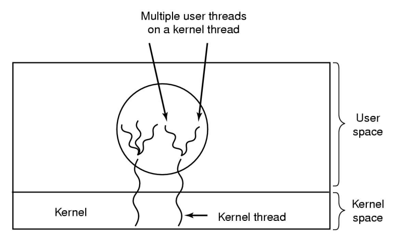
커널 레벨 스레드를 사용하고 커널 스레드 상에서 사용자 레벨 스레드를 다중화 시키는 것이다. 커널은 단지 커널 레벨 스레드들만을 인식하고 이들을 스케줄한다. 이 커널 스레드 중 일부는 그 위에서 다수의 사용자 레벨 스레드를 다중화 시킨다. 

## Pop-Up Threads
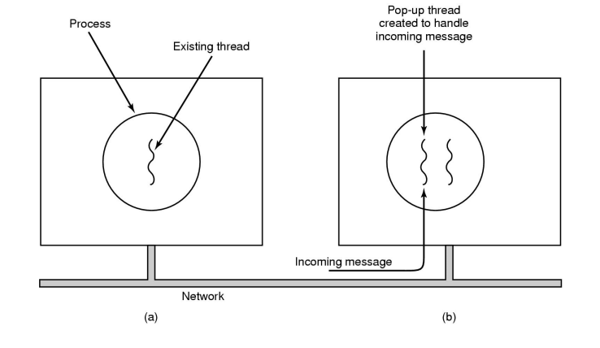
서비스 요청 메시지가 도착하면 시스템은 이를 처리하는 새로운 스레드를 생성하는데 이를 팝업 스레드라고 한다. 이는 완전히 새로 만들어진 것이라서 복원할 정보가 없다.

## Making Single-Threaded Code Multithreaded
단일 스레드 코드를 다중스레드 형태로 만들려면 몇 가지 위험 사항이 있다.
1. 스레드에게는 전역이면서 전체 프로그램 입장에서는 전역이 아닌 변수가 문제가 될 수 있다.
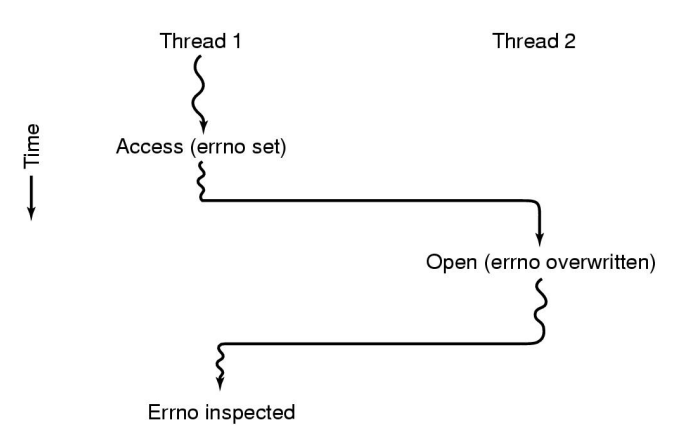
한 가지 예로 UNIX에서 프로세스는 시스템 호출을 부를 때 호출이 실패하는 경우 오류 코드가 errno에 기록된다. 위 그림에서 Thread 1은 특정 파일을 접근할 수 있는 권한이 있는지 알아보기 위해 access 시스템 호출을 실행한다. 운영체제는 전역 변수 errno에 응답을 적어 복귀한다. 제어가 Thread 1로 넘어왔지만 errno를 읽어보기 직전에 스케줄러는 Thread 1이 충분한 CPU 시간을 사용했다고 판단해서 Thread 2로의 문맥 교환을 결정한다. Thread 2는 open 시스템 호출을 부르지만 실패하여 errno 값이 다시 기록되고 결국 Thread 1의 access 호출로 인한 errno 값은 사라진다. 나중에 Thread 1이 실행될 때 이 스레드는 잘못된 값을 읽어 정확하게 행동할 수 없다.

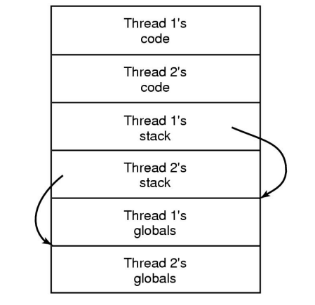
이를 해결하는 방법은 각 스레드에게 자신만의 개별 전역 변수를 할당하는 것이다. 이런 방식은 개별적으로 다른 전역 변수의 복사본을 가지게 되어 충돌을 피할 수 있다.

## Inter Process Condition
몇몇 운영체제에서 협력하는 프로세스들은 종종 각 프로세스가 읽고 쓸 수 있는 저장 공간을 공유한다. 스풀러 디렉터리(공유 메모리)는 번호로 색인되며 이름을 저장하는 다수의 슬롯을 가지고 있다. 두 프로세스가 하나의 슬롯에 접근하려고 할 때 문제가 발생한다. 이 때 두 프로세스는 공유 데이터를 읽거나 기록하는데 최종 결과는 누가 언제 수행되는가에 따라 달라지는 상황을 경쟁 조건(race condition)이라 부른다.

## Critical Regions
경쟁조건은 회피하기 위해서는 한 프로세스가 공유 변수나 파일을 사용중이면 다른 프로세스들은 똑같은 일을 수행하지 못하도록 해야한다. 이를 상호 배제(mutual exclusion)이라고 한다. 공유 메모리를 접근하는 프로그램 부분을 임계구역이라 한다. 만약 두 프로세스가 동시에 임계구역에 존재하지 않도록 조절한다면 경쟁조건을 피할 수 있다. 경쟁조건을 피하려면 다음 4가지 조건을 모두 만족해야 한다.
1. 두 프로세스가 동시에 자신의 임계구역에 존재하는 경우는 없어야 한다.(Mutual Exclusion)
2. CPU의 개수나 속도에 대해 어떤 가정도 하지 않는다.
3. 임계구역 외부에서 실행하고 있는 프로세스는 다른 프로세스들을 블록시켜서는 안된다.(Progress)
4. 임계구역에 진입하기 위해 무한히 기다리는 프로세스는 없어야 한다.(Bounded Waiting)

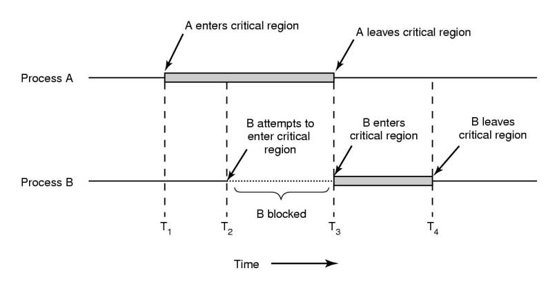
위 그림처럼 프로세스 A가 시간 T1에 자신의 임계 구역에 진입할 경우 프로세스가 시간 T2에 임계구역에 진입하려고 해도 A는 T3에 임계구역에서 나오기 때문에 B는 T3까지 기다렸다가 임계구역에 진입한다.

## Mutual Exclusion with Busy Waiting

상호배제를 얻기 위한 조건
1. 인터럽트 끄기
2. 락 변수
3. 엄격한 교대
4. Peterson의 해법
5. TSL 명령어

### 인터럽트 끄기
각 프로세스가 임계구역에 진입하자마자 인터럽트를 끄고 임계구역에서 나가기 직전에 인터럽트를 켜도록 한다. 이러면 클록 인터럽트가 발생하지 않아 자원이 교차될리없다. CPU는 오직 클록이나 다른 인터럽트의 결과로 프로세스간에 문맥을 교환하므로 인터럽트를 끄면 CPU는 다른 프로세스로 문맥을 교환하지 않는다.

> 사용자 프로세스에게 인터럽트를 끌 권한을 주면 안된다. 만약 사용자 프로세스가 인터럽트를 다시 켜지 않는다면 시스템은 더 이상 동작하지 않기 때문이다.

### 락 변수
0으로 초기화 된 단일 공유 락변수가 있다. 락이 0이면 프로세스는 임계구역에 들어가기 전에 1로 바꾸고 진입한다. 만약 이미 락이 1이면 프로세스는 락 변수가 0이 될 때까지 기다린다. 

> 스케줄링에 따라 경쟁 조건이 발생할 수 있다. 락을 1로 설정하기 직전에 다른 프로세스가 스케줄되어 실행하면서 락을 1로 설정하고 다시 첫 번째 프로세스가 실행하면 락을 1로 설정하여 두 프로세스가 락을 1로 설정하여 임계구역에 동시에 들어오는 불상사가 생긴다.

### 엄격한 교대

```C++
/* Process 0 */`
while (TRUE){
    while(turn != 0); // turn변수가 0이될 때까지 루프를 돈다.
    V++; // 임계구역 진입
    turn = 1; // 임계구역에서 나온다.
    noncritical_region();
}

/* Process 1 */
while (TRUE){
    while (turn != 1);
    V++;
    turn = 0;
    noncritical_region();
}

/*
turn의 초기값은 0이다. Process 1은 turn 변수가 1이될 때까지 반복한다.
*/
```

변수가 특정 값이 될 때까지 계속해서 검사하는 것을 바쁜 대기라 한다. 이는 CPU 시간을 낭비하므로 바쁜 대기는 일반적으로 피해야 한다. 바쁜 대기를 사용하는 락을 스핀 락이라 부른다.

한 프로세스가 다른 프로세스보다 상당히 느린 경우 빠른 프로세스가 임계구역에 존재하지 않는 다른 프로세스에 의해 블록되므로 경쟁 조건을 피하기 위한 조건 **3. 임계구역 외부에서 실행하고 있는 프로세스는 다른 프로세스들을 블록시켜서는 안된다.(Progress)** 라는 조건을 위배한다.

### Peterson's Solution
Dekker는 엄격한 교대를 요구하지 않는 상호배제 문제의 소프트웨어 해결책을 제시하였다.
```C++
/* Process 0 */
flag[0] = TRUE;
while (flag[1]) {
    if(turn == 1){
        flag[0] = FALSE;
        while (turn == 1);
        flag[0] == TRUE;
    }
}
V++;
flag[0] = FALSE;
turn = 1;

/* Process 1 */
flag[1] = TRUE;
while (flag[0]){
    if (turn == 0){
        flag[1] = FALSE;
        while (turn == 0);
        flag[1] = TRUE;
    }
}
V++;
flag[1] = FALSE;
turn 0;
```

```C++
#define FALSE 0
#define TRUE 1
#define N 2 // 프로세스의 수

int turn;
int interested[N];

void enter_region(int process) // 프로세스는 0 or 1
{
    int other; // 다른 프로세스의 수

    other = 1 - process; // 상대방 프로세스
    interested[process] = TRUE; // 현재 프로세스를 1로 설정
    turn = process;
    while (turn == process && interested[other] == TRUE)
}

void leave_region(int process)
{
    interested[process] = FALSE;
}
```

### Bakery Algorithm
n개의 프로세스가 있을 때 임계구역 솔루션

## TSL Instruction
하드웨어의 도움을 약간 필요로 하는 해결책이다.
메모리 워드 LOCK의 값을 읽어 레지스터 REGISTER에 저장하고 메모리 주소 LOCK에 0이 아닌 값을 기록한다.워드를 읽고 값을 저장하는 연산은 분할이 불가능하기 때문에 연산이 완료될 때까지 다른 어떤 처리기도 메모리 워드에 접근할 수 없다. TSL 명령을 수행하는 CPU는 수행이 끝날 때까지 메모리 버스를 잠금으로써 다른 어떤 CPU도 메모리에 접근할 수 없도록 한다.

```
enter_region:
    TSL REGISTER, LOCK // LOCK의 값을 레지스터로 복사하고 LOCK을 1로 설정한다.
    CMP REGISTER, #0 // 이전 값이 0인지 비교한다.
    JNE enter_region // 만약 1이었으면 LOCK이 이미 이전에 1로 설정된 것이기때문에 서브루틴의 처음으로 돌아가 TSL 명령을 다시 시작한다.
    RET

leave_region:
    MOVE LOCK, #0
    RET
```

임계구역에 진입하기 위해서 프로세스는 enter_region을 호출하며 이 루틴은 락이 풀릴 떄까지 바쁜 대기를 한 다음 락을 획득하고 복귀한다. 임계구역을 수행한 후 프로세스는 leave_region을 호출하며 이 루틴은 lock에 0을 저장한다.

TSL 명령의 다른 형태가 XCHG이다. 이는 원자적으로 두 곳의 내용을 교환한다(ex. 레지스터와 메모리 워드의 내용)

## Spin Lock Implementation

Version 1: 다른 프로세서가 메모리에 접근을 하지 못하도록 막는 방법

```C++
void spin_lock(spinlock_t *s){
    while (test_and_set(s) != 0);
}
```

Revised Version

```C++
void spin_lock(spinlock_t *s){
    while (test_and_set(s) != 0) {
        while(*s != 0);
    }
}
```

## The Producer-Consumer Problem
두 프로세스가 고정된 크기의 버퍼를 공유한다. 하나는 생산자로 정보를 버퍼에 저장하고 다른 하나는 소비자로 버퍼에서 정보를 꺼내 온다.

생산자가 새로운 아이템을 버퍼에 넣으려고 하는데 버퍼가 가득 차 있을 때 문제가 발생한다. 해결책은 생산자가 잠들고 소비자가 아이템을 하나 제거할 때 깨워주는 것이다. 마찬가지로 소비자가 아이템을 버퍼에서 가져오려고 하는데 버퍼가 비어있으면 소비자는 잠들고 생산자가 버퍼에 아이템을 넣을 때 깨워준다.

```C++
#define N 100
int count = 0;

void producer(void)
{
    int item;

    while (TRUE) {
        item = produce_item();
        if (count == N) sleep(); // 가득차면 잠들고
        insert_item(item);
        count = count + 1;
        if (count == 1) wakeup(consumer); // 비어있는 상태에서 한 개를 생산하면 소비자를 깨운다.
    }
}

void consumer(void)
{
    int item;

    while (TRUE){
        if (count == 0) sleep(); // 비어있으면 잠들고
        item = remove_item();
        count = count - 1;
        if (count == N-1) wakeup(producer); // 가득 찬 상태에서 한 개를 소비하면 생산자를 깨운다.
        consume_item(item);
    }
}
```

## Semaphores
Dijkstra는 세마포어라는 새로운 변수형을 도입하여 깨움이 저장되지 않은 0값 또는 하나 이상의 깨움이 대기 중인 양수 값을 가지도록 하였다.

Dijkstra는 각각 sleep과 wakeup이 일반화 된 down과 up 두 개의 연산을 제안하였다. 세마포어에 대한 down 연산은 값이 0보다 큰 지를 검사한다. 만약 그렇다면 이 값을 감소시키고 수행을 계속한다. 만약 값이 0 값이면 프로세스는 down의 수행을 완료하지 않고 즉시 잠든다.

값을 검사하고, 변경하고, 경우에 따라 잠드는 이러한 모든 동작은 분할할 수 없는 하나의 원자적 행위이다. 이 연산이 완료되거나 프로세스가 잠들 떄까지 다른 프로세스가 세마포어에 접근할 수 없도록 보장되어야 한다.

up 연산은 세마포어의 값을 증가시킨다. 하나 또는 그 이상의 프로세스가 down 연산을 완료할 수 없어서 세마포어 큐에서 잠들어 있으면 이 중 한 프로세스가 시스템에 의해 선택되어 down 수행을 완료할 수 있다. 따라서 프로세스가 잠들어 있는 세마포어에 대해 up을 수행하면 세마포어 값은 여전히 0이지만 잠들어 있는 프로세스의 개수는 하나가 감소한다.

### The Producer-Consumer problem using Semaphores
```C++
#define N 100
typedef int semaphore;
semaphore mutex = 1; // 생산자와 소비자가 동시에 버퍼에 접근하지 못하도록 하는 변수
semaphore empty = N; // 빈 슬롯의 개수
semaphore full = 0; // 아이템으로 채워진 슬롯의 개수

void producer(void)
{ // empty가 먼저 down되고 mutex가 down되어야 한다.
    int item;

    while (TRUE) {
        item = produce_item();
        down(&empty); // 슬롯이 가득차면 대기한다.
        down(&mutex);
        insert_item(item);
        up(&mutex);
        up(&full);
    }
}

void consumer(void)
{
    int item;
    
    while (TRUE){
        down(&full); // 슬롯이 다 비어있으면 대기한다.
        down(&mutex);
        item = remove_item();
        up(&mutex);
        up(&empty);
        consume_item(item);
    }
}
```

## Priority Inversion
우선순위 역전 문제는 프로세스들이 sleep하고 wakeup할 때 발생한다. 

프로세스가 임계구역에 진입하려고 할 때 먼저 진입이 허용되는지 검사하고 허용되지 않으면 허용될 때까지 제자리에서 루프른 돈다.
이 기법은 CPU시간을 낭비할 뿐 아니라 예기치 못한 결과를 가져온다.
컴퓨터에 높은 우선순위를 가진 H와 낮은 우선순위를 가진 L 두 프로세스가 실행중이라고 하자. L이 임계구역에 진입하고 난 후에 H가 실행이 가능한 준비 상태가 되면 H가 수행이 된다. 하지만 L이 이미 임계구역에 있으므로 제자리 루프를 돌고, L은 H 때문에 수행되지 않아 임계구역을 벗어나지 못해 H는 무한루프를 돌게 된다.
이러한 상황을 우선순위 역전 문제라고 부른다.

## Mutex
세마포어의 단순한 버전으로 세마포어의 개수를 세는 능력이 필요 없는 경우이다.

뮤텍스는 변수로서, unlock, lock 두 가지 중 한 상태를 가진다. 뮤텍스와 함께 두 개의 프로시저가 사용된다. 스레드가 임계구역에 접근할 때 mutex_lock을 호출한다. Unlock(임계구역을 사용할 수 있음을 의미)이면 호출은 성공하고 호출한 스레드는 임계구역에 진입할 수 있다. 

이미 뮤텍스가 Lock 상태이면 스레드는 임계구역에 있는 스레드가 수행을 마치고 mutex_unlock을 호출할 때까지 블록된다. unlock될 때 다수의 스레드가 하나의 뮤텍스에서 대기 중이면 이들 중 하나가 임의로 선택되어 lock을 획득한다.

```C++
mutex_lock:
    TSL REGISTER, MUTEX // 뮤텍스를 레지스터로 복사한 후 1로 설정한다.
    CMP REGISTER, #0 // 뮤텍스 값이 0인지 비교한다.
    JZE ok // 뮤텍스가 0이었으면 뮤텍스는 unlock되고 return한다.
    CALL thread_yield // 뮤텍스가 1이면 다른 스레드를 스케줄링한다.
    JMP mutex_lock // 다시 수행한다.
ok: RET

mutex_unlock:
    MOVE MUTEX, #0
    RET
```
TSL 명령어와 차이점은 뮤텍스의 경우 락을 획득하지 못하면 thread_yield를 호출하여 다른 스레드에게 CPU를 양보한다. 결과적으로 바쁜 대기는 존재하지 않게 된다.

thread_yield는 사용자 공간에 있는 스레드 스케줄러를 호출하므로 매우 빠르다. -> 커널을 호출하지 않는다.


## Mutex in Pthreads
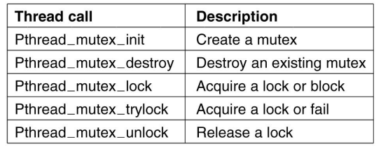
Pthread_mutex_init: 뮤텍스를 생성한다.
Pthread_mutex_destroy: 뮤텍스를 파괴한다.
Pthread_mutex_lock: 락을 설정하며 이미 락이 걸려있으면 대기한다.
Pthread_mutex_trylock: 락을 획득하기 위해 시도할 때 이미 락이 설정되어 있으면 대기하는 대신 오류코드와 함께 바로 복귀하도록 설정한다. -> 효과적으로 바쁜 대기를 수행할 수 있다.
Pthread_mutex_unlock: 뮤텍스를 unlock하며 하나 또는 그 이상의 스레드가 대기 중이면 단 하나의 스레드만 진행할 수 있도록 한다. 

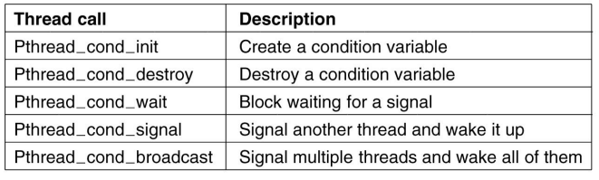
뮤텍스 이외에도 pthread는 조건 변수(conditional variable)라는 동기화 기법을 제공한다. 뮤텍스는 임계구역에 대한 접근을 허용하거나 대기시키는데 적당하다면 조건 변수는 어떤 조건이 만족되지 않으면 스레드의 수행을 대기시킨다.

조건 변수와 뮤텍스는 항상 같이 사용된다. 보통 어떤 스레드가 뮤텍스를 락하고 자신이 필요한 무엇인가가 만족될 때까지 조건 변수에서 대기한다. 그리고 다른 스레드가 신호를 보내면 기다리던 스레드는 진행하게 된다.

Pthread_cond_init: 조건 변수를 생성한다.
Pthread_cond_destroy: 조건 변수를 파괴한다.
Pthread_cond_wait: 다른 스레드가 신호를 보낼 때까지 호출한 스레드를 대기시킨다. 점유하고 있는 뮤텍스를 원자적으로 unlock하게 된다. -> 뮤텍스가 인자로 주어져야 한다.
Pthread_cond_signal: 다른 스레드에게 신호를 보낸다.
Pthread_cond_broadcast: 잠재적으로 동일한 신호를 기다리는 다수의 스레드가 존재할 수 있는 경우 사용된다.

> 세마포어와 다르게 조건 변수는 과거를 기억해 두지 않는다. 블록된 스레드가 없는 조건 변수에 대해 신호를 보내면 이 신호는 그냥 사라진다. 

```C++
/* 스레드를 사용하는 생산자-소비자 문제 */
#include <stdio.h>
#include <pthread.h>
#define MAX 1000000000

pthread_mutex_t the mutex;
Pthread_cond_t condc, condp;
int buffer = 0;

void *producer(void *ptr)
{
    int i;
    
    for(i = 1; i <= MAX; i++){
        pthread_mutex_lock(&the_mutex);
        while (buffer != 0) pthread_cond_wait(&condp, &the_mutex);
        buffer = i;
        pthread_cond_signal(&condc);
        pthread_mutex_unlock(&the_mutex);
    }
    pthread_exit(0);
}

void *consumer(void *ptr)
{
    int i;

    for(i = 1; i<= MAX; i++){
        pthread_mutex_lock(&the_mutex);
        while (buffer == 0) pthread_cond_wait(&condc, &the_mutex);
        buffer = 0;
        pthread_cond_signal(&condp);
        pthread_mutex_unlock(&the_mutex);
    }
    pthread_exit(0);
}

int main(int argc, char **argv)
{
    pthread_t pro, con;
    pthread_mutex_init(&the_mutex, 0);
    pthread_cond_init(&condc, 0);
    pthread_cond_init(&condp, 0);
    pthread_create(&con, 0, consumer, 0);
    pthread_create(&pro, 0, producer, 0);
    pthread_join(pro, 0);
    pthread_join(con, 0);
    pthread_cond_destory(&condc);
    pthread_cond_destory(&condp);
    pthread_mutex_destroy(&the_mutex);
}
```

## Monitor
모니터는 특별한 형태의 모듈 또는 패키지에 모아진 프로시저, 변수, 자료구조의 모음이다. 프로세스는 필요하면 언제든 모니터의 프로시저를 호출할 수 있지만 모니터 밖의 프로시저에서 모니터의 내부 자료 구조를 직접 접근하는 것은 불가능하다.

모니터는 프로그래밍 언어 자체가 지원해주는 개념인데, C는 이를 지원하지 않는다.
```
monitor example
    integer i;
    condition c;

    procedure producer();
    .
    .
    .
    end;

    procedure consumer();
    .
    end;
end monitor;
```

모니터는 상호배제를 성취하는데 중요한 속성인 "단 하나의 프로세스만 한 순간에 모니터에서 활동할 수 있다."를 가진다. 
일반적으로 프로세스가 모니터 프로시저를 호출하면 프로시저의 최초 명령 몇 개가 다른 프로세스가 이미 모니터에서 활동 중인지를 검사한다.
만약 다른 프로세스가 모니터에서 활동 중이라면 다른 프로세스가 모니터에서 나올 때까지 중단(suspend)된다.
다른 프로세스가 모니터를 사용하고 있지 않으면 호출한 프로세스는 모니터에 진입한다.

### Producer/Consumer with Hoare's Monitor
생산자-소비자 문제에서 버퍼가 가득 찰 경우 조건 변수를 사용하여 wait, signal 연산을 통해 해결할 수 있다. 
모니터 프로시저가 더 이상 진행할 수 없음을 인식하면 어떤 조건 변수에 대해 wait을 수행하고 이 동작은 호출한 프로세스를 대기하게 만든다. 이는 현재 모니터 진입을 금지당하고 있는 다른 프로세스가 모니터에 진입할 수 있게 한다.
프로세스는 파트너 프로세스가 대기 중인 조건 변수에 대해 signal을 수행하여 대기 중인 파트너를 깨울 수 있다. 이 때,Hoare는 기존 프로세스를 중단시키고 새로 깨어난 프로세스가 수행되어야 한다고 제안하였다.

## Lock-free Data Structure
CPU는 원자적 CAS(Compare-and-Swap)연산을 제공해야 한다.

## Message Passing
메시지 패싱을 이용하는 프로세스간 통신은 send와 receive 두 가지 프리미티브를 이용한다. 이는 세마포어처럼 시스템 호출의 일종이다.
```
send(destination, message) 
receive(source, message)
```
send 호출은 메시지를 명시된 목적지에 전송하고 receive 호출은 명시된 정보원으로부터 메시지를 받는다. 전달된 메시지가 없으면 수신자는 메시지가 도착할 떄까지 기다린다.
또는 오류 코드와 함께 즉시 복귀할 수도 있다.

### Synchronization
- Blocking send, blocking receive
    - sender와 receiver 모두 메시지가 도착하기 전까지 대기한다.
    - receive 이전에 send가 호출되면 전송하려는 프로세스는 receive가 호출될 때까지 대기하며, receive가 호출되면 메시지는 중간 단계의 버퍼링 없이 송신자에서 수신자로 직접 복사된다.
    - 유사하게 receive가 먼저 호출되면 수신자는 send가 호출될 때까지 기다린다.
    - 이를 랑데뷰(rendezvous)라고 부른다.
- Nonblocking send, blocking receive
    - 송신자는 계속해서 send 호출을 한다.
    - receive는 요청된 메시지가 도착할 때까지 기다린다.
- Nonblocking send, nonblocking receive
    - 송신자, 수신자 모두 기다리지 않는다.

### Addressing
- Direct Addressing
    - send 호출은 수신자 프로세스의 특정 식별자를 포함한다.
    - receive 호출은 앞으로 도착을 프로세스 메시지의 순서 번호를 알 수 있다.
    - receive 호출은 receive 명령이 이루어졌을 때 값을 반환하기 위해 source parameter를 사용할 수 있다.

- Indirect Addressing
    - 메시지는 큐와 같은 공유된 자료구조에 보내진다.
    - 큐는 메일박스라고 불린다.
    - 어떤 프로세스는 메일박스에 메시지를 보내며 다른 프로세스는 메일박스에서 메시지를 고른다.
    - 즉, 메일바그는 어떤 장소로서 메일박스가 생성될 때 정해진 개수만큼 메시지를 버퍼링할 수 있다.

## Barriers
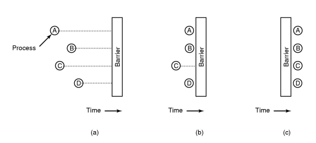
어떤 응용들은 단계별로 구성되는데, 모든 프로세스가 다같이 다음 단계로 진행할 준비가 되기 전에 어떤 프로세스만 먼저 다음 단계로 진행할 수 없다는 규칙을 가지고 있다.
이는 각 단계의 끝에 장벽을 설치함으로써 달성할 수 있다.
한 프로세스가 장벽에 도착하면, 다른 모든 프로세스가 장벽에 도착할 때까지 이미 도착한 프로세스들은 대기한다.

각 프로세스는 장벽에 도착하면 라이브러리 프로시저를 호출하여 장벽 프리미티브를 수행한다. 마지막 프로세스가 도착하면 모든 프로세스는 장벽을 통과한다.

## 스케줄링
다음에 실행할 프로세스를 선택하는 것이다.
- 스케줄링 시점
    - 프로세스가 생성될 때
    - 프로세스가 종료할 때
    - 프로세스가 I/O, 세마포어, 또는 다른 무언가로 대기할 때
    - I/O 인터럽트가 발생할 때
    - 선점형(preemptive) 스케줄링 알고리즘의 경우 클럭 인터럽트가 발생할 때 -> 클럭 인터럽트가 발생하면 수행할 프로세스가 변경된다.
    > 비선점형 스케줄링 알고리즘은 I/O나 대기하거나 CPU를 반환할 때까지 계속해서 수행한다.

- 스케줄링 오버헤드(문맥교환 비용)
    - 모드 변경비용(사용자 -> 커널 -> 사용자)
    - 프로세스 문맥 저장, 복구
    - 메모리 맵 저장 복구
    - CPU 캐시 무효화

### Scheduling - Process Behavior
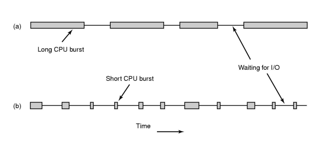
거의 모든 프로세스는 한동안 계산을 수행하다가 다시 한동안 I/O를 요청하는 행동을 반복한다. 시스템 호출이 완료되면 다시 데이터가 필요하거나 데이터를 기록해야 할 때까지 CPU는 계산을 수행하며 이러한 과정이 반복된다.

(a)와 같은 CPU-바운드 프로세스의 경우 대부분의 시간은 계산에 소비하는 반면, (b)와 같은 I/O-바운드 프로세스의 경우 대부분의 시간을 I/O를 기다리면서 보낸다.
이들을 구분하는 핵심은 CPU 버스트의 길이이다.
CPU가 빨라질수록 프로세스는 점점 I/O 바운드가 되는 경향이 있다. 디스크에 비해 CPU가 훨씬 더 빨라지면서 이러한 현상이 발생한다.

### Type of Scheduling
- Long-term scheduling: 새로운 프로세스가 추가될 때
- Medium-term scheduling: 메인 메모리에 프로세스의 수를 추가할 때
- Short-term scheduling: 다음에 실행할 프로세스를 결정할 때
- I/O scheduling

New -> Ready/Suspend: Long-term scheduling
New -> Ready: Long-term scheduling

Ready -> Running: Short-term scheduling

Blocked/suspend -> Blocked: Medium-term scheduling
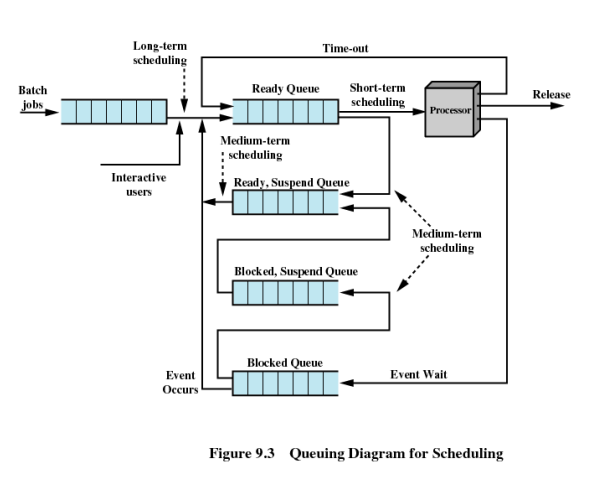

## Categories of Scheduling Algorithm
서로 다른 환경은 서로 다른 스케줄링 알고리즘을 필요로 한다.
- Batch
- Interactive
- Real time

### Scheduling Algorithm Goals
1. 모든 시스템
- 공평함: 각 프로세스에게 공평한 몫의 CPU를 할당함
- 정책 집행: 정책이 집행되는지 관찰함
- 균형: 시스템의 모든 부분이 활동하도록 함

2. 배치 시스템
- 성능: 시간당 처리되는 작업의 수를 최대화 함
- 반환시간: 작업의 제출부터 종료까지 걸리는 시간을 최소화 함
- CPU 이용률: CPU가 항상 활용되도록 함

3. Interactive(대화식) system
- 응답시간: 요청에 빠르게 응답하도록 함
- 비례: 사용자의 기대를 만족시킴

4. Real-time systems
- 마감시간 만족: 데이터 손실을 방지
- 예측 가능: 멀티미디어 시스템에서 품질 저하를 방지

### Scheduling in Batch Systems
1. First-come first-served(선입선출)
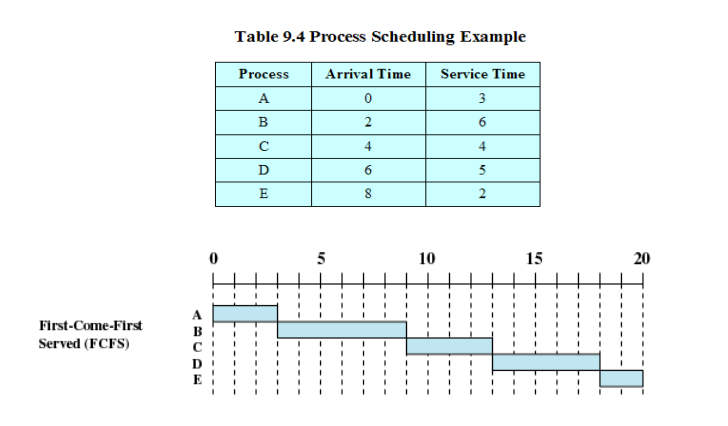
- 프로세스들은 요청 순서대로 CPU를 할당 받는다. 준비 상태의 프로세스를 위한 단일 큐가 존재한다. 큐가 비어있을 때 첫 작업이 외부로부터 시스템으로 제출되면 이 작업은 즉시 시작하여 원하는 만큼 실행된다. 다른 작업이 도착하면 이들은 큐에 놓인다. 실행중인 프로세스가 대기 상태가 되면 큐의 첫 번째 프로세스가 이어 실행된다.

2. Shortest job first
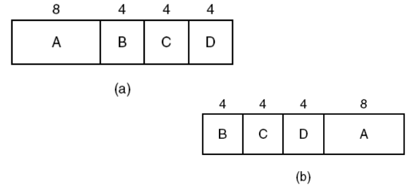
- 실행 시간을 미리 안다고 가정하면 스케줄러는 큐에 있는 프로세스 중 실행 시간이 가장 짧은 최단 작업을 선택한다.

- 모든 작업이 동시에 존재할 때만 최단 작업 우선이 최적이다.

3. Shortest Remaining Time Next
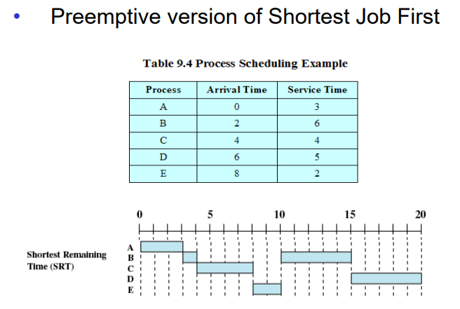
- 최단작업우선의 선점형 버전이다. 스케줄러는 항상 프로세스의 남은 실행 시간이 가장 짧은 작업을 선택한다. 여기서도 작업의 실행 시간을 미리 알고 있어야 한다. 새로운 작업이 도착하면 현재 수행 중인 프로세스의 잔여 시간과 비교한다. 현재 프로세스의 잔여 시간보다 새 프로세스의 실행 시간이 더 짧은 경우 현재 프로세스의 작업을 중단시키고 새로운 작업이 실행을 시작한다.

4. Highest Response Ratio Nest(HRRN)
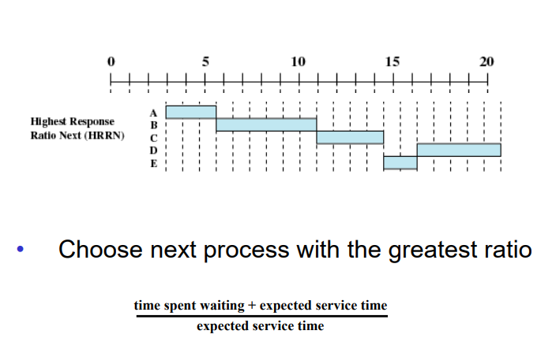
높은 응답비율을 가진 프로세스를 다음 수행 프로세스로 선택한다.

$ {time \space spent \space waiting \space + \space expected \space service \space time} \over expected \space service \space time $

### Scheduling in Interactive Systems
- Round-robin scheduling
- Priority scheduling
- Multiple queues
- Shortest process next
- Guaranteed scheduling
- Lottery scheduling
- Fair-share scheduling

1. Round-Robin Scheduling
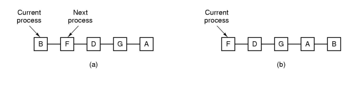
- 각 프로세스에게 시간 할당량이라 불리는 시간 주기가 할당되며 한 번에 이 시간 동안만큼만 실행된다. 프로세스가 할당 시간 동안 실행하면 CPU는 선점되어 다른 프로세스에게 주어진다. 프로세스가 할당 시간이 끝나기 전에 대기하거나 종료하면 CPU는 다른 프로세스로 전환한다. 프로세스가 할당 시간을 소비하면 큐의 맨 뒤에 놓인다.

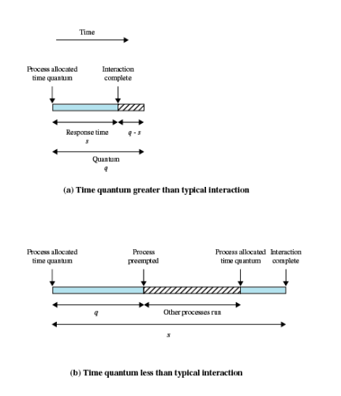
- 한 프로세스에서 다른 프로세스로 문맥교환하는 것은 많은 시간을 필요로 한다. 만약 할당받은 시간이 프로세스가 작업을 완료하는 시간보다 크면 자신의 할당 시간을 다 소비하기 전에 대기를 유발하는 연산을 수행하여 문맥교환을 발생시킨다. 또, 할당 시간이 너무 짧으면 너무 많은 프로세서간 교환을 유발하여 CPU 효율이 떨어진다. 적당한 타협점을 찾아야 한다.

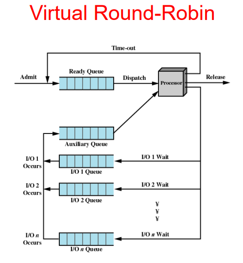
- Virtual Round Robin Scheduling은 일반적인 라운드 로빈을 발전시킨 형태이다. 일반적인 라운드 로빈과는 달리 프로세스가 입출력을 요구하면 입출력 큐에서 대기하다가 작업이 끝나면 보조 큐(Auxiliary Queue)에 들어간다. 그런 다음 스케줄러가 다음 프로세스를 선택할 때 Ready 큐와 Auxiliary 큐에서 선택하게 되는데 Ready 큐보다 Auxiliary 큐의 프로세스 작업을 먼저 실행시킨다. 그리고 저번 시간에 다 못 채우고 나간 시간만큼만 실행을 한다.

2. Priority Scheduling
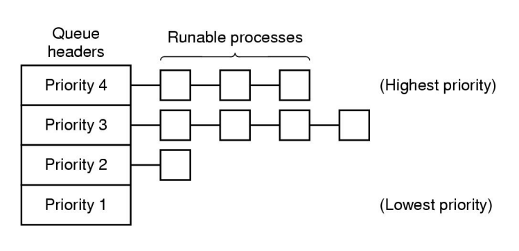
- 각 프로세스에게는 우선순위가 할당되며 가장 높은 우선순위를 가진 실행 가능한 프로세스가 다음에 수행한다.

- 높은 우선순위의 프로세스가 무한히 실행되는 것을 막기 위해 스케줄러는 클록 인터럽트마다 현재 실행중인 프로세스의 우선순위를 낮출 수 있다. 그리고, 현재 수행중인 프로세스의 우선순위가 다음으로 가장 높은 프로세스의 우선순위보다 낮아지면 프로세스 교환이 발생한다.

- 각 프로세스는 최대로 실행할 수 있는 할당 시간을 가진다. 이 할당 시간을 소비하면 다음으로 우선순위가 높은 프로세스에게 실행할 기회가 주어진다.

- 프로세스들을 그룹으로 묶어 우선순위 클래스를 형성하고, 우선순위 클래스마다 우선순위를 할당하며 각 클래스 내에서는 라운드 로빈을 사용한다.

- 낮은 우선순위 클래스는 starvation을 겪을 수 있다.

3. Multilevel Feedback Queue
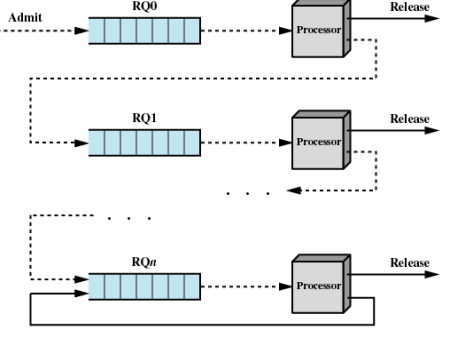
- CPU 바운드 프로세스와 I/O 바운드 프로세스를 구분하여 I/O 바운드 프로세스가 더 높은 우선순위를 갖도록 한다.

- 에이징 매커니즘을 사용한다. 즉, 가장 높은 우선순위의 클래스는 처음 한 번의 할당 시간을 받는다. 할당 시간을 다 소비하면 한 단계 낮은 우선순위 클래스로 이동한다. 대신 다음 우선순위 클래스에서는 이전 클래스의 할당 시간의 2배를 할당 받는다.

- 캐리지 리턴(엔터키)를 입력할 때마다 프로세스가 대화식이 되었다고 가정하고 이 프로세스를 한 단계 높은 우선순위 클래스로 이동시킨다.

4. Short Process Next
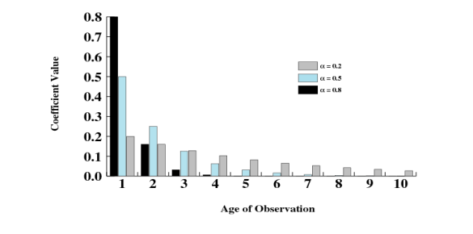
- 과거의 행동을 기반으로 하여 예상 실행 시간이 가장 짧은 프로세스를 실행한다.

- 어떤 프로세스에서 명령 당 예상 시간을 T0, 그 다음 실행 시간이 T1으로 측정되었다고 하면 예상 실행 시간은 다음과 같다.
$ S_{n+1} = aT_(n) + (1-a)S_(n) $

- 현재 측정된 값과 이전 예상치를 가중 평균하여 연속적으로 다음 값을 예상하는 기법을 에이징기법이라 부른다. 

5. Guaranteed Scheduling
- n개의 프로세스에게 1/n만큼의 CPU 시간을 할당한다.

6. Lottery Scheduling
- 스케줄링 결정을 내릴 때마다 무작위로 복권 티켓을 선택하여 이 티켓에 적힌 비율만큼 CPU 시간을 가진다.

7. Fair-share Scheduling
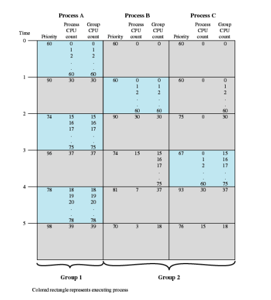
- 각 사용자는 CPU 시간의 일정 비율을 할당 받으며 스케줄러는 이 비율이 지켜지도록 프로세스를 선택한다. 만약 두 명의 사용자가 각각 CPU 시간의 50%를 약속 받았다면 몇 개의 프로세스를 가지고 있는 지와 관계없이 그 만큼을 받게 된다.

$ CPU_j(i) = CPU_j(i-1)/2 $
$ GCPU_j(i) = GCPU_j(i-1)/2 $
$ P_j(i) = Base_j + CPU_j(i)/2  + GCPU_k(i)/(4*W_k) $

## Scheduling Mechanism vs. Policy
- 커널은 스케줄링 매커니즘을 제공한다.
- 사용자 프로세스는 스케줄링 정책을 결정한다.
    - 각 사용자 프로세스는 자식 프로세스를 포함하고 있는 경우가 많은데, 이 중에서도 우선순위가 나뉜다. 따라서 스케줄링 정책은 사용자 프로세스가 결정하도록 하여 자식 프로세스의 우선순위를 결정하고 그에 기반하여 커널의 스케줄링 매커니즘을 따른다.

## Thread Scheduling

프로세스들이 여러 스레드를 가지고 있을 때 사용자 레벨 스레드가 지원되는지 커널 레벨 스레드가 지원되는지에 따라 스케줄링이 달라진다.

사용자 레벨 스레드의 경우 커널은 스레드의 존재를 인식하지 못한다. 따라서 커널은 스케줄링에 따라 프로세스에게 할당 시간만큼 CPU 제어를 넘기면 그 프로세스는 내부의 스케줄러를 활용하여 스레드를 실행한다. 스레드를 다중프로그래밍 하기 위한 클록 인터럽트가 존재하지 않으므로 이 스레드는 자신이 원하는 만큼 실행할 수 있다.
스레드가 실행을 끝마치지 않은 상태로 할당 시간을 모두 소비하면 그 다음 실행 때 해당 스레드가 다시 실행을 재개한다.

사용자 레벨 스레드 스케줄링의 유일한 제약은 너무 오래 실행되는 스레드를 중단시킬 수 있는 클록 인터럽트가 없다는 것이다.

커널 레벨 스레드의 경우 커널은 어떤 스레드를 선택하여 실행한다. 스레드는 할당 시간을 부여 받고 이 시간을 초과하면 강제로 중단된다. 

사용자 레벨 스레드와 커널 레벨 스레드 사이에 가장 큰 차이점은 성능이다. 사용자 레벨 스레드에서 스레드 문맥교환은 시간이 적게 든다. 하지만 커널 레벨 스레드에서는 시간이 많이 든다. 커널 레벨에서 커널은 스레드가 무슨 일을 하는지 절대 알지 못한다.

## Traditional Unix Scheduling
- 다단계 피드백 스케줄링을 사용하면서 각 우선순위 큐에서는 라운드 로빈 스케줄링을 사용하는 방법이다.
- 우선순위는 1초마다 재계산된다.
