# Memory Management

## No Memory Abstraction
메모리 추상화를 사용하지 않으면 모든 프로그램은 물리 메모리를 직접 사용해야 한다. 메모리 추상화가 없는 환경에서는 두 개의 프로그램이 동시에 메모리에서 실행될 수 없다. 한 프로그램이 다른 프로그램의 데이터를 변경하는 결과를 야기할 수 있기 때문이다.

물리 메모리를 직접 사양하는 메모리 모델 설계는 다음과 같다.
1. RAM에서 운영체제가 사용자 프로그램보다 아래에 위치하는 경우
2. ROM(Read Only Memory)에 운영체제가 존재하고 그 아래에 사용자 프로그램이 있는 경우
3. ROM에는 장치 드라이버가 존재하고 그 아래에 사용자 프로그램이 있으며 그 아래에 운영체제가 있는 경우

> 1, 3은 사용자 프로그램의 버그가 운영체제에 영향을 줄 수 있기 때문에 안좋다.

사용자가 명령을 입력하면 운영체제는 요청한 명령 프로그램을 디스크에서 메모리에 적재하고 그것을 실행한다. 새로운 명령이 요청되면 기존 프로그램을 덮어쓴다.

메모리 추상화가 없는 시스템에서 병렬성을 획득하는 방법 중에 하나는 여러 개의 스레드를 사용하는 것이다. 하지만 스레드들이 서로 다른 프로그램을 실행할 수 없기 때문에 제한적이다.

## Address Spaces
1. Physical address space
- 하드웨어에 의해 직접 관리된다.
- 주소는 0부터 시작하여 MAXsys까지의 범위를 가진다.

2. Logical address space
- 프로세스가 생각하는 자신의 메모리이다.
- 0부터 시작하여 프로그램 크기만큼의 범위를 가진다.

## Address Generation
Compliation(구축) -> Assembly -> Linking -> Loading

## Multiple Programs Without Memory Abstraction
메모리 추상화가 없는 시스템에서 여러 프로그램을 동시에 실행하기 위해서는 우선 운영체제가 메모리에 존재하던 프로그램 이미지를 디스크에 저장하고 다음에 실행할 프로그램을 메모리로 올려야 한다.
메모리에 한 순간에 하나의 프로그램만 존재하도록 하기만 하면 충돌을 방지할 수 있다.

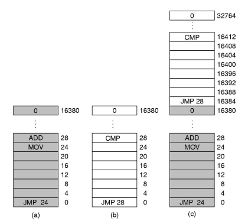
메모리 추상화가 없는 경우 위의 그림과 같은 문제가 발생한다. (a), (b) 둘 다 16KB 크기의 프로그램이다. 
두 프로그램을 연속적으로 적재하여 재배치하게 되면 주소 공간 접근에 문제가 발생한다. (a)의 경우 JMP 24 명령은 24번 주소 공간의 값이 (a)와 (c)가 같기 때문에 문제가 발생하지 않지만, (b)의 경우 JMP 28 명령은 (c)에서의 28번 주소 공간이 다르기 때문에 결과적으로 프로그램이 정상적으로 실행되지 않는다.

이는 절대 물리 주소(absolute physical address)를 사용할 경우의 문제이다.

IBM 360 시스템은 '정적 재배치'라는 기법을 사용하는데, 이는 프로그램이 메모리에 적재될 때 프로그램의 내용을 수정하는 것이다. (c)의 경우 (b)가 재배치될 때 (b)의 모든 명령에 16384를 더하여 정상 실행을 가능하게 한다.
이는 적재하는 시간을 증가시키고 부가적인 정부를 요구하기 때문에 좋은 방법은 아니다.

## Partitioning
여러 프로세스가 동시에 실행할 수 있도록 메인 메모리를 분할하여 프로세스가 요구하는 메모리를 할당해 주는 것
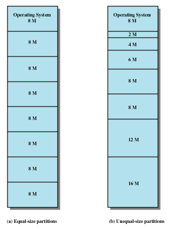
1. Equal-size partitions
- 메인 메모리를 동일한 크기로 n등분 하여 프로세스에 나눠준다. 
- 동적 재배치가 불가능하다면, 목표 프로세스의 할당은 컴파일 시점에 결정된다.
- 일반적으로 적재 시점에 할당이 일어난다.

2. Unequal-size partitions
- 메인 메모리를 각기 다른 크기로 분할하여 프로세스에 나눠준다.
- 각 프로세스를 가능한 가장 작은 공간에 할당하도록 한다.
- 각 할당 공간에는 큐가 있다.
- 만약 동적 재배치가 가능하다면 프로세스들은 메모리 낭비를 최소화하는 방법으로 할당된다.

## Placement with partitioning
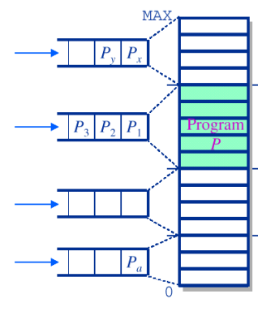
- 물리 메모리는 고정된 크기의 파티션들로 나뉘어진다.
- 프로세스가 시스템에서 동작하려고 하면 프로세스는 파티션에 배정받으며, 만약 동적 재배치가 불가능하면 배정받은 파티션이 이용가능해질 때까지 큐에서 대기한다.
- Internal fragmentation: 파티션에 프로세스가 적재될 경우 프로세스가 차지하고 남은 공간들이 낭비된다.
- Inefficient

## Dynamic Program Relocation
프로그램은 실행시점에 동적으로 재배치된다.
각 프로세스의 주소 공간을 물리 메모리의 서로 다른 공간으로 연속적으로 매핑하는 것이다.
CPU는 base와 limit 이라는 이름의 특별한 하드웨어 레지스터를 사용하는데, base 레지스터에는 프로그램이 적재된 메모리 시작 위치가, limit 레지스터에는 프로그램의 크기가 저장된다. 
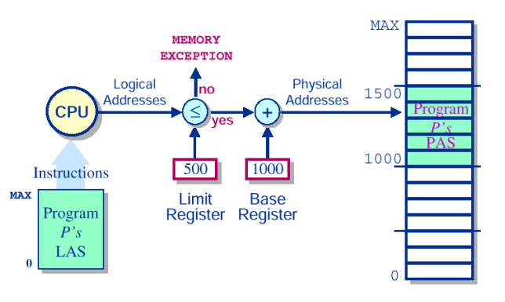
Limit 레지스터보다 적재될 프로세스의 크기가 작으면 Base 레지스터의 값과 더해져서 메인 메모리에 적재된다. 만약 Limit 레지스터보다 큰 경우 Memory Exception을 발생시킨다.
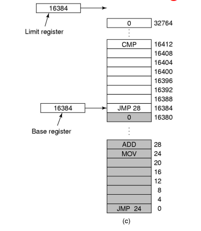
위 그림의 경우 Base 레지스터 값은 16384이고 Limit 레지스터의 값도 16384이다.

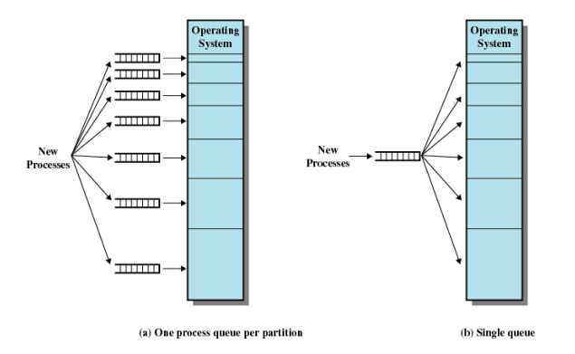
동적 재할당이 없는 경우 프로세스가 각 파티션에 할당될 때 비어있지 않으면 각 파티션의 큐에서 대기해야 한다. 하지만 동적 재할당이 있는 경우 파티션에 상관없이 하나의 큐만 있으면 된다.

## Dynamic Partitioning
- 프로세스는 그때그때 필요한 메모리만큼 할당받는다.
- 프로세스가 할당되고 해제되는 작업이 반복되면 작은 단위의 메모리가 hole처럼 띄엄띄엄 존재하게 되는데, 빈 메모리 공간의 합은 충분히 크지만 실제로 사용할 수 없는 External fragmentation 문제가 발생한다.
- 이를 해결하기 위해 프로세스들을 shift 연산으로 한 곳으로 몰아 남은 빈칸들이 한 블럭이 되게 하는 compaction 기법을 사용한다.

### Dynamic Partitioning Placement Algorithm
memory fragmentation을 막기 위한 할당 방식들이 있다.
1. Best-fit algorithm
- 프로세스의 사이즈와 가장 밀접한 hole에 집어넣는 방식이다
- 알고리즘 중 성능이 가장 나쁘다.
    - 할당할 공간이 없으면 compaction작업을 통해 메모리의 남은 공간을 합치게 되는데 이는 시간이 많이 걸려 합치는 동안 다른 프로그램이 실행할 수 없다.
2. First-fit algorithm
- 메모리를 탐색하여 프로세스가 할당될 수 있는 첫 번째 파티션에 할당한다.
- 가장 빠르다.
- 기본적으로 앞에부터 메모리 할당하므로 search를 계속 앞에서 부터 하면 시간낭비가 생긴다. 
- 메모리 공간 활용력이 떨어진다.
3. Next-fit algorithm
- first-fit의 보완 버전으로, 이전에 메모리 할당을 한 주소부터 search하여 실행할 수 있는 메모리가 있으면 즉시 할당한다.
- 메모리 블럭을 메모리의 끝(가장 큰 블럭이 있는 곳)에 종종 할당한다.
- 메모리 마지막 부분에서 큰 블럭을 얻기 위해 compaction 기법이 종종 요구된다.
4. Worst-fit algorithm
- 메모리 파편을 줄이기 위해 프로세스를 현재 상태에서 가장 큰 메모리 파티션에 할당한다.
- 큰 메모리를 요구하는 프로세스를 실행할 수 없는 경우가 발생한다.

## Solutions for Fragmentation
1. Coalescing
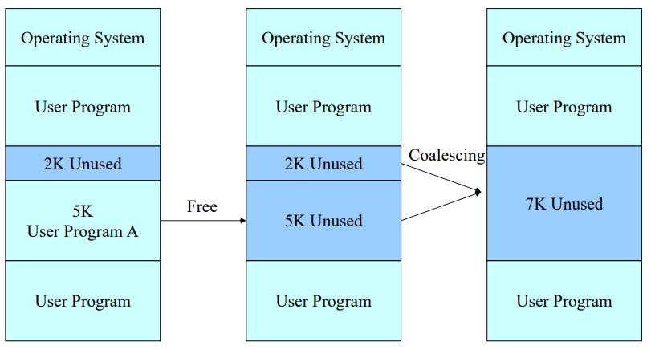
메인 메모리 내에 인접해 있는 memory fragmentation을 하나의 공간으로 통합시킨다.

2. Compaction
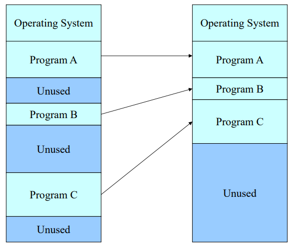
메인 메모리 내에 분산되어 있는 memory fragmentation을 모두 결합하여 하나의 큰 공간을 만드는 작업

### Problems of Compaction
1. Requirement of Compaction
- 동적 프로그램 재배치
2. Problems of Compaction
- 최적의 compaction 알고리즘을 찾기 어렵다.
- compaction 작업 동안 시스템 작업이 중단된다.
3. When to execute Compaction
- 주기적으로
- 메모리 활용도가 lower bound 밑으로 떨어질 때
- 메모리 할당이 실패할 때

## Swapping
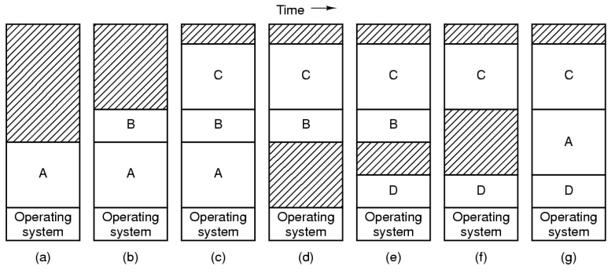
프로세스의 모든 이미지가 메모리로 적재되어 실행되다가 더 이상 실행되지 않을 경우 다시 디스크로 내려 보내는 방법이다.
프로세스는 메모리의 상태에 따라 계속 메모리에 존재하거나 실행할 때만 메모리에 있다가 수면에 들어가면 디스크의 다른 프로세스와 스와핑 된다

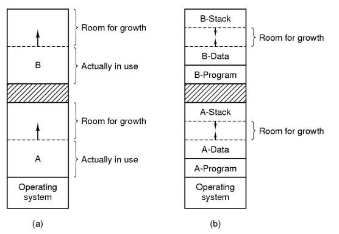
만약 프로세스의 크기가 실행 중에 증가할 것으로 예상된다면 프로세스가 생성되거나 스왑 인 될 때 여분의 빈 공간을 더 할당해 주는 것도 된다.

(a)는 공간 확장을 고려하여 두 프로세스에게 여분의 공간을 더 할당한 예이다. 이때 프로세스를 디스크로 스왑 아웃 한다면 실제 사용하는 메모리 내용만 스왑 아웃 하면 된다.

(b)는 프로세스가 증가될 수 있는 두 세그먼트를 가지는 경우이다. 만약 프로세스가 스택 세그먼트와 데이터 세그먼트(둘 다 증가될 수 있음)를 가지고 있다면 각 프로세스는 할당 받은 메모리 상단에는 스택 세그먼트를, 데이터 세그먼트는 메모리 하단의 프로그램 텍스트 위에 위치 시켜 중간의 메모리 공간으로 증가되도록 한다. 만약 메모리가 부족하다면 다른 여분의 공간이 큰 메모리로 이동하거나 스왑 아웃 되거나 강제 종료된다.

## Overlay
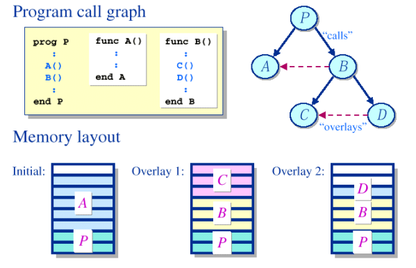
프로그램이 커서 한 번에 내부기억장치에 들어가지 않을 경우나 연산결과를 그대로 다음의 프로그램에 이어받고자 할 경우에 프로그램의 일부를 교체하는 것을 말한다. 오버레이 구조를 취한 프로그램은 서로 배타적인 관계에 있다.

A와 B, C와 D는 오버레이 관계에 있다.

## Memory Management

### Memory Management with Bitmaps
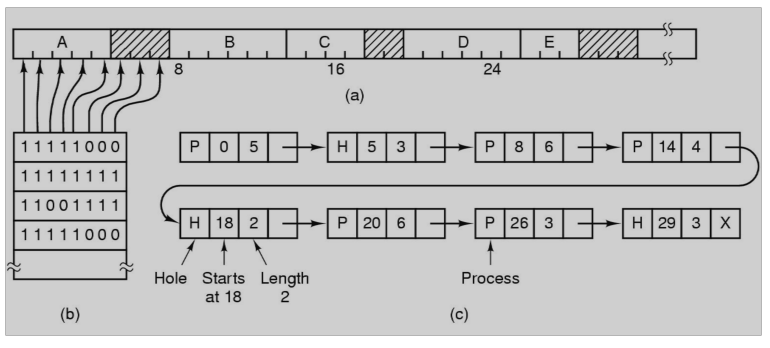
메모리를 여러 개의 할당 단위로 나누어 관리한다. 각 할당 단위마다 비트가 하나씩 대응되는데, 이 비트가 0이면 해당 할당 단위가 가용하고 1이면 이미 사용중이라는 뜻이다.

할당 단위가 커지면 비트맵의 공간이 작아진다.
비트맵의 크기는 메모리 크기와 할당 단위의 크기에 의해 결정된다.

### Memory Management with Linked Lists

리스트의 각 엔트리는 빈 공간(H)이거나 프로세스의 내용(P)을 담고 있음을 나타내는 정보, 시작하는 주소, 길이, 다음 엔트리를 가리키는 포인터로 구성된다.

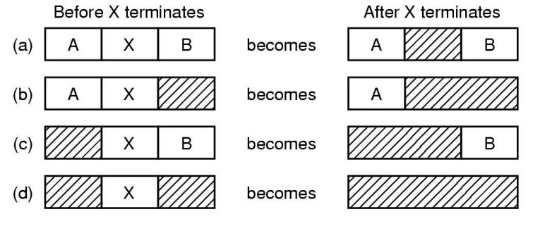
일반적으로 종료되는 프로세스는 2개의 이웃을 갖는다. 위의 그림처럼 4가지 조합이 가능하다.
(a)의 경우 리스트의 변경을 해당 엔트리의 P값을 H로 바꾸기만 하면 된다. 
(b)의 경우 두 개의 엔트리가 하나로 통합되어 전체 리스트에서 엔트리가 하나 줄게 된다.
(d)는 3개의 엔트리가 하나로 통합되며 전체적으로 2개의 엔트리가 줄어든다.

## Virtual Memory
각 프로그램이 자신의 고유한 주소 공간을 가지며 주소 공간은 페이지라고 불리는 조각들로 구성된다.
각 페이지는 연속된 주소를 갖는다.
프로그램이 실행되면 페이지들은 물리 메모리에 매핑되는데 프로그램의 실행을 위해 모든 페이지들이 물리 메모리에 있어야 하는 것은 아니다.

### Paging
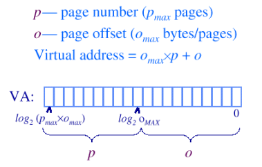
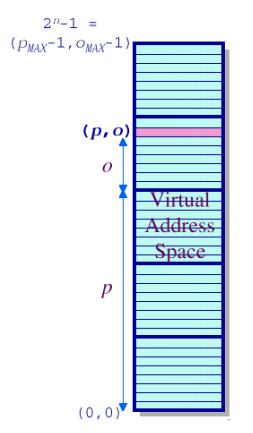
대부분의 가상 메모리는 페이징이라는 기법을 사용한다. 프로그램이 참조하는 주소는 가상 주소라고 불리며 가상 주소 공간을 형성한다. 프로세스의 가상 주소 공간은 페이지라고 불리는 같은 크기의 블럭으로 나누어진다.

가상 주소는 (p, o)의 순서쌍으로 나타낼 수 있는데, p는 페이지 번호이며 o는 오프셋이다. 예를 들어 페이지의 개수가 16개이면 페이지 번호를 위한 비트는 4비트가 되어 p는 최대 4비트가 된다. 페이지의 크기가 4096이면 오프셋을 위해 12비트가 사용된다. 따라서 가상 주소는 16비트의 크기를 갖는다.

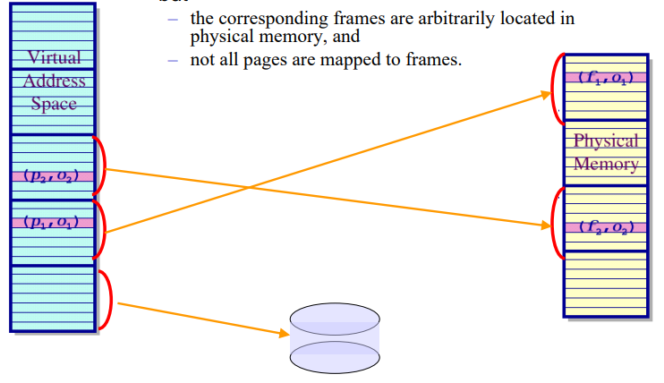
반면, 물리 메모리 상에 대응되는 단위는 페이지 프레임이라고 부른다. 페이지와 페이지 프레임의 크기는 같다. 페이지는 가상 주소 공간에서 연속적이지만 대응되는 프레임은 물리 메모리 상에서는 가변적일 수 있다. 그리고, 모든 페이지가 프레임에 매팽되는 것은 아니다.

### Paging: Virtual address translation
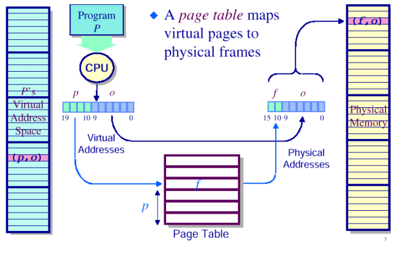
페이지 테이블은 가상 주소 공간의 페이지를 물리 주소의 프레임으로 매핑시킨다. 페이지 테이블은 페이지의 수만큼 엔트리를 갖는다.

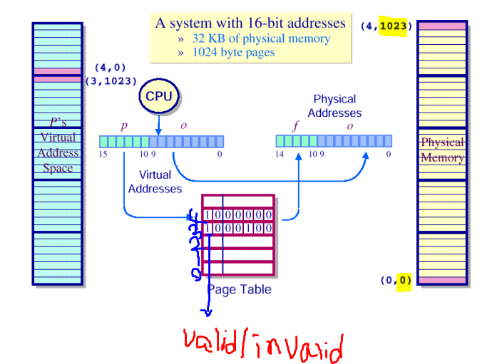
예를 보면 가상 주소 공간의 (4, 0)은 페이지 테이블을 통해 물리 주소 공간의 (0, 0)으로 매핑되었고, (3, 1023)은 (4, 1023)으로 매핑되었다.
가상 주소 공간의 페이지 번호는 페이지 테이블에서 인덱스 번호를 나타낸다.

### Paging: Translation Lookaside Buffer
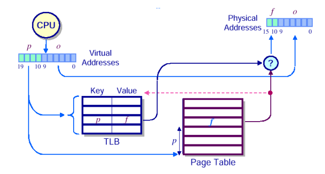
일반적으로 페이지 테이블은 메모리에 유지한다. 페이징을 사용하면 페이지 테이블 참조를 위해 최소한 한 번 이상의 추가적인 메모리 참조가 발생한다. 2번 이상의 메모리 접근은 성능을 저하시킨다.

대부분의 프로그램들은 적은 개수의 페이지들을 집중적으로 참조하는 경향이 있다(= 캐시의 참조 지역성). 이에 페이지 테이블 참조 없이 가상 주소를 물리 주소로 매핑할 수 있는 작은 하드웨어를 사용하도록 하였고 이 하드웨어를 TLB(Translation Lookaside Buffer, 연관 메모리)라고 부른다.
TLB는 MMU 내부에 존재하며 적은 개수의 엔트리를 갖는다.

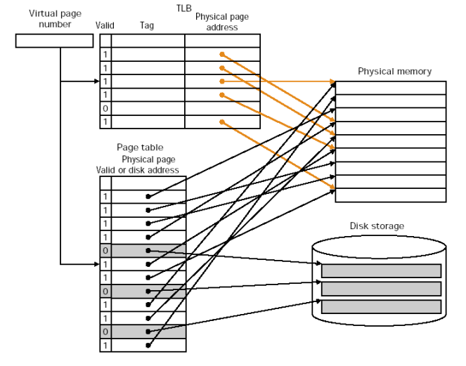
각 엔트리는 한 페이지에 대한 정보를 포함한다.
구체적으로 가상 페이지 번호, 페이지 수정 여부를 나타내는 비트, 보호 코드(읽기/쓰기/실행 허가), 물리 페이지 프레임 번호 등을 포함한다.
각 정보들은 실제 페이지 테이블 엔트리에 저장되어 있는 정보들이다. 페이지 번호는 실제 저장 되어있는 것은 아니며 페이지 테이블 엔트리의 인덱스로 알아낼 수 있다.
TLB 엔트리의 첫 번째 필드는 valid비트이며 엔트리가 유효한지 여부를 나타낸다.

MMU는 주소 변환을 할 때 우선 요청된 가상 페이지 번호가 TLB에 있는지 검색한다. 이 때 모든 엔트리를 동시에 검색한다. 만약 페이지가 존재하고 보호 코드를 위반하지 않는다면 대응되는 페이지 프레임을 사용하여 주소 변환을 실행한다. 이렇게 되면 메모리에 있는 페이지 테이블에 대한 접근은 필요 없다.
**만약 보호 코드를 위반한다면(읽기 전용 페이지인데 쓰기 접근을 한다면) 보호 결함(protection fault)이 발생한다.**

TLB에 참조하는 페이지 번호가 존재하지 않는다면 TLB 미스가 발생한다. 그러면 MMU는 페이지 테이블을 검색하여 해당 페이지 테이블 엔트리를 찾는다. 그리고 TLB 엔트리 중에 하나를 선택하여 그 내용을 교체하고 새로 찾은 페이지 테이블 엔트리 내용을 선택한 TLB 엔트리에 기록한다.
이후 페이지가 다시 참조된다면 이때는 TLB 미스가 아닌 TLB 히트가 발생한다. TLB 엔트리가 교체될 때 수정 비트는 페이지 테이블에 기록한다.

### TLB: MIPS R2000
빈 공간이 아닌 가상 주소가 주어지면 TLB를 병렬로 검색하여 페이지 주소를 프레임 주소로 바꾸고 이를 가지고 캐시에 먼저 접근하여 데이터를 찾는다. 만약 캐시에 없으면 D-RAM으로 가서 찾는다.

### Paging: Protection and Sharing
- Protection: 읽기, 쓰기, 실행 권한을 나타내는 비트이다. 페이지 단위로 있다.
- Sharing: 두 프로세스가 동일한 프레임을 공유하게 한다. 두 프로세스는 데이터를 따로 가지고 있지만 같은 코드를 공유한다면 같은 프레임을 공유한다.

## Virtual Memory - Paging

MMU(Memory Management Unit): 가상 메모리 주소를 물리 메모리 주소로 바꾸는 기능을 한다. CPU가 주소를 만들어내면 MMU회로가 물리 주소로 바꿔서 버스를 통해 메모리에 엑세스한다.

### Structure of Page Table Entry
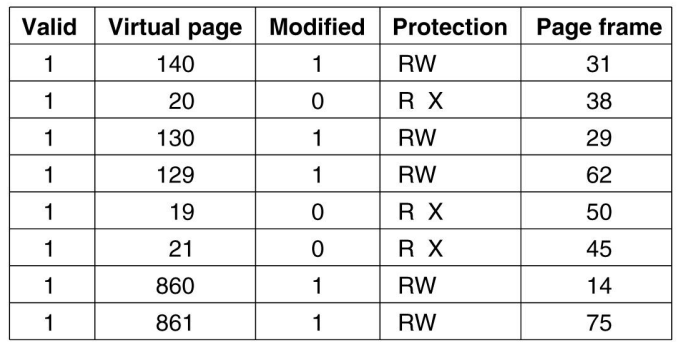
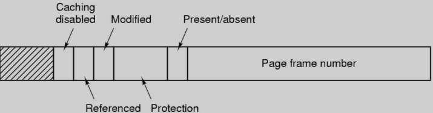
- Protection bit: 어떤 접근이 허용되어 있는지를 표시한다. 읽기, 쓰기, 실행 여부를 표시한다.
- Present/Absent bit: valid/invalid bit이다. 1이면 유효하며 페이지 프레임 번호를 사용할 수 있다.
- Modified bit: 페이지 내용이 변경되면 하드웨어는 자동으로 수정 비트를 1로 설정한다. 수정 비트가 1로 설정되어 있으면(더티 상태라고 한다) 이 페이지 프레임은 교체될 때 그 내용이 디스크에 기록되어야 한다. 0이면 클린 상태라고 한다.
- Reperenced bit: 해당 페이지가 읽기 또는 쓰기로 접근되었을 때 설정된다. 운영체제가 페이지 폴트 처리를 위해 교체할 페이지 프레임을 선택할 때 이용된다. 최근에 사용이 되지 않은 페이지를 교체하는 것이 좋기 때문에 참조 비트가 1이면 최근에 사용이 되었다는 것을 인지하고 교체 대상으로 두지 않는다.
- Caching disabled bit: 해당 페이지가 캐싱될 수 있는지 여부를 가리킨다.

## Speeding Up Paging
- 가상 주소에서 물리 주소로 주소 변환은 빠르게 이루어져야 한다.
- 만일 가상 주소 공간이 커지면 페이지 테이블의 크기도 커진다.

### Problem: Too Large Page Table
1. Multilevel Page Tables
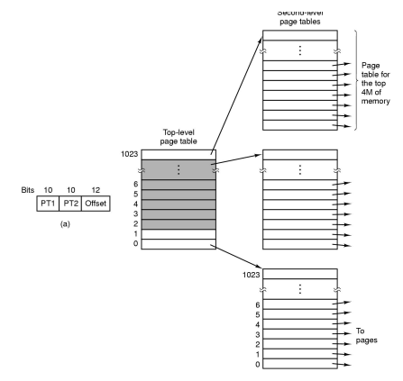
- 모든 페이지 테이블을 항상 메모리에 유지할 필요가 없기 때문에 메모리를 절약할 수 있다. Two-level의 경우 valid bit가 0인 경우 second level 페이지 테이블은 존재할 필요가 없다.

2. Inverted Page Tables
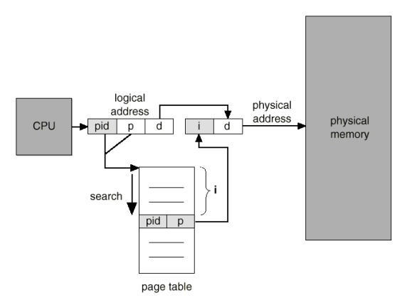
- 가상 주소 공간의 각 페이지마다 엔트리가 하나씩 존재하는 것이 아니라 물리 메모리의 각 페이지 프레임마다 하나의 엔트리가 존재한다.
- 각 엔트리는 각 페이지 프레임에 어떤 프로세스의 페이지가 존재하는지에 대한 정보(프로세스 번호, 페이지 번호)를 유지한다.
- CPU는 pid와 p를 page table에서 찾아서 페이지 프레임 번호(i)를 찾는다. i, offset을 이어 붙인것이 물리 메모리가 된다.
- 페이지 테이블의 크기가 크다는 문제를 해결할 수 있다. 하지만 TLB 미스의 경우 역 페이지 테이블 검색을 해야한다. 이는 가상 주소 기반 해쉬 테이블을 이용하는데, 메모리 상에 존재하는 페이지들 중 같은 해시 값을 같는 페이지들은 체인으로 연결된다. 

## Address Space and OS
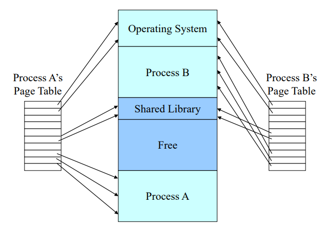
프로세스 페이지 테이블 상단에 운영체제 코드를 가리키는 엔트리가 있다. 

## Page Faults
매핑되지 않은 페이지를 참조하려고 하면 page fault가 발생한다.
page fault가 발생하면 인터럽트를 발생시켜 page fault handler로 점프한다. 운영체제는 새로 진입할 페이지를 위한 공간을 만들기 위해 이미 존재하고 있는 페이지 중에 하나를 내 보내야 한다. 내보낼 페이지가 변경되어 있다면 그 페이지 내용은 디스크로 보내져 기록되어야 한다.
인터럽트 서비스로 부터 복귀하면 다시 페이지를 참조하는 단계부터 시작한다.

> Demand paging: 프로그램 실행 중 필요할 때만 페이지가 적재된다. 접근되지 않은 페이지는 물리 메모리로 적재되지 않는다.

## Virtual Memory Performance
예제)
- Memory access time: 100ns
- Disk access time: 25ms
- Effective access time = 100(1-p) + 25,000,000p
> p: page fault가 발생할 확률

만약 지연율을 10%미만으로 줄이고 싶으면(메모리 액세스 시간이 100ns일 때)
110 > 100 + 25,000,000p이어야 하고 p < 0.0000004이어야 한다.

> 즉, 페이지 교체를 잘 하는게 더 낫다. 기존에 참조된 걸 쫒아냈다가 다시 불러 오는건 너무 비효율적이기 때문

## Page Replacement Algorithms
1. Optimal page replacement algorithm
- 가장 큰 레이블을 갖는 페이지를 교체한다. 즉, 미래에 참조될 페이지 중에 가장 늦게 참조될 것 같은 페이지를 교체한다.
- 즉, 교체에 따른 페이지 폴트의 발생을 가능한 많이 미룬다.
2. Not recently used page replacement
- 각 페이지마다 운영체제가 페이지 사용 정보를 수집할 수 있도록 하기 위한 2개의 상태 비트를 유지한다. 첫 번째 비트는 참조비트이며 보통 R로 표시된다. 두 번째 비트는 변경 비트로 M으로 표시된다.
- 페이지 폴트가 발생하면 운영체제는 R과 M비트의 현재 값에 따라 모든 페이지들을 다음 4가지 카테로기로 구분한다.
    - 클래스 0: Not Referenced, Not Modified
    - 클래스 1: Not Referenced, Modified
    - 클래스 2: Referenced, Not Modified
    - 클래스 3: Referenced, Modified
- 0, 1, 2, 3 순서로 페이지를 교체한다. M = 1이면 교체될 때 디스크에 다시 쓴다.

3. First-In, First-Out page replacement
- 운영체제는 현재 메모리에 존재하는 모든 페이지들을 리스트로 관리한다. 가장 최근에 메모리에 적재된 페이지는 리스트의 끝으로 가고 가장 과거에 적재된 페이지는 리스트의 앞에 존재한다.
- 페이지 폴트가 발생하면 리스트 앞에 있는 페이지가 교체되고 새로운 페이지는 리스트의 가장 뒤에 적재된다.
- 참조가 많이 되는 페이지를 교체할 수 있기 때문에 성능이 안 좋을 수 있다. 간단하긴 하다.
4. Second chance page replacement
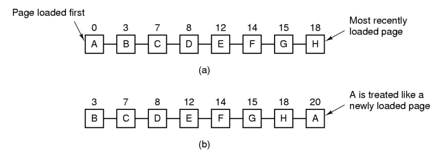
- FIFO가 자주 참조되는 페이지를 교체할 가능성이 있기 때문에 이를 보완한 것이다.
- 페이지의 참조비트를 보고 만약 0이면 처음 적재된 후 참조되지 않았다는 의미이므로 교체한다.
- 페이지의 참조비트가 1이면 최근에 사용된 적이 있다는 뜻이므로 이 페이지를 리스트의 뒤로 옮기고 참조비트를 0으로 클리어하며 적재 시간도 현재 시간으로 갱신한다.
5. Clock page replacement
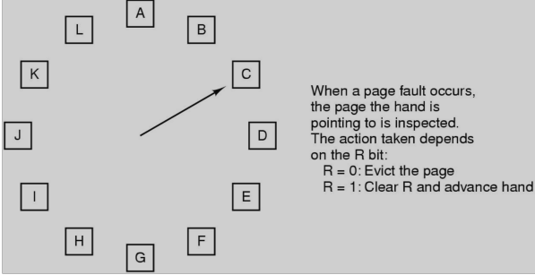
- second chance 알고리즘이 페이지를 리스트에서 이동시켜야 하는 비효율성이 있기 때문에 모든 페이지를 원형 리스트로 관리한다.
- 화살표는 가장 오래된 페이지를 가리킨다.
- 페이지 폴트가 발생하면 화살표가 가리키는 페이지를 검사하여 참조 비트가 0이면 이 페이지를 교체하고 이 위치에 새로운 페이지를 삽입한 뒤 화살표를 다음 페이지를 가리키도록 전진시킨다.
- 참조 비트가 1이면 이 비트는 클리어되고 다음 페이지로 전진한다.
- 이 과정은 참조 비트가 0인 페이지를 찾을 때까지 반복된다.
6. Least recently used page
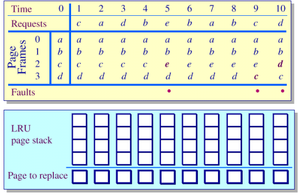

- 반대: MRU(Most Recently Used) page algorithm
- 가장 과거에 참조된 페이지를 교체한다.
- 최근에 참조된 페이지를 스택의 젤 아래에 놓고 스택이 꽉 찼을때는 젤 마지막 페이지를 교체 대상으로 두고 젤 위에 참조된 페이지를 넣는다.
- 페이지 프레임에는 교체된 자리에 새 페이지를 넣는다.
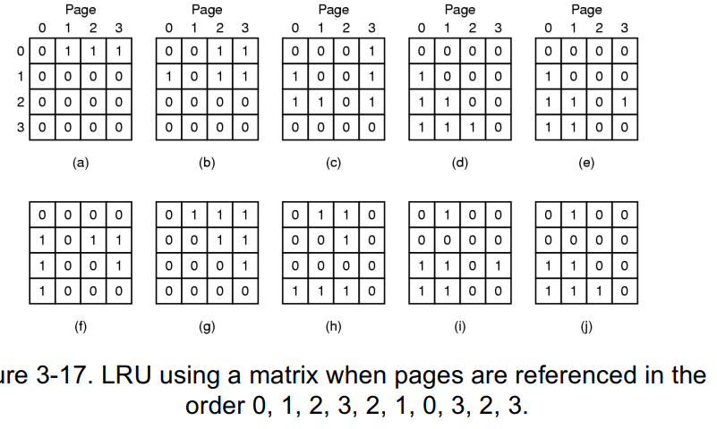
- 페이지 프레임의 수(n)만큼 n x n 비트로 구성된 행렬을 갖는다.
- 페이지가 참조되면 그 페이지에 해당하는 행렬의 행을 모두 1로 바꾼다음에 그 페이지의 행렬의 열을 0으로 모두 바꾼다.
- 가장 최근에 참조된 페이지에 해당하는 행렬의 행의 값의 합이 젤 높고 가장 과거에 참조된 페이지에 해당하는 행렬의 열의 값이 젤 작다.

- 페이지가 참조되면 그 페이지의 리스트의 젤 왼쪽 비트를 1로 설정한다.
- 그 다음 클럭에서 페이지가 참조되면 기존의 리스트의 값을 1비트씩 오른쪽으로 시프트한 후 젤 왼쪽 비트를 1로 하고 참조되지 않은 페이지들은 0을 설정한다.
- 가장 값이 큰 페이지 리스트가 젤 최근에 참조된 것이다.
- 각 페이지가 얼마나 많이 참조되었는지 빈도, 주기도 알 수 있다.

> Optimal page replacement기법이 가장 optimal하다는 것이 증명되었다.
7. Working set page replacement
8. WSClock page replacement
