# Memory Management

## No Memory Abstraction
메모리 추상화를 사용하지 않으면 모든 프로그램은 물리 메모리를 직접 사용해야 한다. 메모리 추상화가 없는 환경에서는 두 개의 프로그램이 동시에 메모리에서 실행될 수 없다. 한 프로그램이 다른 프로그램의 데이터를 변경하는 결과를 야기할 수 있기 때문이다.

물리 메모리를 직접 사양하는 메모리 모델 설계는 다음과 같다.
1. RAM에서 운영체제가 사용자 프로그램보다 아래에 위치하는 경우
2. ROM(Read Only Memory)에 운영체제가 존재하고 그 아래에 사용자 프로그램이 있는 경우
3. ROM에는 장치 드라이버가 존재하고 그 아래에 사용자 프로그램이 있으며 그 아래에 운영체제가 있는 경우

> 1, 3은 사용자 프로그램의 버그가 운영체제에 영향을 줄 수 있기 때문에 안좋다.

사용자가 명령을 입력하면 운영체제는 요청한 명령 프로그램을 디스크에서 메모리에 적재하고 그것을 실행한다. 새로운 명령이 요청되면 기존 프로그램을 덮어쓴다.

메모리 추상화가 없는 시스템에서 병렬성을 획득하는 방법 중에 하나는 여러 개의 스레드를 사용하는 것이다. 하지만 스레드들이 서로 다른 프로그램을 실행할 수 없기 때문에 제한적이다.

## Address Spaces
1. Physical address space
- 하드웨어에 의해 직접 관리된다.
- 주소는 0부터 시작하여 MAXsys까지의 범위를 가진다.

2. Logical address space
- 프로세스가 생각하는 자신의 메모리이다.
- 0부터 시작하여 프로그램 크기만큼의 범위를 가진다.

## Address Generation
Compliation(구축) -> Assembly -> Linking -> Loading

## Multiple Programs Without Memory Abstraction
메모리 추상화가 없는 시스템에서 여러 프로그램을 동시에 실행하기 위해서는 우선 운영체제가 메모리에 존재하던 프로그램 이미지를 디스크에 저장하고 다음에 실행할 프로그램을 메모리로 올려야 한다.
메모리에 한 순간에 하나의 프로그램만 존재하도록 하기만 하면 충돌을 방지할 수 있다.

메모리 추상화가 없는 경우 위의 그림과 같은 문제가 발생한다. (a), (b) 둘 다 16KB 크기의 프로그램이다. 
두 프로그램을 연속적으로 적재하여 재배치하게 되면 주소 공간 접근에 문제가 발생한다. (a)의 경우 JMP 24 명령은 24번 주소 공간의 값이 (a)와 (c)가 같기 때문에 문제가 발생하지 않지만, (b)의 경우 JMP 28 명령은 (c)에서의 28번 주소 공간이 다르기 때문에 결과적으로 프로그램이 정상적으로 실행되지 않는다.

이는 절대 물리 주소(absolute physical address)를 사용할 경우의 문제이다.

IBM 360 시스템은 '정적 재배치'라는 기법을 사용하는데, 이는 프로그램이 메모리에 적재될 때 프로그램의 내용을 수정하는 것이다. (c)의 경우 (b)가 재배치될 때 (b)의 모든 명령에 16384를 더하여 정상 실행을 가능하게 한다.
이는 적재하는 시간을 증가시키고 부가적인 정부를 요구하기 때문에 좋은 방법은 아니다.

## Partitioning
여러 프로세스가 동시에 실행할 수 있도록 메인 메모리를 분할하여 프로세스가 요구하는 메모리를 할당해 주는 것

1. Equal-size partitions
- 메인 메모리를 동일한 크기로 n등분 하여 프로세스에 나눠준다. 
- 동적 재배치가 불가능하다면, 목표 프로세스의 할당은 컴파일 시점에 결정된다.
- 일반적으로 적재 시점에 할당이 일어난다.

2. Unequal-size partitions
- 메인 메모리를 각기 다른 크기로 분할하여 프로세스에 나눠준다.
- 각 프로세스를 가능한 가장 작은 공간에 할당하도록 한다.
- 각 할당 공간에는 큐가 있다.
- 만약 동적 재배치가 가능하다면 프로세스들은 메모리 낭비를 최소화하는 방법으로 할당된다.

## Placement with partitioning

- 물리 메모리는 고정된 크기의 파티션들로 나뉘어진다.
- 프로세스가 시스템에서 동작하려고 하면 프로세스는 파티션에 배정받으며, 만약 동적 재배치가 불가능하면 배정받은 파티션이 이용가능해질 때까지 큐에서 대기한다.
- Internal fragmentation: 파티션에 프로세스가 적재될 경우 프로세스가 차지하고 남은 공간들이 낭비된다.
- Inefficient

## Dynamic Program Relocation
프로그램은 실행시점에 동적으로 재배치된다.
각 프로세스의 주소 공간을 물리 메모리의 서로 다른 공간으로 연속적으로 매핑하는 것이다.
CPU는 base와 limit 이라는 이름의 특별한 하드웨어 레지스터를 사용하는데, base 레지스터에는 프로그램이 적재된 메모리 시작 위치가, limit 레지스터에는 프로그램의 크기가 저장된다. 

Limit 레지스터보다 적재될 프로세스의 크기가 작으면 Base 레지스터의 값과 더해져서 메인 메모리에 적재된다. 만약 Limit 레지스터보다 큰 경우 Memory Exception을 발생시킨다.

위 그림의 경우 Base 레지스터 값은 16384이고 Limit 레지스터의 값도 16384이다.

동적 재할당이 없는 경우 프로세스가 각 파티션에 할당될 때 비어있지 않으면 각 파티션의 큐에서 대기해야 한다. 하지만 동적 재할당이 있는 경우 파티션에 상관없이 하나의 큐만 있으면 된다.

## Dynamic Partitioning
- 프로세스는 그때그때 필요한 메모리만큼 할당받는다.
- 프로세스가 할당되고 해제되는 작업이 반복되면 작은 단위의 메모리가 hole처럼 띄엄띄엄 존재하게 되는데, 빈 메모리 공간의 합은 충분히 크지만 실제로 사용할 수 없는 External fragmentation 문제가 발생한다.
- 이를 해결하기 위해 프로세스들을 shift 연산으로 한 곳으로 몰아 남은 빈칸들이 한 블럭이 되게 하는 compaction 기법을 사용한다.

### Dynamic Partitioning Placement Algorithm
memory fragmentation을 막기 위한 할당 방식들이 있다.
1. Best-fit algorithm
- 프로세스의 사이즈와 가장 밀접한 hole에 집어넣는 방식이다
- 알고리즘 중 성능이 가장 나쁘다.
    - 할당할 공간이 없으면 compaction작업을 통해 메모리의 남은 공간을 합치게 되는데 이는 시간이 많이 걸려 합치는 동안 다른 프로그램이 실행할 수 없다.
2. First-fit algorithm
- 메모리를 탐색하여 프로세스가 할당될 수 있는 첫 번째 파티션에 할당한다.
- 가장 빠르다.
- 기본적으로 앞에부터 메모리 할당하므로 search를 계속 앞에서 부터 하면 시간낭비가 생긴다. 
- 메모리 공간 활용력이 떨어진다.
3. Next-fit algorithm
- first-fit의 보완 버전으로, 이전에 메모리 할당을 한 주소부터 search하여 실행할 수 있는 메모리가 있으면 즉시 할당한다.
- 메모리 블럭을 메모리의 끝(가장 큰 블럭이 있는 곳)에 종종 할당한다.
- 메모리 마지막 부분에서 큰 블럭을 얻기 위해 compaction 기법이 종종 요구된다.
4. Worst-fit algorithm
- 메모리 파편을 줄이기 위해 프로세스를 현재 상태에서 가장 큰 메모리 파티션에 할당한다.
- 큰 메모리를 요구하는 프로세스를 실행할 수 없는 경우가 발생한다.

## Solutions for Fragmentation
1. Coalescing

메인 메모리 내에 인접해 있는 memory fragmentation을 하나의 공간으로 통합시킨다.

2. Compaction

메인 메모리 내에 분산되어 있는 memory fragmentation을 모두 결합하여 하나의 큰 공간을 만드는 작업

### Problems of Compaction
1. Requirement of Compaction
- 동적 프로그램 재배치
2. Problems of Compaction
- 최적의 compaction 알고리즘을 찾기 어렵다.
- compaction 작업 동안 시스템 작업이 중단된다.
3. When to execute Compaction
- 주기적으로
- 메모리 활용도가 lower bound 밑으로 떨어질 때
- 메모리 할당이 실패할 때

## Swapping

프로세스의 모든 이미지가 메모리로 적재되어 실행되다가 더 이상 실행되지 않을 경우 다시 디스크로 내려 보내는 방법이다.
프로세스는 메모리의 상태에 따라 계속 메모리에 존재하거나 실행할 때만 메모리에 있다가 수면에 들어가면 디스크의 다른 프로세스와 스와핑 된다

만약 프로세스의 크기가 실행 중에 증가할 것으로 예상된다면 프로세스가 생성되거나 스왑 인 될 때 여분의 빈 공간을 더 할당해 주는 것도 된다.

(a)는 공간 확장을 고려하여 두 프로세스에게 여분의 공간을 더 할당한 예이다. 이때 프로세스를 디스크로 스왑 아웃 한다면 실제 사용하는 메모리 내용만 스왑 아웃 하면 된다.

(b)는 프로세스가 증가될 수 있는 두 세그먼트를 가지는 경우이다. 만약 프로세스가 스택 세그먼트와 데이터 세그먼트(둘 다 증가될 수 있음)를 가지고 있다면 각 프로세스는 할당 받은 메모리 상단에는 스택 세그먼트를, 데이터 세그먼트는 메모리 하단의 프로그램 텍스트 위에 위치 시켜 중간의 메모리 공간으로 증가되도록 한다. 만약 메모리가 부족하다면 다른 여분의 공간이 큰 메모리로 이동하거나 스왑 아웃 되거나 강제 종료된다.

## Overlay

프로그램이 커서 한 번에 내부기억장치에 들어가지 않을 경우나 연산결과를 그대로 다음의 프로그램에 이어받고자 할 경우에 프로그램의 일부를 교체하는 것을 말한다. 오버레이 구조를 취한 프로그램은 서로 배타적인 관계에 있다.

A와 B, C와 D는 오버레이 관계에 있다.

## Memory Management

### Memory Management with Bitmaps

메모리를 여러 개의 할당 단위로 나누어 관리한다. 각 할당 단위마다 비트가 하나씩 대응되는데, 이 비트가 0이면 해당 할당 단위가 가용하고 1이면 이미 사용중이라는 뜻이다.

할당 단위가 커지면 비트맵의 공간이 작아진다.
비트맵의 크기는 메모리 크기와 할당 단위의 크기에 의해 결정된다.

### Memory Management with Linked Lists

리스트의 각 엔트리는 빈 공간(H)이거나 프로세스의 내용(P)을 담고 있음을 나타내는 정보, 시작하는 주소, 길이, 다음 엔트리를 가리키는 포인터로 구성된다.

일반적으로 종료되는 프로세스는 2개의 이웃을 갖는다. 위의 그림처럼 4가지 조합이 가능하다.
(a)의 경우 리스트의 변경을 해당 엔트리의 P값을 H로 바꾸기만 하면 된다. 
(b)의 경우 두 개의 엔트리가 하나로 통합되어 전체 리스트에서 엔트리가 하나 줄게 된다.
(d)는 3개의 엔트리가 하나로 통합되며 전체적으로 2개의 엔트리가 줄어든다.

## Virtual Memory
각 프로그램이 자신의 고유한 주소 공간을 가지며 주소 공간은 페이지라고 불리는 조각들로 구성된다.
각 페이지는 연속된 주소를 갖는다.
프로그램이 실행되면 페이지들은 물리 메모리에 매핑되는데 프로그램의 실행을 위해 모든 페이지들이 물리 메모리에 있어야 하는 것은 아니다.

### Paging

대부분의 가상 메모리는 페이징이라는 기법을 사용한다. 프로그램이 참조하는 주소는 가상 주소라고 불리며 가상 주소 공간을 형성한다. 프로세스의 가상 주소 공간은 페이지라고 불리는 같은 크기의 블럭으로 나누어진다.

가상 주소는 (p, o)의 순서쌍으로 나타낼 수 있는데, p는 페이지 번호이며 o는 오프셋이다. 예를 들어 페이지의 개수가 16개이면 페이지 번호를 위한 비트는 4비트가 되어 p는 최대 4비트가 된다. 페이지의 크기가 4096이면 오프셋을 위해 12비트가 사용된다. 따라서 가상 주소는 16비트의 크기를 갖는다.

반면, 물리 메모리 상에 대응되는 단위는 페이지 프레임이라고 부른다. 페이지와 페이지 프레임의 크기는 같다. 페이지는 가상 주소 공간에서 연속적이지만 대응되는 프레임은 물리 메모리 상에서는 가변적일 수 있다. 그리고, 모든 페이지가 프레임에 매팽되는 것은 아니다.

### Paging: Virtual address translation

페이지 테이블은 가상 주소 공간의 페이지를 물리 주소의 프레임으로 매핑시킨다. 페이지 테이블은 페이지의 수만큼 엔트리를 갖는다.

예를 보면 가상 주소 공간의 (4, 0)은 페이지 테이블을 통해 물리 주소 공간의 (0, 0)으로 매핑되었고, (3, 1023)은 (4, 1023)으로 매핑되었다.
가상 주소 공간의 페이지 번호는 페이지 테이블에서 인덱스 번호를 나타낸다.

### Paging: Translation Lookaside Buffer

일반적으로 페이지 테이블은 메모리에 유지한다. 페이징을 사용하면 페이지 테이블 참조를 위해 최소한 한 번 이상의 추가적인 메모리 참조가 발생한다. 2번 이상의 메모리 접근은 성능을 저하시킨다.

대부분의 프로그램들은 적은 개수의 페이지들을 집중적으로 참조하는 경향이 있다(= 캐시의 참조 지역성). 이에 페이지 테이블 참조 없이 가상 주소를 물리 주소로 매핑할 수 있는 작은 하드웨어를 사용하도록 하였고 이 하드웨어를 TLB(Translation Lookaside Buffer, 연관 메모리)라고 부른다.
TLB는 MMU 내부에 존재하며 적은 개수의 엔트리를 갖는다.

각 엔트리는 한 페이지에 대한 정보를 포함한다.
구체적으로 가상 페이지 번호, 페이지 수정 여부를 나타내는 비트, 보호 코드(읽기/쓰기/실행 허가), 물리 페이지 프레임 번호 등을 포함한다.
각 정보들은 실제 페이지 테이블 엔트리에 저장되어 있는 정보들이다. 페이지 번호는 실제 저장 되어있는 것은 아니며 페이지 테이블 엔트리의 인덱스로 알아낼 수 있다.
TLB 엔트리의 첫 번째 필드는 valid비트이며 엔트리가 유효한지 여부를 나타낸다.

MMU는 주소 변환을 할 때 우선 요청된 가상 페이지 번호가 TLB에 있는지 검색한다. 이 때 모든 엔트리를 동시에 검색한다. 만약 페이지가 존재하고 보호 코드를 위반하지 않는다면 대응되는 페이지 프레임을 사용하여 주소 변환을 실행한다. 이렇게 되면 메모리에 있는 페이지 테이블에 대한 접근은 필요 없다.
**만약 보호 코드를 위반한다면(읽기 전용 페이지인데 쓰기 접근을 한다면) 보호 결함(protection fault)이 발생한다.**

TLB에 참조하는 페이지 번호가 존재하지 않는다면 TLB 미스가 발생한다. 그러면 MMU는 페이지 테이블을 검색하여 해당 페이지 테이블 엔트리를 찾는다. 그리고 TLB 엔트리 중에 하나를 선택하여 그 내용을 교체하고 새로 찾은 페이지 테이블 엔트리 내용을 선택한 TLB 엔트리에 기록한다.
이후 페이지가 다시 참조된다면 이때는 TLB 미스가 아닌 TLB 히트가 발생한다. TLB 엔트리가 교체될 때 수정 비트는 페이지 테이블에 기록한다.

### TLB: MIPS R2000
빈 공간이 아닌 가상 주소가 주어지면 TLB를 병렬로 검색하여 페이지 주소를 프레임 주소로 바꾸고 이를 가지고 캐시에 먼저 접근하여 데이터를 찾는다. 만약 캐시에 없으면 D-RAM으로 가서 찾는다.

### Paging: Protection and Sharing
- Protection: 읽기, 쓰기, 실행 권한을 나타내는 비트이다. 페이지 단위로 있다.
- Sharing: 두 프로세스가 동일한 프레임을 공유하게 한다. 두 프로세스는 데이터를 따로 가지고 있지만 같은 코드를 공유한다면 같은 프레임을 공유한다.

## Virtual Memory - Paging
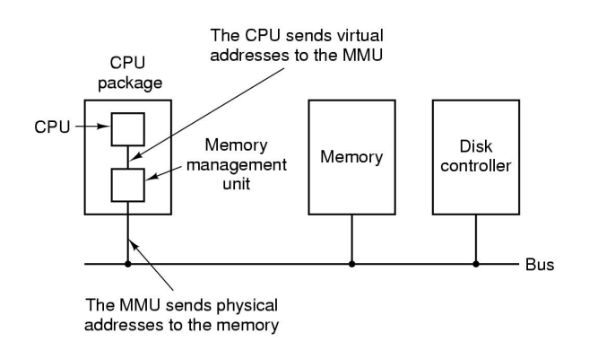
MMU(Memory Management Unit): 가상 메모리 주소를 물리 메모리 주소로 바꾸는 기능을 한다. CPU가 주소를 만들어내면 MMU회로가 물리 주소로 바꿔서 버스를 통해 메모리에 엑세스한다.

### Structure of Page Table Entry

- Protection bit: 어떤 접근이 허용되어 있는지를 표시한다. 읽기, 쓰기, 실행 여부를 표시한다.
- Present/Absent bit: valid/invalid bit이다. 1이면 유효하며 페이지 프레임 번호를 사용할 수 있다.
- Modified bit: 페이지 내용이 변경되면 하드웨어는 자동으로 수정 비트를 1로 설정한다. 수정 비트가 1로 설정되어 있으면(더티 상태라고 한다) 이 페이지 프레임은 교체될 때 그 내용이 디스크에 기록되어야 한다. 0이면 클린 상태라고 한다.
- Reperenced bit: 해당 페이지가 읽기 또는 쓰기로 접근되었을 때 설정된다. 운영체제가 페이지 폴트 처리를 위해 교체할 페이지 프레임을 선택할 때 이용된다. 최근에 사용이 되지 않은 페이지를 교체하는 것이 좋기 때문에 참조 비트가 1이면 최근에 사용이 되었다는 것을 인지하고 교체 대상으로 두지 않는다.
- Caching disabled bit: 해당 페이지가 캐싱될 수 있는지 여부를 가리킨다.

## Speeding Up Paging
- 가상 주소에서 물리 주소로 주소 변환은 빠르게 이루어져야 한다.
- 만일 가상 주소 공간이 커지면 페이지 테이블의 크기도 커진다.

### Problem: Too Large Page Table
1. Multilevel Page Tables

- 모든 페이지 테이블을 항상 메모리에 유지할 필요가 없기 때문에 메모리를 절약할 수 있다. Two-level의 경우 valid bit가 0인 경우 second level 페이지 테이블은 존재할 필요가 없다.

2. Inverted Page Tables

- 가상 주소 공간의 각 페이지마다 엔트리가 하나씩 존재하는 것이 아니라 물리 메모리의 각 페이지 프레임마다 하나의 엔트리가 존재한다.
- 각 엔트리는 각 페이지 프레임에 어떤 프로세스의 페이지가 존재하는지에 대한 정보(프로세스 번호, 페이지 번호)를 유지한다.
- CPU는 pid와 p를 page table에서 찾아서 페이지 프레임 번호(i)를 찾는다. i, offset을 이어 붙인것이 물리 메모리가 된다.
- 페이지 테이블의 크기가 크다는 문제를 해결할 수 있다. 하지만 TLB 미스의 경우 역 페이지 테이블 검색을 해야한다. 이는 가상 주소 기반 해쉬 테이블을 이용하는데, 메모리 상에 존재하는 페이지들 중 같은 해시 값을 같는 페이지들은 체인으로 연결된다. 

## Address Space and OS

프로세스 페이지 테이블 상단에 운영체제 코드를 가리키는 엔트리가 있다. 

## Page Faults
매핑되지 않은 페이지를 참조하려고 하면 page fault가 발생한다.
page fault가 발생하면 인터럽트를 발생시켜 page fault handler로 점프한다. 운영체제는 새로 진입할 페이지를 위한 공간을 만들기 위해 이미 존재하고 있는 페이지 중에 하나를 내 보내야 한다. 내보낼 페이지가 변경되어 있다면 그 페이지 내용은 디스크로 보내져 기록되어야 한다.
인터럽트 서비스로 부터 복귀하면 다시 페이지를 참조하는 단계부터 시작한다.

> Demand paging: 프로그램 실행 중 필요할 때만 페이지가 적재된다. 접근되지 않은 페이지는 물리 메모리로 적재되지 않는다.

## Virtual Memory Performance
예제)
- Memory access time: 100ns
- Disk access time: 25ms
- Effective access time = 100(1-p) + 25,000,000p
> p: page fault가 발생할 확률

만약 지연율을 10%미만으로 줄이고 싶으면(메모리 액세스 시간이 100ns일 때)
110 > 100 + 25,000,000p이어야 하고 p < 0.0000004이어야 한다.

> 즉, 페이지 교체를 잘 하는게 더 낫다. 기존에 참조된 걸 쫒아냈다가 다시 불러 오는건 너무 비효율적이기 때문

## Page Replacement Algorithms
1. Optimal page replacement algorithm
- 가장 큰 레이블을 갖는 페이지를 교체한다. 즉, 미래에 참조될 페이지 중에 가장 늦게 참조될 것 같은 페이지를 교체한다.
- 즉, 교체에 따른 페이지 폴트의 발생을 가능한 많이 미룬다.
2. Not recently used page replacement
- 각 페이지마다 운영체제가 페이지 사용 정보를 수집할 수 있도록 하기 위한 2개의 상태 비트를 유지한다. 첫 번째 비트는 참조비트이며 보통 R로 표시된다. 두 번째 비트는 변경 비트로 M으로 표시된다.
- 페이지 폴트가 발생하면 운영체제는 R과 M비트의 현재 값에 따라 모든 페이지들을 다음 4가지 카테로기로 구분한다.
    - 클래스 0: Not Referenced, Not Modified
    - 클래스 1: Not Referenced, Modified
    - 클래스 2: Referenced, Not Modified
    - 클래스 3: Referenced, Modified
- 0, 1, 2, 3 순서로 페이지를 교체한다. M = 1이면 교체될 때 디스크에 다시 쓴다.

3. First-In, First-Out page replacement
- 운영체제는 현재 메모리에 존재하는 모든 페이지들을 리스트로 관리한다. 가장 최근에 메모리에 적재된 페이지는 리스트의 끝으로 가고 가장 과거에 적재된 페이지는 리스트의 앞에 존재한다.
- 페이지 폴트가 발생하면 리스트 앞에 있는 페이지가 교체되고 새로운 페이지는 리스트의 가장 뒤에 적재된다.
- 참조가 많이 되는 페이지를 교체할 수 있기 때문에 성능이 안 좋을 수 있다. 간단하긴 하다.
4. Second chance page replacement

- FIFO가 자주 참조되는 페이지를 교체할 가능성이 있기 때문에 이를 보완한 것이다.
- 페이지의 참조비트를 보고 만약 0이면 처음 적재된 후 참조되지 않았다는 의미이므로 교체한다.
- 페이지의 참조비트가 1이면 최근에 사용된 적이 있다는 뜻이므로 이 페이지를 리스트의 뒤로 옮기고 참조비트를 0으로 클리어하며 적재 시간도 현재 시간으로 갱신한다.
5. Clock page replacement

- second chance 알고리즘이 페이지를 리스트에서 이동시켜야 하는 비효율성이 있기 때문에 모든 페이지를 원형 리스트로 관리한다.
- 화살표는 가장 오래된 페이지를 가리킨다.
- 페이지 폴트가 발생하면 화살표가 가리키는 페이지를 검사하여 참조 비트가 0이면 이 페이지를 교체하고 이 위치에 새로운 페이지를 삽입한 뒤 화살표를 다음 페이지를 가리키도록 전진시킨다.
- 참조 비트가 1이면 이 비트는 클리어되고 다음 페이지로 전진한다.
- 이 과정은 참조 비트가 0인 페이지를 찾을 때까지 반복된다.
6. Least recently used page

- 반대: MRU(Most Recently Used) page algorithm
- 가장 과거에 참조된 페이지를 교체한다.
- 최근에 참조된 페이지를 스택의 젤 아래에 놓고 스택이 꽉 찼을때는 젤 마지막 페이지를 교체 대상으로 두고 젤 위에 참조된 페이지를 넣는다.
- 페이지 프레임에는 교체된 자리에 새 페이지를 넣는다.

- 페이지 프레임의 수(n)만큼 n x n 비트로 구성된 행렬을 갖는다.
- 페이지가 참조되면 그 페이지에 해당하는 행렬의 행을 모두 1로 바꾼다음에 그 페이지의 행렬의 열을 0으로 모두 바꾼다.
- 가장 최근에 참조된 페이지에 해당하는 행렬의 행의 값의 합이 젤 높고 가장 과거에 참조된 페이지에 해당하는 행렬의 열의 값이 젤 작다.
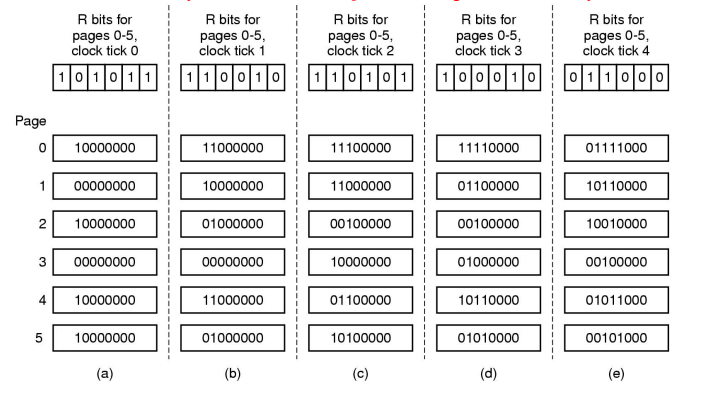
- 페이지가 참조되면 그 페이지의 리스트의 젤 왼쪽 비트를 1로 설정한다.
- 그 다음 클럭에서 페이지가 참조되면 기존의 리스트의 값을 1비트씩 오른쪽으로 시프트한 후 젤 왼쪽 비트를 1로 하고 참조되지 않은 페이지들은 0을 설정한다.
- 가장 값이 큰 페이지 리스트가 젤 최근에 참조된 것이다.
- 각 페이지가 얼마나 많이 참조되었는지 빈도, 주기도 알 수 있다.

> Optimal page replacement기법이 가장 optimal하다는 것이 증명되었다.
7. Working set page replacement
- 프로세스가 현재 자주 참조하는 페이지들의 집합을 작업 집합이라고 한다. 
- 현재 작업 집합이 모두 메모리에 존재하면 프로세스는 다음 실행 단계로 전이하기 전까지는 많은 페이지 폴트를 야기하지 않으며 실행될 수 있다.
- 프로세스가 스케줄링에 의해 디스크에 내려갔다가 다시 시작하면 페이지는 초기화 되어있기 때문에 프로세스는 페이지 폴트를 야기할 것이고 이는 CPU시간의 막대한 낭비이다. 이에 프로세스가 시작하기 전에 필요한 작업 집합을 메모리에 유지시키려고 노력하며 이를 작업 집합 모델이라고 한다.
- 프로세스가 시작하기 전에 페이지를 적재하는 것을 선페이징이라고 한다.
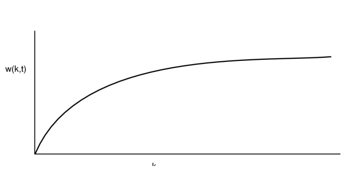
- 현재 시간 t에서 볼 때 지금까지 참조된 페이지 중에서 가장 최근에 참조된 k개의 페이지를 파악할 수 있다. 이 집합 w(t, k)를 작업 집합이라고 한다.
- w(t,k)는 k가 증가함에 따라 그 값이 감소하지 않지만, 주소 공간에 포함된 전체 페이지 이상의 값을 가질 수 없기 때문에 최대 값 또한 제한된다.
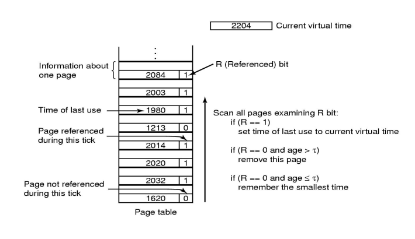
- 우선 각 페이지 테이블 엔트리에서 참조 비트를 검사한다.
- 만약 1이면 현재 가상 시간을 엔트리의 Time of last use 필드에 기록한다.
- 만약 참조 비트가 0이면 이번 클록까지의 간격에 참조되지 않았다는 의미이며 교체의 후보가 된다.
- 참조 비트가 0이면 age(= 현재 시간 - Time of last use)를 확인하며 age가 tau보다 크면 현재 working set에 속하지 않다고 보고 교체한다.
- 만약 age가 tau보다 작으면 여전히 작업 집합에 속해있다는 것이며 이는 교체의 대상이 되지는 않고 유지한다. 대신 가장 큰 나이를 갖는 페이지(가장 작은 Time of last use)를 기억해 둔다.
- 전체 페이지 검사 후 교체할 페이지를 발견하지 못하면 참조 비트가 0인 페이지 중에서 가장 Time of last use가 낮은 페이지를 교체한다.
- 만약 모든 참조 비트가 1이었다면 이들 중에 하나가 임의적으로 교체된다.(수정된 페이지보다는 수정되지 않은 페이지를 교체한다.)
8. WSClock page replacement
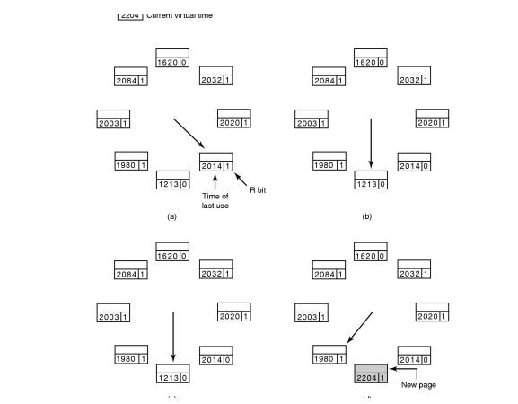
- 페이지 프레임들을 환형 리스트로 관리한다.
- 페이지 폴트가 발생하면 화살표가 가리키는 페이지부터 검사한다.
- R이 1이면 페이지는 최근에 참조되었다는 것이므로 교체의 대상이 되지 않는다. R을 0으로 바꾸고 화살표는 다음 페이지로 전진하여 다시 검사를 계속한다.
- R이 0이면 나이를 검사하여 tau보다 크고 페이지가 수정되지 않았으면 페이지를 교체한다.
- 만약 R이 0인데 나이는 tau보다 크지만 내용이 수정된 상태면 페이지 내용을 우선 디스크에 기록해야 한다.
- 만약 화살표가 시작했던 위치로 다시 돌아오면 다음과 같은 경우가 있다.
    - 최소한 하나의 쓰기가 스케줄링 되어 있는 경우: 화살표를 계속 전진시켜 수정되지 않은 페이지를 찾는다. 하나 이상의 수정된 페이지가 쓰기 스케줄링이 끝나면 클린하게될 것이고 화살표가 이를 발견하면 교체한다.

    - 아무런 쓰기도 스케줄링 되어 있지 않은 경우: 모든 페이지가 작업 집합에 속해있는 경우로 알고리즘은 수정되지 않은 페이지 중에 하나를 교체할 페이지로 선택한다. 모든 페이지가 수정된 경우에는 현재 화살표가 가리키는 페이지를 선택하여 디스크에 쓰고 이것을 교체한다.

## Local vs. Global Page Replacement
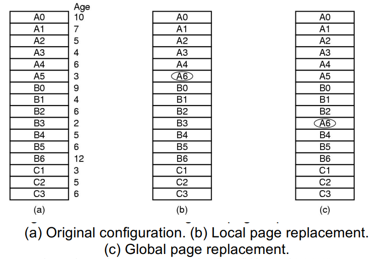
1. Local Page Replacement
- 페이지 폴트를 야기한 프로세스 내부의 페이지들을 대상으로 교체 알고리즘의 기준에 따라 교체한다.
- 각 프로세스에게 고정된 비율의 메모리를 할당할 수 있다는 장점이 있다.
- 작업 집합이 커지면 계속해서 페이지 폴트가 발생하는 스레싱이 일어날 수 있다.
- 작업 집합이 작아지면 메모리 공간을 낭비하는게 된다.
- 프로세스에게 할당된 페이지를 증가시켜야 하는지 감소시켜야 하는지 정보를 제공하는 PFF(Page Fault Frequency) 알고리즘을 이용하여 각 프로세스에게 할당되는 메모리 양을 적절하게 조절해야 한다.
2. Global Page Replacement
- 특정 프로세스를 지정하지 않고 전체 프로세스의 페이지를 대상으로 교체 알고리즘의 기준에 따라 교체한다.
- 실행 중인 프로세스들의 요구에 따라 동적으로 페이지를 할당할 수 있다는 장점이 있다.
- 시간이 지남에 따라 각 프로세스에게 할당된 페이지 프레임 수가 적절하게 변한다.
- 프로세스의 작업 집합이 적재되지 않고 프로세스들이 메모리를 경쟁하게 되면 스레싱이 일어날 수 있다.

### Page Fault Frequency
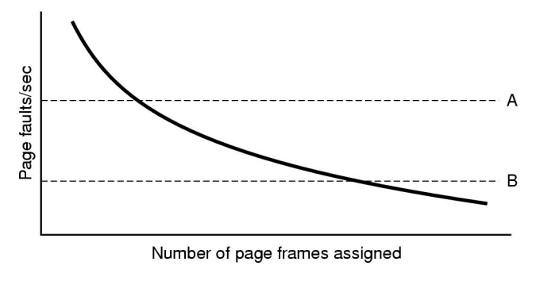
위 그림의 X축은 할당된 페이지 개수, Y축은 페이지 폴트의 발생율이다. 할당된 페이지 개수가 적으면 페이지 폴트가 발생할 확률이 높고 페이지 개수가 많으면 페이지 폴트가 발생할 확률이 낮다. 하지만 페이지 개수가 많으면 메모리 낭비가 발생한다. 따라서 PFF는 A와 B사이의 값을 가지도록 하는 알고리즘이다.

> 스레싱: 프로세스가 메모리에 너무 많이 적재되어서 working set을 다 적재하지 못하고 계속 page fault를 야기해서 작업을 못하는 경우 -> 해결책: Swapping(몇 개의 프로세스를 통채로 스왑 아웃해서 디스크로 내려 보내고 이들이 차지하던 페이지 프레임을 회수하는 것)

## Page Size
페이지 크기는 운영체제가 설정할 수 있는 인자이다.
페이지 크기를 결정하는 데는 여러 가지 요인을 고려해야 한다.
- Internal Fragmentation
- Size of Page Tables
- I/O time for loading each page

페이지 테이블 및 내부 단편화에 의해 발생하는 메모리 부하는 다음과 같다.
$ overhead = se/p + p/2 $
s: 프로세스의 평균 크기
p: 페이지의 크기
s/p: 프로세스마다 필요한 페이지의 개수(페이지 테이블의 개수)
e: 페이지 테이블 엔트리의 크기
p/2: 내부 단편화에 의해 낭비되는 마지막 페이지 공간

낭비되는 공간이 최소가 되어야 하므로 overhead 식을 p에 대하여 미분하면 다음 식이 된다.
$ -se/p^2 + 1/2 = 0 $

따라서 페이지 크기$ p = \sqrt{2se} $일 때 낭비되는 공간이 최소가 된다.

## Separate Instruction and Data Spaces
모든 것을 한 주소 공간에 유지하는 것이 어렵기 때문에 명령어와 데이터를 I-space, D-space라고 불리는 서로 다른 주소 공간에 유지시킨다. 

각 주소 공간은 서로 독립적으로 페이징된다. 각 공간은 서로 다른 페이지 테이블을 가지며 서로 독립적인 매핑 정보를 유지한다. 

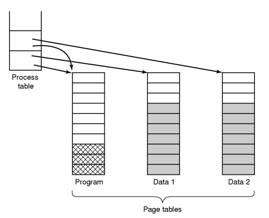
I-space와 D-space를 사용하는 시스템에서는 여러 프로세스들이 I-space를 위한 페이지 테이블만 공유하고 D-space는 서로 다른 페이지 테이블을 사용한다. 그림처럼 프로세스는 2개의 포인터를 가지며 하나는 I-space 페이지 테이블을 다른 하나는 D-space 페이지 테이블을 가리킨다. 

코드를 공유하는 것 외에 데이터를 공유할 수도 있다. UNIX에서는 fork 시스템 호출 이후에 부모와 자식 프로세스가 프로그램의 텍스트와 데이터를 모두 공유한다. 페이징 시스템에서는 각 프로세스에게 서로 다른 페이지 테이블을 할당하고 페이지 테이블의 각 엔트리가 같은 페이지 프레임을 가리키게 하는 방법으로 공유를 구현한다. 따라서 fork를 실행할 때에는 페이지 복사가 발생하지 않는다. 모든 데이터 페이지는 READ ONLY 속성으로 매핑된다.

한 프로세스가 데이터 수정을 시도하면 READ ONLY 속성에 대한 위반이 발생하여 운영체제에 트랩이 걸린다. 이 때 쓰려는 데이터가 저장된 페이지에 대한 복사가 발생하며, 각 프로세스는 자신의 고유한 페이지를 가리키게 된다. 그리고 이 페이지의 속성은 READ-WRITE가 된다. 이제는 쓰기 요청 명령이 허용된다. 즉, 수정되지 않는 페이지는 복사하지 않고 수정되는 페이지만 복사한다. 이를 copy on write라고 한다.

## Shared Libraries
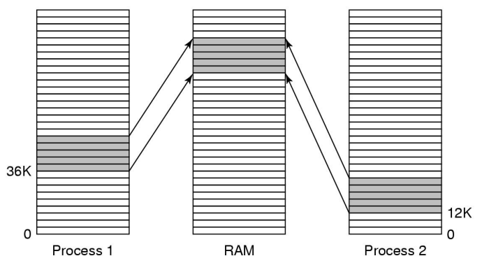
각 프로세스는 공유 라이브러리를 공유할 수 있다. 하지만 라이브러리가 각 프로세스에서 서로 다른 주소 공간에 매핑되는 경우 문제가 발생한다. 이 때 공유 라이브러리가 가상 주소 공간의 어디에 위치하더라도 동작하게 하도록 상대 주소만 사용하는 코드를 사용하는데, 이를 위치 독립 코드(position independent code)라고 한다.

## Memory Mapped File
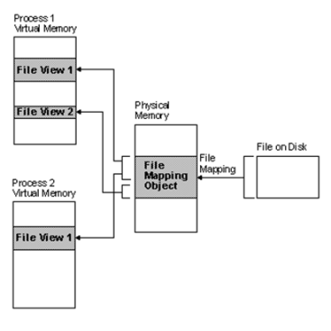
프로세스가 시스템 호출을 이용하여 파일을 자신의 가상 주소 공간에 매핑하는 것을 가능하게 한다.

프로세스의 페이지가 데이터를 사용하려고 하면 디스크에서 파일을 페이지 프레임으로 매핑해온다(demand paging). 그런 다음 각 프로세스는 자신의 페이지 테이블을 이용해서 페이지 프레임에 있는 데이터를 매핑해온다. 이때 mmap을 호출해서 매핑을 시도한다.

## Cleaning Policy
페이지 폴트가 발생했을 때 모든 페이지 프레임이 사용중이라면, 그리고 변경되었다면, 새로운 페이지가 적재되기 전에 기존의 페이지가 디스크에 기록되어야 한다.
운영체제는 충분한 가용 페이지 프레임을 제공하기 위해 항상 빈 프레임을 유지하도록 한다. 주기적으로 메모리의 상태를 검사해서 빈 프레임을 만들어 둔다. -> 페이징 데몬(paging demon)

### Two-Handed Clock
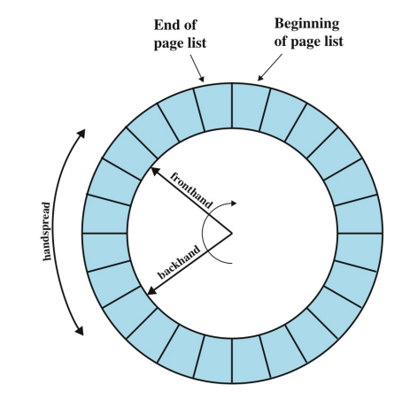
항상 주기적으로 가용한 빈 프레임을 만들어 놓는 방법이다. front hand는 페이징 데몬에 의해 제어되며, 수정된 페이지를 가리키고 있으면 그 페이지는 디스크에 쓰여지고 front hand는 계속 전진한다. 만약 수정되지 않은 페이지면 계속 전진한다.

back hand는 표준 클록 알고리즘이라는 페이지 교체 알고리즘에 의해 제어된다. front hand가 페이지를 계속해서 디스크에 쓰고 있기 때문에 back hand는 수정되지 않은 페이지를 만날 가능성이 높아진다.

## Virtual Memory Interface
- Message Passing
    - 프로세스 간에 메시지를 주고 받는 방법
    1. sender는 메시지를 전송한다.
    2. sender는 메시지를 unmap해도 되고 안해도 된다.
    3. receiver는 주소공간에 message를 매핑한다.

- Distributed Shared Memory
    1. 프로세스가 아직 매핑되어 있지 않은 페이지를 참조하려고 하면 페이지 폴트가 발생한다.
    2. 폴트 핸들러는 참조하려는 페이지를 가지고 있는 기계를 찾아 요청을 보낸다.
    3. 요청을 받은 기계는 자신의 페이지를 unmap하고 네트워크를 통해 요청한 기계에게 보내준다.
    4. 페이지가 도착하면 해당 프로세스의 주소 공간에 매핑하고 중단되었던 명령을 다시 시작한다.

## Page Fault Handling
페이지 폴트를 처리하는 과정
1. 하드웨어는 커널에 트랩을 발생시키고, 프로그램 카운터는 스택에 저장한다.
2. 인터럽트 핸들러는 어셈블리 코드로 실행되며, 이는 범용 레지스터와 휘발성 정보를 저장한다.
3. 운영체제는 페이지 폴트가 발생했음을 인식하고 어떤 가상 주소인지 파악한다.
4. 폴트를 야기한 가상 주소가 파악되면 운영체제는 그 주소가 유효한지 그리고 접근 권한이 있는지를 확인한다.
5. 페이지 프레임의 수정 비트가 1이면 그 내용을 디스크에 쓰기 위한 요청이 스케줄링되고 문맥교환이 일어난다.
6. 페이지 프레임의 상태가 클린이 되면 운영체제는 요청한 페이지가 디스크 어디에 있는지 파악하고, 그 내용을 이 페이지 프레임에 적재하도록 디스크 연산을 스케줄링한다.
7. 디스크 내용이 모두 적재되고 디스크 인터럽트가 발생하면 페이지 테이블이 이 변화를 반영하도록 수정되고 페이지 프레임의 상태가 busy -> normal로 바뀐다.
8. 폴트를 야기한 명령어가 초기 실행되던 상태로 되돌아간다. 프로그램 카운터는 이 명령의 위치를 가리키도록 설정된다.
9. 폴트를 야기한 프로세스가 스케줄링된다. 운영체제는 2단계 어셈블리 루틴으로 복귀한다.
10. 2단계 어셈블리 루틴은 레지스터 및 다른 휘발성 상태 정보를 복구하고 사용자 공간으로 복귀한다.

## Instruction Backup
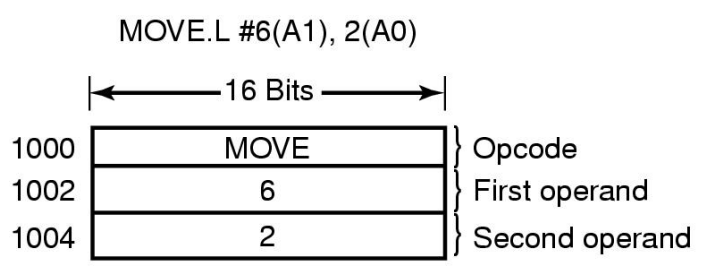
위 명령을 실행하는데도 페이지 폴트가 많이 발생할 수 있다. 명령어 자체를 반입하기 위해 1번, 두 개의 인자를 참조하는데 1번씩 총 3번이다. 

## Page Lock
전역 페이지 교체 알고리즘일 때, I/O 연산을 대기중인 프로세스가 교체되면 I/O 입출력은 충돌이 일어날 수 있다. 이때 physical memory에 있는 페이지에 lock bit를 이용해여 lock을 걸어놓으면 페이지가 교체되지 않는다.

## Separation of Policy and Mechanism
복잡한 시스템을 효과적으로 관리하는 방법 중 하나는 정책과 메커니즘을 분리하는 것이다.
메모리 관리 시스템은 다음의 세 부분으로 구성된다.
1. Low-level MMU 핸들러
2. 커널의 일부분인 페이지 폴트 핸들러
3. 사용자 수준에서 동작하는 외부 페이지 관리자: 정책을 결정하고 변경한다.

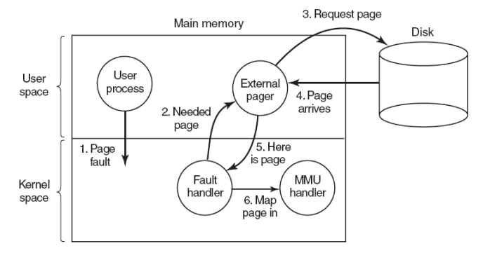
외부 페이저를 이요한 페이지 폴트 처리
1. 페이지 폴트가 발생하면 페이지 폴트 핸들러가 어떤 페이지가 필요한지 외부 페이저에게 알린다.
2. 외부 페이저는 필요한 페이지를 디스크에서 읽어 자신의 주소 공간에 복사한다.
3. 페이지가 어디에 존재하는지 페이지 폴트 핸들러에게 알린다.
4. 페이지 폴트 핸들러는 그 페이지를 외부 페이저의 주소 공간에서 unmap한다.
5. 페이지 폴트를 야기한 사용자 프로세스 주소 공간의 적절한 위치에 매핑해 달라고 MMU 핸들러에게 요청한다.

## Segmentation
컴파일러는 컴파일 도중 다양한 테이블을 생성한다.
1. 소스 텍스트: 출력 리스트를 위해 저장된 프로그램 텍스트(배치 시스템)
2. 심볼 테이블: 변수 이름과 속성을 포함한 테이블
3. 상수 테이블: 사용된 정수형 실수형 상수
4. 파싱 트리: 프로그램의 구문 분석을 위해 사용됨
5. 스택: 컴파일러에서 내부적으로 함수 호출할 때 이용

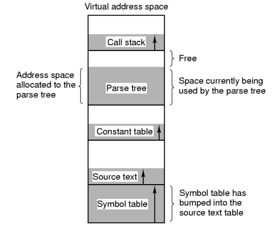
1차원적인 메모리에서는 5개의 테이블이 가상 주소 공간에 연속된 부분으로 할당된다. 
만약 한 프로그램이 매우 많은 변수를 사용하고 그 외에는 다른 프로그램과 유사하다고 가정하자. 그러면 심볼 테이블을 위한 메모리 부분은 가득 차는데 다른 테이블들을 위한 부분들은 여전히 여유공간을 가진다.
이를 위해 시스템은 세그먼트라고 하는 여러 개의 서로 완전히 독립된 주소 공간들을 제공한다. 각 세그먼트는 0부터 시스템에서 허용된 최대 크기까지 값을 갖는 선형 주소로 구성된다. 서로 다른 세그먼트는 서로 다른 크기를 가지며 세그먼트의 크기는 실행 중에 변할 수 있다. 스택의 크기는 새로운 데이터가 추가될 때 증가하며 추가된 데이터가 삭제되면 감소한다.
각 세그먼트가 서로 다른 주소 공간을 구성하기 때문에 한 세그먼트는 다른 세그먼트에 영향을 주지 않고 독립적으로 증가하거나 감소할 수 있다.
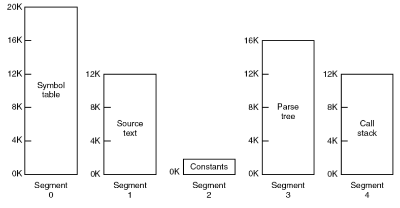
세그먼트를 사용하기 위해서는 프로그램이 사용하는 주소가 두 부분으로 표현되어야 한다. 첫 번째 부분은 세그먼트 번호이며 두 번째 부분은 세그먼트 내부에서의 주소이다.
각 세그먼트는 보통 서로 다른 유형을 함께 포함하는 경우는 드물다.

|고려사항|페이징|세그멘테이션
|--|--|--|
|프로그래머가 이 기술이 사용되는 것을 아는가?|아니오|아니오|
|얼마나 많은 선형 주소를 지원 하는가?|1|다수|
|전체 주소 공간의 크기가 물리 메모리보다 클 수 있는가|예|예|
|함수와 데이터가 구분되고 분리되어 보호 되는가?|예|예|
|크기가 자주 변하는 테이블을 적절하게 지원하는가?|아니오|예|
|공유 지원이 쉽게 구현되는가?|예|예|
|이 기술이 발명된 이유는?|물리메모리를 더 구입하지 않고 더 큰 선형 주소를 제공하기 위해서|프로그램을 논리적인 작은 주소 공간들로 구분하고, 공유/보호하기 위해서|

## Problem of Pure Segmentation: Fragmentation
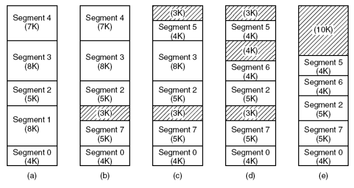
그림과 같이 세그먼트는 가변 크기이기 때문에 세그먼트가 교체되면 세그먼트 사이 빈 공간(fragmentation) 문제가 발생하게 된다. 즉, 메모리 낭비를 초래한다.
(e)는 compaction 기법으로 해결하려고 한 모습이다.

## Segmentation with Paging
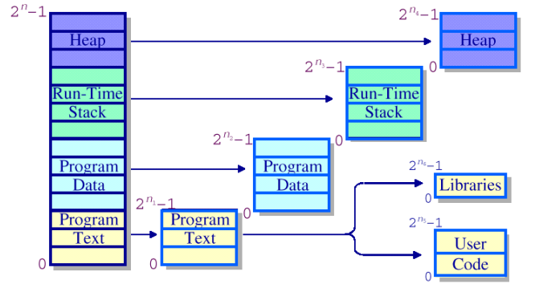
fragmentation 문제를 해결하기 위해 페이징 기법을 약간 도입하였다. 
프로그램을 먼저 몇 개의 세그먼트로 나눈 다음 그 세그먼트를 고정된 크기의 페이지 단위로 쪼갠다.

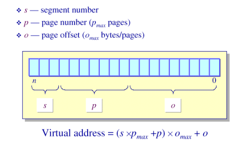
세그먼트를 고정된 크기의 페이지로 나누었기 때문에 각 세그먼트에 있는 페이지의 가상 주소는 위 그림과 같이 정해진다. 이는 다단계 페이지 테이블과 유사한 주소 형식을 가진다.

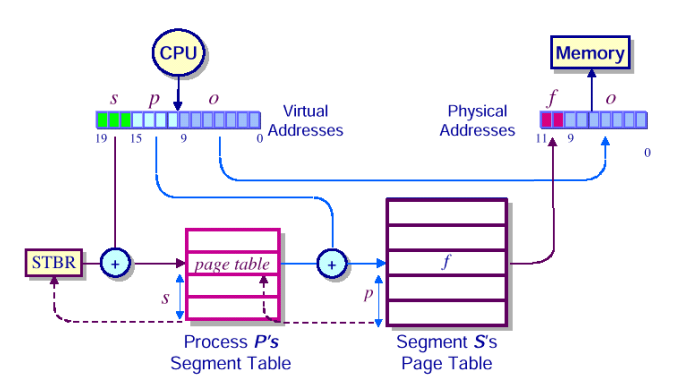
CPU 내에 STBR(Segment Table Base Register)가 있다. s(segment 번호)와 STBR을 더해 세그먼트를 찾고 세그먼트 테이블을 통해 세그먼트의 페이지 테이블을 찾는다.

## Segmentation with Paging: MULTICS
프로세스마다 세그먼트 테이블이 있고 세그먼트 테이블 엔트리는 각 페이지 테이블을 가리킨다.
세그먼트 디스크립터 구조는 다음과 같다.
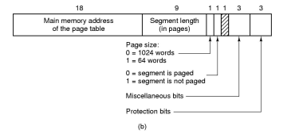

메모리 참조가 일어나면 다음 알고리즘이 실행된다.
1. 세그먼트 번호를 이용하여 세그먼트 디스크립터를 찾는다.
2. 세그먼트가 가리키는 페이지 테이블이 메모리에 있는지 확인한다.
    - 있으면 테이블에 접근하고 없으면 페이지 폴트가 발생한다.
    - 보호 비트를 위반하면 protection fault가 발생한다.
3. 페이지 테이블에서 요청한 가상 페이지에 대응되는 엔트리를 찾는다. 엔트리에 해당 페이지 프레임이 이미 메모리에 있는지 확인한다.
    - 있으면 주소를 가져오고 없으면 페이지 폴트가 발생한다.
4. 페이지 프레임의 주소에 오프셋(페이지 내부 주소)을 더한다. 이것이 물리 주소가 된다.
5. 물리 주소에서 실제 데이터 쓰기 또는 읽기가 실행된다.

이러한 과정이 각 명령어 실행 때마다 처리되려면 오래걸리기 때문에 MULTICS 하드웨어는 16 워드의 고속 TLB를 제공한다. TLB에 저장된 내용은 병렬적으로 동시에 검색된다.
주소가 참조되면 우선 TLB를 검사한다. 주소가 TLB에 있으면 TLB에 있는 페이지 프레임 번호를 이용하여 물리 주소를 바로 계산한다. 즉, 세그먼트 테이블과 페이지 테이블을 참조할 필요가 없다.
TLB에는 가장 최근에 참조한 16개의 페이지에 대한 정보가 기록된다. 

## Segmentation with Paging: The Pentium
