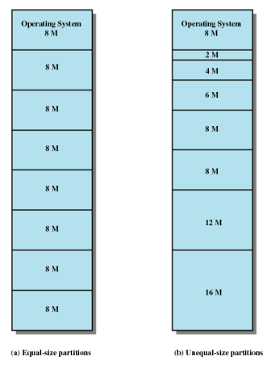
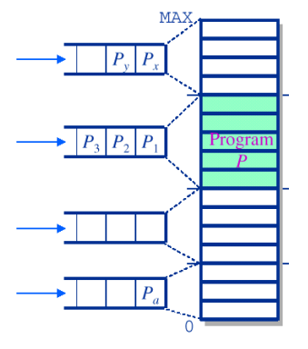
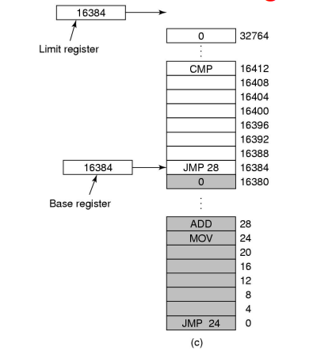

# Memory Management

## No Memory Abstraction
메모리 추상화를 사용하지 않으면 모든 프로그램은 물리 메모리를 직접 사용해야 한다. 메모리 추상화가 없는 환경에서는 두 개의 프로그램이 동시에 메모리에서 실행될 수 없다. 한 프로그램이 다른 프로그램의 데이터를 변경하는 결과를 야기할 수 있기 때문이다.

물리 메모리를 직접 사양하는 메모리 모델 설계는 다음과 같다.
1. RAM에서 운영체제가 사용자 프로그램보다 아래에 위치하는 경우
2. ROM(Read Only Memory)에 운영체제가 존재하고 그 아래에 사용자 프로그램이 있는 경우
3. ROM에는 장치 드라이버가 존재하고 그 아래에 사용자 프로그램이 있으며 그 아래에 운영체제가 있는 경우

> 1, 3은 사용자 프로그램의 버그가 운영체제에 영향을 줄 수 있기 때문에 안좋다.

사용자가 명령을 입력하면 운영체제는 요청한 명령 프로그램을 디스크에서 메모리에 적재하고 그것을 실행한다. 새로운 명령이 요청되면 기존 프로그램을 덮어쓴다.

메모리 추상화가 없는 시스템에서 병렬성을 획득하는 방법 중에 하나는 여러 개의 스레드를 사용하는 것이다. 하지만 스레드들이 서로 다른 프로그램을 실행할 수 없기 때문에 제한적이다.

## Address Spaces
1. Physical address space
- 하드웨어에 의해 직접 관리된다.
- 주소는 0부터 시작하여 MAXsys까지의 범위를 가진다.

2. Logical address space
- 프로세스가 생각하는 자신의 메모리이다.
- 0부터 시작하여 프로그램 크기만큼의 범위를 가진다.

## Address Generation
Compliation(구축) -> Assembly -> Linking -> Loading

## Multiple Programs Without Memory Abstraction
메모리 추상화가 없는 시스템에서 여러 프로그램을 동시에 실행하기 위해서는 우선 운영체제가 메모리에 존재하던 프로그램 이미지를 디스크에 저장하고 다음에 실행할 프로그램을 메모리로 올려야 한다.
메모리에 한 순간에 하나의 프로그램만 존재하도록 하기만 하면 충돌을 방지할 수 있다.

메모리 추상화가 없는 경우 위의 그림과 같은 문제가 발생한다. (a), (b) 둘 다 16KB 크기의 프로그램이다. 
두 프로그램을 연속적으로 적재하여 재배치하게 되면 주소 공간 접근에 문제가 발생한다. (a)의 경우 JMP 24 명령은 24번 주소 공간의 값이 (a)와 (c)가 같기 때문에 문제가 발생하지 않지만, (b)의 경우 JMP 28 명령은 (c)에서의 28번 주소 공간이 다르기 때문에 결과적으로 프로그램이 정상적으로 실행되지 않는다.

이는 절대 물리 주소(absolute physical address)를 사용할 경우의 문제이다.

IBM 360 시스템은 '정적 재배치'라는 기법을 사용하는데, 이는 프로그램이 메모리에 적재될 때 프로그램의 내용을 수정하는 것이다. (c)의 경우 (b)가 재배치될 때 (b)의 모든 명령에 16384를 더하여 정상 실행을 가능하게 한다.
이는 적재하는 시간을 증가시키고 부가적인 정부를 요구하기 때문에 좋은 방법은 아니다.

## Partitioning
여러 프로세스가 동시에 실행할 수 있도록 메인 메모리를 분할하여 프로세스가 요구하는 메모리를 할당해 주는 것

1. Equal-size partitions
- 메인 메모리를 동일한 크기로 n등분 하여 프로세스에 나눠준다. 
- 동적 재배치가 불가능하다면, 목표 프로세스의 할당은 컴파일 시점에 결정된다.
- 일반적으로 적재 시점에 할당이 일어난다.

2. Unequal-size partitions
- 메인 메모리를 각기 다른 크기로 분할하여 프로세스에 나눠준다.
- 각 프로세스를 가능한 가장 작은 공간에 할당하도록 한다.
- 각 할당 공간에는 큐가 있다.
- 만약 동적 재배치가 가능하다면 프로세스들은 메모리 낭비를 최소화하는 방법으로 할당된다.

## Placement with partitioning

- 물리 메모리는 고정된 크기의 파티션들로 나뉘어진다.
- 프로세스가 시스템에서 동작하려고 하면 프로세스는 파티션에 배정받으며, 만약 동적 재배치가 불가능하면 배정받은 파티션이 이용가능해질 때까지 큐에서 대기한다.
- Internal fragmentation: 파티션에 프로세스가 적재될 경우 프로세스가 차지하고 남은 공간들이 낭비된다.
- Inefficient

## Dynamic Program Relocation
프로그램은 실행시점에 동적으로 재배치된다.
각 프로세스의 주소 공간을 물리 메모리의 서로 다른 공간으로 연속적으로 매핑하는 것이다.
CPU는 base와 limit 이라는 이름의 특별한 하드웨어 레지스터를 사용하는데, base 레지스터에는 프로그램이 적재된 메모리 시작 위치가, limit 레지스터에는 프로그램의 크기가 저장된다. 

Limit 레지스터보다 적재될 프로세스의 크기가 작으면 Base 레지스터의 값과 더해져서 메인 메모리에 적재된다. 만약 Limit 레지스터보다 큰 경우 Memory Exception을 발생시킨다.

위 그림의 경우 Base 레지스터 값은 16384이고 Limit 레지스터의 값도 16384이다.

동적 재할당이 없는 경우 프로세스가 각 파티션에 할당될 때 비어있지 않으면 각 파티션의 큐에서 대기해야 한다. 하지만 동적 재할당이 있는 경우 파티션에 상관없이 하나의 큐만 있으면 된다.

## Dynamic Partitioning
- 프로세스는 그때그때 필요한 메모리만큼 할당받는다.
- 프로세스가 할당되고 해제되는 작업이 반복되면 작은 단위의 메모리가 hole처럼 띄엄띄엄 존재하게 되는데, 빈 메모리 공간의 합은 충분히 크지만 실제로 사용할 수 없는 External fragmentation 문제가 발생한다.
- 이를 해결하기 위해 프로세스들을 shift 연산으로 한 곳으로 몰아 남은 빈칸들이 한 블럭이 되게 하는 compaction 기법을 사용한다.

### Dynamic Partitioning Placement Algorithm
memory fragmentation을 막기 위한 할당 방식들이 있다.
1. Best-fit algorithm
- 프로세스의 사이즈와 가장 밀접한 hole에 집어넣는 방식이다
- 알고리즘 중 성능이 가장 나쁘다.
    - 할당할 공간이 없으면 compaction작업을 통해 메모리의 남은 공간을 합치게 되는데 이는 시간이 많이 걸려 합치는 동안 다른 프로그램이 실행할 수 없다.
2. First-fit algorithm
- 메모리를 탐색하여 프로세스가 할당될 수 있는 첫 번째 파티션에 할당한다.
- 가장 빠르다.
- 기본적으로 앞에부터 메모리 할당하므로 search를 계속 앞에서 부터 하면 시간낭비가 생긴다. 
- 메모리 공간 활용력이 떨어진다.
3. Next-fit algorithm
- first-fit의 보완 버전으로, 이전에 메모리 할당을 한 주소부터 search하여 실행할 수 있는 메모리가 있으면 즉시 할당한다.
- 메모리 블럭을 메모리의 끝(가장 큰 블럭이 있는 곳)에 종종 할당한다.
- 메모리 마지막 부분에서 큰 블럭을 얻기 위해 compaction 기법이 종종 요구된다.
4. Worst-fit algorithm
- 메모리 파편을 줄이기 위해 프로세스를 현재 상태에서 가장 큰 메모리 파티션에 할당한다.
- 큰 메모리를 요구하는 프로세스를 실행할 수 없는 경우가 발생한다.
