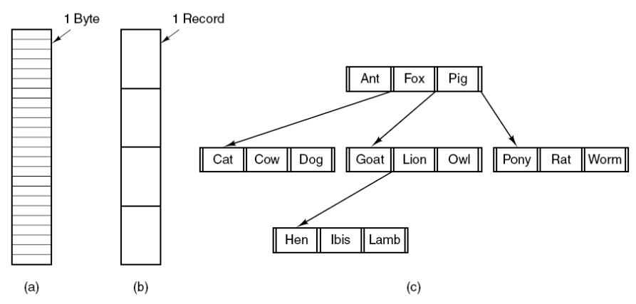
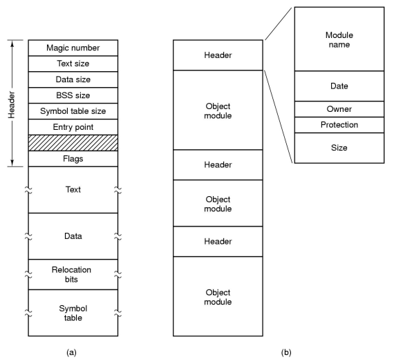
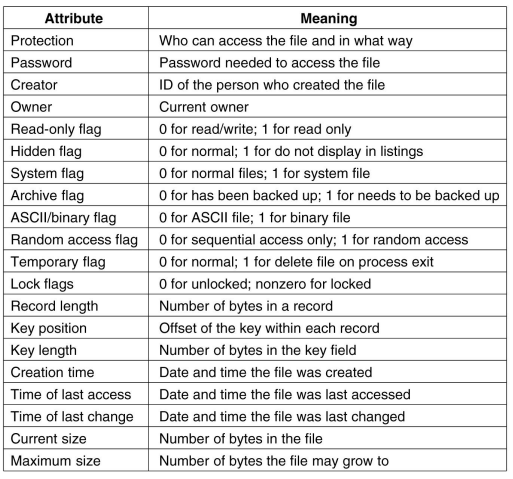

# File Systems
장기 기억 정보 저장소를 위한 세 가지 필수 요구 사항은 다음과 같다.
1. 저장소는 매우 큰 규모의 정보를 저장할 수 있어야 한다.
2. 정보는 그것을 사용하는 프로세스가 종료된 후에도 유지되어야 한다.
3. 다수의 프로세스가 동시에 정보에 접근할 수 있어야 한다.

## File & File System
File
- 프로세스에 의해 생성된 정보의 논리적인 단위
- 저장 장치에 정보를 저장하는 단위
- 바이트 배열로 되어있다.
- 유니크한 경로 이름이 있다. -> 같은 디렉터리에 같은 이름은 없다.
- 하나의 개체/단위로서 다뤄진다.
- 접근 권한을 다룰 수 있다.

File System
사용자와 어플리케이션에게 파일 사용에 대한 서비스를 제공하는 소프트웨어

## File Naming
많은 운영체제는 파일 이름을 마침표를 사용해 두 부분으로 구분하여 마침표 다음에 나오는 부분을 파일 확장자로 부른다.

## File Structure

파일은 여러 가지 형태의 구조를 가질 수 있다.
(a)는 특별한 구조를 가지지 않는 바이트들의 연속이다. 
(b)는 고정된 크기의 레코드들의 연속이며, 각 레코드는 특별한 형태의 내부 구조를 가진다. 읽기 연산은 하나의 레코드를 읽고, 쓰기 연산은 하나의 레코드를 변경하거나 추가한다는 개념이 존재한다.
(c)는 트리 구조로 구성된 레코드들을 가지며 동일한 길이를 가질 필요는 없지만 레코드 내부의 고정된 위치에 키 필드를 가진다.

## File Type

(a)는 UNIX 초기 버전에서 사용했던 단순한 실행 가능한 이진 파일이다. 단지 바이트들의 연속으로, 파일이 (a)와 같은 형태의 포맷을 가지고 있다면 운영체제는 이 파일을 실행할 수 있다.

(b)는 라이브러리 파일(아카이브 파일)이다. 헤더와 오브젝트 모듈이 합쳐진 파일이다.

## File Attributes

## File Access Semantic
Access 형태
1. Sequential Access
    - 프로세스는 파일의 모든 바이트 또는 레코드를 앞부분부터 순차적으로 읽고 쓸 수 있다.
    - 건너 뛰거나 순서를 바꿀 수 없다.

2. Direct(Random) Access: Method 1
    - id = open(file)
    - pread(id, &buf, from, rwbytes)
> 모든 읽기 연산마다 파일 내에서 읽을 위치를 지정한다.
3. Direct(Random) Access: Method 2
    - id = open(file)
    - lseek(id, SEET_SET, from)
    - read(id, &buf, rwbytes)
> seek을 통해 특별한 연산이 현재 위치를 지정한다. seek 실행 후에 이러한 현재 위치부터 파일을 순차적으로 읽게 된다.

## File Sharing
다수의 프로세스가 파일을 열 수 있도록 해야하는가?
- Yes

파일의 데이터를 변경했을 때 언제 프로세스에 영향을 주는가?
- UNIX: 즉시
- Andrew File System: 파일이 닫힌 이후