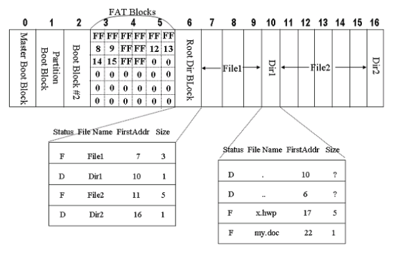

# File Systems
장기 기억 정보 저장소를 위한 세 가지 필수 요구 사항은 다음과 같다.
1. 저장소는 매우 큰 규모의 정보를 저장할 수 있어야 한다.
2. 정보는 그것을 사용하는 프로세스가 종료된 후에도 유지되어야 한다.
3. 다수의 프로세스가 동시에 정보에 접근할 수 있어야 한다.

## File & File System
File
- 프로세스에 의해 생성된 정보의 논리적인 단위
- 저장 장치에 정보를 저장하는 단위
- 바이트 배열로 되어있다.
- 유니크한 경로 이름이 있다. -> 같은 디렉터리에 같은 이름은 없다.
- 하나의 개체/단위로서 다뤄진다.
- 접근 권한을 다룰 수 있다.

File System
사용자와 어플리케이션에게 파일 사용에 대한 서비스를 제공하는 소프트웨어

## File Naming
많은 운영체제는 파일 이름을 마침표를 사용해 두 부분으로 구분하여 마침표 다음에 나오는 부분을 파일 확장자로 부른다.

## File Structure

파일은 여러 가지 형태의 구조를 가질 수 있다.
(a)는 특별한 구조를 가지지 않는 바이트들의 연속이다. 
(b)는 고정된 크기의 레코드들의 연속이며, 각 레코드는 특별한 형태의 내부 구조를 가진다. 읽기 연산은 하나의 레코드를 읽고, 쓰기 연산은 하나의 레코드를 변경하거나 추가한다는 개념이 존재한다.
(c)는 트리 구조로 구성된 레코드들을 가지며 동일한 길이를 가질 필요는 없지만 레코드 내부의 고정된 위치에 키 필드를 가진다.

## File Type

(a)는 UNIX 초기 버전에서 사용했던 단순한 실행 가능한 이진 파일이다. 단지 바이트들의 연속으로, 파일이 (a)와 같은 형태의 포맷을 가지고 있다면 운영체제는 이 파일을 실행할 수 있다.

(b)는 라이브러리 파일(아카이브 파일)이다. 헤더와 오브젝트 모듈이 합쳐진 파일이다.

## File Attributes


## File Access Semantic
Access 형태
1. Sequential Access
    - 프로세스는 파일의 모든 바이트 또는 레코드를 앞부분부터 순차적으로 읽고 쓸 수 있다.
    - 건너 뛰거나 순서를 바꿀 수 없다.

2. Direct(Random) Access: Method 1
    - id = open(file)
    - pread(id, &buf, from, rwbytes)
> 모든 읽기 연산마다 파일 내에서 읽을 위치를 지정한다.
3. Direct(Random) Access: Method 2
    - id = open(file)
    - lseek(id, SEET_SET, from)
    - read(id, &buf, rwbytes)
> seek을 통해 특별한 연산이 현재 위치를 지정한다. seek 실행 후에 이러한 현재 위치부터 파일을 순차적으로 읽게 된다.

## File Sharing
다수의 프로세스가 파일을 열 수 있도록 해야하는가?
- Yes

파일의 데이터를 변경했을 때 언제 프로세스에 영향을 주는가?
(파일이 변경되었다는 것을 프로세스가 언제 알 수 있는가?)
- UNIX: 즉시
- Andrew File System: 파일이 닫힌 이후

## File Operations
- Create: 파일 생성
- Delete: 파일 삭제
- Open: 파일 열기
- Close: 파일 닫기
- Read: 파일 읽기
- Write: 파일 쓰기
- Append: 파일 뒷 부분에 붙여 쓰기
- Seek: read/write offset 변경하기
- Get Attributes: 속성정보 읽어오기
- Set Attributes: 속성정보 설정하기
- Rename: 파일 이름 변경하기

## Example Program Using File System Calls
```C++
/* File copy program. Error checking and reporting is minimal */

#include <sys/types.h>
#include <fcntl.h>
#include <stdlib.h>
#include <unistd.h>

int main(int argc, char *argv[]);

#define BUF_SIZE 4096
#define OUTPUT_MODE 0700

int main(int argc, char *argv[])
{
    int in_fd, out_fd, rd_count, wt_count; 
    char buffer[BUF_SIZE];

    if(argc != 3) exit(1); // argc는 꼭 3이어야 한다.

    /* Open the input file and create the output file */
    in_fd = open(argv[1], O_RDONLY); // argv[1]을 읽기 전용으로 연다. 성공 시 파일 디스크립터를 반환한다.
    if(in_fd < 0) exit(2);
    out_fd = create(argv[2], OUTPUT_MODE); // create 명령어는 argv[2]를 만들어서 open까지 한다. permission bit를 0700으로 설정하여서 소유자만 R/W/E(7)할 수 있도록 한 것이다.
    if(out_fd < 0) exit(3);

    /* Copy loop */
    while(TRUE){
        rd_count = read(in_fd, buffer, BUF_SIZE); // in_fd가 가리키는 파일에서 BUF_SIZE만큼의 데이터를 읽어서 buffer에 저장한다. rd_count가 0이면 끝까지 읽은 것이다. 음수면 에러
        if (rd_count <= 0) break; // 실패시 루프 탈출
        wt_count = write(out_fd, buffer, rd_count); // 읽은 것만큼 buffer로부터 out_fd에 write한다. 
        if (wt_count <= 0) exit(4);
    }

    /* Close the files */
    close(in_fd);
    close(out_fd);
    if(rd_count == 0)
        exit(0);
    else
        exit(5);
}
```

```C++
// argc, argv 부가 설명

// copy a.c b.c라는 명령어가 있다고 가정한다.

int main(int argc, char *argv[])
{
    argc = 3; // argc = 3으로 기본 설정
    agrv[0] = "copy"; // *argv[0]이 "copy"를 가리키게 함
    argv[1] = "a.c";
    argv[2] = "b.c";
}
```

## Directory(Folder)
파일에 대한 정보를 가지고 있는 특별한 파일
- 파일 속성
- 파일 위치
- 파일 소유자

파일 이름과 파일을 매핑시켜주는 역할을 한다.

### Hierarchical Directory System

초기에는 루트 디렉터리밖에 없었다.


관련된 파일들을 서브 트리로 묶은 형태이다.

### Path Names

디렉터리들은 테이블 형태로 되어있다.
path는 유니크 해야한다.

절대 경로: 루트 디렉터리부터의 경로
상대 경로: 현재 작업 디렉터리부터의 경로


DOS and Windows 3.1의 경우에는 8개의 파일 이름, 3개의 확장자로 총 11자가 필요했다.

DOS, Windows는 '.'이 꼭 필요했지만 맥은 필요가 없고 유닉스는 있어도 되고 없어도 됐다.

## Directory Operations
- Create
- Delete
- Opendir
- Closedir
- Readdir
- Rename
- Link: 이름을 하나 더 부여하는 것(같은 파일을 가리킨다.)
- Unlink

## File system Layout

파일 시스템은 디스크상에 존재한다. 대부분의 디스크는 하나 또는 그 이상의 파티션으로 분할되어 사용되며, 각 파티션에는 독립적인 파일 시스템이 존재한다.

디스크의 섹터 0번은 MBR(Master Boot Record)라 불리며 컴퓨터를 부팅하는 용도로 사용된다. 컴퓨터가 켜지면 BIOS는 MBR을 읽어 이를 실행한다. 부트 코드는 partition table을 보고 active한 파티션을 찾아 그 파티션의 부트 블럭(첫 번째 블럭)을 읽어서 실행한다.

partition table은 4개의 영역이 있으며, 나머지 전체 영역을 최대 4개의 영역으로 나눈다. 파티션 테이블에는 각 파티션의 시작, 끝 주소를 가지고 있다.

4개의 파티션 중 하나는 부트 파티션으로 부팅에 사용되는 파티션이다.

슈퍼 블럭은 파일 시스템에서 중요한 인자들을 가지고 있으며, 부팅할 때나 파일 시스템이 처음으로 접근될 때 메모리로 읽혀진다.

free space mgmt는 파일 시스템 내에 있는 프리한 블럭에 대한 정보를 가지고 있다.

i-node는 자료 구조들의 배열로, 파일마다 하나의 i-node자료 구조가 존재하여 파일에 대한 모든 것을 가진다.

## File allocation methods
파일에 데이터 블럭을 할당하는 방법
1. Contiguous allocation

- 각 파일을 연속된 디스크 블럭에 저장하는 방법.
- External fragmentation 문제가 발생할 수 있다.
- CD에서 사용된다.
- 디스크 블록의 크기가 1kb라고 하면 50kb의 파일은 50개의 연속된 블럭이다.
- 파일마다 start block 번호와 length를 가지고 있다. 

2. Chained allocation: non-contiguous allocation

- 디스크 블록들을 연결 리스트 형태로 관리한다.
- 처음 블럭은 파일 이름, start block, length 정보를 가진다.
- 블럭에서 몇 바이트는 다음 블럭을 가리키는 포인터를 저장하기 위해 사용된다. 따라서, 하나의 블럭에 저장되는 데이터 양은 2의 지수 배가 아니다.
- 파일 데이터와 메타 데이터(다음 블럭 데이터)를 함께 기록하는 것은 오버헤드를 발생시킨다.
- 특정 블럭으로 바로 접근할 수 없다.
- 에러가 나면 메타 데이터도 없어진다.


각 블럭에 존재하는 포인터를 메모리 내에 있는 테이블에 저장한 것이다. 이러한 테이블을 FAT(File Allocation Table)이라고 한다.
다음 블럭을 나타내며 0은 미사용 블럭을 뜻한다.
전체 블럭이 하나의 엔트리가 필요한데, 이 테이블이 메모리에 존재해야 하기 때문에 메모리가 부족하다. 
3. Indexed allocation: non-contiguous allocation
index block이 있고 이는 포함하는 블럭을 순서대로 포함하고 있다. 따라서, index block만 보면 포함하는 데이터 블럭을 알 수 있다. index block을 tree 구조로 만들면 용량 문제를 해결할 수 있다.

### Design of UNIX File System

Indexed allocation의 약간의 변형이다.
첫 번째 블럭은 컴퓨터 부팅에 쓰이는 Boot Block이다.
두 번째 블럭은 슈퍼 블럭이다. 슈퍼블럭은 전체 파일시스템에 대한 형상 정보를 가지고 있다.
세 번째는 i-node블럭이다. i-node는 번호로, 파일의 속성과 파일의 디스크 블럭 주소를 가진다. i-node 0, 1번은 안쓰며, 2번은 root 디렉터리이다. i-node는 이름을 가지고 있지는 않다.

그림에서 root 디렉터리는 자신(.)과 부모(..)은 자기 자신이다. 그리고 3, 4, 5, 7에 자식으로 각 파일이 연결되어 있는 것을 볼 수 있다.

디렉터리에는 파일 이름과 i-node가 있으며, 파일 이름을 통해 i-node를 바꾸는 역할을 한다. (i-node 번호를 통해 파일 시스템에서 다른 파일을 찾을 수 있기 때문에)

### UNIX Block Addressing
유닉스에서 i-node에는 최대 10개 까지의 direct 블럭을 할당할 수 있고 추가적으로 3개의 indirect 블럭을 할당할 수 있다. direct 블럭은 데이터 블럭 번호를 포함하고 있지만 indirect 블럭은 index 블럭의 번호를 포함하며 index 블럭을 확인해야 데이터 블럭 번호를 포함하고 있다. indirect 블럭은 single, double, triple indirect 블럭이 있는데 triple indirect 블럭은 double indirect 블럭을 가리키고 double indirect 블럭은 single indirect 블럭을 가리키고 single indirect 블럭은 index 블럭을 가리킨다.

대용량의 파일을 관리할 수 있다는 장점이 있다. 또, random한 접근이 가능하기 때문에 오버헤드가 FAT FILE SYSTEM보다 작다.

### Implementing Directories

FAT File 디렉터리의 엔트리에는 파일의 이름 및 파일의 모든 속성 정보를 포함하고 있다. 하지만 UNIX File 시스템의 디렉터리에는 이름과 i-node번호만 포함하고 있고 i-node가 이름을 제외한 파일의 모든 속성을 포함하고 있다.

현대 운영체제는 더 길고 가변적인 파일 이름을 지원한다. 기존의 방식으로는 위 (a), (b) 기법 중 하나를 사용하여 255글자의 공간을 예약해놓는 방법을 썼는데, 이는 너무 많은 오버헤드를 불러 일으킨다. 이를 해결하기 위해 아래와 같은 형태를 구현하였다.


디렉터리의 엔트리 크기를 가변적으로 설정하였다. (a)는 UNIX 파일 시스템의 구조이다(FAT과 비슷). 첫 번째 블럭은 엔트리 길이, 두 번째는 속성, 세 번째는 이름이다. 이름은 4바이트씩 커진다. 각 파일 이름은 특별한 문자(보통 0)로 끝난다.

(b)는 heap에 모든 파일의 이름을 모아놓고 파일 이름의 포인터가 가리키는 방식이다.

### Directory Entry of FAT File System


## Shared Files
서로 다른 사용자에게 소속된 디렉터리에 공유된 파일이다. 파일은 링크(link)작업을 통해 다른 디렉터리와 파일을 연결할 수 있다.

파일의 소유자 A가 있고 나머지 소유자 B, C가 링크를 걸어서 공유를 하고 있다고 가정하자. A가 파일을 제거하면서 i-node를 같이 제거한다면 B, C는 엉뚱한 파일을 가리키게 된다. 이를 해결하기 위해 바로가기 파일(Symbolic Link File)을 권장한다. 바로가기 파일은 자신이 가리키는 파일의 경로를 가지고 있다.

### Log-Structured File System
디스크 탐색 시간을 줄여 쓰기 작업의 성능을 높이기 위해 설계되었다. 기본 아이디어는 전체 디스크를 로그 형태로 사용하는 것이다. 주기적으로, 메모리에 버퍼링되어 있는 쓰기 요청을 모아 하나의 세그먼트로 구성한 후, 이러한 하나의 연속적인 세그먼트를 디스크의 로그의 끝에 기록한다.
각 세그먼트는 i-node, 디렉터리 엔트리, 데이터 블럭을 포함한다.
i-node는 고정된 위치에 모여있는 것이 아니라 로그 상에서 여기 저기 흩어져 있다.

디스크는 유한하기 때문에 새로운 세그먼트가 쓰이려면 디스크를 비워주어야 한다. 따라서 LFS는 클리너 스레드를 가지고 있다. 클리너는 첫 번째 세그먼트의 요약을 읽어서 어떤 i-node와 파일이 존재하는지 확인하고 i-node 맵을 통해 유효한 블럭을 찾아 다음 세그먼트에 기록한다. 첫 번째 세그먼트는 비워지게 되며 이는 새로운 데이터를 기록하는 로그의 맨 뒷부분으로 사용된다.

i-node map: 모든 i-node의 번호를 가지고 있다. 

### Comparison between LFS and FFS

Unix FFS(Fat File System)은 고정된 위치에 파일이 기록된다. i-node가 있고 i-node는 데이터 블럭을 가리키는 구조이다.
LFS는 디렉터리가 변경되면 i-node가 변경되고, 파일 데이터가 write되면 i-node는 새로 write된다. 변경이 있으면 writing point에서 순차적으로 계속 기록한다.

### Cleaning(Garbage Collection)

LFS는 계속해서 쓰이기 때문에 디스크가 금방 차게 된다. 디스크는 유한하기 때문에 새로운 세그먼트가 쓰이려면 디스크를 비워주어야 한다. 따라서 LFS는 클리너 스레드를 가지고 있다. 클리너는 첫 번째 세그먼트의 요약을 읽어서 어떤 i-node와 파일이 존재하는지 확인하고 i-node 맵을 통해 유효한 블럭을 찾아 다음 세그먼트에 기록한다. 첫 번째 세그먼트는 비워지게 되며 이는 새로운 데이터를 기록하는 로그의 맨 뒷부분으로 사용된다.

### Journaling File System
유닉스에서 파일 삭제 연산은 다음을 요구한다.
1. 파일을 디렉터리에서 삭제
2. I-node를 가용 i-node로 반환
3. 파일이 차지하던 디스크 블록을 가용 디스크 블록으로 반환

만약 위 단계 도중 시스템이 종료되면 더이상 접근할 수 없는 문제가 발생한다. 이를 해결하는 것이 저널링 파일 시스템이다.
위와 같이 단계 도중 시스템 크래쉬가 발생하면 부팅할 때 로그를 보고 당시에 어떤 작업을 실행 중이었는지 파악한 다음 해당 작업을 완료한다.


파일 시스템이 Log Area가 있어서 파일 시스템의 구조를 변경할 때 로그를 남긴다. 구조 변경이 모두 완료되면 로그를 지운다. 만약 변경 도중 시스템 크래쉬가 발생하면 부팅할 때 로그 영역을 보고 다시 실행하거나 롤백한다.

> Fast recovery가 가능하다.

## Virtual File Systems

하나의 운영체제에 여러 파일 시스템을 지원하고자 하였다. UNIX는 다수의 파일 시스템을 하나의 구조로 통합하기 위해 VFS(Virtual File System)을 사용하였다.
모든 파일 시스템의 공동적인 부분은 모아서 virtual file system이랑 계층을 만들고 이 계층에하 하위에 존재하는 파일 시스템의 실제부분을 호출하여 직접 데이터를 조작하는 방식이다.

### Linux VFS

프로세스가 read/write 함수를 호출하면 VFS는 각 파일시스템에 호출한다.

### Determining Block size
파일을 고정된 크기의 블럭으로 나누어 저장하기 때문에 적절한 블럭 크기가 필요하다.

1. Large block size
- 작은 파일의 경우 공간 낭비가 심하다.
- 한 파일을 읽을 때 적은 블럭을 읽기 때문에 성능 면에선 우수하다.
- FAT와 i-node에서 엔트리의 수가 적다. -> 오버헤드가 적다.

2. Small block size
- 한 파일을 여러 블럭으로 나누어 정리한다.
- FAT, i-node의 엔트리가 많이 탐색 시 오버헤드가 크다.

> 디스크에서 적은 수의 큰 파일들이 대부분의 공간을 차지하고 있다.


### Free space management
파일에 할당되지 않은 free 블럭을 관리하는 방법
1. Bit map(bit vector)

- 모든 블럭에 대응되는 비트가 있어 1이면 사용중이고 0이면 비어있는 것이다. 
- free 블럭을 찾기 편하다(특히 연속적일 경우)
- Bit map은 크기가 작아 메모리 낭비가 매우 적다.

2. Linked List

- free 블럭들을 연결 리스트로 연결한다.
- free 블럭을 읽으려면 앞에서 부터 찾아야하기 때문에 오버헤드가 너무 크다.

3. Grouping(indexing)

- index 블럭에 여러 개의 free 블럭들을 넣어 index 블럭들을 서로 연결 리스트로 연결한다.
- 파일시스템이 aging되면 파일의 블럭들이 불연속적으로 흩어져 있어 파일을 읽을 때 큰 오버헤드가 발생한다.


- 블록들의 포인터를 가진 블록 하나만 메모리에 유지하면 된다. 
- free 블럭이 되면 메모리에 있는 index 블럭에 계속해서 쌓는다.
- 블록이 포인터로 가득차면 이 블록은 디스크에 기록된다.
- free 블럭이 파일에 할당되면 메모리에 있는 index 블럭을 먼저 할당하고 다 쓰면 디스크의 index 블럭을 읽어온다.
- 포인터 블럭이 거의 비어있는 상태에서 파일을 생성하고 삭제하는 작업이 계속되면 많은 디스크 I/O가 발생해서 성능이 떨어진다.
- 이를 방지하기 위해 (a)에서 3개의 블럭이 반환되면 (c)처럼 반 정도만 디스크에 저장하고 나머지 반은 메모리에 유지시킴으로써 불필요한 I/O 호출을 줄인다.

## Disk Quotas

각 사용자에게 디스크나 파일의 최대 할당량을 부여하고, 운영체제는 사용자들이 할당량을 초과해서 사용하지 못하도록 한다.
위 그림에서 파일이 할당되다가 Soft block limit에 다다르면 운영체제는 사용자에게 경고 메시지를 보낸다. hard block limit은 절대 한계로 이에 도달하면 더이상 파일을 생성할 수가 없다.

## File system Backups
백업 유형
- Physical Dump
- Logical Dump
    - Complete Dump: 파일 시스템 전체를 백업
    - Incremental Dump: 지난 번 백업 이후 변경된 파일만 백업


Logical Dump: 파일을 순회하면서 필요한 부분만 백업하는 것. 백업할 때 directory 구조도 백업해야 한다.

Logical Dump를 시작하려면 하나 이상의 지정된 디렉터리에서 시작해서 디렉터리를 순환적으로 방문하면서 부모 디렉터리부터 백업한다.
변경된 파일이나 디렉터리를 가리키는 경로상에 존재하는 다른 모든 디렉터리는 변경되지 않았더라도 백업되어야 한다.
하지만 변경된 파일이 아무것도 없을 경우에는 안해도 된다.

덤프 알고리즘은 비트맵을 가지고 있으며 각 파일에 대응되는 비트가 있다. 비트가 1인 경우만 백업한다.

1. 처음에 모든 디렉터리는 비트를 1로 설정한다.
2. 변경된 파일이 존재하지 않는 디렉터리는 비트를 다시 0으로 설정한다.
3. 디렉터리만 먼저 백업한다.
4. 파일을 백업한다.

> 덤프 테이프로부터 파일 시스템을 복구하려면 먼저 디스크에 빈 파일 시스템을 생성한다. 그리고 가장 최근의 완전 덤프를 복구한다. 테이프에서 디렉터리들이 먼저 나타나기 때문에 이들을 먼저 복구하여 파일 시스템의 뼈대를 만든다. 그 다음 파일들이 복구된다. 완전 덤프를 복구한 이후 첫 번째 incremental 덤프부터 시작해서 모든 incremental 덤프를 복구한다.

논리적인 덤프는 다음과 같은 문제가 있다.
1. free 블럭 리스트는 파일이 아니기 때문에 덤프되지 않아 처음부터 다시 구성해야 한다.
2. 파일이 두 개 이상의 디렉터리에 존재하도록 링크되어 있어도 파일은 한 번만 복구되기 때문에 다른 디렉터리에서 이 파일을 가리키도록 링크를 다시 해주어야 한다.
3. UNIX 파일의 경우 중간에 데이터가 기록되어 있지 않은 hole 파일이 생길 수 있다. 덤프를 하게되면 hole 파일에도 중간에 데이터를 채워 놓기 때문에 덤프 후 hole 파일은 매우 큰 파일이 된다.
4. 파이프와 같은 특수 파일은 절대 덤프되어서는 안된다.

## File system consistency
파일을 수정하면 i-node, bitmap 등 여러 가지를 한 번에 변경해야 한다. 변경 도중 시스템 크래쉬에 의해 일부만 변경된다면 일관성이 깨지게 된다.

파일 시스템의 일관성을 회복하는 프로그램이 있다.
UNIX: fsck
Windows: scandisk

Fast recovery of consistency: 저널링 기법


파일 시스템을 디렉토리를 순회하면서 할당된 블럭을 조사한다. 만약 (b)처럼 2번 블럭이 어떤 표시도 되어있지 않은 경우 2번 블럭을 free 블럭으로 표시한다
(c)처럼 free 블럭이 2번 등록되어있는 경우는 free 블럭 비트 하나를 줄인다.
(d)처럼 할당블럭에 2개가 할당되어 있으면 두 파일 중 하나가 삭제되게 된다. 이는 (c)에서 제대로 일관성을 회복하지 않은 채 파일을 할당한 결과이다.

## Increasing file system performance
1. Caching: 버퍼 캐시 or 블럭 캐시

- D-RAM의 일부분을 버퍼 캐시로 사용한다. 파일 시스템에서 파일을 읽어오면 버퍼 캐시에 일단 저장을 한다.
- 메타데이터는 수정이 되면 즉시 쓰여져야 한다.
- 캐시 내에서 빠른 시일 내에 사용되지 않을것 같은 블럭은 LRU 리스트의 맨 앞으로 가게 해서 제빨리 교체되도록 한다.
- 곧 사용될것 같은 블럭은 MRU쪽으로 저장해서 오랫동안 캐시에 머물도록 한다.

2. Read-ahead
- 블럭이 필요하기 전에 미리 캐시로 읽어와서 캐시 적중률을 높인다.
- 만약 파일이 k번 블럭을 파일 시스템에 요청하면, 파일 시스템은 이 요청을 처리한 후, 블럭 k+1이 캐시에 있는지 확인한다. 만약 없으면 이 블럭이 필요로 할 때 캐시에 도착하도록 k+1 블럭의 읽기를 스케줄한다.
- 이러한 전략은 순차적으로 읽는 파일에만 효과가 있다.

3. Reducing disk arm movement
파일 시스템을 살짝 수정하여 성능을 높이고자 했다.

(a)처럼 i-node들을 디스크의 앞 부분에 배치하면 i-node와 데이터 블록 사이의 평균 탐색 거리가 길어지므로 (b)처럼 디스크를 각 실린더 그룹으로 나누고 각 실린더 그룹마다 자신만의 i-node들, 블럭, free 리스트를 가진다. 
4. Disk defragmentation
- 파일들이 연속적이게 되도록 블럭의 위치를 이동시켜 가용 공간이 디스크상에서 연속적인 영역이 되게 한다.

## File System Example
1. The ISO 9660 File System

- CD-ROM 파일 시스템이다.
- 파일의 시작 위치(Location of file)와 파일의 크기(File size)만 가지고 있다.
- 파일 이름 형식도 8.3 형식을 따른다.

1. Rock Ridge Extensions
ISO-9660을 확장한 버전이다.
NM: 대체 이름을 두어 파일이 두 번째 이름을 가질 수 있도록 하였다. 이는 ISO 9660이 제한하는 이름의 길이에 구애받지 않아서 UNIX 파일 이름이 CD-ROM에서 표현될 수 있도록 하였다.

2. Joliet 학장판
- 파일 이름을 64글자로 길게 하였다.
- 파일 이름으로 유니코드 문자 집합을 사용할 수 있게 하였다.
- 디렉터리 깊이에 대한 제한이 제거되었다.
- 디렉터리 이름에 확장자를 넣을 수 있다.

## File Access Control

각 사용자의 파일 접근 권한을 매트릭스로 만들어 관리한다.


- Access Control List: 파일에 대해 사용자의 접근 권한을 리스트로 만든 것이다. 


- Capability List: 사용자 기준으로 나눈 것이다. 파일이 많아지면 리스트가 너무 커진다.

## File System Layout
하드 디스크는 원판으로 되어 있으며 각 트랙은 섹터단위로 쪼개져 있다. 

MS-DOS FAT 파일 시스템이다. 구조는 위 그림과 같다.
MS-DOS는 디스크 당 4개의 파티션을 지원한다.
MS-DOS는 루트 디렉터리의 위치는 고정되어있지만 서브 디렉터리는 위치가 고정되어있지 않다. 


MS-DOS 디렉터리의 엔트리 구조는 위와 같다. 첫 8바이트는 파일 이름, 그 다음 3바이트는 확장자 .. 등과 같다.

FAT 블럭에서 각 엔트리는 처음에 12비트로(FAT-12) 블럭은 2^12개까지 있을 수 있었다(0~4095). 그 다음 16비트(FAT-16)가 나와서 2^16개까지 나올 수 있었다. FAT-16이 지원할 수 있는 가장 큰 디스크 파티션은 2GB이며 각 블럭의 크기는 32KB이었다. 2GB 크기의 파티션 4개를 사용함으로써 지원가능한 가장 큰 디스크는 8GB이다.
FAT-32는 파티션의 크기가 이론적으로 2^28 * 2^15바이트까지 지원할 수 있는데 현질적으로 2TB로 제한하였다. 파일 시스템이 파티션의 크기를 512바이트 섹터 단위로 관리하면서 32비트 숫자를 사용하기 때문에 2^9 * 2^32 = 2TB이기 때문이다.

## The UNIX V7 File System
각 i-node의 크기는 256바이트이다.

## UNIX Access Control
Access Control
- 소유자, 그룹, 기타
- 모든 파일은 자신의 i-node에 접근 제어 비트를 가진다.
- ex) File F: 111 100 100 (rwx rwx rwx)
    - Owner: read, write, execute
    - Group: read
    - Others: read

- 파일을 오픈할 때 접근 제어 비트가 검사된다.


- FFS의 디자인이다.
- 헤드가 움직이면서 seek하는데 가장 오버헤드가 심하다. -> 유사한 실린더를 모아서 실린더 그룹을 만들어서 헤드가 최소한으로 움직이게 하였다.

## Linux Ext 2, 3, 4 File System
- Ext-2 File System
    - 각 실린더 그룹마다 파일 시스템을 구현하였고 저널링 기법을 사용하지 않았따.
- Ext-3 File System
    - 저널링 기법을 도입하였다.
- Ext-4 File System
    - Extent 구조(시작 블럭과 블럭 개수가 함께 엔트리에 적혀있는 구조)로 구현하였다. -> 훨씬 더 많은 블럭들을 연속적으로 i-node에 적을 수 있었다.