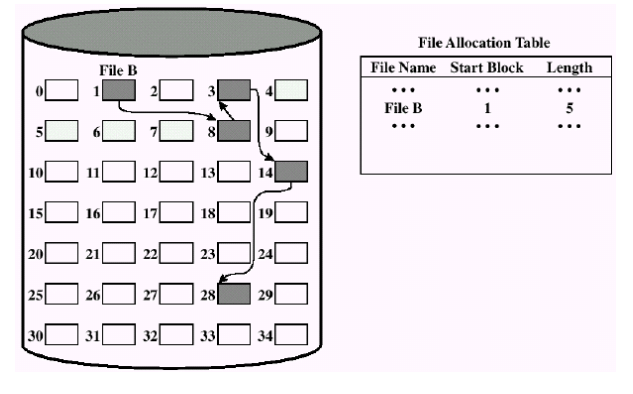

# File Systems
장기 기억 정보 저장소를 위한 세 가지 필수 요구 사항은 다음과 같다.
1. 저장소는 매우 큰 규모의 정보를 저장할 수 있어야 한다.
2. 정보는 그것을 사용하는 프로세스가 종료된 후에도 유지되어야 한다.
3. 다수의 프로세스가 동시에 정보에 접근할 수 있어야 한다.

## File & File System
File
- 프로세스에 의해 생성된 정보의 논리적인 단위
- 저장 장치에 정보를 저장하는 단위
- 바이트 배열로 되어있다.
- 유니크한 경로 이름이 있다. -> 같은 디렉터리에 같은 이름은 없다.
- 하나의 개체/단위로서 다뤄진다.
- 접근 권한을 다룰 수 있다.

File System
사용자와 어플리케이션에게 파일 사용에 대한 서비스를 제공하는 소프트웨어

## File Naming
많은 운영체제는 파일 이름을 마침표를 사용해 두 부분으로 구분하여 마침표 다음에 나오는 부분을 파일 확장자로 부른다.

## File Structure

파일은 여러 가지 형태의 구조를 가질 수 있다.
(a)는 특별한 구조를 가지지 않는 바이트들의 연속이다. 
(b)는 고정된 크기의 레코드들의 연속이며, 각 레코드는 특별한 형태의 내부 구조를 가진다. 읽기 연산은 하나의 레코드를 읽고, 쓰기 연산은 하나의 레코드를 변경하거나 추가한다는 개념이 존재한다.
(c)는 트리 구조로 구성된 레코드들을 가지며 동일한 길이를 가질 필요는 없지만 레코드 내부의 고정된 위치에 키 필드를 가진다.

## File Type

(a)는 UNIX 초기 버전에서 사용했던 단순한 실행 가능한 이진 파일이다. 단지 바이트들의 연속으로, 파일이 (a)와 같은 형태의 포맷을 가지고 있다면 운영체제는 이 파일을 실행할 수 있다.

(b)는 라이브러리 파일(아카이브 파일)이다. 헤더와 오브젝트 모듈이 합쳐진 파일이다.

## File Attributes


## File Access Semantic
Access 형태
1. Sequential Access
    - 프로세스는 파일의 모든 바이트 또는 레코드를 앞부분부터 순차적으로 읽고 쓸 수 있다.
    - 건너 뛰거나 순서를 바꿀 수 없다.

2. Direct(Random) Access: Method 1
    - id = open(file)
    - pread(id, &buf, from, rwbytes)
> 모든 읽기 연산마다 파일 내에서 읽을 위치를 지정한다.
3. Direct(Random) Access: Method 2
    - id = open(file)
    - lseek(id, SEET_SET, from)
    - read(id, &buf, rwbytes)
> seek을 통해 특별한 연산이 현재 위치를 지정한다. seek 실행 후에 이러한 현재 위치부터 파일을 순차적으로 읽게 된다.

## File Sharing
다수의 프로세스가 파일을 열 수 있도록 해야하는가?
- Yes

파일의 데이터를 변경했을 때 언제 프로세스에 영향을 주는가?
(파일이 변경되었다는 것을 프로세스가 언제 알 수 있는가?)
- UNIX: 즉시
- Andrew File System: 파일이 닫힌 이후

## File Operations
- Create: 파일 생성
- Delete: 파일 삭제
- Open: 파일 열기
- Close: 파일 닫기
- Read: 파일 읽기
- Write: 파일 쓰기
- Append: 파일 뒷 부분에 붙여 쓰기
- Seek: read/write offset 변경하기
- Get Attributes: 속성정보 읽어오기
- Set Attributes: 속성정보 설정하기
- Rename: 파일 이름 변경하기

## Example Program Using File System Calls
```C++
/* File copy program. Error checking and reporting is minimal */

#include <sys/types.h>
#include <fcntl.h>
#include <stdlib.h>
#include <unistd.h>

int main(int argc, char *argv[]);

#define BUF_SIZE 4096
#define OUTPUT_MODE 0700

int main(int argc, char *argv[])
{
    int in_fd, out_fd, rd_count, wt_count; 
    char buffer[BUF_SIZE];

    if(argc != 3) exit(1); // argc는 꼭 3이어야 한다.

    /* Open the input file and create the output file */
    in_fd = open(argv[1], O_RDONLY); // argv[1]을 읽기 전용으로 연다. 성공 시 파일 디스크립터를 반환한다.
    if(in_fd < 0) exit(2);
    out_fd = create(argv[2], OUTPUT_MODE); // create 명령어는 argv[2]를 만들어서 open까지 한다. permission bit를 0700으로 설정하여서 소유자만 R/W/E(7)할 수 있도록 한 것이다.
    if(out_fd < 0) exit(3);

    /* Copy loop */
    while(TRUE){
        rd_count = read(in_fd, buffer, BUF_SIZE); // in_fd가 가리키는 파일에서 BUF_SIZE만큼의 데이터를 읽어서 buffer에 저장한다. rd_count가 0이면 끝까지 읽은 것이다. 음수면 에러
        if (rd_count <= 0) break; // 실패시 루프 탈출
        wt_count = write(out_fd, buffer, rd_count); // 읽은 것만큼 buffer로부터 out_fd에 write한다. 
        if (wt_count <= 0) exit(4);
    }

    /* Close the files */
    close(in_fd);
    close(out_fd);
    if(rd_count == 0)
        exit(0);
    else
        exit(5);
}
```

```C++
// argc, argv 부가 설명

// copy a.c b.c라는 명령어가 있다고 가정한다.

int main(int argc, char *argv[])
{
    argc = 3; // argc = 3으로 기본 설정
    agrv[0] = "copy"; // *argv[0]이 "copy"를 가리키게 함
    argv[1] = "a.c";
    argv[2] = "b.c";
}
```

## Directory(Folder)
파일에 대한 정보를 가지고 있는 특별한 파일
- 파일 속성
- 파일 위치
- 파일 소유자

파일 이름과 파일을 매핑시켜주는 역할을 한다.

### Hierarchical Directory System

초기에는 루트 디렉터리밖에 없었다.


관련된 파일들을 서브 트리로 묶은 형태이다.

### Path Names

디렉터리들은 테이블 형태로 되어있다.
path는 유니크 해야한다.

절대 경로: 루트 디렉터리부터의 경로
상대 경로: 현재 작업 디렉터리부터의 경로


DOS and Windows 3.1의 경우에는 8개의 파일 이름, 3개의 확장자로 총 11자가 필요했다.

DOS, Windows는 '.'이 꼭 필요했지만 맥은 필요가 없고 유닉스는 있어도 되고 없어도 됐다.

## Directory Operations
- Create
- Delete
- Opendir
- Closedir
- Readdir
- Rename
- Link: 이름을 하나 더 부여하는 것(같은 파일을 가리킨다.)
- Unlink

## File system Layout

파일 시스템은 디스크상에 존재한다. 대부분의 디스크는 하나 또는 그 이상의 파티션으로 분할되어 사용되며, 각 파티션에는 독립적인 파일 시스템이 존재한다.

디스크의 섹터 0번은 MBR(Master Boot Record)라 불리며 컴퓨터를 부팅하는 용도로 사용된다. 컴퓨터가 켜지면 BIOS는 MBR을 읽어 이를 실행한다. 부트 코드는 partition table을 보고 active한 파티션을 찾아 그 파티션의 부트 블럭(첫 번째 블럭)을 읽어서 실행한다.

partition table은 4개의 영역이 있으며, 나머지 전체 영역을 최대 4개의 영역으로 나눈다. 파티션 테이블에는 각 파티션의 시작, 끝 주소를 가지고 있다.

4개의 파티션 중 하나는 부트 파티션으로 부팅에 사용되는 파티션이다.

슈퍼 블럭은 파일 시스템에서 중요한 인자들을 가지고 있으며, 부팅할 때나 파일 시스템이 처음으로 접근될 때 메모리로 읽혀진다.

free space mgmt는 파일 시스템 내에 있는 프리한 블럭에 대한 정보를 가지고 있다.

i-node는 자료 구조들의 배열로, 파일마다 하나의 i-node자료 구조가 존재하여 파일에 대한 모든 것을 가진다.

## File allocation methods
파일에 데이터 블럭을 할당하는 방법
1. Contiguous allocation

- 각 파일을 연속된 디스크 블럭에 저장하는 방법.
- External fragmentation 문제가 발생할 수 있다.
- CD에서 사용된다.
- 디스크 블록의 크기가 1kb라고 하면 50kb의 파일은 50개의 연속된 블럭이다.
- 파일마다 start block 번호와 length를 가지고 있다. 

2. Chained allocation: non-contiguous allocation

- 디스크 블록들을 연결 리스트 형태로 관리한다.
- 처음 블럭은 파일 이름, start block, length 정보를 가진다.
- 블럭에서 몇 바이트는 다음 블럭을 가리키는 포인터를 저장하기 위해 사용된다. 따라서, 하나의 블럭에 저장되는 데이터 양은 2의 지수 배가 아니다.
- 파일 데이터와 메타 데이터(다음 블럭 데이터)를 함께 기록하는 것은 오버헤드를 발생시킨다.
- 특정 블럭으로 바로 접근할 수 없다.
- 에러가 나면 메타 데이터도 없어진다.


각 블럭에 존재하는 포인터를 메모리 내에 있는 테이블에 저장한 것이다. 이러한 테이블을 FAT(File Allocation Table)이라고 한다.
다음 블럭을 나타내며 0은 미사용 블럭을 뜻한다.
전체 블럭이 하나의 엔트리가 필요한데, 이 테이블이 메모리에 존재해야 하기 때문에 메모리가 부족하다. 
3. Indexed allocation: non-contiguous allocation
index block이 있고 이는 포함하는 블럭을 순서대로 포함하고 있다. 따라서, index block만 보면 포함하는 데이터 블럭을 알 수 있다. index block을 tree 구조로 만들면 용량 문제를 해결할 수 있다.

### Design of UNIX File System

Indexed allocation의 약간의 변형이다.
첫 번째 블럭은 컴퓨터 부팅에 쓰이는 Boot Block이다.
두 번째 블럭은 슈퍼 블럭이다. 슈퍼블럭은 전체 파일시스템에 대한 형상 정보를 가지고 있다.
세 번째는 i-node블럭이다. i-node는 번호로, 파일의 속성과 파일의 디스크 블럭 주소를 가진다. i-node 0, 1번은 안쓰며, 2번은 root 디렉터리이다. i-node는 이름을 가지고 있지는 않다.

그림에서 root 디렉터리는 자신(.)과 부모(..)은 자기 자신이다. 그리고 3, 4, 5, 7에 자식으로 각 파일이 연결되어 있는 것을 볼 수 있다.

디렉터리에는 파일 이름과 i-node가 있으며, 파일 이름을 통해 i-node를 바꾸는 역할을 한다. (i-node 번호를 통해 파일 시스템에서 다른 파일을 찾을 수 있기 때문에)

### UNIX Block Addressing
유닉스에서 i-node에는 최대 10개 까지의 direct 블럭을 할당할 수 있고 추가적으로 3개의 indirect 블럭을 할당할 수 있다. direct 블럭은 데이터 블럭 번호를 포함하고 있지만 indirect 블럭은 index 블럭의 번호를 포함하며 index 블럭을 확인해야 데이터 블럭 번호를 포함하고 있다. indirect 블럭은 single, double, triple indirect 블럭이 있는데 triple indirect 블럭은 double indirect 블럭을 가리키고 double indirect 블럭은 single indirect 블럭을 가리키고 single indirect 블럭은 index 블럭을 가리킨다.

대용량의 파일을 관리할 수 있다는 장점이 있다. 또, random한 접근이 가능하기 때문에 오버헤드가 FAT FILE SYSTEM보다 작다.

### Implementing Directories

FAT File 디렉터리의 엔트리에는 파일의 이름 및 파일의 모든 속성 정보를 포함하고 있다. 하지만 UNIX File 시스템의 디렉터리에는 이름과 i-node번호만 포함하고 있고 i-node가 이름을 제외한 파일의 모든 속성을 포함하고 있다.

현대 운영체제는 더 길고 가변적인 파일 이름을 지원한다. 기존의 방식으로는 위 (a), (b) 기법 중 하나를 사용하여 255글자의 공간을 예약해놓는 방법을 썼는데, 이는 너무 많은 오버헤드를 불러 일으킨다. 이를 해결하기 위해 아래와 같은 형태를 구현하였다.


디렉터리의 엔트리 크기를 가변적으로 설정하였다. (a)는 UNIX 파일 시스템의 구조이다(FAT과 비슷). 첫 번째 블럭은 엔트리 길이, 두 번째는 속성, 세 번째는 이름이다. 이름은 4바이트씩 커진다. 각 파일 이름은 특별한 문자(보통 0)로 끝난다.

(b)는 heap에 모든 파일의 이름을 모아놓고 파일 이름의 포인터가 가리키는 방식이다.

### Directory Entry of FAT File System


## Shared Files
서로 다른 사용자에게 소속된 디렉터리에 공유된 파일이다. 파일은 링크(link)작업을 통해 다른 디렉터리와 파일을 연결할 수 있다.

파일의 소유자 A가 있고 나머지 소유자 B, C가 링크를 걸어서 공유를 하고 있다고 가정하자. A가 파일을 제거하면서 i-node를 같이 제거한다면 B, C는 엉뚱한 파일을 가리키게 된다. 이를 해결하기 위해 바로가기 파일(Symbolic Link File)을 권장한다. 바로가기 파일은 자신이 가리키는 파일의 경로를 가지고 있다.

### Log-Structured File System
디스크 탐색 시간을 줄여 쓰기 작업의 성능을 높이기 위해 설계되었다. 기본 아이디어는 전체 디스크를 로그 형태로 사용하는 것이다. 주기적으로, 메모리에 버퍼링되어 있는 쓰기 요청을 모아 하나의 세그먼트로 구성한 후, 이러한 하나의 연속적인 세그먼트를 디스크의 로그의 끝에 기록한다.
각 세그먼트는 i-node, 디렉터리 엔트리, 데이터 블럭을 포함한다.
i-node는 고정된 위치에 모여있는 것이 아니라 로그 상에서 여기 저기 흩어져 있다.

디스크는 유한하기 때문에 새로운 세그먼트가 쓰이려면 디스크를 비워주어야 한다. 따라서 LFS는 클리너 스레드를 가지고 있다. 클리너는 첫 번째 세그먼트의 요약을 읽어서 어떤 i-node와 파일이 존재하는지 확인하고 i-node 맵을 통해 유효한 블럭을 찾아 다음 세그먼트에 기록한다. 첫 번째 세그먼트는 비워지게 되며 이는 새로운 데이터를 기록하는 로그의 맨 뒷부분으로 사용된다.

i-node map: 모든 i-node의 번호를 가지고 있다. 

### Comparison between LFS and FFS

Unix FFS(Fat File System)은 고정된 위치에 파일이 기록된다. i-node가 있고 i-node는 데이터 블럭을 가리키는 구조이다.
LFS는 디렉터리가 변경되면 i-node가 변경되고, 파일 데이터가 write되면 i-node는 새로 write된다. 변경이 있으면 writing point에서 순차적으로 계속 기록한다.

### Cleaning(Garbage Collection)

LFS는 계속해서 쓰이기 때문에 디스크가 금방 차게 된다. 디스크는 유한하기 때문에 새로운 세그먼트가 쓰이려면 디스크를 비워주어야 한다. 따라서 LFS는 클리너 스레드를 가지고 있다. 클리너는 첫 번째 세그먼트의 요약을 읽어서 어떤 i-node와 파일이 존재하는지 확인하고 i-node 맵을 통해 유효한 블럭을 찾아 다음 세그먼트에 기록한다. 첫 번째 세그먼트는 비워지게 되며 이는 새로운 데이터를 기록하는 로그의 맨 뒷부분으로 사용된다.

### Journaling File System
유닉스에서 파일 삭제 연산은 다음을 요구한다.
1. 파일을 디렉터리에서 삭제
2. I-node를 가용 i-node로 반환
3. 파일이 차지하던 디스크 블록을 가용 디스크 블록으로 반환

만약 위 단계 도중 시스템이 종료되면 더이상 접근할 수 없는 문제가 발생한다. 이를 해결하는 것이 저널링 파일 시스템이다.
위와 같이 단계 도중 시스템 크래쉬가 발생하면 부팅할 때 로그를 보고 당시에 어떤 작업을 실행 중이었는지 파악한 다음 해당 작업을 완료한다.


파일 시스템이 Log Area가 있어서 파일 시스템의 구조를 변경할 때 로그를 남긴다. 구조 변경이 모두 완료되면 로그를 지운다. 만약 변경 도중 시스템 크래쉬가 발생하면 부팅할 때 로그 영역을 보고 다시 실행하거나 롤백한다.

> Fast recovery가 가능하다.