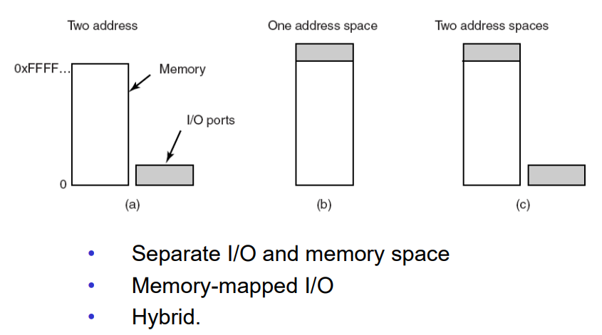
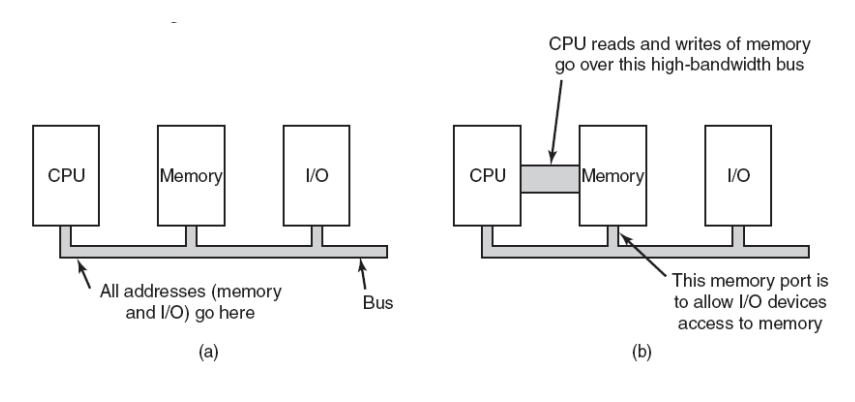
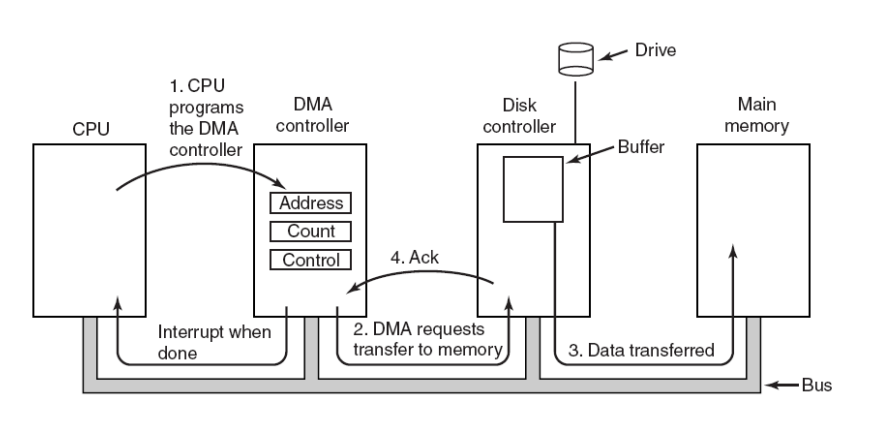
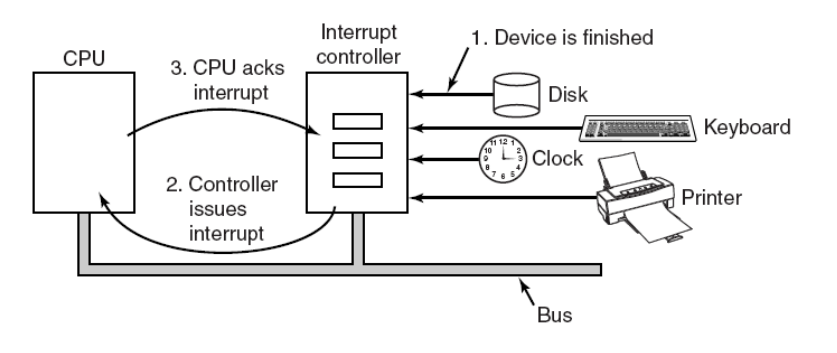
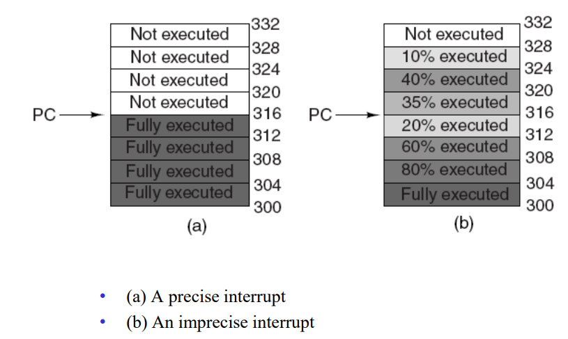
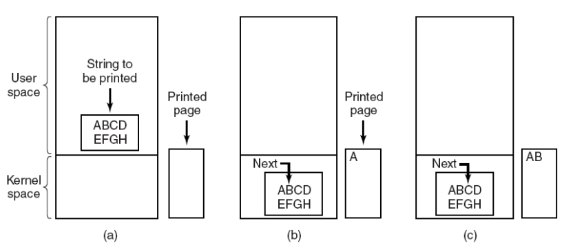

# Ch5 입출력
## Block Device & Character Device
1. Block Device
- 정보를 각각 자신의 주소를 가지는 고정된 크기의 블록에 저장한다.
- 모든 전송은 블록의 단위로 이루어진다.
- ex) 하드 드라이브, CD-ROM, USB

2. Character Device
- 일련의 문자들을 블록 구조와 관계없이 전송/받아들인다.
- 각각의 문자들은 주소가 없으며 탐색 연산도 수행할 수 없다.
- ex) 마우스, 프린터, 모뎀

## Device Controllers
입출력 장치는 전형적으로 기계적인 부분과 전기적인 부분으로 구성된다.

전기적인 부분: device controller, 여러 디바이스를 제어할 수 있다.

Controller가 하는 일:
1. 연속적인 비트 열을 바이트 단위의 블록으로 변환한다.
    - 블록의 바이트들은 일반적으로 먼저 컨트롤러 내부의 버퍼에 비트단위로 모아진다. 그런 다음 비트에 대한 체크섬이 진행되고 블록이 오류가 없으면 메인 메모리에 복사된다.
2. CPU에게 인터럽트 신호를 보낸다.
3. 데이터를 호스트로 받아서 버퍼링을 한다.

## Memory-Mapped I/O
각각의 컨트롤러는 CPU와의 통신에 사용되는 몇 개의 레지스터를 가지고 있다. 이 레지스터에 대한 쓰기에 의해서 운영체제는 장치에게 I/O 명령을 내릴 수 있다.

1. Memory-Mapped I/O
- 메모리와 I/O가 하나의 연속된 주소 공간에 위치한다. -> I/O가 차지하는 만큼 메모리 용량은 감소한다.
- D-RAM의 상단에 I/O 레지스터를 할당한다.-> D-RAM과 충돌되지 않게 한다.

2. Separate I/O and memory space
- 입출력 레지스터에 따로 주소를 할당한다.
- 메모리에 입출력하는 명령과 I/O port에 입출력하는 명령이 따로 있다.
- CPU와 메모리 사이는 버스로 연결되어 있는데, 그 버스에 I/O 컨트롤러도 연결되어있다. -> 주소를 가지고 버스로 접근한다.

3. Hybrid
- 펜티엄같은 경우 두 방식 섞은 것 가능하다.

## Memory Bus Architecture

1. A single-bus architecture
- CPU는 버스를 통해 각 레지스터로 접근한다.
- CPU는 버스를 통해 각 레지스터에 주소를 입력하여 결과값을 얻는다.
- 모든 레지스터가 주소를 확인할 수 있다.

2. A dual-bus memory architecture
- CPU와 메모리만 연결하는 버스를 따로 두어서 CPU는 넓은 대역폭을 갖는 버스를 통해 메모리에 읽기/쓰기 연산을 할 수 있다.

## Direct Memory Access(DMA)

버스를 통해 CPU, 메인메모리, 디스크 컨트롤러, DMA 컨트롤러가 연결되어 있다. 디스크 컨트롤러 카드를 통해 하드 드라이브가 연결되어 있다. 

CPU가 하드 드라이브의 값을 읽으려면 디스크 컨트롤러의 레지스터에 명령어와 주소를 집어넣으면 하드 드라이브를 구동할 수 있다. 그러면 하드디스크 버퍼에 값을 집어넣을 수 있다. 그런 다음 CPU가 버퍼의 값을 메인메모리에 카피한다. -> CPU가 오버헤드가 일어나고 낭비가 심함.

DMA를 사용하는 방법
1. CPU는 DMA 컨트롤러의 레지스터 값(Address, Count, Control)을 설정하여 명령만 한다.
2. DMA는 디스크 컨트롤러에 명령을 내려 데이터를 메인메모리로 카피한다.
3. 카피가 끝나면 DMA는 CPU에게 인터럽트를 걸어서 완료됨을 알린다.

디스크 컨트롤러에서 메인메모리에 데이터를 카피하는 방법
1. 버퍼에서 직접 메인메모리에 보낸다.
2. DMA가 디스크 컨트롤러의 데이터를 자신의 레지스터로 가져왔다가 자신의 레지스터 값을 메인메모리로 카피한다.

> Cycle Stealing: CPU는 메인메모리에 접근하는데, DMA도 메인 메모리에 읽기/쓰기 요청을 할 수 있다. 만약 둘이 동시에 요청을 하게되면 DMA를 먼저 메모리에 액세스하게 한다. 즉, CPU의 사이클을 훔쳐서 DMA가 먼저 메모리에 액세스 한다는 의미이다. 

Data transfer methof of DMA
1. Fly-by-mode: 디스크 컨트롤러가 메인메모리에 직접 데이터를 보내는 방법
2. DMA가 중개하여 디스크 컨트롤러로부터 데이터를 불러와서 레지스터에 저장시킨 다음 메인메모리르 보내는 방법

Bus transfer mode
- Word-at-a-time mode: 한 번에 한 워드씩 읽어들이는 방법. Cycling Stealing이 일어난다.
- Burst mode: 한 번에 여러 워드를 읽어오는 방법

## Interrupts Revisited

1. 디바이스들이 입출력을 마치면 인터럽트 컨트롤러에 신호를 보낸다.
2. 인터럽트 컨트롤러는 디바이스의 우선순위에 따라 CPU에 인터럽트 신호를 보낸다.
3. CPU는 인터럽트가 끝나면 인터럽트 컨트롤러에 ACK를 보낸다.

## Precise and Imprecise Interrupts

인터럽트는 Precise 인터럽트, Imprecise 인터럽트 두 종류로 나눌 수 있다.
1. precise interrupt: PC 이전 명령어까지 모두 실행을 완료시킨 다음에 인터럽트 서비스 루틴으로 이동하는 방법.

2. imprecise interrupt: 파이프라이닝을 통해 동시에 여러 명령을 실행한다. 실질적으로 인터럽트 구현이 어렵다.

precise interrupt의 특징
1. PC는 알려진 공간에 저장된다.
2. PC에 의해 가리켜진 것 이전 모든 명령어는 충분히 실행되었다.
3. PC 이후 명령어는 한 번도 실행되지 않았다.
4. PC가 가리키는 명령어의 실행 상태는 알려져 있다.

## Goal of I/O Software
1. Device Independency
    - 모든 입출력 장치에 공통적인 방법으로 접근할 수 있어야 한다.

2. Uniform Naming
    - 파일 or 입출력 장치의 이름은 문자열이나 정수이다.
    - 장치에 구애받지 않고 이름을 정할 수 있으며 이름을 통해 root 파일 시스템에 마운트할 수 있다.

3. Error Handling
    - 일반적으로 오류는 가능한 한 하드웨어와 가까운 곳에서 처리해야 한다.

4. Synchronous vs asynchronous
    - interrupt-driven(Asynchronous): CPU는 입출력 장치를 구동하고 기다리지 않고 다른 작업을 수행한다.
    - Blocked transfer(Synchronous): 입출력을 요구하면 CPU는 멈추고(Blocked) 입출력이 끝나기를 기다린다.

5. Buffering
    - 사용자 프로세스는 입출력 동안에 blocked상태가 되는데 만약 swap out되어 디스크공간으로 이동하면 데이터가 저장될 공간이 없기 때문에 버퍼링이 필요하다.

    - Single Buffering
    - Double Buffering: 입출력 장치가 1번 버퍼에 입력하는 동안 2번 버퍼가 사용자 프로세스에게 데이터를 제공하는 식의 병렬 진행이 가능하다.

6. Sharable vs dedicated devices
    - 디스크같은 입출력 장치는 많은 사용자들에 의해 사용될 수 있다. 여러 사용자들이 동일한 디스크에 있는 파일들을 오픈하여도 문제가 발생하지 않는다.
    - 테이프 드라이브같은 장치는 한 사용자가 종료할 때까지 단일 사용자에 의해 전용된다.

## Programmed I/O

프로세스가 운영체제에 문자열을 출력하라고 시스템호출하면 운영체제는 문자열 데이터를 자신의 버퍼 공간으로 가져온다. 그리고 그 데이터를 차례대로 프린터로 출력한다.

```C++
// 입출력 장치는 굉장히 느린데 CPU는 빠르다. 근데 CPU가 계속 기다리고 있기 때문에 성능이 떨어진다. -> 폴링/바쁜대기
copy_from_user(buffer, p, count); // 커널내부의 버퍼로 출력할 문자열을 복사해온다. p는 커널 버퍼이다.
for (i=0; i<count; i++){
    while (*printer_status_reg != READY); // 프린터 상태 레지스터가 준비상태가 될 때까지 기다린다.
    *printer_data_register = p[i]; // 프린터 데이터 레지스터에 글자를 하나씩 집어넣는다.
}
return_to_user(); // 출력한다.
```

## Interrupt-Dirven I/O
CPU가 놀지 않아 CPU 활용도가 높다.
```C++
// 첫 글자를 출력하는 부분(디바이스를 구동하는 부분)
copy_from_user(buffer, p, count);
enable_interrupts();
while (*printer_status_reg != READY);
*printer_data_register = p[0];
scheduler();// CPU는 스케줄하여 다른 프로그램을 시작하도록 한다.
// 즉, 첫 글자를 출력하고 스케줄러로 다른 프로세스를 수행하기 시작한다. 첫 글자가 출력이 끝나면 프린터는 인터럽트를 걸고, CPU는 인터럽트 서비스 루틴으로 간다.

// 인터럽트 서비스 루틴
if (count == 0){ //출력할 데이터가 없으면 sleep하던 프로세스를 깨운다.
    unblock_user();
}
else{
    *printer_data_register = p[i];
    count = count - 1;
    i = i + 1;
}
acknowledge_interrupt(); // 인터럽트 처리가 끝났다고 신호를 보낸다.
return_from_interrupt(); // 원래 실행하던 프로그램을 실행하도록 한다.
```

## I/O Using DMA
```C++
copy_from_user(buffer, p, count); // 커널버퍼로 데이터 카피
set_up_DMA_controller(); // DMA의 레지스터 값을 세팅한다. 그러면 DMA는 구동을 시작한다. 
scheduler();

// DMA의 카피가 끝나면 CPU에게 인터럽트를 걸어준다.
// 인터럽트 서비스 루틴
acknowledge_interrupt();
unblock_user(); 
return_from_interrupt();
```