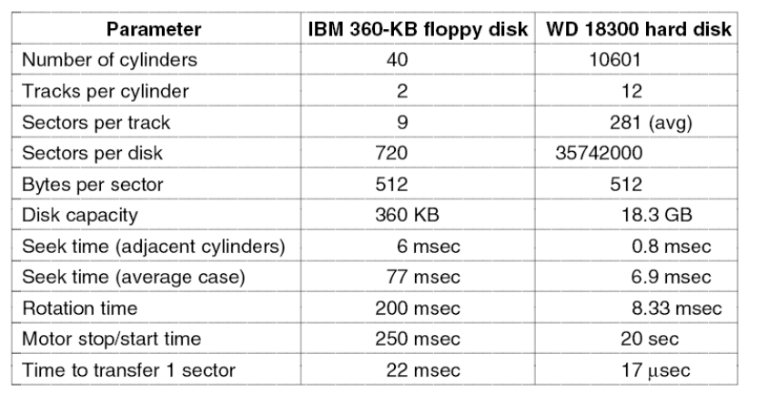

# Ch5 입출력
## Block Device & Character Device
1. Block Device
- 정보를 각각 자신의 주소를 가지는 고정된 크기의 블록에 저장한다.
- 모든 전송은 블록의 단위로 이루어진다.
- ex) 하드 드라이브, CD-ROM, USB

2. Character Device
- 일련의 문자들을 블록 구조와 관계없이 전송/받아들인다.
- 각각의 문자들은 주소가 없으며 탐색 연산도 수행할 수 없다.
- ex) 마우스, 프린터, 모뎀

## Device Controllers
입출력 장치는 전형적으로 기계적인 부분과 전기적인 부분으로 구성된다.

전기적인 부분: device controller, 여러 디바이스를 제어할 수 있다.

Controller가 하는 일:
1. 연속적인 비트 열을 바이트 단위의 블록으로 변환한다.
    - 블록의 바이트들은 일반적으로 먼저 컨트롤러 내부의 버퍼에 비트단위로 모아진다. 그런 다음 비트에 대한 체크섬이 진행되고 블록이 오류가 없으면 메인 메모리에 복사된다.
2. CPU에게 인터럽트 신호를 보낸다.
3. 데이터를 호스트로 받아서 버퍼링을 한다.

## Memory-Mapped I/O
각각의 컨트롤러는 CPU와의 통신에 사용되는 몇 개의 레지스터를 가지고 있다. 이 레지스터에 대한 쓰기에 의해서 운영체제는 장치에게 I/O 명령을 내릴 수 있다.

1. Memory-Mapped I/O
- 메모리와 I/O가 하나의 연속된 주소 공간에 위치한다. -> I/O가 차지하는 만큼 메모리 용량은 감소한다.
- D-RAM의 상단에 I/O 레지스터를 할당한다.-> D-RAM과 충돌되지 않게 한다.

2. Separate I/O and memory space
- 입출력 레지스터에 따로 주소를 할당한다.
- 메모리에 입출력하는 명령과 I/O port에 입출력하는 명령이 따로 있다.
- CPU와 메모리 사이는 버스로 연결되어 있는데, 그 버스에 I/O 컨트롤러도 연결되어있다. -> 주소를 가지고 버스로 접근한다.

3. Hybrid
- 펜티엄같은 경우 두 방식 섞은 것 가능하다.

## Memory Bus Architecture

1. A single-bus architecture
- CPU는 버스를 통해 각 레지스터로 접근한다.
- CPU는 버스를 통해 각 레지스터에 주소를 입력하여 결과값을 얻는다.
- 모든 레지스터가 주소를 확인할 수 있다.

2. A dual-bus memory architecture
- CPU와 메모리만 연결하는 버스를 따로 두어서 CPU는 넓은 대역폭을 갖는 버스를 통해 메모리에 읽기/쓰기 연산을 할 수 있다.

## Direct Memory Access(DMA)

버스를 통해 CPU, 메인메모리, 디스크 컨트롤러, DMA 컨트롤러가 연결되어 있다. 디스크 컨트롤러 카드를 통해 하드 드라이브가 연결되어 있다. 

CPU가 하드 드라이브의 값을 읽으려면 디스크 컨트롤러의 레지스터에 명령어와 주소를 집어넣으면 하드 드라이브를 구동할 수 있다. 그러면 하드디스크 버퍼에 값을 집어넣을 수 있다. 그런 다음 CPU가 버퍼의 값을 메인메모리에 카피한다. -> CPU가 오버헤드가 일어나고 낭비가 심함.

DMA를 사용하는 방법
1. CPU는 DMA 컨트롤러의 레지스터 값(Address, Count, Control)을 설정하여 명령만 한다.
2. DMA는 디스크 컨트롤러에 명령을 내려 데이터를 메인메모리로 카피한다.
3. 카피가 끝나면 DMA는 CPU에게 인터럽트를 걸어서 완료됨을 알린다.

디스크 컨트롤러에서 메인메모리에 데이터를 카피하는 방법
1. 버퍼에서 직접 메인메모리에 보낸다.
2. DMA가 디스크 컨트롤러의 데이터를 자신의 레지스터로 가져왔다가 자신의 레지스터 값을 메인메모리로 카피한다.

> Cycle Stealing: CPU는 메인메모리에 접근하는데, DMA도 메인 메모리에 읽기/쓰기 요청을 할 수 있다. 만약 둘이 동시에 요청을 하게되면 DMA를 먼저 메모리에 액세스하게 한다. 즉, CPU의 사이클을 훔쳐서 DMA가 먼저 메모리에 액세스 한다는 의미이다. 

Data transfer methof of DMA
1. Fly-by-mode: 디스크 컨트롤러가 메인메모리에 직접 데이터를 보내는 방법
2. DMA가 중개하여 디스크 컨트롤러로부터 데이터를 불러와서 레지스터에 저장시킨 다음 메인메모리르 보내는 방법

Bus transfer mode
- Word-at-a-time mode: 한 번에 한 워드씩 읽어들이는 방법. Cycling Stealing이 일어난다.
- Burst mode: 한 번에 여러 워드를 읽어오는 방법

## Interrupts Revisited

1. 디바이스들이 입출력을 마치면 인터럽트 컨트롤러에 신호를 보낸다.
2. 인터럽트 컨트롤러는 디바이스의 우선순위에 따라 CPU에 인터럽트 신호를 보낸다.
3. CPU는 인터럽트가 끝나면 인터럽트 컨트롤러에 ACK를 보낸다.

## Precise and Imprecise Interrupts

인터럽트는 Precise 인터럽트, Imprecise 인터럽트 두 종류로 나눌 수 있다.
1. precise interrupt: PC 이전 명령어까지 모두 실행을 완료시킨 다음에 인터럽트 서비스 루틴으로 이동하는 방법.

2. imprecise interrupt: 파이프라이닝을 통해 동시에 여러 명령을 실행한다. 실질적으로 인터럽트 구현이 어렵다.

precise interrupt의 특징
1. PC는 알려진 공간에 저장된다.
2. PC에 의해 가리켜진 것 이전 모든 명령어는 충분히 실행되었다.
3. PC 이후 명령어는 한 번도 실행되지 않았다.
4. PC가 가리키는 명령어의 실행 상태는 알려져 있다.

## Goal of I/O Software
1. Device Independency
    - 모든 입출력 장치에 공통적인 방법으로 접근할 수 있어야 한다.

2. Uniform Naming
    - 파일 or 입출력 장치의 이름은 문자열이나 정수이다.
    - 장치에 구애받지 않고 이름을 정할 수 있으며 이름을 통해 root 파일 시스템에 마운트할 수 있다.

3. Error Handling
    - 일반적으로 오류는 가능한 한 하드웨어와 가까운 곳에서 처리해야 한다.

4. Synchronous vs asynchronous
    - interrupt-driven(Asynchronous): CPU는 입출력 장치를 구동하고 기다리지 않고 다른 작업을 수행한다.
    - Blocked transfer(Synchronous): 입출력을 요구하면 CPU는 멈추고(Blocked) 입출력이 끝나기를 기다린다.

5. Buffering
    - 사용자 프로세스는 입출력 동안에 blocked상태가 되는데 만약 swap out되어 디스크공간으로 이동하면 데이터가 저장될 공간이 없기 때문에 버퍼링이 필요하다.

    - Single Buffering
    - Double Buffering: 입출력 장치가 1번 버퍼에 입력하는 동안 2번 버퍼가 사용자 프로세스에게 데이터를 제공하는 식의 병렬 진행이 가능하다.

6. Sharable vs dedicated devices
    - 디스크같은 입출력 장치는 많은 사용자들에 의해 사용될 수 있다. 여러 사용자들이 동일한 디스크에 있는 파일들을 오픈하여도 문제가 발생하지 않는다.
    - 테이프 드라이브같은 장치는 한 사용자가 종료할 때까지 단일 사용자에 의해 전용된다.

## Programmed I/O

프로세스가 운영체제에 문자열을 출력하라고 시스템호출하면 운영체제는 문자열 데이터를 자신의 버퍼 공간으로 가져온다. 그리고 그 데이터를 차례대로 프린터로 출력한다.

```C++
// 입출력 장치는 굉장히 느린데 CPU는 빠르다. 근데 CPU가 계속 기다리고 있기 때문에 성능이 떨어진다. -> 폴링/바쁜대기
copy_from_user(buffer, p, count); // 커널내부의 버퍼로 출력할 문자열을 복사해온다. p는 커널 버퍼이다.
for (i=0; i<count; i++){
    while (*printer_status_reg != READY); // 프린터 상태 레지스터가 준비상태가 될 때까지 기다린다.
    *printer_data_register = p[i]; // 프린터 데이터 레지스터에 글자를 하나씩 집어넣는다.
}
return_to_user(); // 출력한다.
```

## Interrupt-Dirven I/O
CPU가 놀지 않아 CPU 활용도가 높다.
```C++
// 첫 글자를 출력하는 부분(디바이스를 구동하는 부분)
copy_from_user(buffer, p, count);
enable_interrupts();
while (*printer_status_reg != READY);
*printer_data_register = p[0];
scheduler();// CPU는 스케줄하여 다른 프로그램을 시작하도록 한다.
// 즉, 첫 글자를 출력하고 스케줄러로 다른 프로세스를 수행하기 시작한다. 첫 글자가 출력이 끝나면 프린터는 인터럽트를 걸고, CPU는 인터럽트 서비스 루틴으로 간다.

// 인터럽트 서비스 루틴
if (count == 0){ //출력할 데이터가 없으면 sleep하던 프로세스를 깨운다.
    unblock_user();
}
else{
    *printer_data_register = p[i];
    count = count - 1;
    i = i + 1;
}
acknowledge_interrupt(); // 인터럽트 처리가 끝났다고 신호를 보낸다.
return_from_interrupt(); // 원래 실행하던 프로그램을 실행하도록 한다.
```

## I/O Using DMA
```C++
copy_from_user(buffer, p, count); // 커널버퍼로 데이터 카피
set_up_DMA_controller(); // DMA의 레지스터 값을 세팅한다. 그러면 DMA는 구동을 시작한다. 
scheduler();

// DMA의 카피가 끝나면 CPU에게 인터럽트를 걸어준다.
// 인터럽트 서비스 루틴
acknowledge_interrupt();
unblock_user(); 
return_from_interrupt();
```

## I/O Software Layers

User-level I/O software: 테이프로 부터의 백업 프로그램
Device-independent operating system software: 운영체제 커널 내부에 있다. 모든 디바이스를 공통적으로 관리한다.
Device driver: 각 디바이스마다 디바이스 드라이버가 있다.
Interrupt handler: 디바이스 안에 인터럽트 핸들러도 있다.
> 디바이스가 하드웨어를 구동하며, 디바이스 드라이버는 하드웨어 장치마다 하나씩 존재한다.

## Interrupt Handler
인터럽트 핸들러는 디바이스가 인터럽트를 걸어줄 때 작업을 하기 시작한다. 평소에는 숨겨져있다.

인터럽트가 걸리면 CPU는 인터럽트 벡터 테이블을 보고 인터럽트 서비스 루틴의 주소를 찾는다. PC를 서비스 루틴의 주소로 설정한 다음 점프한다.

인터럽트 핸들러는 다음과 같이 작동한다.
1. 하드웨어적으로 저장되어지지 않은 레지스터의 값을 소프트웨어적으로 저장한다.
2. 인터럽트 서비스 루틴을 위한 문맥(ex. 지역변수)을 설정한다.
3. 기존의 스택을 인터럽트 서비스 루틴을 위한 스택으로 설정한다. 프로세스마다 유저스택, 커널스택이 따로 존재한다.
4. 인터럽트 컨트롤러에 ACK(인터럽트를 시작한다는 신호)를 보낸다. 
5. 레지스터들을 스택에서 프로세스 테이블에 다시 복사한다.(필요하다면)
6. 인터럽트 서비스 루틴을 실행한다.
7. 어떤 프로세스를 다음에 실행할 것인지 스케줄링한다.
8. 커널모드에서 유저모드로 변경한 후 다음에 실행할 프로세스를 위한 MMU 문맥(가상 메모리에 대한 레지스터)을 설정한다.
9. PSW를 포함하여 새로운 프로세스의 레지스터를 적재한다.
10. 새로운 프로세스의 실행을 시작한다.

## Device Driver
컴퓨터에 부착된 각 입출력 장치는 장치를 제어하기 위한 코드인 디바이스 드라이버를 필요로 한다.

## Device-Independent I/O Software
운영체제안에는 device-independent i/o software가 있고 그 밑에 디바이스 드라이버가 있다. 장치 독립적인 입출력 소프트웨어는 디바이스 종류와 무관하게 공통된 기능을 제공하는 소프트웨어이다.
- 모든 디바이스 드라이버에게 공통된 인터페이스를 제공한다.
- 프린터나 하드디스크로부터 데이터를 읽어오면 버퍼링 기능을 제공한다.
- 에러가 발생하면 사용자 프로그램에게 보고한다.
- 테이프같은 경우는 하나의 프로세스에 의해서만 사용될 수 있기 때문에 사용 요청에 대한 수라과 거절을 제공한다.
- 장치 독립적인 블록 크기

## User-Space I/O Softwae

사용자 프로세스가 하드웨어에 입출력할 때 과정이다.
1. 사용자 프로그램이 입출력을 요청한다. 운영체제에 시스템 콜을 한다.
2. 운영체제는 요청을 받으면 Device-independent software를 실행한다. ex) 버퍼 캐시에서 데이터를 찾는다.
3. 만약 필요한 부분이 버퍼 캐시에 없으면 디스크로부터 가져오기 위해 장치 드라이버를 호출한다.
4. 입출력이 끝나고 디스크가 종료되면 하드웨어는 인터럽트를 발생시킨다.

## Magnetic Disks
자기 디스크는 실린더들로 구성되는데 각각은 트랙들로 구성된다. 트랙은 섹터로 나뉘어 지며, 이를 읽는 암 끝에 헤드가 존재한다. 데이터를 읽기 위해 헤드가 원하는 트랙으로 가야한다(seek). 자기 디스크가 돌아가면서 원하는 섹터가 헤드로 올 때까지 기다리는데 이를 lotational delay라고 한다(평균 반바퀴이다).
seek 시간이 오래걸린다.


섹터 하나당 512바이트이다.
인접 실린더로 갈 때는 seek time이 적은데, 멀리 떨어진 곳으로 seek하면 오래걸린다.
데이터를 읽고 전송하는 시간: seek time + lotational delay(한 바퀴 도는 시간의 반) + transfer time


바깥쪽 섹터일수록 더 많은 섹터를 가지기 때문에 바깥쪽섹터와 안쪽 섹터의 번호는 다르다. 프로그램에서는 virtual geometry로 생각하여 사용한다.

## RAID
디스크의 성능, 안정성을 향상시켜 주는 디스크 구성이다.
RAID(Redundant Array of Independent Disk) 레벨 0은 성능을 위한 것으로 데이터를 쪼개어 네 개의 디스크에 나누어 병렬로 넣는다. 디스크에 에러가 하나라도 나면 데이터가 사라지기 때문에 1개 있을때보다 안정성이 낮다.

이에 나온것이 RAID 레벨 1이다. 데이터를 쪼개서 4군데에 나눠 놓고 MIRRORED DISK에 똑같은 데이터를 또 적어놓는다. 같은 디스크를 똑같이 하나 더 나왔기때문에 가격이 2배로 비싸다.

각 조각에 Hamming 코드를 더해서 4비트 워드를 7비트 워드로 바꾼다. 따라서, 고장나면 패리티 비트를 통해 에러를 검출할 수 있다. 이는, 매 비트 시간마다 해밍 코드 검사를 해야해서 상당히 부담되었다.

이에 레벨 3에서는 패리티비트 하나만 추가하였다. 패리티 비트에 의해 오류 검출을 하면 디스크는 불량 비트의 위치가 보이기 때문에 에러를 정정할 수 있다.

레벨 4는 다시 4개 병렬로 동작하고 마지막 디스크에서는 패리티 비트를 기록하여 에러 검출을 한다. 디스크 2개 이상이 동시에 고장날 때 시스템 고장이 발생한다. 패리티 디스크가 매 비트 시간마다 진행되어서 매우 바빴다.

레벨 5는 패리티를 골고루 분산시켜 병목현상을 해결하고자 하였다.

## CD-ROM
CD는 나선형으로 되어있으며 안쪽부터 데이터를 기록한다. 안 쪽을 읽을 때는 CD롬 회전 속도가 빠르고 바깥쪽으로 갈수록 느리다(일정 속도로 데이터를 읽어야하므로). CD는 움푹 들어간 부분 pits와 평평한 부분 lands로 구성된다. land에서는 레이저를 반사시키고 pit에서는 레이저가 반사가 안된다.

CD롬은 2K 블럭 단위로 데이터를 기록한다. 

## DVD
DVD는 CD를 발전시킨 형태이다.
1. pit를 더 작게 하였다.
2. 나선의 밀도를 높였다.
3. 레이저의 강도를 높였다.(저장 용량을 높였다)

DVD 형태
1. Single-sided, single-layer : 4.7GB
2. Single-sided, dual-layer : 8.5GB
3. Double-sided, single-layer : 9.4GB
4. Double-sided, dual-layer : 17GB

## Disk Formatting

하드 디스크의 기본 저장단위는 섹터(512바이트)이다.
Preamble: 특정 비트 패턴
ECC: 에러 교정 코드


디스크는 트랙으로 이루어져 있으며 각 트랙은 섹터로 이루어져 있다. 
각 트랙마다 섹터 번호의 위치가 다르다. -> cylinder skew
- 헤드가 순차적으로 읽을 때 헤드가 움직이는 시간을 고려하기 때문이다. 원판은 회전하기 때문에 헤드가 다음 트랙으로 움직일 때 위치가 달라지기 때문이다.


디스크에서 섹터를 연속적으로 읽기 위해서는 컨트롤러에 큰 버퍼를 요구한다. 따라서, 디스크의 한 섹터를 읽고 ECC 계산을 진행한 다음에 데이터는 메인 메모리에 전송되는데, 이 때 헤드는 다음 섹터를 지나게될 것이다. 따라서, 순차적인 번호를 조금 떨어뜨려 놓음으로써 헤드가 읽기 명령이 끝나면 다음 섹터를 읽을 수 있게 거리를 벌려놓는 것이 Interleaving이다.

(b)는 1칸 씩 띄워 놓은 single interleaving이며, 복사 과정이 더 느릴 경우 (c)처럼 double interleaving으로 2 칸을 띄워놓는다.

> 현재는 interleaving이 사용되지 않는다.

## Disk Arm Scheduling Algorithms
디스크 읽기/쓰기 시간은 다음 시간을 포함한다.
1. Seek time
2. Rotational delay
3. Actual data transfer time

Seek time은 매우 길다.
에러 체크는 컨트롤러에 의해 수행된다.

First-in, first-out(FIFO)방식

- 요청이 들어온 순서대로 처리한다.
- 헤드가 움직이는 시간이 많아진다(increase seek time)

Shortest service time first

- 헤드가 현 위치에서 가장 가까운 번호로 가서 처리한다.
- 요청이 처리되고 있는 중간에 많은 요청이 들어오면 양 끝 단에 대한 요청들은 중간 부분에 요청이 없을 때까지 기다리게 되어 starvation을 경험한다.
- 최소 응답 시간과 공평함이 여기서 충돌한다.

SCAN or elevator algorithm

- 엘레베이터와 같이 동작한다.
- 먼저 숫자가 커지는 순서대로 가다가 더이상 요청이 없으면 아래 쪽으로 내려가면서 요청을 처리한다.
- starvation이 없다.
- 단점: 요청들의 service 시간에 대한 편차가 있다. 가운데 트랙에 있는 요청은 편차가 적으며 바깥 쪽 트랙은 편차가 크다. like 선풍기

C-SCAN

- 한 쪽 방향으로 가면서 요청을 처리하다가 더 이상 없으면 반대편 끝 쪽으로 가서 다시 요청을 처리한다.
- 위치에 따른 서비스 시간의 편차는 없다.
- 입출력 요청이 엄청 많은 경우 헤드 바로 앞에 요청이 오면 재수가 좋아서 바로 요청이 처리되고 재수가 없는 경우는 헤드가 지나가자마자 요청이 와서 거의 한 바퀴를 기다려야 하는 경우가 생긴다. -> 의도치 않은 서비스 타임에 대한 편차가 심하게 생긴다.

N-step-SCAN
- 큐를 여러 개 만들어서 하나의 큐에는 최대 N개의 요청이 들어간다.
- 큐 별로 C-SCAN(N개의 요청 처리)이 쓰인다.
- C-SCAN 방법에 의한 서비스 타임 편차를 해결할 수 있다.

FSCAN
- 큐가 2개이다.
- 첫 번째 큐에 대해서 요청 처리를 하는 동안 새로 오는 요청들은 다른 큐에 들어간다.


평균 헤드가 움직인 거리는 SSTF가 젤 작으며 FIFO가 제일 크다. 하지만 SSTF는 starvation이 있어서 SCAN이나 C-SCAN이 더 많이 사용된다.

## Error Handling
하드 디스크는 에러율이 높다.
제조 결함으로 bad sector가 생길 수 있다. 이는 쓰여진 값을 정확하게 다시 읽을 수 없는 것이다.
이를 해결하는 방식은 2가지가 있다.
1. spare sector(여분 섹터): 여분 섹터를 하나 만들어서 bad sector를 대신할 섹터를 만든다. (b)의 경우 상당히 큰 오버헤드가 발생하기 때문에 (c)처럼 모든 섹터를 옮겨서 bad sector를 우회하게 한다.

## Stable Storage
기록하다가 전원이 나가더라도 old data or new data가 유지되도록 하는 것이다.

기본 아이디어는 디스크를 두 개 쓰는 것이다. 새로운 데이터를 기록하고 싶으면 1번 디스크에 먼저 기록하는데 ECC도 같이 기록한다. 도중에 전원이 꺼져 기록이 제대로 되지 않았으면 데이터와 ECC를 가지고 비교하여 에러 검출을 한다. 따라서, ECC 에러가 발생한다.
1번 디스크에 ECC 에러가 나면 2번 디스크의 Old data를 1번 디스크로 카피하여 old data를 유지시키도록 한다. 그런 다음 다시 디스크에 써서 1번이 new data가 되면 2번과 차이가 생기게 된다.
그러면 1번 내용을 2번에 카피하여 같은 상태로 만든다(e번 상태)
> 같은 내용을 2번 적어야하기 때문에 더 오래 걸린다..

## Clock Hardware
주기적으로 타이머 인터럽트를 걸어주는 클럭 하드웨어가 있다. 클럭 하드웨어에는 하나의 Crystal oscillator가 있어서 이는 pulse 신호를 보내서 counter 레지스터에 holding 레지스터 값을 넣는다. pulse가 올 때마다 카운터 레지스터 값을 하나씩 줄여서 0이 되면 타이머 인터럽트가 발생한다. 그러면 다시 홀딩 레지스터가 카운터 레지스터로 덮어 씌워진다.

### Clock Software
클럭 드라이버의 의무는 다음과 같다.
1. 현재 시간을 유지한다.
2. 프로세스가 할당된 시간보다 더 오랫동안 실행하는 것을 방지한다.
3. CPU 사용 시간을 계산한다.
4. 사용자 프로세스가 만든 알람 시스템 호출을 처리한다.
5. 시스템 자체의 일부를 위한 워치독 타이머(특정 시간이 되면 어떤 일을 하도록 하는 타이머)를 제공한다.
6. 프로파일링, 모니터링, 통계자료 모으기 작업을 한다.

시간을 유지하는 방법은 여러 가지가 있다.

(a)는 64비트 카운터를 사용하여 어떤 시점을 기준으로 몇 번의 tick이 지났는지를 파악해서 일정 tick을 계산하여 현재 시간을 기록한다.
(b) tick이 모여 1초가 될 때까지 세다가 1초가 되면 저장하여 초 단위로 기록한다.
(c) 시스템이 부팅 후 몇 초가 지났는지를 계산한다.

타이머 서비스 요청은 매우 빈번히 일어난다.
따라서, 타이머의 시간을 저장하는 테이블을 만들어서 현재 타이머의 시간과 다음 시그널 시간을 유지시킨다. 위 그림은 차례대로 3: 4203에 서비스 요청, 4: 4207에 서비스 요청, 6: 4213에 서비스 요청, 2: 4215에 요청, 1: 4216에 요청을 뜻한다. 클럭 인터럽트가 걸릴 때마다 각 테이블에 남은 타이머를 갱신한다.
새로운 타이머 요청이 들어오면 다음 테이블에 넣어놓는다.

## Keyboard Software

특별하게 처리되는 문자들이다.


ESC를 이용한 커서를 움직이는 문자들이다.


비디오 램에서 스크린에 문자를 띄우는데 비디오 램에 속성을 같이 표시하여 하나의 문자를 표시하는데 2개의 문자를 사용했다. 속성 정보(X)에 따라 스크린의 문자에 특성이 추가된다.

## Input software
키보드에서 입력을 할 때 각 키마다 스캔 코드라고 하는 코드 값이 있었고 CPU는 코드 값을 읽어서 그에 따른 ASCI코드로 변환해서 화면에 보여주었다.

## X윈도우 시스템
X가 컴퓨터에서 실행할 때 키보드와 마우스로부터 입력을 모아서 화면에 출력을 쓰는 소프트웨어를 X서버라고 한다. 

클라이언트와 서버 사이에는 대게 TCP/IP가 사용되는데 다음 네 가지 종류의 메시지가 전해진다.
1. 프로그램으로부터 워크스테이션까지 내려가는 명령
2. 프로그램 질의에 대한 워크스테이션의 응답
3. 키보드, 마우스, 그리고 다른 이벤트 공표
4. 오류 메세지

## Graphical User Interfaces
```C++
#include <X11/Xlib.h>
#include <X11/Xutil.h>

main(int argc, char *argv[])
{
    Display disp;
    Window win;
    GC gc;
    XEvent event;
    int running = 1;

    disp = XOpenDisplay("display_name");
    win = XCreateSimpleWindow(disp, ...);
    XSetStandardProperties(disp, ...);
    gc = XCreateGC(disp, win, 0, 0);
    XSelectInput(disp, win, ButtomPressMask | KeyPressMask | ExposureMask);
    XMapRaised(disp, win);

    while (runnign){ // 메시지를 처리하는 루프
        XNextEvent(disp, &event);
        switch (event.type){
            case Expose:  ...; break;
            case ButtonPress: ...; break;
            case Keypress: ...; break;
        }
    }

    // 프로그램 종료

    XFreeGC(disp, gc);
    XDestoryWindow(disp, win);
    XCloseDisplay(disp);
}
```

## Bitmaps
기본적으로 화면에 문자/이미지를 보여줄 때 비트맵을 사용하며 하나하나의 칸을 픽셀이라고 부른다. 비트맵 단위로 문자를 표현한다. 문자의 크기를 키우게 되면 문자의 폰트가 깨지게 되어 별로 안이쁘다. 
이에 벡터 폰트(트루 타입 폰트)를 사용하였다. 이는 비트맵이 아닌 수식 형태로 저장하였다. 

## Power Management
디스플레이가 많은 전력을 사용한다. 94년에 비해 98년에 cpu의 전력 사용량이 늘었다.
전력 사용량이 늘어나면서 전력관리에 이슈가 커져갔다. 


디스플레이의 전력 사용량을 줄이려면 각 영역마다 백라이트가 있는데, 화면이 차지하는 부분을 잘 배치해서 화면이 없는 영역은 백라이트를 꺼서 전력 소모량을 줄였다.


트랜지스터의 속도를 조금 줄여서 전력 사용량을 줄였다. 시간을 2배로 늘리면 전압은 4배 줄일 수 있었다.