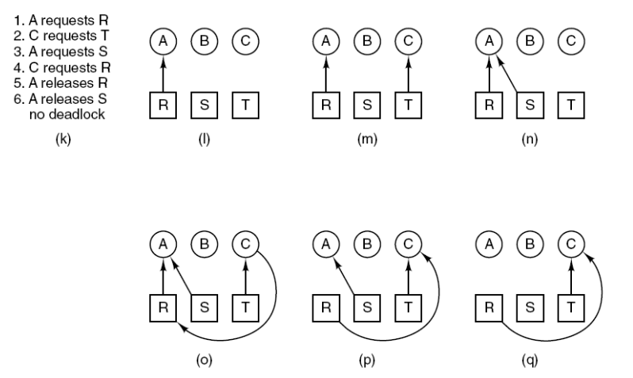

# Deadlocks
프로세스가 모두 블록된 상태로 영원히 남게 되는 상태이다.

## Resource
자원은 preemptable, nonpreemptable자원이 있다.
선점형 자원은 나쁜 영향없이 그것을 소유하고 있는 프로세스로부터 빼앗을 수 있는 자원이다. ex. 메모리

nonpreemptable 자원: 한 번 할당되면 반납할 때까지 기다려야 하는 자원이다.

## Resource Acquisition
```C++
// 리소스가 한 개일 때
typedef int semaphore;
semaphore resource_1;

void process_A(void){
    down(&resource_1);// 리소스를 대표하는 세마포어를 다운시킨다. 다른 프로세스가 접근하려고 하면 접근을 막는다.
    use_resource_1();
    up(&resource_1); // 사용 후 up 시킨다.
}
```

```C++
// 리소스가 두 개일 때
typedef int semaphore;
semaphore resource_1;
semaphore resource_2;

void process_A(void){
    down(&resource_1); // 1부터 다운 시키고 업 시킬때는 2부터 시킨다.
    down(&resource_2);
    use_both_resources();
    up(&resource_2);
    up(&resource_1);
}
```

```C++
// 프로세스가 2개일 때
// 이 코드는 데드락이 발생하지 않는다.
typedef int semaphore;
semaphore resource_1;
semaphore resource_2;

void process_A(void){
    down(&resource_1); // 1부터 다운 시키고 업 시킬때는 2부터 시킨다.
    down(&resource_2);
    use_both_resources();
    up(&resource_2);
    up(&resource_1);
}

void process_B(void){
    down(&resource_1); // 1부터 다운 시키고 업 시킬때는 2부터 시킨다.
    down(&resource_2);
    use_both_resources();
    up(&resource_2);
    up(&resource_1);
}
```

```C++
// 이 경우는 데드락이 발생한다.
// A는 1, 2 순으로 할당 받는데, B는 2, 1 순으로 할당받기 때문이다. A와 B가 동시에 실행하게 되면 A는 1을 할당 받고 B가 2를 할당받은 다음에 나머지 자원을 할당받지 못 한채로 대기하기 때문에 데드락이 걸린다.
typedef int semaphore;
semaphore resource_1;
semaphore resource_2;

void process_A(void){
    down(&resource_1); // 1부터 다운 시키고 업 시킬때는 2부터 시킨다.
    down(&resource_2);
    use_both_resources();
    up(&resource_2);
    up(&resource_1);
}

void process_B(void){
    down(&resource_2); // 1부터 다운 시키고 업 시킬때는 2부터 시킨다.
    down(&resource_1);
    use_both_resources();
    up(&resource_1);
    up(&resource_2);
}
```

## Introduction To Deadlocks
프로세스의 집합 내 프로세스들이 다른 프로세스가 발생시키는 이벤트를 기다리는 상태이다. 서로 데드락에 걸려있기 때문에 이벤트가 발생하지 않아 무한 교착상태에 있다.

## Conditions for Resource Deadlocks
자원에 대한 데드락이 발생하는 조건: 데드락이 발생하기 위해서는 아래의 모든 조건이 만족되어야 한다. 하나라도 존재하지 않으면 데드락이 발생하지 않는다.

1. 상호 배제 조건이 만족될 때. 각 자원은 현재 정확히 하나의 프로세스에게 할당되어 있거나 가용한 상태이다.
2. hold and wait 조건: 이전에 승인되어 현재 자원들을 보유하고 있는 프로세스가 새로운 자원을 요청할 때
3. no preemption 조건: 이전에 승인된 자원들은 프로세스로부터 강제로 빼앗을 수 없다. 메모리는 preemption이므로 데드락이 발생하지 않는다.
4. Circular wait 조건: 둘 이상의 프로세스들이 순환체인 되어있는 경우. 각 프로세스는 체인의 다른 프로세스들에 의해 소유되어 있는 자원을 기다린다.


(a): 자원 R이 프로세스 A에게 할당되었다.
(b): 프로세스 B가 자원 S를 요구한다.
(c): T는 프로세스 D에 할당되었는데 C가 요구하고 있고, U는 C에 할당되었는데 D가 요구하고 있어서 데드락 상태이다.

자원이 할당되는 순서에 따라 데드락이 발생할 수도 있고 발생하지 않을 수도 있다.


자원 R, S, T가 있고, 프로세스 A, B, C가 있다.

프로세스 A: R 요구 -> S 요구 -> R 반납 -> S 반납
프로세스 B: S 요구 -> T 요구 -> S 반납 -> T 반납
프로세스 C: T 요구 -> R 요구 -> T 반납 -> R 반납


(j)에서 circular wait가 발생하였다. 데드락이 발생하였다.


순서를 살짝 바꾸면 데드락이 발생하지 않는다. 프로세스 A는 (o)에서 두 자원에게 할당을 받았기 때문에 실행을 한다. 따라서 프로세스 C가 자원 R을 요청을 해도 어차피 A는 실행을 하고 종료를 할 수 있기 때문에 반납이 가능해서 데드락이 걸리지 않는다.

데드락에 대처하는 전략
1. 데드락 문제를 방치한다.(타조 전략)
2. 탐지 및 회복: 데드락이 발생하도록 두고, 데드락 발생을 탐지하여 행동을 취한다.
3. 자원을 조심스럽게 할당하여 동적으로 회피한다.
4. 구조적으로 4 가지 요구 조건(데드락 발생 조건)을 무효로 하여 데드락 예방

## Deadlock Detection and Recorvery
먼저 detection을 해야한다.
1. 각 타입의 자원이 하나만 있을 때
- 사이클이 있는지 없는지를 확인하면 된다. 이는 그래프를 그려서 사이클을 제외한 나머지를 지운다. 사이클이 존재하면 데드락이 걸린 것이다.

2. 각 타입의 자원이 여러 개일 때
- 자원 할당 매트릭스를 사용한다. 현재 할당된 상태를 나타내는 current allocation matrix와 현재 요구하는 상태를 나타내는 request matrix가 있다.

자원 할당 그래프를 이용해서 데드락을 탐지하는 알고리즘을 banker's algorithm 이라고 한다.


P0 ~ P4 5개의 프로세스와 A, B, C 세 개의 자원이 있다.
현 상태에서 P1, P3, P4, P2, P0 순으로 또 전체 할당하면 안전하게 할당할 수 있다. 데드락 탐지는 

1. P1에 1 2 2를 마저 할당한다. 그런 다음 자원을 반납받는다.
    - 5 3 3 이용 가능
2. P3에 0 1 1을 전부 할당한다. 그런 다음 2 2 2 자원을 반납받는다.
    - 7 4 4 이용 가능
3. P4에 4 3 1을 전부 할당한다. 그런 다음 4 3 3 자원을 반납받는다.
    - 7 4 6 이용 가능
4. P2에 6 0 0을 전부 할당한다. 그런 다음 9 0 2 자원을 반납받는다.
    - 10 4 8 이용 가능
5. P0에 7 4 3을 전부 할당한다. 그런 다음 7 5 3 자원을 반납받는다.
    - 12 4 8 이용 가능

데드락에서 회복하기
- preemption을 통한 회복: 프로세스에서 자원을 뺏어서 회복시킨다.(많은 자원은 비선점형.. -> 프로세스를 죽이는 수밖에,,)
- 롤백을 통한 회복
- 프로세스를 죽여서 회복

## Deadlock Avoidance
어떤 프로세스에 자원을 할당했을 때 데드락이 발생할 가능성이 있으면 자원을 할당하지 않는다.


r -> s: 프로세스 A가 프린터를 할당받는다.
s -> t: 프로세스 B가 플로터를 할당받는다.
t 지점에서 만약 B나 A가 각각 프린터나 플로터를 요청하게 되면 불안정한 상태가 되어 데드락이 발생할 수 있다. 따라서 t -> s 이동을 통해 B는 플로터를 반납하고 A가 플로터를 요청한 뒤 반납할 때까지 기다려야 한다.


(a), (b)는 안전하다. (b)의 경우 자원이 2개 남긴 했지만 프로세스 C가 자원 2개를 할당받으면 실행을 시작할 수 있기 때문에 자원의 할당 후 반환이 가능하다. 하지만 (c)의 경우 1개가 남았는데 1개를 줘서 실행을 시킬 수 있는 프로세스가 없기 때문에 데드락이 걸린 것이다.

## Deadlock Prevention
데드락 발생 가능성을 봉쇄한다.

자원 상태에 대한 데드락 방지
1. 상호배제 조건을 공략한다.
- 운영체제를 활용하여 상호 배타적으로 사용해야 하는 자원을 공유하도록 하게 한다. 즉, 자원을 상호배타적이지 않게 만든다. ex) 프린터
- 자원을 스풀링한다.

2. 비선점형 조건을 공략한다.
- CPU의 메모리같은 경우는 선점형 자원이기 때문에 비선점형 자원에 대한 작업을 메모리로 '스풀링'하여 다른 프로세스가 비선점형 자원에 대한 접근이 가능하도록 한다.
- 중간에 뺏어서 다른 프로세스에게 줘버린다.

3. 순환 대기 조건을 공략한다.

- 자원에 전역적인 순서를 부여하여 프로세스가 2개 이상의 자원을 할당받을 때 낮은 순서번호의 자원부터 할당받도록 하면 순환 대기가 생기지 않는다. -> 현실적으로 모든 프로그램에 이러한 조건을 설정하기가 힘들다.

4. 잡고 기다림 조건을 공략한다.
- 필요한 자원은 한 꺼번에 할당받도록 한다. 만약 모든 자원을 할당받을 수 없다면 애초에 할당받지 않도록 한다. -> 중간에 추가로 할당받을 일이 없기 때문에 데드락이 발생하지 않는다.
- 자원 활용도가 떨어지며 자원이 많이 필요한 프로세스의 경우 starvation이 발생하기도 한다.


Swappable space: 프로그램 실행할 때 스왑 가능한 영역을 충분히 할당받고 시작한다. -> 잡고 기다림 조건 전략 사용
Process resource: 자원의 순서를 매겨서 데드락을 피한다. -> 순환 대기 조건 전략 사용
Main memory: 선점형 조건 전략 사용. preemtion 가능하도록 한다.
Internal resource: 순환 대기 조건 사용

## 기타 문제들
1. Two-phase locking
- 필요한 자원이 있는데 그 자원들이 락이 되었으면 그 프로세스는 이전에 할당받은 자원들을 모두 언락한 다음에 다시 처음 단계부터 시작한다.

2. Communication Deadlocks
- 통신 과정에서 메시지가 손실되어 다른 프로세스가 메시지를 받지 못한 경우 프로세스는 계속 대기한다. 이때 각 프로세스가 서로 다른 프로세스에 의해 발생하는 어떤 이벤트를 기다리면서 블록되어 있다. 이러한 경우를 통신 데드락이라고 한다.

3. 라이브락
- 자원이 할당되지 않아 계속 무한루프를 도는 바쁜 대기 상태를 말한다.

```C++
// 이 경우는 데드락이 발생한다.
// A는 1, 2 순으로 할당 받는데, B는 2, 1 순으로 할당받기 때문이다. A와 B가 동시에 실행하게 되면 A는 1을 할당 받고 B가 2를 할당받은 다음에 나머지 자원을 할당받지 못 한채로 대기하기 때문에 데드락이 걸린다.
typedef int semaphore;
semaphore resource_1;
semaphore resource_2;

void process_A(void){
    down(&resource_1); // 1부터 다운 시키고 업 시킬때는 2부터 시킨다.
    down(&resource_2);
    use_both_resources();
    up(&resource_2);
    up(&resource_1);
}

void process_B(void){
    down(&resource_2); // 1부터 다운 시키고 업 시킬때는 2부터 시킨다.
    down(&resource_1);
    use_both_resources();
    up(&resource_1);
    up(&resource_2);
}
```
이 경우이다. waiting하면서 CPU를 계속 쓰고 있는데 멈춘 상태가 아니다. 그래서 데드락과 비슷한 경우이다

4. Starvation
- 데드락을 회피하기 위해 희생되는 프로세스를 계속 고를텐데, 그 희생 프로세스가 계속 같은 프로세스가 되면 그 프로세스는 starvation 문제를 겪게 된다.