# Multimedia Operating Systems
멀티미디어의 중요한 특징
1. 멀티미디어는 높은 데이터 전송률을 사용한다.
2. 멀티미디어는 실시간 재생 기능을 필요로 한다.

멀티미디어와 I/O 장치의 데이터 전송률은 다음과 같다.
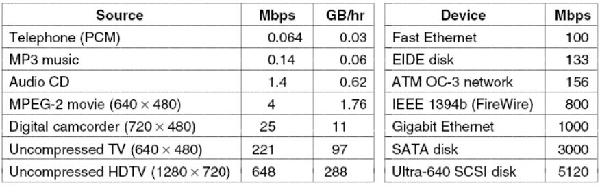
Umcompressed(압축이 안된 데이터)를 보면 데이터 양이 엄청나다는 것을 볼 수 있다. 따라서 데이터를 압축해야 한다.

멀티미디어 파일은 비디오, 각 나라의 오디오, 각 나라의 자막, 빨리감기, 빨리 뒤로보기와 같은 파일을 포함하기 때문에 파일시스템은 멀티미디어의 여러 서브파일을 관리해야 한다.

## Video Encoding
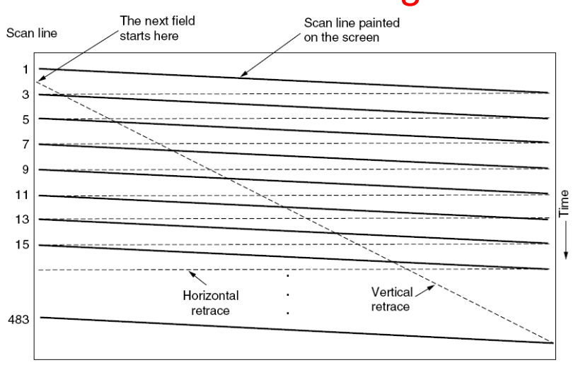
NTSC방식은 483개의 주사선이 있다. 각 주사선의 번호에서 주사선을 쏜다. 처음에 1,3, .., 483으로 홀수번에서 주사선을 쏜 다음 483에서 다시 젤 위로 가서 2, 4, 6.. 짝수 번에서 주사선을 쏜다. 계속해서 반복하는데, 이 방법은 interlacing 방식이라고 한다. 이 주사선은 화면에 표시된다.

> 인터레이스 방식을 사용하지 않으려면 프로그레시브 방식을 사용해야 한다.

## Audio Encoding
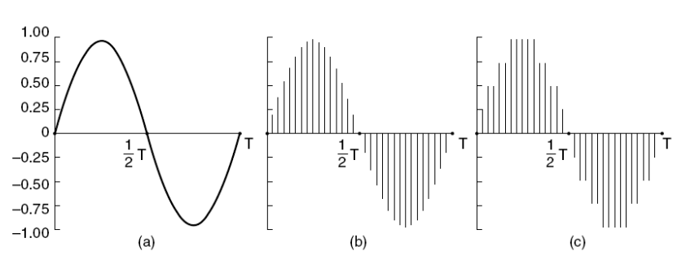
아날로그 신호를 디지털로 처리한다. 
(a)는 소리의 아날로그 신호이다. 이를 샘플링(값을 측정)하여 (b)처럼 만든다. (b)의 각 값에 대한 비트를 4비트로 측정한 것이 (c)이다. 총 9단계의 값이 있으므로 9단계의 값을 저장하기 위해서는 4비트가 필요하다. (c)는 샘플링한 것을 4비트로 양자화(Quantizing, 특정 단위 값으로 저장한 것)한 것이다. -> 아날로그를 디지털로 변환하였기 때문에 양자화 오류가 발생한다.

## 푸리에 변환
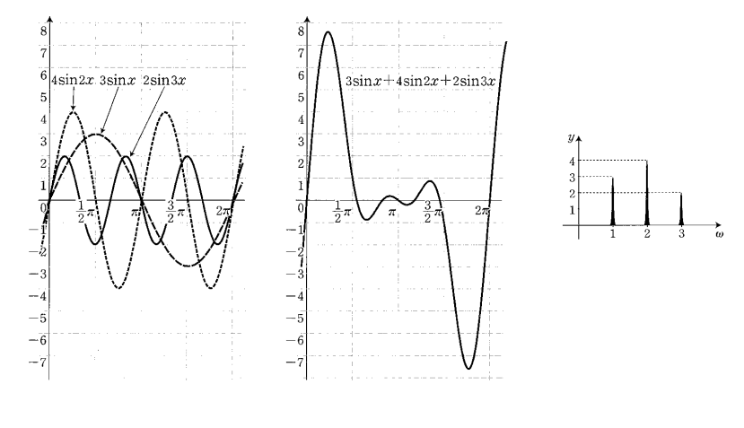
어떤 아날로그 신호가 있으면 그 신호를 분석하면 여러 함수로 표현이 가능하다. 그 함수들의 계수를 찾는 것이 푸리에 변환이다.
즉, 각 주파수 성분별로 크기(각 주파수의 세기)를 알아내는 방식이다. 
> 푸리에 변환에 의하면 어떤 신호가 오더라도 각각의 주파수의 합에 의해 나타낼 수 있다. 하지만 어렵기 때문에 일정 세기 이상의 주파수만 취하여 합성하여 최대한 유사한 신호를 만들어 낸다.

## The JPEG Standard
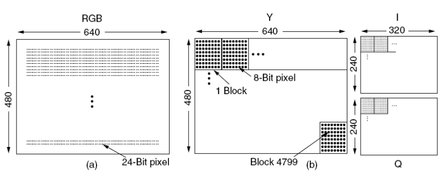
JPEG는 연속-색조 정지 영상을 위한 표준이다.
1단계: RGB 화소가 입력값으로 들어오면 JPEG으로 인코딩되면 일단 블럭 단위로 화면을 분할한다(8화소 X 8화소단위가 1블럭이다.) JPEG는 Y(명암), I(녹색계열), Q(붉은색 계열) 행렬로 세기를 저장을 한다. Y행렬은 4800개 블록, 다른 두 행렬은 1200 블록을 가진다. 각 블럭의 화소들을 지그재그 형태로 구성하여 그 파형을 푸리에변환으로 계수값을 찾아낸다.

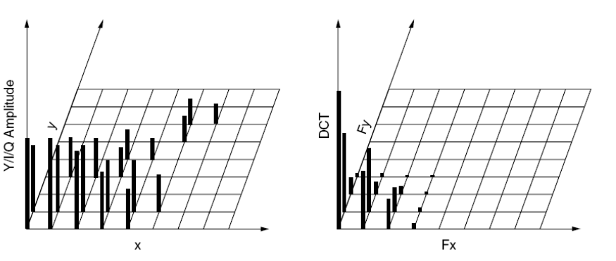

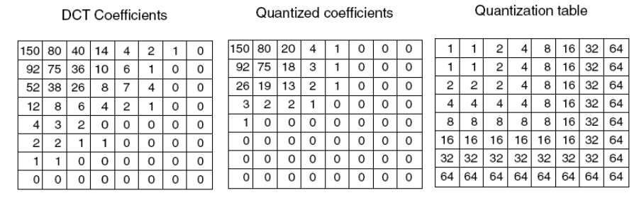
계수를 다 찾아낸다음에 계수가 낮은 부분은 Quantization table을 통해서 없앤다. DCT Coefficients 행렬에서 숫자가 낮은 것일수록 고주파 성분이며, 이의 세기가 세지 않으면 Quantization table을 통해서 없앤다. 

DCT Coefficients 행렬의 값들을 Quantization table의 값들로 나눠서 Quantized coefficients 행렬을 만든다. 그런 다음 Quantized coefficients 행렬의 값을 저장한다.

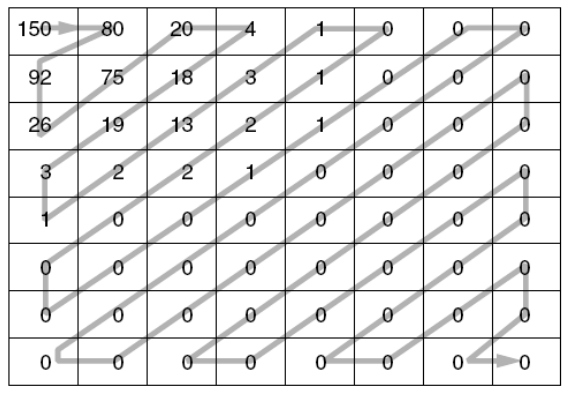
위 사진은 양자화된 값이 전송되는 순서이다.
이를 알고 있으면 원래 신호를 다시 복구할 수 있는데, 위의 계산에서 고주파를 없애버렸기 때문에 완전히 복구를 할 수는 없다. 이를 유손실 압축이라고 한다.

## MPEG Standard
동영상을 압축하는 기준이다.
MPEG 프레임은 세 가지 유형의 서로 다른 종류 프로엠으로 출력된다..
1. I(Intracoded) frames: JPEG로 인코딩된 정지 화상이다.
2. P(Predictive) frames: 마지막 프레임과 블록 별 차이점을 나타낸다. 압축률이 높다.
3. B(Bidirectional) frames: 마지막 프레임 및 다음 프레임과의 차이점을 나타낸다. 압축률을 더 높일 수 있었다.

## Audio Compression
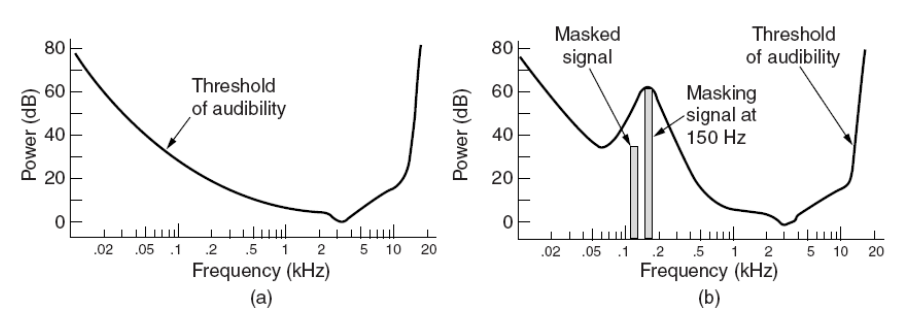
MPC에서 오디오를 압축할 때 가청 주파수 한계를 사용한다. 사람은 낮은 주파수는 잘 듣고 고주파는 잘 못듣는다. 따라서, 가청 주파수 한계보다 낮은 세기는 저장하지 않는 것이다.
마스킹 기법도 있다. 어떤 주파수의 세기가 굉장히 세면 그 주변의 주파수는 저장할 필요가 없다는 것이다.

## General Real-Time Scheduling
멀티미디어를 지원하는 운영체제에서의 스케줄링이다.

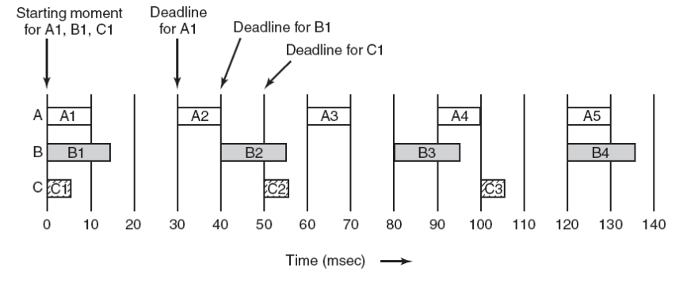
각 프로세스마다 주기적으로 자신의 주기 안에 한 번만 실행하면 된다.

각 프로세스는 자신의 주기가 있고 1/주기 를 하면 초당 몇 번 실행해야 하는지를 알 수 있다.

## Rate Monotonic Scheduling
선점이 가능한 주기적인 프로세스를 위한 정적 실시간 스케줄링 알고리즘이다. 
Rate = 1/주기 로, 초당 몇 번 실행해야 하는지이다.

여러 프로세스가 있을 때 rate가 클수록 우선순위를 높게 준다.

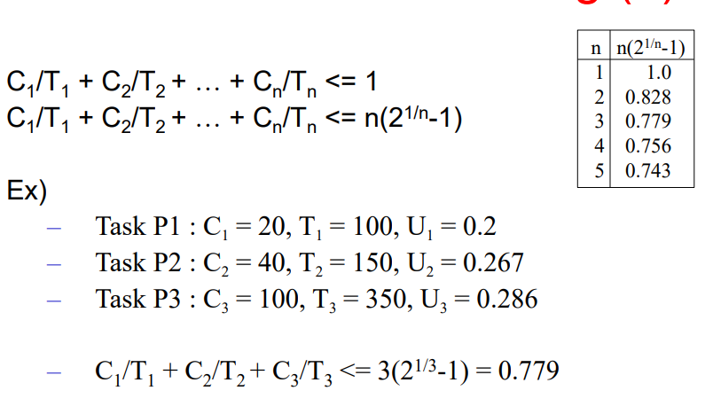
T를 주기(ms 단위)라고 하고 C는 한 번에 실행하는 시간(ms 단위)이다. C/T는 그 프로세스의 작동 시간이다.
Ex)
- Task P1: C1 = 20, T1 = 100, U1 = 0.2
    - Task P1이 사용하는 시간은 CPU시간의 0.2이다.

모든 테스크의 U의 합은 1을 넘으면 안된다.
모든 테스크의 합이 n(2^(1/n) - 1)보다 작거나 같으면 무조건 스케줄링 된다. n은 테스크의 개수이다.

RMS을 위한 조건은 다음과 같다.
1. 각 주기적 프로세스는 자신의 주기 안에서 한 번 실행을 해야한다.
2. 프로세스 간에 의존성이 없다.
3. 각 프로세스는 주기마다 똑같은 시간을 실행한다.
4. 가끔씩 빈 시간에 비주기적 프로세스가 발생할 수 있는데, 이는 데드라인이 없다.
5. 프로세스를 중단하고 새 프로세스를 실행하는 것에 대한 비용은 0이어야 한다.-> 즉각적인 문맥 교환이 일어나야 한다.

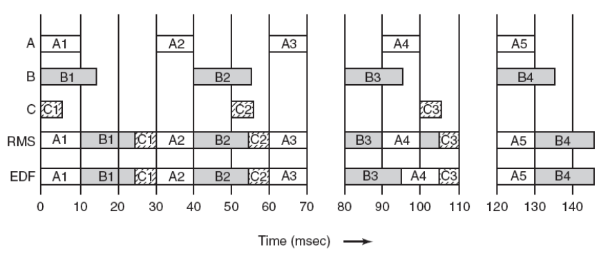
A는 30ms마다 10ms 실행하므로 rate는 1/30이다
B는 40ms마다 15ms 실행하므로 rate는 1/40이다.
C는 50ms마다 5ms 실행하므로 rate는 1/50이다.
> 주기가 클 수록 우선순위가 낮다. 따라서 A가 우선순위가 가장 높다.

## Eariest Deadline First

그때그때의 deadline이 빠를 수록 우선순위가 높다.
t = 90에서 B3와 A4의 데드라인은 똑같다. 이 때는 그냥 실행하고 있던 B3를 계속 실행한다.

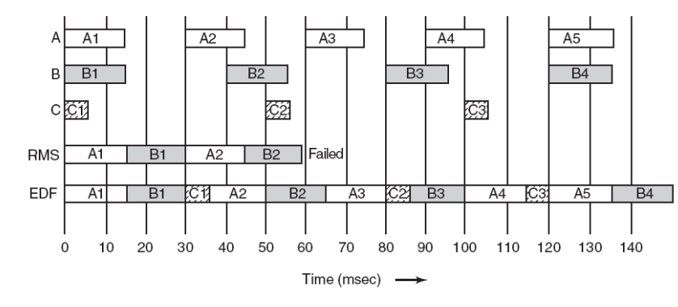
위 그림은 RMS의 경우 스케줄링이 안된다.
A의 실행시간이 더 길어져서 A1, B1이 실행이 끝나면 바로 A2와 C1중에 하나가 실행해야 하는데 A2가 우선순위가 더 높으므로 A2를 실행한다. 그 사이에 B2가 실행 준비가 되었고 B2와 C1중에 B2를 먼저 실행하면 그 사이에 C1의 데드라인이 끝난다. 그래서 RMS는 Deadline fail이 일어난다. EDF는 가능하다.

## Priority Inversion
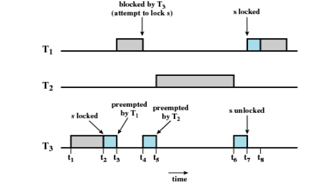
T3가 실행하다가 T1이 우선순위가 더 높으니까 T1이 도중에 실행한다. 그러다가 T1이 T3에게 할당되어있는 자원이 필요한 경우 이미 그 자원은 T3에 할당되어있기 때문에 뺏을 수가 없어서 T3가 다시 실행되게 된다. 그러다가 T2가 우선순위가 더 높으니까 실행하고 끝나면 T3실행한다. T3가 실행 끝나고 자원을 내놓으면 T1이 그 자원을 할당받아 실행한다.
> T1이 T3때문에 실행이 밀리는건 어쩔 수 없지만 T2가 T3를 밀어버림으로써 T1도 같이 밀리는것이 문제이다.

## Priority Inheritance
위의 우선순위 역전 문제를 해결하기 위해 나온 방법이다.
T3가 자원을 할당받아 실행하고 있다가 T1이 깨어나서 실행을 한다. 실행 도중 T3의 자원을 가져가려고 하면 멈추고 T3가 다시 실행을 한다. 그 때 T1의 우선순위가 T3에 할당되어서 T3는 그 자원을 가지고 있고 T1이 기다리는 동안 T1의 우선순위를 가지고 실행을 한다. 그러므로 T3실행 도중 T2가 실행을 하려고 해도 안된다. T3가 자원을 할당 해제하면 우선순위 할당은 자동으로 해제된다.

## Multimedia File System Paradigms
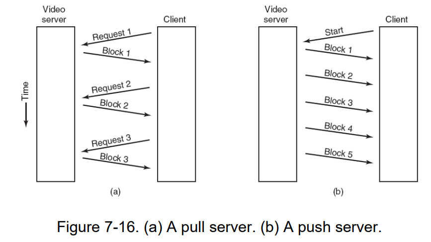
비디오 서버는 (b) push 서버 형태가 더 좋다. (b) push server는 클라이언트가 서버에 요청하면 그 데이터가 주기적으로 클라이언트에 전송한다. 즉, 비디오를 실행 요청하면 계속해서 비디오를 실행하는 것이다.

## Near Video on Demand
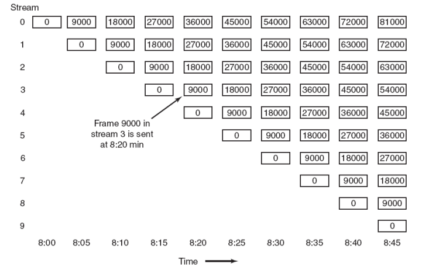
의사 주문형 비디오는 정기적인 시간 간격(여기서는 5분)마다 스트림(여기서는 9000프레임)이 시작된다. 

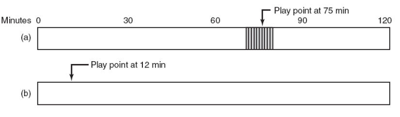
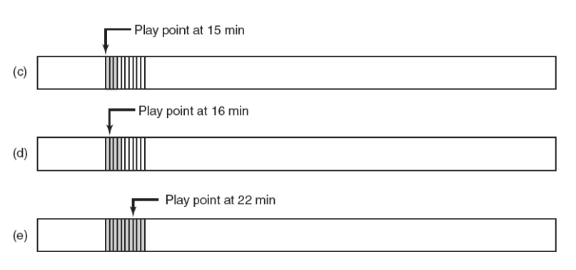
클라이언트는 이전 T분과 재생할 T분 만큼을 자체적으로 버퍼링하고 있다. 위 그림의 경우 75분 지점을 보고 있다가 12분 지점으로 돌아간 상황이다. 그러면 3분동안 개인 스트림으로 보면서 15분지점의 스트림을 버퍼에 계속 저장하는 것이다. (c)의 경우 12분에서 3분 기다린 후의 상황이다. 버퍼링은 15~18분이 되었다.

## Placing a File on a Single Disk
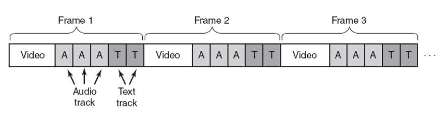
영화 파일을 디스크에 저장할 때 배치 방법이다.
한 프레임은 비디오, 오디오, 텍스트로 이루어져 있다. 디스크에 sequential로 저장해서 프레임 별로 저장했다. 순차적으로 저장하였으므로 읽기는 매우 빠르다.

## Two Alternative File Organization Strategies
영화 데이터를 하드디스크에 배치하는 방법이다.

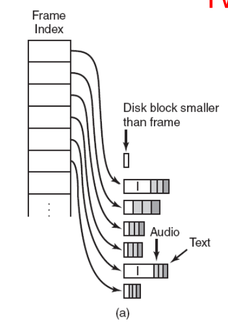
(a)는 작은 블록 모델이다. 디스크에 블록 단위로 저장하는데, 디스크 블록의 크기를 선정하여야 한다. 블록의 크기를 프레임 크기보다 작게 선정한다. 그리고 프레임 인덱스라는 자료구조를 만들어서 각 프레임마다 하나의 엔트리가 존재하여 각 프레임의 시작 위치를 가리킨다.
- RAM 사용량이 많다.
- 디스크 낭비가 적다.

(b)는 디스크 블럭의 크기가 프레임보다 훨씬 큰 경우이다. 이 경우는 블럭 인덱스 자료구조를 선정해서 각 블럭에 어떤 프레임들이 저장되어 있는지를 나타낸다. 블럭 인덱스 테이블에는 몇 번부터 몇 번까지 프레임이 저장되어 있는지 저장되어 있다. 만약 중간에 잘려서 두 블럭에 프레임이 나눠지면 seek time이 커지고 만약 마지막 작은 빈칸을 안채우고 넘어가면 메모리 낭비가 일어난다.
- RAM 사용이 작다.
- 디스크 낭비가 꽤나 있다.-> 프레임을 쪼개면 마지막 작은 빈칸을 채울 수 있어 공간 낭비가 줄어든다. 하지만 추가적인 seek time이 발생한다.

## Placing Files for Near Video on Demand
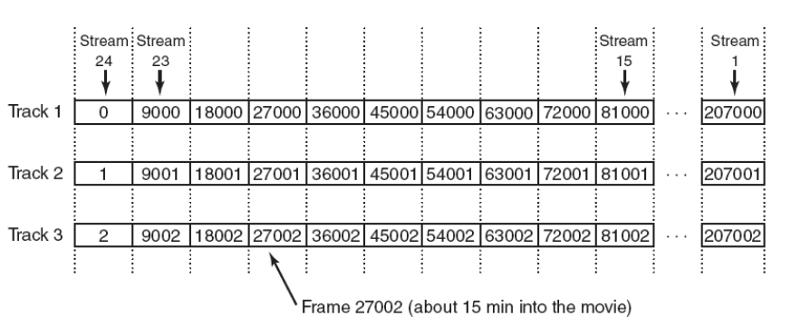
영화 한 편을 24개의 스트림으로 서비스한다. 트랙 단위로 24개 스트림을 저장한다. 24번 스트림은 0번 트랙으로 설정하였다. 헤드의 움직임을 최소화할 수 있다.

한 디스크에 영화 파일을 어디에 배치하느냐! 가장 인기있는 영화는 디스크의 중간에 배치를 하였다. 헤드가 트랙 위를 움직이면서 읽는데, 가장 자주 지나가는 곳이 중간부분이기 때문에 인기있는 데이터는 중간에 놔둔다.

## Placing Files on Multiple Disk
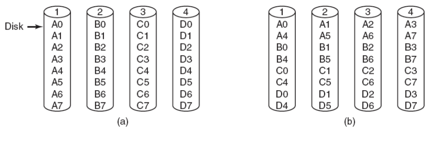
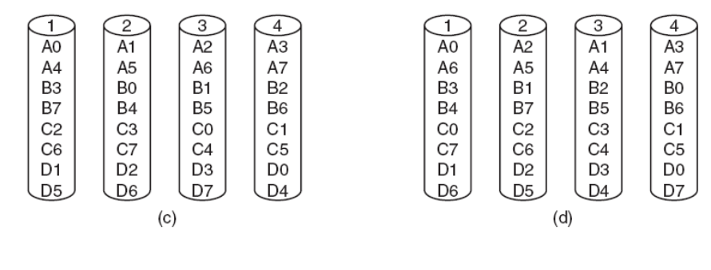
여러 디스크에 병렬로 멀티미디어 데이터를 저장하는 방법이다.
a. 디스크 하나 당 하나의 데이터를 저장하는 방법이 있다. -> 영화에 따라 인기도가 다르기때문에 바쁜 디스크가 있고 놀고있는 디스크가 있을 것이다. 
b. 따라서 여러 디스크에 영화를 striping하여 배치하면 골고루 작업을 분할할 수 있다.
c. (b)의 경우 모든 영화는 젤 앞부분을 많이 보기 때문에 상대적으로 1번디스크가 바쁘다. 따라서 배치 순서를 살짝 쉬프트하여 배치한다.
d. 랜덤하게 들어가게 배치를 한다.

## Blcok Caching
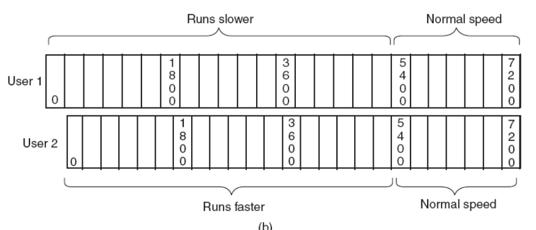
두 명의 유저가 같은 영화를 보기 시작했는데, 유저 2가 10초 늦게 보기 시작하면 싱크가 안맞게 된다. 따라서, 유저 2의 영화를 살짝씩 빠르게 하여 나중에는 두 유저의 스트림이 같게 된다.

## Static Disk Scheduling
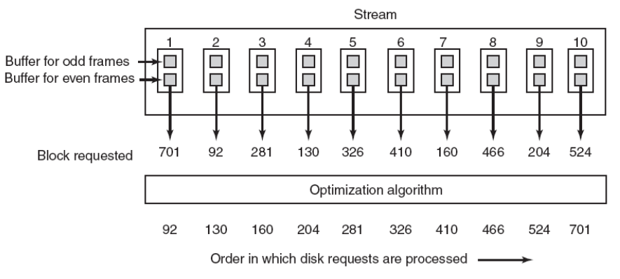
각 영화는 한 라운드에 한 프레임을 요청한다. 각 요청이 오면 트랙 순으로 정렬한다음에 scan 알고리즘으로 순차적으로 서비스한다.

## Dynamic Disk Scheduling
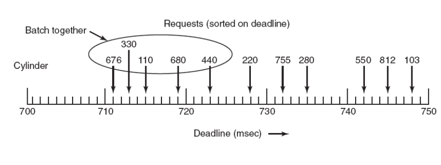
scan알고리즘은 데드라인을 신경쓰지 않는데, 각 요청들이 도착하면 데드라인 안에 요청이 처리되어야 하므로 scan-EDF 알고리즘을 사용하여 데드라인과 트랙 번호를 둘 다 신경썼다. 먼저, 데드라인이 임박한 요청들을 모은 다음에 그 요청들에서 SCAN 알고리즘을 써서 트랙 번호 순으로 처리를 하는 것이다.